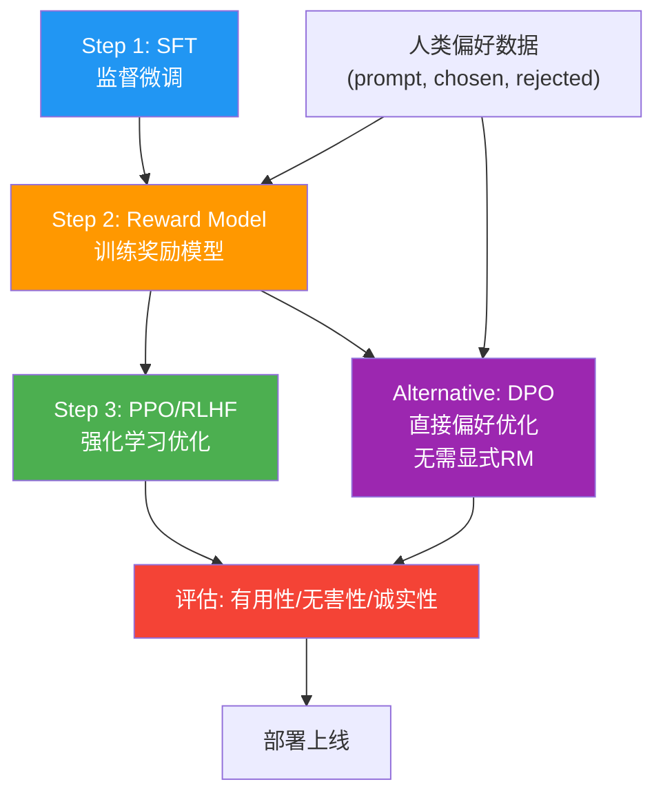

# SimPO 与 DPO 的区别是什么?SimPO 的核心改进是什么

- **SimPO (Simple Preference Optimization)** 是对 DPO 的改进,2024 年提出.

- **DPO 回顾**:用 reference model 计算 log-prob 差作为隐式 reward.需要维护两个模型(policy + reference).

- **SimPO 核心改进**:
1.  **去掉 reference model**:直接用序列平均 log-prob 作为 reward,无需 reference model
2.  **长度归一化**:用平均 log-prob(除以序列长度)而非求和,消除长度偏置
3.  **目标间隔**:在正负样本之间引入 margin (γ),要求正样本 reward 至少比负样本高 γ

SimPO Loss = -log σ(β/|y_w| * logπ(y_w|x) - β/|y_l| * logπ(y_l|x) - γ)

- **物理含义**:SimPO 认为'好的回答平均每个 token 的对数概率应该更高',并用 margin 强化区分度.

- **优势**:训练更快(省一个模型前向)、省显存、效果不差于 DPO.

*   **实战案例**：在实际对齐训练中，DPO有时会倾向于生成“废话文学”或无限重复的高概率但无意义的短句，因为它只关注概率差。引入SimPO的Margin后，模型被强制要求正负样本之间有显著的奖励gap，有效缓解了“无差别拒绝”或“平庸回答”的问题。

*   **代码示例**
```python
# PyTorch 风格伪代码：SimPO Loss 计算
def simpo_loss(policy_logps, ref_logps, labels, beta, margin_gamma):
    # policy_logps: [batch, 2] (chosen, rejected)
    # 长度归一化：除以序列长度
    # 注意：实际代码中 logps 通常已经是经过 mask 的 sum
    lengths = labels.sum(dim=-1).float()  # 获取序列长度
    
    # 对应 SimPO 公式中的 (beta * log pi) / |y|
    policy_rewards = (beta * policy_logps) / lengths.unsqueeze(1)
    
    # Chosen - Rejected - Margin
    diff = policy_rewards[:, 0] - policy_rewards[:, 1] - margin_gamma
    
    # Binary Cross Entropy with Logits
    loss = -F.logsigmoid(diff).mean()
    return loss
```

| 特性 | DPO (Direct Preference Optimization) | SimPO (Simple Preference Optimization) |
| :--- | :--- | :--- |
| **Reference Model** | **必需**，用于计算基准对数概率，防止模式崩塌 | **不需要**，节省约 30%-40% 显存和计算量 |
| **Reward 归一化** | 使用求和的 Log Prob | 使用**平均值** Log Prob (消除长度偏差) |
| **Margin (间隔)** | 无（默认为0） | 引入 **Margin (γ)**，强制正负样本区分度 |
| **显存占用** | 高 (Policy + Ref + Optimizer) | 低 (仅 Policy + Optimizer) |
| **数学本质** | 基于 Bradley-Terry 模型的重构 | 基于平均似然比的目标函数优化 |

**SimPO 与 DPO Reward 映射对比：**
```text
DPO Reward 公式:
r(x, y) = β * (log π(y|x) - log π_ref(y|x))
           │               │
           │               └─ 需要加载 Ref Model 计算
           └─ Policy Model 输出

SimPO Reward 公式:
r(x, y) = (β * log π(y|x)) / |y| - γ
           │                     │
           │                     └─ 引入 Margin
           └─ 长度归一化，无需 Ref Model
```

## 常见考点
1. **长度偏置的具体表现**：为什么未归一化的 Log-prob Sum 倾向于选择更长的回答？SimPO 的长度归一化是简单的除法吗？会不会影响模型生成简洁回答的能力？
2. **Margin (γ) 的设定**：γ 是一个超参数，通常设为多少？它对收敛速度和最终对齐强度有何影响？
3. **与 DPO 的数学等价性条件**：在什么假设条件下，SimPO 的 reward 可以看作是 DPO reward 的一种近似或代理？（通常与 Ref Model 的熵有关）。


## 核心流程图



## 记忆要点

- SimPO 核心改进：去 Reference Model，省显存；用平均 Log Prob 消除长度偏置。
- 引入 Margin (γ)：强制正样本 Reward 比负样本高 γ，增强区分度。
- DPO 需 Ref Model 防止崩塌，SimPO 用长度归一化替代，训练更快。
- 物理含义：SimPO 优化“平均每个 token 的概率”，而非总和概率。


## 结构化回答

**30 秒电梯演讲：** SimPO去除了参考模型，利用平均对数概率和边距优化偏好。——打个比方，原本需要两个人一起打分，现在一个人平均分算好了就能排优劣，还省去了另一个人。

**展开框架：**
1. **SimPO 核心** — SimPO 核心改进：去 Reference Model，省显存；用平均 Log Prob 消除长度偏置。
2. **引入 Margi** — 引入 Margin (γ)：强制正样本 Reward 比负样本高 γ，增强区分度。
3. **DPO 需 Re** — DPO 需 Ref Model 防止崩塌，SimPO 用长度归一化替代，训练更快。

**收尾：** 以上三点都能配合实战聊。我可以展开任一要点，比如「SimPO 的 margin γ 一般设多大」这类追问您感兴趣吗？

## 视频脚本

> 预计时长：2 分钟 | 由浅入深

| 时间 | 画面/字幕 | 口播台词 | 讲解要点 |
|------|----------|----------|----------|
| 0:00 | 标题卡 | "SimPO 与 DPO 的区别是什么，30 秒讲清楚。" | 开场钩子 |
| 0:30 | 概念定义动画 | "一句话：SimPO去除了参考模型，利用平均对数概率和边距优化偏好。" | 核心定义 |
| 1:00 | SimPO 核心改进图解 | "去 Reference Model，省显存；用平均 Log Prob 消除长度偏置。" | SimPO 核心改进 |
| 1:30 | 总结卡 | "记好这几条，面试不慌。下期见。" | 收尾 |
