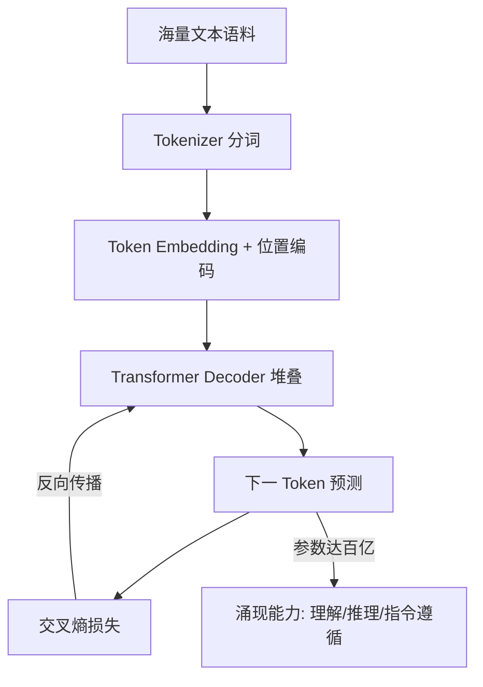

# 什么是大语言模型(LLM)?它的核心能力有哪些

- **大语言模型 (LLM)** 是基于 Transformer 架构、在海量文本上训练的超大规模神经网络模型.

- **实战案例**：在一个 7B 参数模型微调项目中，我们尝试通过增加数据量提升效果，但当数据量未突破临界点时，模型逻辑推理能力几乎为零。只有当参数量和数据量同时达到 Scaling Laws 预测的阈值时，逻辑涌现能力才突然显现。

- **核心能力**
1. **语言理解**:理解指令、推理、翻译
2. **文本生成**:对话、写作、代码补全
3. **知识记忆**:训练数据中的事实和模式
4. **指令跟随**:按格式/约束输出

- **代表模型**:GPT-4、Claude、GLM、Llama、Qwen

- **一句话理解**:LLM = 超大规模参数 + 海量训练数据 + Transformer 架构 → 涌现出语言理解和生成能力.


**## 常见考点**
1. **涌现能力**：模型参数量达到一定规模（如百亿/千亿）后突然出现的小模型不具备的能力（如上下文学习、指令遵循）。
2. **Scaling Laws（缩放定律）**：解释模型性能与计算量、数据量和参数量之间的幂律关系，是预训练的基础理论。
3. **Zero-shot vs Few-shot**：零样本推理（无示例）与小样本推理（给几个示例）的区别及Prompt设计策略。

- **模型参数规模与能力对比**

| 规模 | 参数量示例 | 典型能力 | 适用场景 |
| :--- | :--- | :--- | :--- |
| **小模型** | < 1B | 简单文本分类、NER | 端侧设备、手机本地运行 |
| **中型模型** | 7B - 13B | 基础对话、简单代码生成、一般写作 | 中等成本企业部署、垂直领域微调 |
| **大型模型** | 70B+ | 复杂逻辑推理、长文本理解、数学/科学研究 | 高难度复杂任务、通用人工智能基座 |

## 技术原理

LLM 的核心是「Transformer 架构 + 下一 token 预测 + 规模化」三位一体：

- **Transformer 的自注意力机制**：LLM 的骨架是 Transformer（Decoder-only 架构为主，如 GPT 系列）。每个 token 通过自注意力（Self-Attention）与上下文中所有其他 token 交互，计算 $Attention(Q,K,V) = softmax(QK^T/\sqrt{d_k})V$。这使得模型能捕捉长距离依赖（如「第 1 段提到的人名在第 50 段被引用」），突破了 RNN 的序列依赖瓶颈，支持大规模并行训练。
- **下一 Token 预测的训练目标**：LLM 的预训练目标极其简单——给定前 $t$ 个 token，预测第 $t+1$ 个 token。损失函数是交叉熵 $\mathcal{L} = -\sum \log P(x_{t+1} | x_{1:t})$。尽管目标简单，但在海量数据（万亿 token）和超大参数（百亿~万亿）下，模型被迫学习语法、语义、世界知识、推理模式。这种「压缩即智能」的范式（信息压缩逼出泛化能力）是 LLM 成功的根本。
- **Scaling Laws（缩放定律）**：OpenAI 的研究表明，模型 loss 随计算量 $C$、数据量 $D$、参数量 $N$ 呈幂律下降：$L(C) \approx (C_c/C)^{\alpha_C}$。这意味着只要持续增加算力和数据，性能就持续提升（未饱和）。Chinchilla 定律进一步指出最优训练是 $D/N \approx 20$（每个参数约 20 个 token），指导了数据与参数的配比。
- **涌现能力（Emergent Abilities）**：某些能力（如上下文学习 ICL、思维链 CoT、指令遵循）在参数量低于阈值（约 10B~60B）时几乎为零，超过阈值后突然出现。这可能是任务复杂度需要足够的模型容量才能表征，类似相变现象。注意：近期研究（如斯坦顿 2023）质疑「涌现」是否只是评估指标的非线性造成的假象。

## 代码示例

```python
# LLM 的核心：下一 token 预测（PyTorch 伪代码）
import torch
import torch.nn.functional as F

class SimpleLLM(torch.nn.Module):
    def __init__(self, vocab_size=50000, d_model=4096, n_layers=32, n_heads=32):
        super().__init__()
        self.token_embedding = torch.nn.Embedding(vocab_size, d_model)
        self.position_embedding = torch.nn.Embedding(2048, d_model)  # 位置编码
        self.transformer = torch.nn.TransformerDecoder(
            num_layers=n_layers, ...)   # 堆叠的 Transformer 块
        self.lm_head = torch.nn.Linear(d_model, vocab_size)  # 输出层

    def forward(self, input_ids):
        # input_ids: (batch, seq_len) 输入 token 序列
        positions = torch.arange(input_ids.size(1))
        x = self.token_embedding(input_ids) + self.position_embedding(positions)
        x = self.transformer(x)                          # 自注意力 + FFN
        logits = self.lm_head(x)                         # (batch, seq, vocab)
        return logits

# 训练：预测下一个 token
def train_step(model, input_ids):
    logits = model(input_ids[:, :-1])                    # 输入前 t-1 个 token
    targets = input_ids[:, 1:]                           # 目标是后 t-1 个 token
    loss = F.cross_entropy(logits.reshape(-1, vocab_size), targets.reshape(-1))
    loss.backward()
    optimizer.step()

# 推理：自回归生成（逐 token）
def generate(model, prompt_ids, max_new_tokens=100):
    for _ in range(max_new_tokens):
        logits = model(prompt_ids)[:, -1, :]            # 取最后一个位置的分布
        next_token = torch.argmax(logits, dim=-1)        # 贪婪采样
        prompt_ids = torch.cat([prompt_ids, next_token.unsqueeze(0)], dim=1)
    return prompt_ids
```

## 注意事项

- **基座模型 vs 对话模型**：预训练出的基座模型（如 Llama-3-8B-Base）只会「续写文本」，不会对话。需要 SFT（监督微调，用指令-回答对训练）+ RLHF（人类反馈强化学习）才能变成 ChatGPT 这样的对话助手。直接用基座模型做对话会得到牛头不对马嘴的续写。
- **幻觉（Hallucination）的根源**：LLM 本质是概率生成，没有事实校验机制，会自信地编造不存在的事实。缓解：RAG（检索增强，提供外部知识）、工具调用（让模型查数据库/API）、RLHF 惩罚幻觉输出。但无法根治。
- **上下文窗口的限制**：LLM 能处理的输入长度有限（如 8K~128K token），超出会截断或报错。长文档场景需 RAG 分块检索，而非全量塞入 prompt。
- **知识截止日期**：LLM 的知识来自训练数据，训练后的事件不知道。这是基座模型的固有局限，需通过 RAG 或联网搜索补充实时信息。
- **计算成本与延迟**：大模型推理成本高（70B 模型单次推理几百毫秒到秒级）。生产环境要做量化（INT8/INT4）、蒸馏、KV Cache 优化、 batching 等工程优化。
- **安全与对齐**：未对齐的模型可能输出有害、偏见、违法内容。RLHF 和 Constitutional AI 是主流对齐方法，但无法 100% 消除风险，需配合内容审核。

## 流程图



## 核心知识点图


## 记忆要点

- 定义：基于Transformer、海量数据训练的超大规模神经网络。
- 核心能力：语言理解、文本生成、知识记忆、指令遵循。
- 涌现能力：参数量达百亿级后突然出现的小模型不具备的能力。
- 缩放定律：性能随算力、数据量、参数量呈幂律关系增长。


## 结构化回答

**30 秒电梯演讲：** 基于海量数据和Transformer架构的大规模概率生成模型。——打个比方，读完了互联网所有书的超级大脑，能预测下一个字。

**展开框架：**
1. **定义** — 基于Transformer、海量数据训练的超大规模神经网络。
2. **核心能力** — 语言理解、文本生成、知识记忆、指令遵循。
3. **涌现能力** — 参数量达百亿级后突然出现的小模型不具备的能力。

**收尾：** 以上三点都能配合实战聊。我可以展开任一要点，比如「LLM 和传统 NLP 模型有什么区别」这类追问您感兴趣吗？

## 视频脚本

> 预计时长：2 分钟 | 由浅入深

| 时间 | 画面/字幕 | 口播台词 | 讲解要点 |
|------|----------|----------|----------|
| 0:00 | 标题卡 | "大语言模型(LLM)，30 秒讲清楚。" | 开场钩子 |
| 0:30 | 概念定义动画 | "一句话：基于海量数据和Transformer架构的大规模概率生成模型。" | 核心定义 |
| 1:00 | 定义图解 | "基于Transformer、海量数据训练的超大规模神经网络。" | 定义 |
| 1:30 | 总结卡 | "记好这几条，面试不慌。下期见。" | 收尾 |
