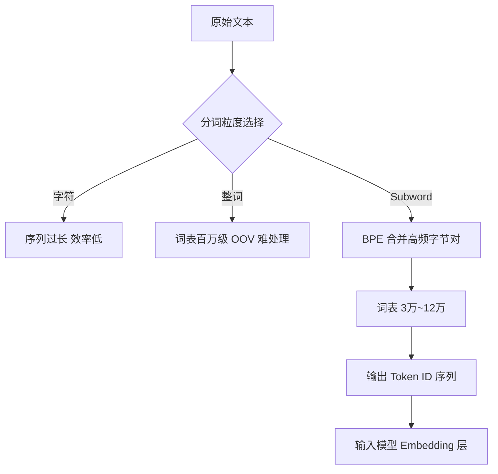
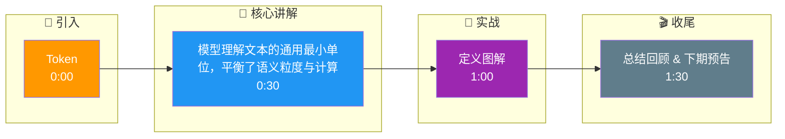

# 什么是 Token?为什么大模型用 Token 而不是字或词

- **Token** 是大模型处理文本的最小单位,介于字符和词之间.

- **实战案例**：在使用 Tokenizer API 计算成本时，发现一段包含大量代码的日志文本 Token 数远超预估（是英文的 2 倍）。经分析，特定编程符号和长变量名被拆分成了极其细碎的 Byte 级 Subwords。优化策略是针对性收集代码语料训练 SentencePiece 模型，将常用关键字（如 `function`, `return`）单 Token 化，节省了 30% 的推理成本。

- **为什么不用字?**
  - 单个字信息量太少,序列太长,计算效率低.

- **为什么不用词?**
  - 中文词边界模糊(分词困难)
  - 词表太大(百万级),模型难以处理

- **Token 的优势**
  - 词表大小可控(通常 3万~12万)
  - 兼容新词、缩写、代码、Emoji
  - 多语言通用,无需单独分词器

- **例子**:'Hello World' → ['Hello', ' World'] = 2 tokens

- **估算**:1 个中文 ≈ 0.7-1.5 tokens,1 个英文单词 ≈ 1.3-1.5 tokens.

**## 常见考点**
1. **分词算法**：主流使用 BPE (Byte Pair Encoding) 或 WordPiece，了解其通过统计词频合并子词的原理。
2. **特殊 Token**：如 `<BOS>` (开始)、`<EOS>` (结束)、`<PAD>` (填充) 在训练和推理中的作用。
3. **Tokenization 不一致性**：不同模型的分词器不同（如 GPT 和 Llama 对同一字符串切分可能不同），影响多语言和代码处理效果。

- **分词粒度对比**

| 粒度 | 分词方式 | 词表大小 | 序列长度 | OOV 处理 | 适用场景 |
| :--- | :--- | :--- | :--- | :--- | :--- |
| **字/字符** | 按单个字符切分 | 极小 (百级) | 极长 (计算慢) | 无 (字集有限) | 需要精细字符控制的任务 |
| **词** | 按词典匹配 (如 Jieba) | 极大 (百万级) | 较短 | 差 (生词难处理) | 传统 NLP (统计机器翻译) |
| **Subword** | **BPE / WordPiece** | **中等 (3w-10w)** | **中等** | **好 (拆解生词)** | **现代大模型 (LLM)** |

- **BPE 分词关键代码**
```python
# 简易 BPE 合并逻辑示意
from collections import Counter

def get_stats(vocab):
    pairs = Counter()
    for word, freq in vocab.items():
        symbols = word.split()
        for i in range(len(symbols)-1):
            pairs[symbols[i], symbols[i+1]] += freq
    return pairs

# 核心步骤：找到频率最高的字节对，合并为新字符
pairs = get_stats(vocab)
best_pair = max(pairs, key=pairs.get)
vocab = {word.replace(' '.join(best_pair), ''.join(best_pair)): freq for word, freq in vocab.items()}
```

## 流程图



## 记忆要点

- 定义：模型处理文本的最小单位，介于字符和词之间。
- 选词原因：字符序列太长效率低，词表太大且分词难。
- 优势：词表可控，兼容多语言和代码，无生词(OOV)问题。
- 算法：主流BPE，通过统计频率合并高频字节对。

## 结构化回答

**30 秒电梯演讲：** 模型理解文本的通用最小单位，平衡了语义粒度与计算效率。——打个比方，像把文章切碎成有意义的字词块，既不是笔画也不是整句。

**展开框架：**
1. **定义** — 模型处理文本的最小单位，介于字符和词之间。
2. **选词原因** — 字符序列太长效率低，词表太大且分词难。
3. **优势** — 词表可控，兼容多语言和代码，无生词(OOV)问题。

**收尾：** 以上三点都能配合实战聊。我可以展开任一要点，比如「BPE 和 WordPiece 有什么区别」这类追问您感兴趣吗？

## 视频脚本

> 预计时长：2 分钟 | 由浅入深

| 时间 | 画面/字幕 | 口播台词 | 讲解要点 |
|------|----------|----------|----------|
| 0:00 | 标题卡 | "Token，30 秒讲清楚。" | 开场钩子 |
| 0:30 | 概念定义动画 | "一句话：模型理解文本的通用最小单位，平衡了语义粒度与计算效率。" | 核心定义 |
| 1:00 | 定义图解 | "模型处理文本的最小单位，介于字符和词之间。" | 定义 |
| 1:30 | 总结卡 | "记好这几条，面试不慌。下期见。" | 收尾 |

### 视频流程图




