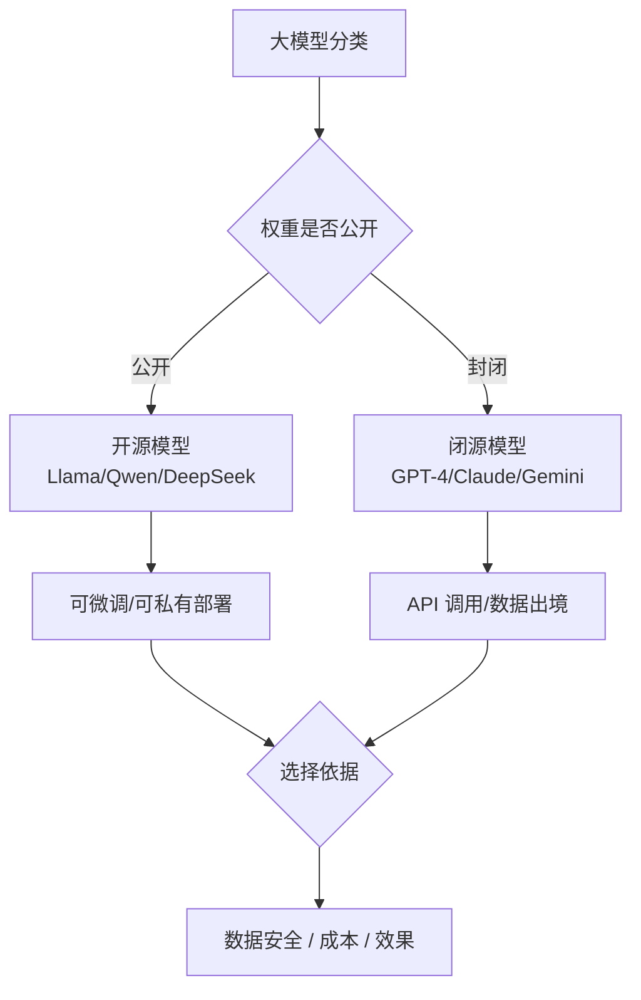

# 开源大模型和闭源大模型有什么区别?如何选择

- **开源 vs 闭源**

| 维度 | 开源(Llama/Qwen/GLM) | 闭源(GPT-4/Claude) |
|------|------------------------|---------------------|
| 模型权重 | ✅ 可下载 | ❌ 只能用 API |
| 微调 | ✅ 可自定义 | ❌ 只能 prompt |
| 数据隐私 | ✅ 本地部署 | ❌ 数据上传 |
| 成本 | 一次性 GPU 成本 | 按 token 付费 |
| 能力上限 | 略低于顶级闭源 | 最强 |

- **选型策略对比**

| 选型维度 | 开源方案 | 闭源方案 |
| :--- | :--- | :--- |
| **启动速度** | 慢（需采购、部署、调试） | 快（API调用即用） |
| **运维成本** | 高（需监控集群、处理容灾） | 低（厂商兜底） |
| **定制能力** | 极高（可修改权重、架构） | 低（仅Prompt/微调接口） |
| **数据合规** | 纯内网，合规性最好 | 需严格审核厂商隐私协议 |
| **延迟稳定性** | 受自建网络和负载影响 | 全球CDN，相对稳定 |

- **选择建议**
  - **数据敏感**(金融/医疗)→ 开源本地部署
  - **需要深度定制**(行业模型)→ 开源 + 微调
  - **追求最强效果**(通用场景)→ 闭源 API
  - **成本敏感 + 高 QPS** → 开源自部署

- **趋势**:开源模型与闭源的差距在缩小(Llama 3.1 405B 接近 GPT-4).

- **实战案例**：某金融风控项目初期使用 GPT-4 API 效果极佳，但因数据合规要求无法上传用户交易记录，后切换至 Qwen-72B-Int4 本地私有化部署，配合 LoRA 微调，虽召回率略降 3% 但完全满足合规需求，且长期成本降低 60%。

```python
# 混合模式实战：用 GPT-4 生成训练数据，蒸馏给开源 7B 模型
import openai

# 1. 使用闭源模型生成高质量 SFT 数据 (知识蒸馏)
def generate_synthetic_data(prompt):
    resp = openai.ChatCompletion.create(
        model="gpt-4-turbo",
        messages=[{"role": "user", "content": prompt}],
        temperature=0.7
    )
    return resp.choices[0].message.content

# 2. 将生成数据用于训练本地轻量模型，降低推理成本
# train_local_llama7b(dataset=generated_data)
```

## 常见考点
1. **开源协议**：区分 Apache 2.0（商用友好）、MIT（宽松）与 Llama 社区许可证（限制某些规模商用）的法律风险。
2. **私有化部署挑战**：开源自建不仅涉及算力成本，还需考虑推理加速（如 vLLM/TGI）、监控服务、高可用架构等运维复杂性。
3. **混合模式**：使用闭源大模型处理复杂任务（如 GPT-4 生成 SFT 数据），训练开源小模型（如 Llama 3 8B）进行低成本批量推理的“蒸馏”思路。

## 流程图




## 记忆要点

- 闭源：能力最强，API即用，按量付费，数据需上传。
- 开源：权重可下载，支持微调和本地部署，数据隐私好。
- 选型：数据敏感/需深度定制选开源；追求效果/快速启动选闭源。
- 趋势：开源与闭源能力差距缩小，混合模式(蒸馏)成新趋势。


## 结构化回答

**30 秒电梯演讲：** 模型权重的公开程度与使用权限的差异。——打个比方，买房装修(开源，自由但累)vs住酒店(闭源，省心但有规则)。

**展开框架：**
1. **闭源** — 能力最强，API即用，按量付费，数据需上传。
2. **开源** — 权重可下载，支持微调和本地部署，数据隐私好。
3. **选型** — 数据敏感/需深度定制选开源；追求效果/快速启动选闭源。

**收尾：** 以上三点都能配合实战聊。我可以展开任一要点，比如「7B 模型能做什么级别的任务」这类追问您感兴趣吗？

## 视频脚本

> 预计时长：2 分钟 | 由浅入深

| 时间 | 画面/字幕 | 口播台词 | 讲解要点 |
|------|----------|----------|----------|
| 0:00 | 标题卡 | "开源大模型和闭源大模型有什么区别，30 秒讲清楚。" | 开场钩子 |
| 0:30 | 概念定义动画 | "一句话：模型权重的公开程度与使用权限的差异。" | 核心定义 |
| 1:00 | 闭源图解 | "能力最强，API即用，按量付费，数据需上传。" | 闭源 |
| 1:30 | 总结卡 | "记好这几条，面试不慌。下期见。" | 收尾 |
