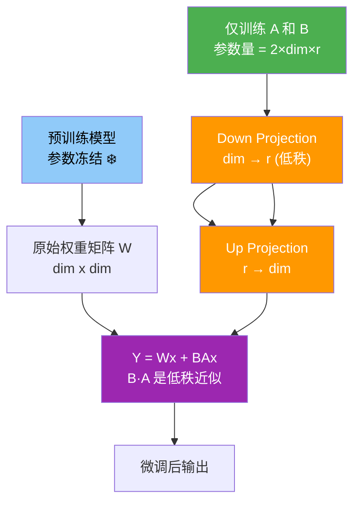

# 解释一下Lora的原理

### 1. LoRA 的背景和问题
在预训练大规模模型时，微调整个模型的参数可能会带来较大的计算和存储开销。对于像 GPT-3 这样的大型模型，直接微调所有参数不仅非常耗时，还需要大量的存储资源。全量微调还需要为每个任务存储一份完整的模型权重，这在多任务场景下是不可接受的。

### 2. LoRA 的原理
LoRA 的核心假设是：模型在适应特定任务时，权重更新的改变量具有**低秩** 特性。即，尽管预训练模型拥有大量的参数，但在微调过程中，参数变化的维度实际上可以通过一个较小的子空间来表示。

LoRA 通过引入低秩矩阵分解，在微调时冻结原始模型权重 $W$，只训练旁路的小矩阵。

假设某个层的权重矩阵为 $W \in \mathbb{R}^{d \times k}$，LoRA 的权重更新公式为：

$$h = W_0 x + \Delta W x = W_0 x + B A x$$

其中：
- $W_0 \in \mathbb{R}^{d \times k}$：预训练模型的原始权重矩阵，**冻结**，保持不变。
- $\Delta W \in \mathbb{R}^{d \times k}$：权重变化量，被分解为 $B \times A$。
- $A \in \mathbb{R}^{r \times k}$ 和 $B \in \mathbb{R}^{d \times r}$：低秩矩阵，秩 $r \ll \min(d, k)$。
- $x$：输入向量。
- **缩放因子**：通常在推理时引入缩放因子 $\frac{\alpha}{r}$，即 $h = W_0 x + \frac{\alpha}{r}BAx$，用于在调整秩 $r$ 时保持训练稳定性。

**计算过程**：
1. 先计算 $y = A x$ (降维: $k \to r$)。
2. 再计算 $z = B y$ (升维: $r \to d$)。
3. 最终输出 $h = W_0 x + z$。

- **LoRA 架构 ASCII 图示**

```text
      输入 x (k维)
         │
    ┌────┴────┐
    │         │
[ 冻结路径 ] [ LoRA 旁路 ]
    │         │
    ▼         ▼
 ( W0 )    ( A -> B )
 (d×k)     (r×k)(d×r)
    │         │
    │    (缩放 α/r)
    │         │
    └────┬────┘
         │
      输出 h (d维) = W0·x + (α/r)·(B·A·x)
```

### 3. 关键细节
- **参数量对比**：全量微调参数量为 $d \times k$，LoRA 参数量为 $d \times r + r \times k = r(d+k)$。当 $r=8, d=4096, k=4096$ 时，参数量减少约 500-1000 倍。
- **推理零开销**：由于 $W_0$ 和 $B A$ 的维度相同，可以通过 $W_{new} = W_0 + (\alpha/r)BA$ 将权重合并，推理时与原模型结构完全一致，不增加额外计算量。

**实战案例：LoRA 在 Llama-3 微调中的“灾难性遗忘”**
在使用 LoRA 微调 Llama-3 70B 进行特定领域（如医疗）问答时，如果只将 LoRA 挂载在 `q_proj` 和 `v_proj` 上，虽然训练速度快且显存占用低，但发现模型对通用知识的回答能力大幅下降。**排查**：因为医疗数据与其他领域数据差异巨大，低秩矩阵不足以完全解耦冲突。**解决**：将 Target Modules 扩展到 `q_proj`, `k_proj`, `v_proj`, `o_proj` 以及 MLP 层的 `gate_proj` 等（即 Full LoRA），虽然参数量微增，但成功保留了通用能力并注入了领域知识。

**代码示例：PyTorch 实现 LoRA Layer**
```python
import torch
import torch.nn as nn

class LoRALinear(nn.Module):
    def __init__(self, in_features, out_features, rank=8, alpha=16):
        super().__init__()
        # 原始线性层（冻结）
        self.linear = nn.Linear(in_features, out_features, bias=False)
        self.linear.weight.requires_grad = False
        
        # LoRA 低秩分解
        self.lora_A = nn.Parameter(torch.randn(rank, in_features))
        self.lora_B = nn.Parameter(torch.zeros(out_features, rank))
        self.scaling = alpha / rank

    def forward(self, x):
        # 原始计算
        base_out = self.linear(x)
        # LoRA 旁路计算: x @ A^T @ B^T
        lora_out = (x @ self.lora_A.T @ self.lora_B.T) * self.scaling
        return base_out + lora_out
```

**LoRA vs 全量微调 vs 其他 PEFT**
| 特性 | 全量微调 | LoRA | Prefix Tuning | Adapter
|------|---------|------|--------------|---------|
| 参数量 | 100% | < 1% | < 0.1% | ~3-5% |
| 推理延迟 | 无额外开销 | 零开销 (需合并权重) | 有额外开销 (Prefix占用Context) | 有额外开销 (增加层数) |
| 训练稳定性 | 高 | 高 | 较低 (难收敛) | 中等 |
| 硬件要求 | 极高 | 低 (单卡可跑大模型) | 低 | 中 |

## 常见考点
1.  **为什么 $A$ 和 $B$ 的初始化方式不同？**（为了保证训练开始时 $\Delta W \approx 0$，不影响预训练模型的能力。通常 $A$ 用随机高斯初始化，$B$ 用全 0 初始化）。
2.  **LoRA 应该加在哪些层？**（实验表明加在 Attention 中的 $W_q, W_v$ 效果最好且性价比最高，也可以加到 MLP 层，但性价比下降）。
3.  **秩 的选择？**（$r$ 越大表达能力越强但参数越多；通常 $r$ 选 4, 8, 16, 64 等，需根据任务复杂度调整；若 $r$ 太小可能导致欠拟合）。
4.  **与全量微调的性能对比？**（在大多数指令微调任务上，设置合理的 $r$，LoRA 可以达到与全量微调相当甚至更好的效果，因为低秩限制起到了正则化作用，防止过拟合）。


## 核心流程图



## 记忆要点

- 核心原理：冻结预训练权重 W，训练低秩矩阵 A 和 B，更新量 ΔW = B×A。
- 参数量：秩 r << min(d,k)，参数量减少数百至千倍，大幅降低显存占用。
- 推理合并：通过 W_new = W + (α/r)BA 将权重合并，推理时零延迟、零额外计算。
- 初始化：A 随机高斯初始化，B 初始化为零，确保训练起步 ΔW=0，保护预训练权重。
- 缩放因子：引入 α/r 缩放，平衡不同秩 r 下的更新步长，保持训练稳定。


## 结构化回答

**30 秒电梯演讲：** 冻结大模型权重，通过低秩矩阵分解更新少量参数实现高效微调。——打个比方，给一本厚书（大模型）加几张便利贴（低秩矩阵）做笔记，而不是整本书重写。

**展开框架：**
1. **核心原理** — 冻结预训练权重 W，训练低秩矩阵 A 和 B，更新量 ΔW = B×A。
2. **参数量** — 秩 r << min(d,k)，参数量减少数百至千倍，大幅降低显存占用。
3. **推理合并** — 通过 W_new = W + (α/r)BA 将权重合并，推理时零延迟、零额外计算。

**收尾：** 以上三点都能配合实战聊。我可以展开任一要点，比如「LoRA的秩r如何选择」这类追问您感兴趣吗？

## 视频脚本

> 预计时长：2 分钟 | 由浅入深

| 时间 | 画面/字幕 | 口播台词 | 讲解要点 |
|------|----------|----------|----------|
| 0:00 | 标题卡 | "解释一下Lora的原理，30 秒讲清楚。" | 开场钩子 |
| 0:30 | 概念定义动画 | "一句话：冻结大模型权重，通过低秩矩阵分解更新少量参数实现高效微调。" | 核心定义 |
| 1:00 | 核心原理图解 | "冻结预训练权重 W，训练低秩矩阵 A 和 B，更新量 ΔW = B×A。" | 核心原理 |
| 1:30 | 总结卡 | "记好这几条，面试不慌。下期见。" | 收尾 |

---

## 延伸：介绍Lora及其变体的特点

> 合并自 `lln-017`（相似度 67%）

LoRA (Low-Rank Adaptation) 通过低秩分解假设：模型在适配特定任务时，权重更新量 $\Delta W$ 具有低秩特性。它冻结预训练权重 $W_0$，训练可分解的 $A$ 和 $B$ 矩阵（$\Delta W = BA$），其中 $A \in \mathbb{R}^{d \times r}, B \in \mathbb{R}^{r \times k}$，秩 $r \ll \min(d, k)$。前向传播时 $h = W_0 x + BA x$。

**实战案例**：
在多租户SaaS平台中，我们需要为100个不同的客户微调同一个7B模型。如果全量微调，显存成本巨大。实战中我们采用LoRA，每个客户仅维护一个几MB的Adapter文件。推理时，动态加载目标客户的LoRA权重并与基座模型合并，从而以单份模型的成本服务百个定制化场景，且互不干扰。

**变体详解**：
1.  **AdaLoRA (Adaptive LoRA)**：
    *   *痛点*：重要模块（如Attention中的q, v投影）可能需要更高秩，而不重要模块仅需低秩。
    *   *机制*：动态分配不同层的秩预算。基于重要性评分（如梯度的平方和）调整每个权重矩阵的秩，重要矩阵增加秩，不重要矩阵减小秩。
2.  **DoRA (Weight-Decomposed LoRA)**：
    *   *痛点*：LoRA 直接学习加性更新，可能限制了对权重幅度的调整能力。
    *   *机制*：将预训练权重分解为 **幅度** 和 **方向**：$W = m \cdot \frac{V}{||V||}$。LoRA 仅用于更新方向向量 $V$，而引入一个可学习的标量 $m$ 或向量来调整幅度。实验表明其对微调的收敛性和最终效果通常优于标准LoRA。
3.  **LoRA+**：
    *   *机制*：针对 LoRA 中 A 和 B 矩阵通常使用相同学习率导致收敛慢的问题，建议使用不同的学习率。通常 B 矩阵的学习率设为 A 的 $\lambda$ 倍（如 $\lambda=2$ 或更高），并调整缩放因子 $\alpha$。

**变体对比表格**：
| 特性 | LoRA (Standard) | AdaLoRA | DoRA | LoRA+ |
| :--- | :--- | :--- | :--- | :--- |
| **核心改进** | 固定低秩矩阵加性更新 | 动态调整各层的秩 | 权重分解(幅度+方向) | A/B矩阵使用不同学习率 |
| **参数量** | 极低 (2d*r) | 动态变化 (整体接近) | 略高于LoRA (含magnitude) | 与LoRA相同 |
| **训练稳定性** | 高 | 中 (需监控秩调整) | 高 | 高 (收敛更快) |
| **适用场景** | 通用任务微调 | 需要精细化参数分配的任务 | 需要大幅改变特征幅度的任务 | 追求训练速度的场景 |
| **显存占用** | 最低 | 低 (需存储重要性矩阵) | 低 | 低 |

**代码示例 (PEFT/LoRA)**：
```python
from peft import LoraConfig, get_peft_model

# LoRA 配置实战
config = LoraConfig(
    r=16,                    # 秩
    lora_alpha=32,           # 缩放因子 (通常 alpha = 2*r)
    target_modules=["q_proj", "v_proj"], # 仅微调Attention层
    lora_dropout=0.05,
    bias="none",
    task_type="CAUSAL_LM"
)
model = get_peft_model(base_model, config)
```

**架构示意图**：
```text
标准 LoRA:
    Input x
      │
      ▼
┌─────┴─────┐
│  Frozen W0 │ (d x k)
└─────┬─────┘
      │      ┌─────┐
      └──────>│  +  │<───┐
             └─────┘    │ (通道维相加)
   ┌──────────────────┐│
   │  B (d x r) • A (r x k) │  <── Trained (Rank r)
   └──────────────────┘
            │
            ▼
        Output
```

**常见考点**：
1. LoRA 的缩放因子 $\alpha$ 的作用是什么？（在初始化时控制更新的幅度，通常设为 $1x$ 或 $2x$ 的秩）
2. 为什么 LoRA 推理无延迟？（可以将 $BA$ 直接合并回 $W_0$，不增加额外的计算算子）
3. 秩 $r$ 一般设置为多少？（根据参数预算，常见 8, 16, 64；量化场景下可能需要更高 rank）


## 核心流程图


## 记忆要点

- 核心原理：假设权重更新具有低秩特性，所以冻结原权重仅训练降维矩阵A和B
- 推理优势：因为BA矩阵可直接合并回原权重，所以推理时无任何额外延迟
- 变体对比：AdaLoRA动态调秩，DoRA分解方向与幅度，LoRA+为AB矩阵设不同学习率
- 实战口诀：多租户场景极其友好，单基座模型动态加载多份极小Adapter


## 结构化回答

**30 秒电梯演讲：** 用低秩矩阵更新冻结大模型，小参数实现高效微调——打个比方，像给大模型贴薄纸，只改少量开关就能微调功能，不用重装整个系统

**展开框架：**
1. **核心原理** — 假设权重更新具有低秩特性，所以冻结原权重仅训练降维矩阵A和B
2. **推理优势** — 因为BA矩阵可直接合并回原权重，所以推理时无任何额外延迟
3. **变体对比** — AdaLoRA动态调秩，DoRA分解方向与幅度，LoRA+为AB矩阵设不同学习率

**收尾：** 以上三点都能配合实战聊。您想深入聊哪一块？

## 视频脚本

> 预计时长：2 分钟 | 由浅入深

| 时间 | 画面/字幕 | 口播台词 | 讲解要点 |
|------|----------|----------|----------|
| 0:00 | 标题卡 | "介绍Lora及其变体的特点，30 秒讲清楚。" | 开场钩子 |
| 0:30 | 概念定义动画 | "一句话：用低秩矩阵更新冻结大模型，小参数实现高效微调" | 核心定义 |
| 1:00 | 核心原理图解 | "假设权重更新具有低秩特性，所以冻结原权重仅训练降维矩阵A和B" | 核心原理 |
| 1:30 | 总结卡 | "记好这几条，面试不慌。下期见。" | 收尾 |
