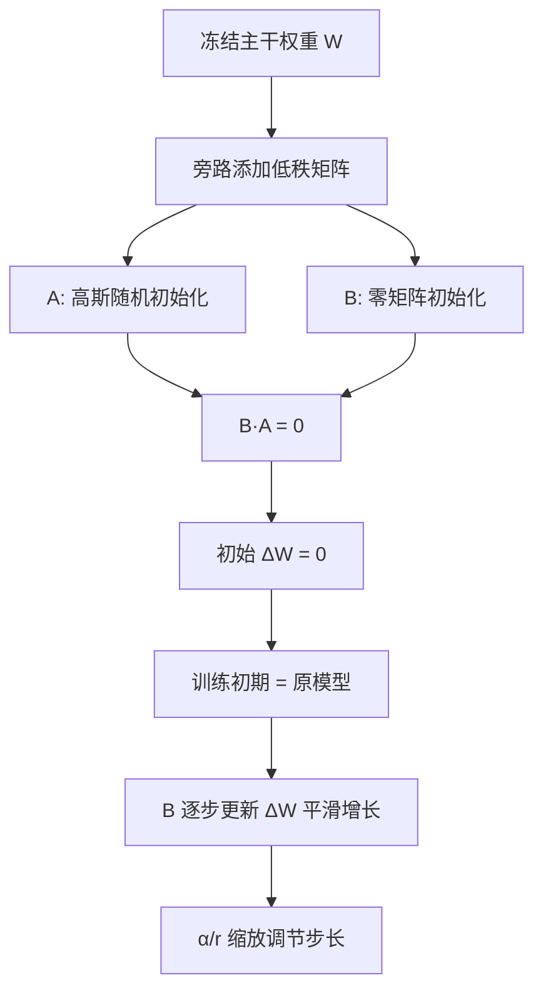

# LoRA 的优点

### LoRA 的优点

**🎁 高效性：**
通过低秩矩阵分解，大幅减少了需要微调的参数量（通常可减少 1000 倍以上）。显存占用大幅降低（因为不需要存储所有梯度的 Optimizer States），使得单卡微调大模型成为可能。

**📍 冻结主干模型：**
LoRA 保持原始模型的主干权重 $W$ 不变，仅调整 $A$ 和 $B$ 矩阵。这使得可以在多个任务之间共享同一个预训练模型（作为底座），而不同任务只需要微调并存储少量的低秩矩阵（几 MB 到几百 MB）。

**🌟 通用性强：**
LoRA 可以应用在模型的多种层次结构（如自注意力层、前馈网络层等），广泛适用于各类 Transformer 模型（Llama, Qwen, Baichuan 等）。

**🛡️ 推理零延迟：**
虽然训练时是旁路结构，但在推理部署阶段，可以通过数学恒等式 $W_{new} = W + \frac{\alpha}{r}BA$ 将训练好的权重合并回原模型。推理时模型结构不变，没有额外的计算开销。

---

### LoRA 的初始化策略

在 LoRA 的实现中，矩阵 **$B$ 初始化为零矩阵**，矩阵 **$A$ 使用随机高斯分布初始化**。这样做的主要目的是在微调开始时确保权重调整 $\Delta W \approx 0$，从而稳定训练过程。

#### 1. 为什么初始化时需要 B 初始化为零矩阵

LoRA 的目标是在不改变预训练模型原始权重 $W$ 的情况下，通过微调来对模型进行轻量级的适配。如果在微调一开始，矩阵 $A$ 和 $B$ 的初始值导致较大的权重变化（即 $\Delta W \neq 0$），模型的表现可能会发生突变，偏离原本的预训练模型表现，从而导致不稳定的训练过程。

通过将 $B$ 初始化为零矩阵，$A \times B$ 一开始为零矩阵，这样确保了在微调开始时：
$$W_{new} = W + \Delta W = W + 0 = W$$
即，初始时微调模型的权重与预训练模型的权重保持一致。

#### 2. 随机初始化 A 的原因
尽管 $B$ 初始化为零，但 $A$ 使用随机高斯分布进行初始化。这是为了确保在训练过程中，当 $B$ 的梯度更新使其不再为零矩阵时，$A$ 能够提供多样的参数更新方向。

*   **打破对称性**：如果 $A$ 也是全 0，或者 $A, B$ 都是对称初始化，那么所有 LoRA 通路可能学到完全相同的特征，限制模型表达能力。随机初始化 $A$ 赋予了每个神经元探索不同特征空间的能力。
*   **提供有效的梯度信息**：$A$ 和 $B$ 的梯度更新依赖于链式法则。随机初始化保证了在训练初期，梯度流能够有效地传递，帮助模型快速找到适应任务的最优参数方向。

#### 3. 缩放因子 $\alpha$ 的作用
公式中通常引入 $\frac{\alpha}{r}$ 进行缩放。由于 $A$ 是随机初始化，$B$ 是 0，训练开始时 $\Delta W$ 的量级约为 $O(1/\sqrt{r})$。引入 $\alpha$ 可以在调整秩 $r$ 时不需要重新调节学习率，保持训练的稳定性。

### 总结

- **$A$ (随机高斯)**：提供探索方向，打破对称性。
- **$B$ (全零)**：确保训练起步 $\Delta W = 0$，平滑过渡，保护预训练权重。
- **$\alpha/r$ (缩放)**：平衡不同秩 $r$ 下的更新步长。

## 常见考点
1.  **LoRA 与 Adapter 的区别？**（LoRA 并行插入权重矩阵，推理可完美合并，无额外计算延迟；Adapter 串行插入层与层之间，推理有额外的 FLOPs 开销和显存占用）。
2.  **为什么 LoRA 可以起到正则化作用？**（限制了参数更新的秩，限制了模型的自由度，迫使模型在低维流形上寻找最优解，从而防止过拟合，泛化能力往往更强）。
3.  **不同任务使用不同的 $r$ 会影响性能吗？**（简单的下游任务 $r=8$ 足矣，复杂知识注入或指令微调任务可能需要 $r=64$ 或更高，但边际效应递减）。
4.  **多 LoRA 并行服务？**（在推理时，可以动态切换不同的 LoRA 权重合并到底座模型上，实现单卡服务多个不同微调任务的模型，即 LoRA Serving）。

## 技术原理

**B 矩阵初始化为零，确保初始状态等同于原模型**
LoRA 的核心思想是用两个低秩矩阵 A 和 B 的乘积来近似权重更新量 ΔW，即 `W_new = W + (α/r)·B·A`。为了保证微调开始时模型行为与预训练模型完全一致（不破坏已学到的知识），B 被初始化为零矩阵，使得 `B·A = 0`，从而 `W_new = W`。这种"零启动"设计保证了训练初期的稳定性，不会因为随机初始化导致输出突变。

**A 矩阵随机初始化，为后续训练提供丰富的梯度方向**
虽然 B 为零，但 A 用高斯随机初始化。这样设计的目的是打破对称性——如果 A 也是零，那么所有 LoRA 通路会学到完全相同的特征，限制表达能力。随机初始化的 A 保证了当 B 的梯度更新使其不再为零时，不同通路能探索不同的特征空间，提供多样的梯度方向，加速收敛。

**这种设计避免了训练初期的性能突变**
如果 A 和 B 都随机初始化，初始 ΔW 会是一个随机非零矩阵，模型输出会立即偏离预训练表现，导致训练初期 loss 暴涨甚至发散。零初始化 B 让 ΔW 平滑地从 0 开始增长，实现了从预训练知识到任务特定知识的渐进式过渡，保护了预训练权重。

**实现了从预训练知识到任务特定知识的平滑过渡**
配合缩放因子 α/r，当调整秩 r 时无需重新调学习率——因为 ΔW 的量级被 α/r 归一化。这种设计让 LoRA 在不同 r（如 8/16/64）下训练稳定性一致，简化了超参搜索。

## 代码示例

```python
# HuggingFace PEFT 库的 LoRA 配置
from peft import LoraConfig, get_peft_model

config = LoraConfig(
    r=8,                          # 秩，常用 8/16/64
    lora_alpha=16,                # 缩放因子，通常 = 2*r
    target_modules=["q_proj", "v_proj"],  # 应用到注意力层
    lora_dropout=0.05,
    bias="none",
    task_type="CAUSAL_LM",
)
model = get_peft_model(base_model, config)
# 冻结主干，仅训练 A 和 B（参数量减少 1000+ 倍）
```

```python
# 推理时合并权重：零额外延迟
def merge_lora_weights(model):
    for name, module in model.named_modules():
        if hasattr(module, "lora_A"):
            # W_new = W + (alpha/r) * B @ A
            delta_w = (module.lora_alpha / module.r) * \
                      module.lora_B.weight @ module.lora_A.weight
            module.base_layer.weight.data += delta_w
            # 合并后可删除 LoRA 模块，推理结构不变
```

## 注意事项

- 高效性：参数量减少 1000 倍以上，显存占用低，单卡即可微调大模型。
- 共享底座：冻结主干模型，多任务仅需存储少量 LoRA 权重，便于切换。
- 推理零延迟：权重可完美合并回原模型，推理结构不变，无计算开销。
- 通用性强：适用于 Attention 和 MLP 层，兼容各类 Transformer 架构。
- 正则化：限制参数更新秩，约束模型自由度，防止过拟合，泛化性强。
- r 选择：简单任务 r=8 足够，知识注入任务可能需要 r=64，边际效应递减。

## 流程图



## 记忆要点

- 高效性：参数量减少 1000 倍以上，显存占用低，单卡即可微调大模型。
- 共享底座：冻结主干模型，多任务仅需存储少量 LoRA 权重，便于切换。
- 推理零延迟：权重可完美合并回原模型，推理结构不变，无计算开销。
- 通用性强：适用于 Attention 和 MLP 层，兼容各类 Transformer 架构。
- 正则化：限制参数更新秩，约束模型自由度，防止过拟合，泛化性强。

## 结构化回答

**30 秒电梯演讲：** 通过独特的零初始化设计，确保微调初期完全继承预训练能力，渐进式学习新任务。——打个比方，像给电脑装系统，先完整备份原系统（B=0），再小心翼翼打补丁（A随机），防止一开始就崩。

**展开框架：**
1. **高效性** — 参数量减少 1000 倍以上，显存占用低，单卡即可微调大模型。
2. **共享底座** — 冻结主干模型，多任务仅需存储少量 LoRA 权重，便于切换。
3. **推理零延迟** — 权重可完美合并回原模型，推理结构不变，无计算开销。

**收尾：** 以上三点都能配合实战聊。我可以展开任一要点，比如「为什么LoRA用高斯随机初始化A而B用零初始化」这类追问您感兴趣吗？

## 视频脚本

> 预计时长：2 分钟 | 由浅入深

| 时间 | 画面/字幕 | 口播台词 | 讲解要点 |
|------|----------|----------|----------|
| 0:00 | 标题卡 | "LoRA 的优点，30 秒讲清楚。" | 开场钩子 |
| 0:30 | 概念定义动画 | "一句话：通过独特的零初始化设计，确保微调初期完全继承预训练能力，渐进式学习新任务。" | 核心定义 |
| 1:00 | 高效性图解 | "参数量减少 1000 倍以上，显存占用低，单卡即可微调大模型。" | 高效性 |
| 1:30 | 总结卡 | "记好这几条，面试不慌。下期见。" | 收尾 |

### 视频流程图


