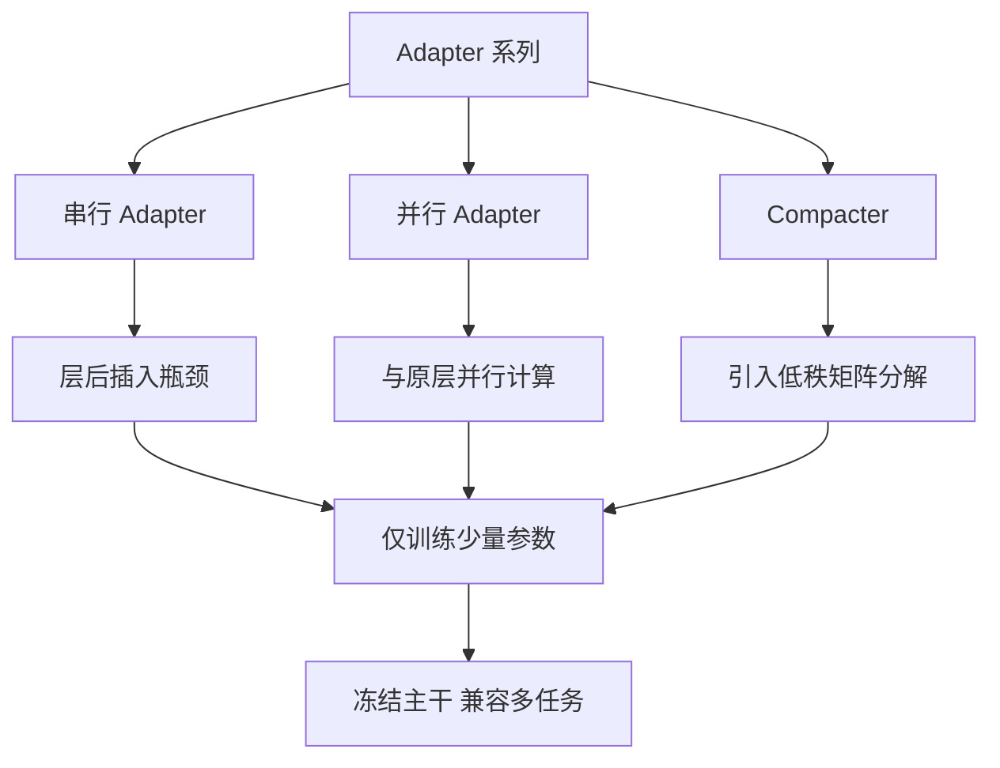

# 介绍几种常见的Adapter

Adapter 方法的基本思想是在预训练模型的基础上增加一些可训练的模块来实现任务微调，但这些方法并不总是和 LoRA 一样，直接在权重矩阵上进行融合。不同的 Adapter 方法有各自的实现方式和插入位置。

### 1. Houlsby Adapter
Houlsby Adapter 的实现方式是在 Transformer 的每一层的自注意力块和前馈网络之间插入一个 Adapter 模块。这种设计没有直接修改原始权重矩阵，而是通过增加新的可训练层来实现微调。

**具体结构如下：**
*   **Adapter 模块结构**：通常包括一个降维层、非线性激活函数（如 ReLU 或 GELU）和一个升维层，中间包含 Layer Norm。
*   **数据流过程**：对于给定的输入 $h$，经过自注意力（Self-Attention）后，再通过 Adapter 模块进行额外的特征变换。整个过程可以表示为：
    $$h_{out} = \text{LayerNorm}(h + \text{Adapter}(h))$$
    $$h_{final} = \text{FFN}(h_{out})$$
    Adapter 模块产生的输出与原始特征进行残差连接，并接 Layer Norm 保证训练稳定性。

这种方法的特点是，Adapter 模块不与原始权重矩阵直接交互，而是作为独立的层插入。

### 2. Parallel Adapter
Parallel Adapter 与 Houlsby Adapter 不同，它与 Transformer 的层是平行的工作方式。

*   **特征融合**：Parallel Adapter 不会直接修改 Transformer 的层输出，而是将 Adapter 模块的输出与 Transformer 层输出相加或进行其他融合操作。
*   **结构差异**：不同于直接插入的 Houlsby Adapter，Parallel Adapter 像是并行执行的子网络，其输入与原始层相同，经过 Adapter 变换后，与原始层的输出进行融合。公式表示为：
    $$h_{ffn} = \text{FFN}(h)$$
    $$h_{adapter} = \text{Adapter}(h)$$
    $$h_{out} = h_{ffn} + h_{adapter}$$

这种方法依然没有对原始的权重矩阵进行低秩分解或直接修改，而是通过增加并行的结构来辅助特征学习。

### 3. Compacter
Compacter 是 Adapter 方法的一种优化变体，它通过低秩分解技术减少了 Adapter 模块的参数量。具体而言，它通过将 Adapter 模块的权重矩阵表示为几个低秩矩阵的乘积来实现参数压缩：

*   **低秩分解**：类似于 LoRA 的思想，Compacter 对 Adapter 模块内部的权重矩阵进行低秩分解。它引入了超复数乘积或者简单的低秩结构。数学上可以看作：
    $$W = (P H Q)$$
    其中引入了较小的超复杂度参数，从而极大地压缩了参数量。
*   **参数更新方式**：虽然使用了低秩分解，但它仅限于 Adapter 模块内部的权重更新，并不会直接去修改 Transformer 原始的权重矩阵。

### 4. 总结
虽然一些 Adapter 变体（如 Compacter）会使用低秩分解技术来减少参数量，但传统的 Adapter 方法（如 Houlsby 和 Parallel Adapter）主要是通过添加新的层结构来微调模型，而不是直接在原始权重矩阵上进行操作和融合。因此，传统的 Adapter 方法并不像 LoRA 那样训练一个低秩矩阵用于与原始的权重矩阵直接融合，推理时通常会有额外的延迟。

## 常见考点
1. **Houlsby Adapter 与 Pfeiffer Adapter 的区别**：Pfeiffer Adapter 是 Houlsby 的简化版，只将 Adapter 放置在 Feed-Forward Network (FFN) 之后，减少了 Adapter 的数量（减半），进一步降低计算开销，但性能通常略逊于 Houlsby。
2. **Adapter 的推理延迟**：由于 Adapter 是串行或并行地增加层数，推理时必须进行这些额外的计算，无法像 LoRA 那样合并权重为零额外计算成本。这是 Adapter 在工业界落地较少的主要原因之一。
3. **Layer Norm 的位置**：在某些 Adapter 变种中，Layer Norm 是加在 Adapter 内部，而在另一些（如 Houlsby）中是加在残差连接之后。这会影响梯度的流动和模型的收敛速度。

## 技术原理

**Houlsby Adapter 在原层后插入瓶颈结构**
Houlsby Adapter 是最早提出的 Adapter 方案，在 Transformer 每一层的自注意力块和 FFN 之间串行插入一个 Adapter 模块。Adapter 内部是瓶颈结构：先降维（投影到低维空间）、非线性激活（ReLU/GELU）、再升维回原维度，配合 LayerNorm 和残差连接。降维大大压缩了参数量，但因为是串行插入，推理时必须多一次前向计算。

**Parallel Adapter 与原层并行处理并融合特征**
Parallel Adapter 改变了插入方式——不再串行接在原层之后，而是与 Transformer 层并行运行。输入同时经过原层（如 FFN）和 Adapter，两者输出相加融合：`h_out = FFN(h) + Adapter(h)`。并行结构对推理延迟更友好（理论上可并行计算），但仍增加了额外的可训练参数和计算量。

**Compacter 利用低秩分解进一步减少 Adapter 参数**
Compacter 在 Adapter 内部引入低秩分解思想，把 Adapter 的权重矩阵表示为几个低秩矩阵的乘积（类似 LoRA），进一步压缩参数量。它还引入了超复数乘积（Hypercomplex Multiplication）结构，在保持表达能力的同时大幅减少可训练参数，适合参数极度受限的场景。

**相比 LoRA，传统 Adapter 推理时需计算额外层**
Adapter 系列（Houlsby/Parallel）的根本局限：推理时必须保留并计算这些额外层，无法像 LoRA 那样把训练好的权重合并回原矩阵。这导致 Adapter 推理有额外的 FLOPs 开销和显存占用，延迟增加，这是 Adapter 在工业界落地较少的主要原因。

## 代码示例

```python
# Houlsby Adapter 模块结构（PyTorch 简化实现）
import torch.nn as nn

class HoulsbyAdapter(nn.Module):
    def __init__(self, dim=768, bottleneck=64):
        super().__init__()
        self.down = nn.Linear(dim, bottleneck)   # 降维
        self.activation = nn.GELU()
        self.up = nn.Linear(bottleneck, dim)     # 升维
        self.layer_norm = nn.LayerNorm(dim)
        nn.init.zeros_(self.up.weight)           # 初始化为零，保证训练初期不破坏原模型

    def forward(self, h):
        residual = h
        x = self.down(h)
        x = self.activation(x)
        x = self.up(x)
        return self.layer_norm(residual + x)     # 残差连接
```

```python
# 并行 Adapter 与 FFN 融合
class TransformerLayerWithParallelAdapter(nn.Module):
    def __init__(self):
        self.ffn = FFN()
        self.adapter = HoulsbyAdapter()

    def forward(self, h):
        h_ffn = self.ffn(h)           # 原层
        h_adapter = self.adapter(h)   # 并行 Adapter
        return h_ffn + h_adapter      # 融合（与 Houlsby 串行不同）
```

## 注意事项

- Houlsby Adapter：串行插入在注意力和 FFN 之间，结构经典。
- Parallel Adapter：与 Transformer 层并行计算，输出融合。
- Compacter：使用低秩分解压缩 Adapter 内部权重，参数更少。
- 对比 LoRA：Adapter 增加层数导致推理延迟，LoRA 可融合无延迟。
- 推理延迟敏感场景（如在线服务）优选 LoRA；离线任务可接受 Adapter 的额外开销。

## 流程图




## 记忆要点

- Houlsby Adapter：串行插入在注意力和FFN之间，结构经典。
- Parallel Adapter：与Transformer层并行计算，输出融合。
- Compacter：使用低秩分解压缩Adapter内部权重，参数更少。
- 对比LoRA：Adapter增加层数导致推理延迟，LoRA可融合无延迟。


## 结构化回答

**30 秒电梯演讲：** Adapter系列通过串行或并行插入小型神经网络层进行微调，Compacter引入了低秩思想。——打个比方，Houlsby像在收费站加通道（串行），Parallel像在主路旁修辅路（并行），Compacter则是把辅路修得很窄（低秩）。

**展开框架：**
1. **Houlsby** — Houlsby Adapter：串行插入在注意力和FFN之间，结构经典。
2. **Parallel** — Parallel Adapter：与Transformer层并行计算，输出融合。
3. **Compacte** — Compacter：使用低秩分解压缩Adapter内部权重，参数更少。

**收尾：** 以上三点都能配合实战聊。您想深入聊哪一块？

## 视频脚本

> 预计时长：2 分钟 | 由浅入深

| 时间 | 画面/字幕 | 口播台词 | 讲解要点 |
|------|----------|----------|----------|
| 0:00 | 标题卡 | "介绍几种常见的Adapter，30 秒讲清楚。" | 开场钩子 |
| 0:30 | 概念定义动画 | "一句话：Adapter系列通过串行或并行插入小型神经网络层进行微调，Compacter引入了低秩思想。" | 核心定义 |
| 1:00 | 要点图解 | "Houlsby Adapter：串行插入在注意力和FFN之间，结构经典。" | 要点 |
| 1:30 | 总结卡 | "记好这几条，面试不慌。下期见。" | 收尾 |
