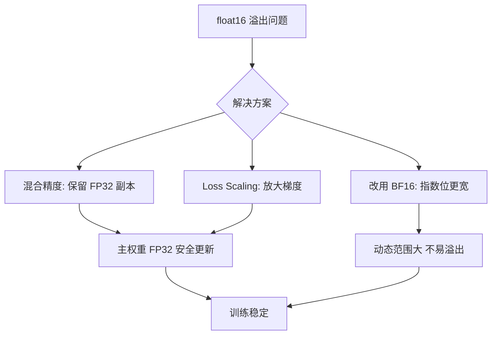

# 怎么解决训练使用float16导致溢出的问题

### 解决 float16 训练溢出的方法

使用 float16 (FP16) 进行训练时，由于其动态范围较小（最大值约为 65504），容易发生**上溢**（数值过大变为 Infinity）或**下溢**（数值过小变为 0）。以下是主要的解决方案：

#### 1. 混合精度训练
这是目前最主流的解决方案。
*   **原理**：仅在计算密集型的矩阵乘法（前向和反向传播）中使用 FP16，但在权重更新和梯度累加等关键步骤使用 FP32。
*   **实现**：保留一份 FP32 格式的权重副本。每次迭代时，将 FP32 权重转为 FP16 进行计算，计算出的 FP16 梯度转回 FP32 后更新 FP32 权重副本。
*   **作用**：FP32 的大范围有效防止了权重更新时的溢出问题。

#### 2. 损失缩放
针对 FP16 的**下溢**问题（梯度太小被截断为0）。
*   **原理**：在反向传播之前，将 Loss 乘以一个较大的系数 $S$（如 $2^{16}$）。根据链式法则，反向传播得到的梯度也会相应放大 $S$ 倍，使其进入 FP16 的有效表示范围。在优化器更新权重前，再将梯度除以 $S$ 还原。
*   **分类**：
    *   **静态缩放**：固定一个较大的缩放因子，如果遇到 NaN 则跳过更新。
    *   **动态缩放**：从较大的缩放因子开始，如果检测到梯度溢出（Inf/NaN），则缩小缩放因子；否则定期尝试增大缩放因子，以最大化梯度精度。

#### 3. 使用 bfloat16 (Brain Floating Point)
*   **原理**：bfloat16 截断了 FP32 的尾数，但保留了完整的 8 位指数位。
*   **优势**：其数值范围与 FP32 完全相同，因此极难发生上溢或下溢，**通常不需要 Loss Scaling**。
*   **代价**：精度低于 FP16，但对深度学习训练通常影响不大。

#### 4. 梯度裁剪
*   **原理**：在反向传播后，对梯度的范数进行限制（如设定最大值为 1.0）。
*   **作用**：主要用于防止梯度爆炸，这有助于缓解 FP16 的上溢问题。

#### 5. 优化初始化与激活函数
*   使用更稳定的权重初始化方法（如 Xavier/Glorot 或 He 初始化）。
*   避免使用容易导致梯度消失或爆炸的激活函数（如 Sigmoid/Tanh），推荐使用 ReLU 及其变体。

```text
Loss Scaling 流程示意：

[Forward Pass] -> [Loss (FP16, very small)]
       |
       v
[Multiply by Scale S (e.g. 65536)] -> [Scaled Loss]
       |
       v (Backpropagation)
[Scaled Gradients (FP16)]
       |
       v
[Divide by Scale S / Unscale] -> [Original Gradients (FP32)]
       |
       v
[Optimizer Update]
```

---

## 常见考点
1.  **bfloat16 相比 FP16 的主要优缺点是什么？**（Hint：bf16 优势是转换快、无需 Loss Scaling、不溢出；劣势是精度低，可能影响收敛速度。）
2.  **为什么 FP16 梯度转回 FP32 之前不需要反 Unscale？**（Hint：实际上 Loss Scaling 是作用在计算图上的，Unscale 操作通常是在 Optimizer Step 之前对梯度进行的。）
3.  **动态 Loss Scaling 中，如果多次检测到 Inf 会发生什么？**（Hint：会跳过本次更新，并将缩放因子除以一个系数（如 2），直到梯度不再溢出。）

## 流程图



## 记忆要点

- 混合精度训练：FP16计算配合FP32权重备份，解决溢出。
- Loss Scaling：放大Loss防止梯度下溢，动态调整缩放因子。
- 使用bfloat16：保留FP32的指数位，范围大无需Loss Scaling。
- 梯度裁剪：限制梯度范数，防止梯度爆炸导致的上溢。

## 结构化回答

**30 秒电梯演讲：** 通过混合精度保留FP32副本、损失缩放放大梯度、或改用bfloat16来解决。——打个比方，像用放大镜（缩放）看微小的蚂蚁（小梯度）防止看不见，或者直接换个量程更大的尺子（bfloat16）。

**展开框架：**
1. **混合精度训练** — FP16计算配合FP32权重备份，解决溢出。
2. **Loss Sca** — Loss Scaling：放大Loss防止梯度下溢，动态调整缩放因子。
3. **使用bfloat** — 使用bfloat16：保留FP32的指数位，范围大无需Loss Scaling。

**收尾：** 以上三点都能配合实战聊。您想深入聊哪一块？

## 视频脚本

> 预计时长：2 分钟 | 由浅入深

| 时间 | 画面/字幕 | 口播台词 | 讲解要点 |
|------|----------|----------|----------|
| 0:00 | 标题卡 | "怎么解决训练使用float16导致溢出的问题，30 秒讲清楚。" | 开场钩子 |
| 0:30 | 概念定义动画 | "一句话：通过混合精度保留FP32副本、损失缩放放大梯度、或改用bfloat16来解决。" | 核心定义 |
| 1:00 | 混合精度训练图解 | "FP16计算配合FP32权重备份，解决溢出。" | 混合精度训练 |
| 1:30 | 总结卡 | "记好这几条，面试不慌。下期见。" | 收尾 |

### 视频流程图


