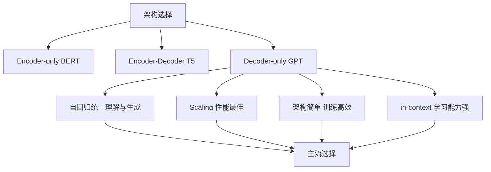

# 为什么现在的大语言模型都用Decoder-only

### 为什么现在的大语言模型都用 Decoder-only

随着 GPT-4、LLaMA 等模型的发布，Decoder-only 架构（即仅包含 Transformer 解码器）成为了大模型的主流选择。主要原因如下：

**1. 统一的架构与泛化能力**
*   **任务通用性**：Decoder-only 模型基于自回归语言模型目标（预测下一个 token）。这种目标对于所有 NLP 任务（无论是理解、翻译还是生成）都是通用的。相比之下，Encoder-Decoder 架构（如 T5）通常需要针对不同任务构造特定的输入格式（如 `text: ... target: ...`），Decoder-only 只需要将任务转化为文本续写形式即可。
*   **Scaling Law（缩放定律）**：研究表明，同等参数量下，Decoder-only 模型在下游任务上的性能上限通常更高，且随着模型规模增大，性能提升更加平滑。

**2. 训练效率与堆叠便利性**
*   **架构简单**：Decoder-only 结构更简单，由相同的层堆叠而成。相比 Encoder-Decoder 需要维护两套子结构，Decoder-only 更容易进行工程优化和扩展。
*   **算力利用率**：在训练过程中，Decoder-only 不需要 Encoder 和 Decoder 之间的交叉注意力计算，这使得数据流更纯粹，在大规模分布式训练时通信开销更小，计算效率更高。

**3. 生成能力的天然优势**
*   大模型的核心应用场景正从传统的分类/理解转向复杂的**生成**任务。Encoder 架构（如 BERT）擅长理解但不擅长生成，Encoder-Decoder 虽能生成但结构复杂。Decoder-only 自回归的生成机制使其在文本生成任务上具有天然的优势。

**4. 避免 Mask 带来的预训练微调差异**
*   BERT 等 Encoder 模型在预训练时使用 `[MASK]`，但在微调时并不使用，这导致了预训练和微调阶段的 gap。而 Decoder-only 的自回归预测任务在训练和推理阶段是完全一致的，不存在这种差异。

**5. 注意力机制的容错性**
*   Encoder 通常使用双向注意力，这在极长序列下可能导致训练不稳定。Decoder-only 的因果注意力机制（只能看过去）虽然看似受限，但在大模型规模下，通过增加层数和注意力头，足以弥补单向信息的不足。

#### 实战案例：推理阶段的显存优化
在开源 LLaMA-3 推理部署中，利用 Decoder-only 架构的 KV Cache 机制（KV缓存），可以将生成速度提升 3-5 倍。相比之下，Encoder-Decoder 架构（如 T5）由于双向注意力机制，KV Cache 的利用率和压缩效率不如 Decoder-only 显著，导致长文本生成时显存占用激增。

#### 架构对比表格

| 特性维度 | Decoder-only (e.g., GPT, LLaMA) | Encoder-Decoder (e.g., T5, BART) | Encoder-only (e.g., BERT) |
| :--- | :--- | :--- | :--- |
| **核心注意力机制** | 单向（因果掩码） | 双向 Encoder + 单向 Decoder | 双向（全可见） |
| **任务适配性** | 极强（统一为生成范式） | 强（适合序列到序列任务） | 弱（主要适合理解分类任务） |
| **推理效率** | 高（KV Cache 利用率高） | 中（结构复杂，显存碎片多） | 高（无生成步骤） |
| **训练收敛** | 随参数量提升显著（遵循 Scaling Law） | 较快，但大参数下性能提升不如 Decoder-only | 容易陷入局部最优，受限于掩码干扰 |
| **主要应用场景** | 通用生成、对话、复杂推理 | 翻译、摘要、结构化生成 | 文本分类、实体抽取、语义相似度 |

## 技术原理

- **自回归目标的"任务统一"**：Decoder-only 用单一目标——预测下一个 token $P(w_t | w_{<t})$。所有 NLP 任务都能转化为"给一段文本，续写答案"——翻译是"中文：X 英文："，分类是"情感：'X' 是"，问答是"Q: X A:"。这种统一性让**一个模型 + 一份预训练 + 一种微调**就能处理所有任务，无需为每个任务设计特殊 head 或 loss。相比之下，BERT 需要每个任务加分类层并单独微调，T5 虽统一但需 prefix 设计。
- **Scaling Law 偏爱 Decoder-only**：Google 的研究表明，在相同计算预算下，Decoder-only 的性能-参数曲线**斜率更陡**——参数增大时，Decoder-only 收益更大。可能原因：①自回归目标是"密度更高"的监督信号（每个 token 都有梯度，而 BERT 的 MLM 只对 15% [MASK] token 有梯度）；②因果注意力让模型学到的表示更"预测性"，对下游任务更通用。
- **训练效率的工程优势**：①**无交叉注意力**——Encoder-Decoder 的 Decoder 每个 block 要 attend Encoder 的输出，引入额外的 K/V 投影和通信；Decoder-only 只有自注意力，计算图更简单，分布式训练（TP/PP）通信更少；②**因果 mask 允许 KV Cache 复用**——训练时每个 token 只 attend 前面，推理时缓存 KV 避免重复计算，长文本生成效率极高。
- **预训练-微调一致性**：BERT 的 MLM 用 `[MASK]` 占位符训练，但下游任务输入没有 `[MASK]`，造成"训练-推理分布偏移"。Decoder-only 的自回归目标在预训练、SFT、推理时**完全一致**（都是"给前文续写后文"），无 gap。这让大模型能从预训练直接迁移到下游任务，少样本甚至零样本就能 work。

## 对比/选型

| 维度 | Decoder-only | Encoder-Decoder | Encoder-only |
|------|-------------|-----------------|--------------|
| 代表模型 | GPT, LLaMA, Qwen | T5, BART, Flan-T5 | BERT, RoBERTa |
| 注意力 | 因果（单向） | Encoder 双向 + Decoder 单向 | 双向 |
| 训练目标 | Next Token Prediction | Span Corruption / MLM | MLM |
| 任务统一 | 极强（文本续写） | 强（text-to-text） | 弱（每任务需 head） |
| 生成能力 | 强 | 强 | 无（仅理解） |
| KV Cache | 完美适用 | 部分适用 | 不适用 |
| 同算力性能 | 最高 | 中 | 低（理解任务除外） |
| 适用 | 通用大模型 | 翻译、摘要 | 分类、抽取 |

## 代码示例

```python
import torch
import torch.nn as nn

class DecoderBlock(nn.Module):
    """Decoder-only 的标准 block（无交叉注意力，比 Encoder-Decoder 简单）"""
    def __init__(self, d_model=4096, n_heads=32):
        super().__init__()
        self.attn = nn.MultiheadAttention(d_model, n_heads, batch_first=True)
        self.ffn = nn.Sequential(
            nn.Linear(d_model, d_model * 4),
            nn.SiLU(),
            nn.Linear(d_model * 4, d_model)
        )
        self.norm1 = nn.RMSNorm(d_model)
        self.norm2 = nn.RMSNorm(d_model)

    def forward(self, x, kv_cache=None):
        # 因果 mask：只能看前面的 token
        T = x.size(1)
        causal_mask = torch.triu(torch.ones(T, T, dtype=torch.bool), diagonal=1)
        # Self-Attention（带 KV Cache 加速推理）
        attn_out, new_cache = self.attn(
            self.norm1(x), self.norm1(x), self.norm1(x),
            attn_mask=causal_mask, is_causal=True,
            past_key_value=kv_cache, need_weights=False
        )
        x = x + attn_out                  # 残差
        x = x + self.ffn(self.norm2(x))   # FFN
        return x, new_cache

# ===== 自回归生成的核心循环 =====
def generate(model, input_ids, max_new_tokens=100):
    """逐 token 生成，复用 KV Cache"""
    kv_cache = None
    for _ in range(max_new_tokens):
        # 只需 forward 新 token，KV Cache 已存历史
        logits, kv_cache = model(input_ids[:, -1:], past_key_value=kv_cache)
        next_token = logits[:, -1, :].argmax(dim=-1, keepdim=True)
        input_ids = torch.cat([input_ids, next_token], dim=-1)
        if next_token.item() == eos_id:
            break
    return input_ids
```

## 常见坑/注意事项

- **Decoder-only 在"理解任务"上并非绝对劣势**：早期认为 BERT 在分类/抽取上更强，但 InstructGPT 后的大 Decoder-only 在这些任务上反超 BERT。原因是参数规模 + 指令微调让 Decoder-only 学到了通用理解能力。仅在**参数极小**（<100M）或**纯分类**场景 BERT 仍有成本优势。
- **Encoder-Decoder 的复兴**：Flan-T5、BART 在**翻译、摘要**等 seq2seq 任务上仍有竞争力，且参数效率高。Google 仍维护 T5 系列。但通用大模型赛道（GPT/Claude/Gemini）已统一为 Decoder-only。
- **因果注意力的"信息损失"**：理论上因果注意力让模型看不到后文，对"理解整句"不利。但实践表明，随着层数增加，底层"双向信息"会通过残差传播。现代 Decoder-only 用几十层就能弥补。
- **KV Cache 的显存陷阱**：长上下文（如 128K）时 KV Cache 占用显存巨大（$2 \cdot L \cdot T \cdot d$）。需要用 PagedAttention（vLLM）、GQA（Grouped Query Attention）或 KV 量化缓解。
- **不要盲目跟风"Decoder-only 唯一"**：选型要基于任务。小模型做 NER/分类用 BERT，seq2seq 用 T5，通用对话/生成用 Decoder-only。架构是手段不是目的。

## 流程图




## 记忆要点

- 架构统一：所有任务转化为文本续写，无需特定任务结构。
- Scaling Law：同等参数下性能上限更高，扩展性强。
- 训练效率：无交叉注意力，计算纯粹，工程实现简单。
- 生成优势：自回归机制天然适合生成任务，无预训练微调Gap。


## 结构化回答

**30 秒电梯演讲：** 架构简单、扩展性强，自回归方式统一了理解和生成任务，Scaling性能好。——打个比方，与其用两个专家（Encoder和Decoder）配合，不如培养一个全能天才，什么活都能干，配合还更默契。

**展开框架：**
1. **架构统一** — 所有任务转化为文本续写，无需特定任务结构。
2. **Scaling** — Scaling Law：同等参数下性能上限更高，扩展性强。
3. **训练效率** — 无交叉注意力，计算纯粹，工程实现简单。

**收尾：** 以上三点都能配合实战聊。我可以展开任一要点，比如「Decoder-only在哪些任务上不如Encoder-only」这类追问您感兴趣吗？

## 视频脚本

> 预计时长：2 分钟 | 由浅入深

| 时间 | 画面/字幕 | 口播台词 | 讲解要点 |
|------|----------|----------|----------|
| 0:00 | 标题卡 | "现在的大语言模型都用Decoder-only，30 秒讲清楚。" | 开场钩子 |
| 0:30 | 概念定义动画 | "一句话：架构简单、扩展性强，自回归方式统一了理解和生成任务，Scaling性能好。" | 核心定义 |
| 1:00 | 架构统一图解 | "所有任务转化为文本续写，无需特定任务结构。" | 架构统一 |
| 1:30 | 总结卡 | "记好这几条，面试不慌。下期见。" | 收尾 |
