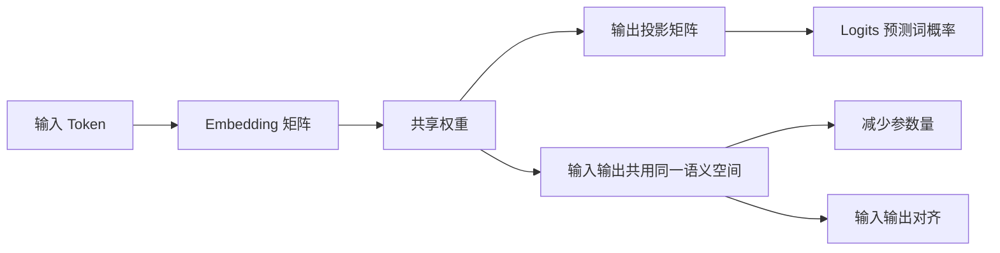

# Transformer在哪里做了权重共享

在 Transformer 模型中，权重共享主要应用在**Embedding 层和 Output 层**之间。

### 1. 共享位置
模型通常将输入的 Token Embedding（词嵌入矩阵）与输出层（将隐藏状态映射回词表概率的线性层）的权重矩阵设为相同。即：$W_{embedding} = W_{output}$。

### 2. 原理与优势
*   **参数量减少**：Embedding 层和输出层通常都是巨大的矩阵（词表大小 $\times$ 隐藏维度）。共享权重可以将模型的参数量减少近一半，降低过拟合风险，节省显存。
*   **语义对齐**：输入 Embedding 将离散的 Token 映射到向量空间，输出层将向量映射回 Token。共享权重强制模型在“编码”和“解码”时使用相同的语义空间，使得学到的表示更加一致和鲁棒。
*   **正则化效果**：这种约束相当于一种正则化手段，限制了模型的参数自由度，有助于提升泛化能力。

### 3. 架构图示
```text
输入 Token (ID)                     最终隐藏状态
     |                                    |
     v                                    v
+-------------------+          +----------------------+
|  Embedding Matrix |          | Output Linear Layer  |
|  (Vocab x D_model)|          | (D_model x Vocab)    |
|   W_emb           |          |   W_out              |
+---------+---------+          +-----------+----------+
          |                                    |
          +-----------+  (权重共享) +----------+
                      | W_emb = W_out |
                      +----------------+
```

### 4. 注意事项
*   **语言对差异**：在机器翻译等任务中，如果源语言和目标语言共享词表（如使用 BPE 子词），则共享权重是有效的；若语言差异巨大且词表不共享，则通常不共享。
*   **乘法因子**：在某些实现中（如 Transformer 原论文），共享的权重在输出层会乘以一个缩放因子（如 $\sqrt{d_{model}}$），以平衡训练过程中的梯度。

### 5. 常见考点
1.  **参数量计算**：如果词表大小为 50,000，隐藏层维度为 4096，共享权重能减少多少参数？（答：约 2亿参数，即 $50k \times 4096$）。
2.  **为什么需要缩放因子？**（答：因为 Embedding 和 Output 层在训练过程中梯度更新的规模不同，缩放有助于稳定训练）。
3.  **Layer Norm 的位置**：在原始 Transformer 中，Bias 是不共享的，且通常 Output 层之前会接 Layer Norm，这些细节的区别是什么？

### 6. 实战深化

**实战案例**
在使用 Google T5 或 BERT 模型微调特定领域任务时，若领域词汇与通用预训练词汇重叠度低，强制共享权重可能导致“语义空间冲突”。此时若微调数据量不足，解耦权重往往能取得更好效果；但若追求极致的**移动端部署体积**（如将模型压缩至 100MB 以内），则必须开启权重共享。

**代码示例**
```python
import torch.nn as nn

class SharedWeightsTransformer(nn.Module):
    def __init__(self, vocab_size, d_model):
        super().__init__()
        # 定义 Embedding 层
        self.embedding = nn.Embedding(vocab_size, d_model)
        # 定义 Layer Norm (通常在 Output 前)
        self.layer_norm = nn.LayerNorm(d_model)
        
        # 关键：将 Output 层的 weight 绑定到 Embedding 层
        # 使得参数在内存中只有一份，梯度更新共享
        
    def forward(self, input_ids, hidden_state):
        # 输入端
        x = self.embedding(input_ids)
        
        # ... 经过 Transformer Blocks ...
        
        # 输出端：使用转置后的 Embedding 权重作为 Linear 层权重
        # 注意：PyTorch Linear 是，而 Embedding 是，所以通常不转置直接使用或 bias=False
        logits = torch.nn.functional.linear(hidden_state, self.embedding.weight.t())
        return logits
```

## 流程图




## 记忆要点

- 位置共享：输入Embedding层与输出Linear层共用权重矩阵W_emb = W_out
- 减少参数：可减少近一半模型参数，降低过拟合风险并节省显存
- 语义对齐：强制编码和解码使用同一语义空间，提升模型表示的一致性


## 结构化回答

**30 秒电梯演讲：** 输入层和输出层共用同一个权重矩阵，减少参数并统一语义空间。——打个比方，编码和解码用同一本字典，确保“文字变意思”和“意思变文字”的标准一致。

**展开框架：**
1. **位置共享** — 输入Embedding层与输出Linear层共用权重矩阵W_emb = W_out
2. **减少参数** — 可减少近一半模型参数，降低过拟合风险并节省显存
3. **语义对齐** — 强制编码和解码使用同一语义空间，提升模型表示的一致性

**收尾：** 以上三点都能配合实战聊。您想深入聊哪一块？

## 视频脚本

> 预计时长：2 分钟 | 由浅入深

| 时间 | 画面/字幕 | 口播台词 | 讲解要点 |
|------|----------|----------|----------|
| 0:00 | 标题卡 | "Transformer在哪里做了权重共享，30 秒讲清楚。" | 开场钩子 |
| 0:30 | 概念定义动画 | "一句话：输入层和输出层共用同一个权重矩阵，减少参数并统一语义空间。" | 核心定义 |
| 1:00 | 位置共享图解 | "输入Embedding层与输出Linear层共用权重矩阵W_emb = W_out" | 位置共享 |
| 1:30 | 总结卡 | "记好这几条，面试不慌。下期见。" | 收尾 |
