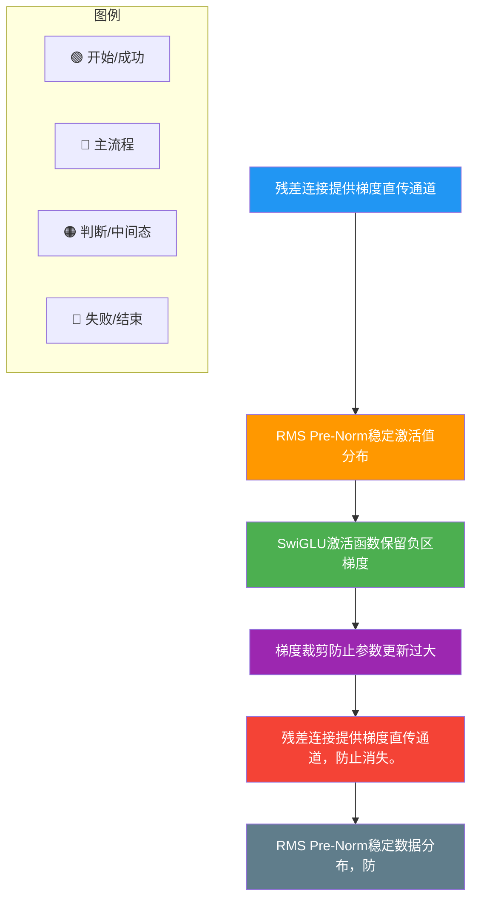

# Llama模型在训练过程中如何处理梯度消失和梯度爆炸的问题

Llama 模型基于 Transformer 架构，本身包含多种机制来应对梯度消失和梯度爆炸问题。主要措施如下：

### 1. 残差连接
*   **原理**：在每一层（Attention 层和 FFN 层）都引入残差连接，即 $Output = x + Sublayer(x)$。
*   **作用**：为梯度反向传播提供了“高速通道”。即使深层网络的权重更新导致梯度衰减，加法运算也能保证梯度直接传递到前面的层，有效缓解梯度消失。

### 2. RMS Pre-Norm (前置归一化)
*   **原理**：Llama 使用 RMSNorm 并将其放在子层运算之前。
*   **作用**：
    *   **数值稳定性**：归一化操作将输入数据的幅度限制在稳定范围内，防止中间激活值过大导致梯度爆炸。
    *   **梯度平滑**：Pre-Norm 结构在深层网络中比 Post-Norm 具有更好的梯度流动性，进一步缓解了梯度消失。

### 3. SwiGLU 激活函数
*   **原理**：使用 SwiGLU 替代 ReLU。
*   **作用**：Swish 函数在负值区域具有非零梯度，相比于 ReLU 在负区完全截断（梯度为0），SwiGLU 保留了更多的信息流动，减少了“神经元死亡”现象，有助于缓解梯度消失。

### 4. 实战案例与代码
**实战案例**：在训练百亿参数级别的模型时，如果移除梯度裁剪，loss 会在某个 Step 突然变成 NaN；此外，在使用混合精度（BF16）训练时，Pre-Norm 配合 BF16 能显著减少上溢问题，因为 BF16 的指数位比 FP16 大，更能容纳 Pre-Norm 中间激活值的动态范围。

**代码示例**：
```python
# PyTorch风格的梯度裁剪实现
loss = criterion(output, target)
loss.backward()

# 计算全局梯度范数
torch.nn.utils.clip_grad_norm_(model.parameters(), max_norm=1.0)

# 检查是否存在 NaN 或 Inf (常见于 DeepSpeed 训练中的监控)
for param in model.parameters():
    if torch.isnan(param.grad).any() or torch.isinf(param.grad).any():
        print("Gradient explosion detected!")
        break

optimizer.step()
```

### 5. 机制对比

| 问题 | 传统解决方案 | LLaMA 采用方案 | LLaMA 方案优势 |
| :--- | :--- | :--- | :--- |
| **梯度消失** | ReLU, Batch Norm | **Pre-Norm + SwiGLU + 残差** | 允许极深层次训练（如 80+ 层），梯度流更通畅 |
| **梯度爆炸** | 梯度裁剪, Layer Norm | **Pre-Norm + 梯度裁剪** | 归一化前置防止激活值累积过大，配合 BF16 效果更佳 |
| **训练稳定性** | Warmup | **AdamW + Warmup** | 自适应学习率配合 Warmup 平稳度过初期不稳定阶段 |
| **死神经元** | Leaky ReLU | **SwiGLU** | 门控机制允许少量信息通过，避免永久性失活 |

### 6. Llama 模块内部数据流（梯度视角）

```text
Layer Input (x)
     │
     ▼
┌─────────────────┐
│   RMSNorm(x)    │  <- Pre-Norm：输入即被归一化，保证进入子层的数据数值稳定
└────────┬────────┘
         │
         ▼
┌─────────────────┐
│   Sublayer      │  <- Attention / FFN
│   (Attn/FFN)    │
└────────┬────────┘
         │
         ▼
   ┌─────┴─────┐
   │ Residual  │  <- 加法操作：梯度可以直接无衰减地流回 Input
   │   Add     │
   └─────┬─────┘
         │
         ▼
   Layer Output
```

### 7. 关键细节补充
*   **Xavier/Glorot 初始化**：Llama 在初始化权重时，通常采用标准正态分布 truncated normal，并除以 $\sqrt{\text{layer\_dims}}$，确保方差随深度保持恒定。
*   **AdamW 的梯度修正**：AdamW 修正了权重衰减的实现方式（解耦了 L2 正则化），对于超大模型的收敛至关重要，防止优化器由于自适应学习率导致的权重更新异常。
*   **具体的梯度裁剪参数**：在训练 Llama 时，常用的 Global Norm Clipping 阈值为 1.0。

## 常见考点
1.  **Pre-Norm vs Post-Norm 对模型收敛的影响**：为什么现在的 LLM 都用 Pre-Norm？（Post-Norm 在极深层网络（如 32+ 层）容易出现训练不稳定，Warmup 阶段极长；Pre-Norm 更容易训练深层模型，虽然极深下理论表达力可能略有下降，但实际效果更好）。
2.  **SwiGLU 为什么比 ReLU 好**？（ReLU 的死神经元问题在深层网络中会累积，Swish 的平滑非单调性有助于优化）。
3.  **DeepSpeed ZeRO 中的梯度裁剪**：在分布式训练（如 Megatron-LM）中，梯度裁剪通常发生在 All-Reduce 之前还是之后？（通常在计算梯度后、Optimizer Step 前，对全局梯度范数进行裁剪）。


## 核心流程图



## 记忆要点

- 防梯度消失：核心靠残差连接(加法通道)提供梯度高速通路，配合Pre-Norm缓解深层衰减。
- 防梯度爆炸：靠RMSNorm前置缩放限制激活值幅度，配合AdamW与全局梯度裁剪(阈值1.0)。
- 防死神经元：采用SwiGLU替代ReLU，因负值区域梯度不为零，故保留信息流动防失活。
- Pre vs Post：因Pre-Norm不改变主干数据流，故比Post-Norm更容易训练几十层的超大模型。
- 数值稳定性：权重初始化除以维度的平方根，配合BF16混合精度防中途溢出出NaN。


## 结构化回答

**30 秒电梯演讲：** 通过残差、归一化和裁剪机制确保深层网络训练稳定。——打个比方，给管道加旁通阀，稳压器和限压阀，保证水流既不停也不爆。

**展开框架：**
1. **防梯度消失** — 核心靠残差连接(加法通道)提供梯度高速通路，配合Pre-Norm缓解深层衰减。
2. **防梯度爆炸** — 靠RMSNorm前置缩放限制激活值幅度，配合AdamW与全局梯度裁剪(阈值1.0)。
3. **防死神经元** — 采用SwiGLU替代ReLU，因负值区域梯度不为零，故保留信息流动防失活。

**收尾：** 以上三点都能配合实战聊。您想深入聊哪一块？

## 视频脚本

> 预计时长：2 分钟 | 由浅入深

| 时间 | 画面/字幕 | 口播台词 | 讲解要点 |
|------|----------|----------|----------|
| 0:00 | 标题卡 | "Llama模型在训练过程中如何处理梯度消失和梯度爆炸的问题，30 秒讲清楚。" | 开场钩子 |
| 0:30 | 概念定义动画 | "一句话：通过残差、归一化和裁剪机制确保深层网络训练稳定。" | 核心定义 |
| 1:00 | 防梯度消失图解 | "核心靠残差连接(加法通道)提供梯度高速通路，配合Pre-Norm缓解深层衰减。" | 防梯度消失 |
| 1:30 | 总结卡 | "记好这几条，面试不慌。下期见。" | 收尾 |

---

## 延伸：Llama如何处理梯度消失/爆炸

> 合并自 `xhw-027`（相似度 73%）

Llama 模型通过一系列架构设计有效应对了深度网络中的梯度消失和梯度爆炸问题。

### 1. 残差连接
- **原理**：在每个子层（如自注意力层和前馈层）中，将输入直接加到输出上：$Output = Layer(Input) + Input$。
- **作用**：为梯度反向传播提供了“高速通道”，使得梯度能够直接流向浅层，有效缓解了梯度消失问题。

### 2. RMS Pre-Norm
- **原理**：在进入子层计算之前先进行归一化，而不是在之后。
- **作用**：保证输入到深层网络的数据幅度始终处于稳定范围，防止数值在多层传播后变得过大或过小，从而稳定训练过程。

### 3. 激活函数的选择
- **SwiGLU**：Llama 使用的 SwiGLU 激活函数及其组件（如 Swish）具有平滑的非线性特性，导数在正区间不易饱和，避免了传统 Sigmoid/Tanh 导致的梯度消失风险。

### 4. 初始化与裁剪
- **权重初始化**：采用合适的初始化策略（如类似 GPT-2 的方式），确保初始状态下网络各层的输出方差稳定。
- **梯度裁剪**：在反向传播时对梯度的范数进行限制，防止个别梯度过大导致权重更新剧烈，从而避免梯度爆炸。

### 实战案例
在训练 70B 参数级别的 Llama 模型时，如果未使用 `Pre-Norm` 而误用 `Post-Norm`，往往在训练初期就会遇到 Loss 不收敛或变成 NaN 的情况；此外，即使有 Pre-Norm，若忘记设置 `gradient_clip_threshold=1.0`，在 Batch Size 较大时偶尔会出现梯度激增导致的权重崩溃。

### 关键代码示例 (PyTorch)
```python
def forward(self, x):
    # RMS Pre-Norm: 先归一化
    h = x + self.attention(self.norm1(x))
    # 残差连接 + SwiGLU FeedForward
    out = h + self.ffn(self.norm2(h))
    return out
```

### 梯度流向示意图 (Pre-Norm + Residual)

```text
      Forward Pass               Gradient Flow (Backward)
           │                            ▲
           x                            │
      ┌────┴────┐                       │
      │  Norm   │                       │ (Gradient passes mainly
      └────┬────┘                       │  through residual add)
           │                            │
      ┌────▼────┐                       │
      │ SubLayer│                       │
      └────┬────┘                       │
           │                            │
      ┌────▼────┐                       │
      │   Add   │ ◄─────────────────────┘
      └────┬────┘  (Identity Mapping x)
           │
           ▼
        Output
```

## 常见考点
1. **Pre-Norm 的梯度问题**：Pre-Norm 虽然稳定了训练，但可能导致梯度的范数在网络前部较小，Llama 是否有针对此的初始化调整（如 std 缩放）？
2. **RMSNorm 具体公式**：写出 RMSNorm 的归一化公式 $\bar{x}_i = \frac{x_i}{\sqrt{\frac{1}{n} \sum x_j^2} + \epsilon} \gamma_i$，解释为什么不需要减去均值。
3. **SwiGLU 对梯度的影响**：相比于 ReLU（死亡神经元问题），SwiGLU 的单调性和非零导区间如何帮助缓解梯度消失。


## 核心流程图


## 记忆要点

- 残差连接：提供梯度反向传播高速通道，直接缓解深层网络梯度消失。
- Pre-Norm设计：先归一化再进入子层，确保输入深层的数据幅度稳定。
- 激活与裁剪：SwiGLU导数不饱和防梯度消失，配合梯度裁剪(如1.0)防梯度爆炸。
- 初始化：合理权重初始化维持各层输出方差稳定，防止初期Loss爆炸。


## 结构化回答

**30 秒电梯演讲：** 通过残差连接和预归一化稳定梯度流。——打个比方，修了条高速公路（残差）和限速路段（裁剪），确保车流（梯度）畅通不失控。

**展开框架：**
1. **残差连接** — 提供梯度反向传播高速通道，直接缓解深层网络梯度消失。
2. **Pre-Norm** — Pre-Norm设计：先归一化再进入子层，确保输入深层的数据幅度稳定。
3. **激活与裁剪** — SwiGLU导数不饱和防梯度消失，配合梯度裁剪(如1.0)防梯度爆炸。

**收尾：** 以上三点都能配合实战聊。您想深入聊哪一块？

## 视频脚本

> 预计时长：3 分钟 | 由浅入深

| 时间 | 画面/字幕 | 口播台词 | 讲解要点 |
|------|----------|----------|----------|
| 0:00 | 标题卡 | "Llama如何处理梯度消失/爆炸，30 秒讲清楚。" | 开场钩子 |
| 0:36 | 概念定义动画 | "一句话：通过残差连接和预归一化稳定梯度流。" | 核心定义 |
| 1:12 | 残差连接图解 | "提供梯度反向传播高速通道，直接缓解深层网络梯度消失。" | 残差连接 |
| 1:48 | Pre-Norm设计图解 | "先归一化再进入子层，确保输入深层的数据幅度稳定。" | Pre-Norm设计 |
| 2:24 | 总结卡 | "记好这几条，面试不慌。下期见。" | 收尾 |
