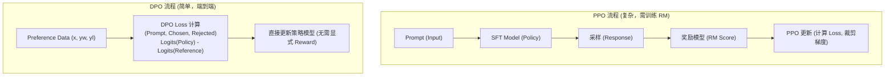

# 分析一下DPO和PPO的区别

DPO (Direct Preference Optimization) 和 PPO (Proximal Policy Optimization) 都用于策略优化，但它们的设计理念、优化目标和适用场景有显著区别。

### 1. 核心区别概览
| 特性 | PPO | DPO |
| :--- | :--- | :--- |
| **类型** | 强化学习算法 | 偏好优化算法 (主要用于对齐) |
| **奖励信号** | 依赖环境反馈或奖励模型 (RM) | 直接基于人类偏好对数据 (无需 RM) |
| **优化方式** | 策略梯度 + 剪切约束 | 二元分类似然最大化 (解析推导) |
| **稳定性** | 需调整超参数，RL阶段易不稳 | 训练稳定，像分类任务一样简单 |

### 2. 详细对比
#### 优化目标
*   **PPO**：目标是最大化 **期望累积奖励**。通过限制新旧策略的 KL 散度或比率（Clipping）来确保更新在“信任域”内。
*   **DPO**：目标是最大化 **人类偏好概率**。DPO 证明了优化奖励差等价于优化策略对数似然比，因此直接用偏好数据 $(y_w, y_l)$ 构建损失函数，强制模型增加偏好输出的概率，降低拒绝输出的概率。

#### 算法流程
*   **PPO (RLHF流)**：SFT 模型 $\to$ 训练奖励模型 $\to$ PPO 训练 (生成采样 $\to$ RM打分 $\to$ 更新策略)。
*   **DPO**：SFT 模型 $\to$ 直接在偏好数据上训练 (无需采样和打分，直接计算 Loss 更新)。

#### 约束机制
*   **PPO**：使用剪切机制或 KL 惩罚项，防止新策略偏离旧策略太远。
*   **DPO**：利用 **参考模型 ($\pi_{ref}$)** 的输出作为分母/基准，隐式地控制策略与初始模型的偏差（相当于动态的 KL 约束）。

### 3. 选型对比表 (深度版)

| 维度 | PPO | DPO |
| :--- | :--- | :--- |
| **训练复杂度** | 高 (需维护 Actor, Critic, RM 三个模型) | 低 (仅需 Policy 和 Reference 两个模型) |
| **显存占用** | 极高 (需存储多份梯度及生成历史) | 中 (主要是两个模型的前向计算) |
| **采样成本** | 高 (每次迭代都要实时生成) | 无 (使用离线静态数据集) |
| **Reward Hacking** | 常见 (模型会利用 RM 的漏洞) | 较少见 (但若 $\beta$ 过大仍会崩塌) |
| **适用阶段** | 需要探索复杂环境或精细控制奖励时 | 已有高质量偏好对数据时 |
| **主要痛点** | 超参极其敏感，调试周期长 | 依赖偏好数据的质量，数据难获取 |

### 4. 流程架构对比



### 5. 实战选型建议
**实战案例**：在数据量较少（如<1万条偏好对）但计算资源充足（多卡 A800）的情况下，**PPO** 可能表现更好，因为它可以通过在线采样探索多样化的回答，避免过拟合小数据集；而在数据量充足（如>10万条）但显存受限（单卡 A100）时，**DPO** 是首选，因为它避免了训练 RM 的巨大开销且收敛极快。

## 核心知识点图


## 记忆要点

- 流程对比：PPO需训练RM且实时采样，DPO直接用偏好数据，无需RM和采样。
- 优化目标：PPO最大化累积奖励并剪裁，DPO最大化偏好概率，用解析解替代RL。
- 约束机制：PPO用Clip或KL惩罚，DPO用冻结的参考模型隐式约束KL散度。
- 训练特性：PPO超参敏感易Reward Hacking，DPO训练稳定像分类任务，但依赖数据质量。


## 结构化回答

**30 秒电梯演讲：** PPO基于奖励优化策略，DPO基于偏好直接优化策略。——打个比方，PPO像拿指南针不断修正路线，DPO像直接按地图走捷径。

**展开框架：**
1. **流程对比** — PPO需训练RM且实时采样，DPO直接用偏好数据，无需RM和采样。
2. **优化目标** — PPO最大化累积奖励并剪裁，DPO最大化偏好概率，用解析解替代RL。
3. **约束机制** — PPO用Clip或KL惩罚，DPO用冻结的参考模型隐式约束KL散度。

**收尾：** 以上三点都能配合实战聊。您想深入聊哪一块？

## 视频脚本

> 预计时长：2 分钟 | 由浅入深

| 时间 | 画面/字幕 | 口播台词 | 讲解要点 |
|------|----------|----------|----------|
| 0:00 | 标题卡 | "分析一下DPO和PPO的区别，30 秒讲清楚。" | 开场钩子 |
| 0:30 | 概念定义动画 | "一句话：PPO基于奖励优化策略，DPO基于偏好直接优化策略。" | 核心定义 |
| 1:00 | 流程对比图解 | "PPO需训练RM且实时采样，DPO直接用偏好数据，无需RM和采样。" | 流程对比 |
| 1:30 | 总结卡 | "记好这几条，面试不慌。下期见。" | 收尾 |

---

## 延伸：DPO和PPO的区别

> 合并自 `xhw-030`（相似度 73%）

DPO（Direct Preference Optimization）和 PPO（Proximal Policy Optimization）都是策略优化算法，但应用场景和优化机制有显著区别。

### 1. 核心区别
- **PPO**：基于环境的**强化学习**算法。智能体与环境交互获得奖励，利用奖励信号更新策略，旨在最大化累积奖励。
- **DPO**：基于人类反馈的**离线偏好优化**算法。不需要奖励模型或环境交互，直接利用人类偏好数据（如“输出A优于输出B”）优化策略。

### 2. 优化机制
- **PPO**：引入剪切机制，限制新旧策略的比率，防止单次更新步长过大导致训练崩溃。它需要一个 Reward Model 来提供奖励信号（在 RLHF 流程中）。
- **DPO**：推导出了最优策略与奖励模型之间的解析关系，将原本 RLHF 中的两阶段（训练 RM + RL 优化）合并为一个阶段。通过最大化偏好数据的对数似然直接优化策略，隐式地包含了对参考策略的 KL 散度约束。

### 3. 优缺点对比
- **PPO**：通用性强，适合各类 RL 任务，但实现复杂，训练不稳定，需要调整超参数（如 clip range），且依赖奖励模型的质量。
- **DPO**：实现简单，训练稳定，更适合大模型的微调。它避免了训练奖励模型的困难和 RL 训练的不稳定性，但严重依赖高质量的偏好对数据。

### 4. 应用场景
- **PPO**：传统 RL 任务（游戏、机器人控制）、RLHF 流程中的策略优化阶段。
- **DPO**：大语言模型的偏好对齐，直接用 SFT 模型 + 偏好数据进行微调。

### 实战案例
在使用 PPO 进行 RLHF 微调时，常遇到 Reward Hack 问题，即模型生成晦涩但高分的句子来欺骗 RM；而 DPO 实现更简单，直接在 Preference 数据上训练，往往只需 1-2 个 epoch 即能达到很好的对齐效果，是目前开源社区微调 Llama-3/Mistral 的首选方案。

### 关键代码示例
```python
# DPO Loss 计算逻辑 (伪代码)
def dpo_loss(policy_chosen_logps, policy_rejected_logps, 
             ref_chosen_logps, ref_rejected_logps, beta):
    # 计算策略与参考模型的 Logits 差异
    pi_diff = policy_chosen_logps - policy_rejected_logps
    ref_diff = ref_chosen_logps - ref_rejected_logps
    # 隐式 Reward 差异
    loss = -F.logsigmoid(beta * (pi_diff - ref_diff)).mean()
    return loss
```

### DPO vs PPO 详细对比

| 维度 | PPO (RLHF) | DPO |
| :--- | :--- | :--- |
| **训练阶段** | 多阶段 (SFT -> RM -> PPO) | 单阶段 |
| **是否需要 Reward Model**| 是 | 否 (隐式推导) |
| **是否需要在线采样** | 是 (生成样本 -> 打分) | 否 (使用离线偏好对) |
| **训练稳定性** | 较差，需 KL 裁剪等保护 | 较好，类似 Supervised Learning |
| **实现难度** | 高 (Actor, Critic, RM, Value) | 低 (仅修改 Loss Function) |
| **主要超参数** | Clip range, KL penalty, LR | Beta (KL 系数) |
| **数据依赖** | 需大量 Prompt + RM 打分 | 需高质量 对 |
| **计算资源消耗**| 高 (需同时跑 Policy 和 RM) | 低 (仅需前向传播) |

### 流程对比图

```text
RLHF (PPO Pipeline):
Data -> Reward Model -> PPO Loop (Generate -> RM Score -> Update Policy)

DPO Pipeline:
Data (Prompt, Chosen, Rejected) -> DPO Loss Calculation -> Update Policy
```

## 常见考点
1. **DPO 的推导逻辑**：解释 DPO 如何利用 Bradley-Terry 模型和最优策略的解析解 $\pi^*(y|x) \propto \exp(\frac{1}{\beta} R(x,y))$ 来消去奖励模型。
2. **参考模型的作用**：DPO 中为什么还需要一个 Reference Model（通常是 SFT 模型），它在 Loss 函数中起什么作用（KL 约束）？
3. **偏好数据规模**：相比 PPO 需要大量的在线采样，DPO 对数据量的要求有何不同？DPO 容易出现的“Reward Hacking”形式是什么？

## 记忆要点

- 流程对比：PPO需在线采样+显式RM打分(多阶段)；DPO直接利用离线偏好数据(单阶段)。
- 核心机制：DPO通过数学推导消去RM，将偏好优化转为分类Loss，隐式包含KL约束。
- 优劣对比：PPO通用但训练极难调；DPO实现简单稳定，算力要求低，成开源对齐首选。
- 参考模型：DPO无需RM，但仍需SFT模型作Reference计算KL惩罚，防模型偏离过远。


## 结构化回答

**30 秒电梯演讲：** PPO用环境奖惩练策略，DPO直接用人类偏好调模型。——打个比方，PPO是考试看分数（奖励）来复习，DPO是直接告诉你A答案比B好来选A。

**展开框架：**
1. **流程对比** — PPO需在线采样+显式RM打分(多阶段)；DPO直接利用离线偏好数据(单阶段)。
2. **核心机制** — DPO通过数学推导消去RM，将偏好优化转为分类Loss，隐式包含KL约束。
3. **优劣对比** — PPO通用但训练极难调；DPO实现简单稳定，算力要求低，成开源对齐首选。

**收尾：** 以上三点都能配合实战聊。您想深入聊哪一块？

## 视频脚本

> 预计时长：4 分钟 | 由浅入深

| 时间 | 画面/字幕 | 口播台词 | 讲解要点 |
|------|----------|----------|----------|
| 0:00 | 标题卡 | "DPO和PPO的区别，30 秒讲清楚。" | 开场钩子 |
| 0:40 | 概念定义动画 | "一句话：PPO用环境奖惩练策略，DPO直接用人类偏好调模型。" | 核心定义 |
| 1:20 | 流程对比图解 | "PPO需在线采样+显式RM打分(多阶段)；DPO直接利用离线偏好数据(单阶段)。" | 流程对比 |
| 2:00 | 核心机制图解 | "DPO通过数学推导消去RM，将偏好优化转为分类Loss，隐式包含KL约束。" | 核心机制 |
| 2:40 | 优劣对比图解 | "PPO通用但训练极难调；DPO实现简单稳定，算力要求低，成开源对齐首选。" | 优劣对比 |
| 3:20 | 总结卡 | "记好这几条，面试不慌。下期见。" | 收尾 |
