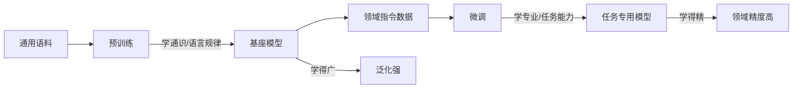

# 预训练和微调任务有什么区别,两者的目的

🦄在深度学习和自然语言处理领域,预训练和微调是模型训练的两个关键阶段.它们在模型的构建和应用中扮演着不同的角色,具有不同的目的.

**1. 预训练**

*   **定义：**
    预训练是指在大规模的未标注数据上训练模型,使其学习通用的特征表示.这一阶段不针对特定任务,而是让模型掌握数据的基本结构和模式.
*   **目的：**
    *   **学习通用特征：** 通过在大量数据上训练,模型能够捕获数据的通用特征和模式.
    *   **提高效率：** 预训练好的模型可以作为下游任务的基础,减少训练时间和数据需求.
*   **方法：**
    *   **自监督学习：** 利用数据本身的结构信息作为监督信号.
    *   **例如：**
        *   **语言模型任务：** 预测下一个词(如GPT系列).
        *   **遮盖语言模型:** 预测被遮盖的词(如BERT).
*   **特点：**
    *   **数据类型：** 通常使用未标注的大规模数据集.
    *   **训练目标：** 学习数据的内在结构和一般模式.

**2. 微调**

*   **定义：**
    微调是指在预训练模型的基础上,使用小规模的标注数据针对特定任务进行训练,以适应具体应用需求.
*   **目的：**
    *   **适应特定任务：** 使预训练模型在特定任务上达到最佳性能.
    *   **利用预训练知识：** 通过微调,模型可以在特定任务上充分发挥预训练阶段学到的知识.
*   **方法：**
    *   **监督学习：** 使用标注的任务数据,对模型进行训练和优化.
    *   **调整模型参数：** 在预训练模型的参数基础上,针对新任务进行细微调整.
*   **特点：**
    *   **数据类型：** 使用针对特定任务的标注数据集.
    *   **训练目标：** 优化模型在特定任务上的表现.

**3. 预训练和微调的区别**

| 维度 | 预训练 | 微调 |
| :--- | :--- | :--- |
| **数据类型** | 使用未标注的大规模数据集. | 使用标注的特定任务数据集. |
| **训练目标** | 学习通用的特征表示,捕捉数据的基本模式. | 针对特定任务优化模型性能. |
| **应用范围** | 通用,适用于多种下游任务. | 专用,针对特定任务进行优化. |
| **训练方式** | 自监督学习,无需人工标注数据. | 监督学习,需要人工标注的数据. |

**4. 两者的关系**

*   **预训练为微调提供基础：** 预训练阶段获得的通用特征表示,为微调阶段提供了良好的起点.
*   **微调提升模型的特定任务性能：** 通过在预训练模型上进行微调,可以在特定任务上取得更好的效果,而无需从零开始训练模型.

**5. 总结**

*   **预训练：** 目的是学习通用的特征表示,捕获数据的基本模式;特点是在大规模未标注数据上进行自监督学习.
*   **微调：** 目的是使模型适应特定任务,优化其在该任务上的性能;特点是在小规模标注数据上进行监督学习,调整模型参数.

通过先预训练再微调的方式,可以充分利用大规模数据的优势,提高模型在特定任务上的性能.

---

**实战深化**

*   **实战案例**：在医疗垂类大模型开发中，直接使用通用基座模型回答“阿司匹林用量”时往往给出安全但不准确的建议。通过使用医院内部脱敏的 10 万条问诊记录进行全量微调，模型能精准掌握科室特定的用药规范，但需警惕模型“学坏”了训练数据中某些医生的错误习惯，因此需要严格的数据清洗。

*   **代码示例 (PyTorch)**：
    ```python
    # 伪代码：预训练加载与微调参数冻结策略
    model = AutoModelForCausalLM.from_pretrained("base-model")
    
    # 场景：显存受限，仅微调最后两层和 LM Head
    for param in model.parameters():
        param.requires_grad = False # 冻结预训练权重
    
    for layer in model.model.layers[-2:]:
        for param in layer.parameters():
            param.requires_grad = True # 解冻最后两层
    ```

## 流程图




## 记忆要点

- 预训练：用海量无标注数据自监督学习，目的是掌握通用特征和语言模式。
- 微调：用少量标注数据监督学习，目的是适应特定任务，优化特定表现。
- 数据差异：预训练数据大且无标，微调数据小且专精。
- 关系总结：预训练打基础（通才），微调做适配（专才），提升下游效率。


## 结构化回答

**30 秒电梯演讲：** 预训练学通识，微调学专业。——打个比方，像上大学，预训练是通识教育（学基础语感），微调是专业实习（针对工作场景强化）。

**展开框架：**
1. **预训练** — 用海量无标注数据自监督学习，目的是掌握通用特征和语言模式。
2. **微调** — 用少量标注数据监督学习，目的是适应特定任务，优化特定表现。
3. **数据差异** — 预训练数据大且无标，微调数据小且专精。

**收尾：** 以上三点都能配合实战聊。您想深入聊哪一块？

## 视频脚本

> 预计时长：2 分钟 | 由浅入深

| 时间 | 画面/字幕 | 口播台词 | 讲解要点 |
|------|----------|----------|----------|
| 0:00 | 标题卡 | "预训练和微调任务有什么区别,两者的目的，30 秒讲清楚。" | 开场钩子 |
| 0:30 | 概念定义动画 | "一句话：预训练学通识，微调学专业。" | 核心定义 |
| 1:00 | 预训练图解 | "用海量无标注数据自监督学习，目的是掌握通用特征和语言模式。" | 预训练 |
| 1:30 | 总结卡 | "记好这几条，面试不慌。下期见。" | 收尾 |

---

## 延伸：预训练和微调的区别

> 合并自 `xhw-032`（相似度 80%）

预训练和微调是深度学习模型训练的两个关键阶段，目的和方法截然不同。

### 预训练
- **定义**：在大规模未标注数据上进行训练。
- **目的**：学习通用的语言特征、世界知识和模式。不针对特定任务，旨在构建一个通用的基础模型。
- **方法**：通常是自监督学习，例如预测下一个词（GPT）或掩码词预测（BERT）。
- **特点**：数据量大（万亿级）、泛化能力强、计算成本高。

### 微调
- **定义**：在预训练模型的基础上，使用特定任务的标注数据进行训练。
- **目的**：让模型适应特定的下游任务（如情感分类、问答、代码生成），激发预训练学到的知识。
- **方法**：监督学习，使用标注数据调整模型参数。
- **特点**：数据量小、针对性强、训练成本低。

### 核心区别
1. **数据**：预训练用未标注海量数据；微调用标注的小规模数据。
2. **目标**：预训练学“通用能力”；微调学“特定技能”。
3. **过程**：预训练是从零开始学习；微调是基于已有知识进行迁移和适应。

### 对比表格
| 维度 | 预训练 | 微调 |
| :--- | :--- | :--- |
| **数据类型** | 无标注海量文本 | 特定任务的标注数据 |
| **计算资源** | 极高 (数千GPU卡) | 较低 (单卡或少卡) |
| **主要目标** | 学习通用表征与知识 | 适应特定下游任务 |
| **常见损失函数** | Cross-Entropy (语言建模) | Cross-Entropy / Task-specific Loss |

### 实战案例
在实际部署垂直领域的 RAG 系统时，直接使用通用预训练模型往往无法准确理解行业术语（如医疗领域的“ICD编码”）。我们曾对 Llama 3 进行了领域增量预训练，使用了约 50B tokens 的行业文献，随后才进行 SFT。结果发现，经过增量预训练的模型在专业术语召回上提升了 30% 以上，而仅进行 SFT 的模型则容易产生幻觉。

### 代码示例 (PEFT LoRA 微调)
```python
import torch
from peft import LoraConfig, get_peft_model
from transformers import AutoModelForCausalLM

# 加载基础模型
model = AutoModelForCausalLM.from_pretrained("qwen/Qwen-7B")

# 配置 LoRA (低秩适应)，避免全量微调
config = LoraConfig(
    r=16,           # 秩
    lora_alpha=32,
    target_modules=["q_proj", "v_proj"], # 只微调注意力层
    lora_dropout=0.05,
    task_type="CAUSAL_LM"
)

# 包装模型，仅约 1% 参数可训练
model = get_peft_model(model, config)
model.print_trainable_parameters()
```

## 记忆要点

- 对比核心：预训练用海量无标注学“通用知识”，微调用少量有标注学“特定技能”。
- 计算成本差异：因为数据量与目标不同，预训练极高（千卡），微调较低（单卡/少卡）。
- 架构补充：LoRA微调因冻结主网络仅训练附加低秩矩阵，所以显存开销极小（约1%参数）。


## 结构化回答

**30 秒电梯演讲：** 预训练学通用知识，微调学特定技能。——打个比方，预训练是上大学通识教育，微调是参加工作后的岗前培训。

**展开框架：**
1. **对比核心** — 预训练用海量无标注学“通用知识”，微调用少量有标注学“特定技能”。
2. **计算成本差异** — 因为数据量与目标不同，预训练极高（千卡），微调较低（单卡/少卡）。
3. **架构补充** — LoRA微调因冻结主网络仅训练附加低秩矩阵，所以显存开销极小（约1%参数）。

**收尾：** 以上三点都能配合实战聊。您想深入聊哪一块？

## 视频脚本

> 预计时长：3 分钟 | 由浅入深

| 时间 | 画面/字幕 | 口播台词 | 讲解要点 |
|------|----------|----------|----------|
| 0:00 | 标题卡 | "预训练和微调的区别，30 秒讲清楚。" | 开场钩子 |
| 0:36 | 概念定义动画 | "一句话：预训练学通用知识，微调学特定技能。" | 核心定义 |
| 1:12 | 对比核心图解 | "预训练用海量无标注学“通用知识”，微调用少量有标注学“特定技能”。" | 对比核心 |
| 1:48 | 计算成本差异图解 | "因为数据量与目标不同，预训练极高（千卡），微调较低（单卡/少卡）。" | 计算成本差异 |
| 2:24 | 总结卡 | "记好这几条，面试不慌。下期见。" | 收尾 |
