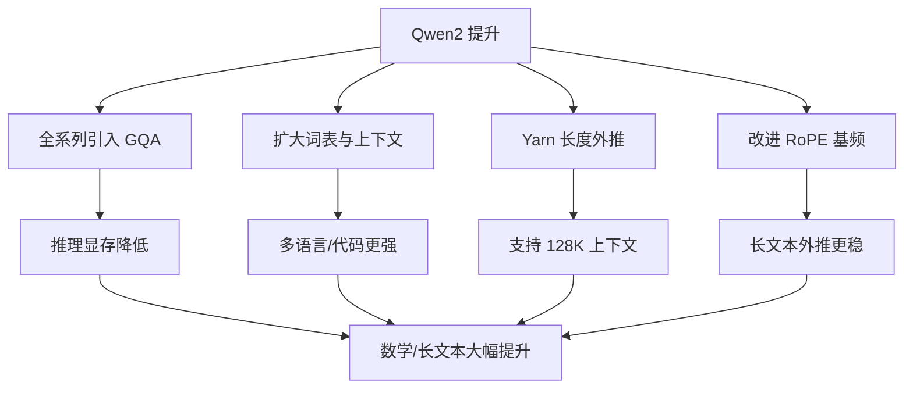

# Qwen2 有哪些提升

Qwen2 在 Qwen1.5 的基础上进行了全面升级，主要体现在以下方面：

**1. 模型尺寸多样化**
*   提供了 0.5B、1.5B、7B、57B-A14B (MoE架构) 和 72B 五种尺寸，满足不同算力场景的需求。

**2. 架构优化：全系列支持 GQA**
*   **GQA (Grouped Query Attention)**：Qwen2 全系列模型均采用了 GQA 技术（此前仅大模型使用）。
*   **优势**：显著减少显存占用，提升推理速度，尤其有利于长文本处理和低显存设备部署。

**3. 性能全面提升**
*   **语言能力**：在中文、英文及 27 种新增语言的评测中表现优异，解决了多语言混用问题。
*   **代码与数学**：融合了 Code-Qwen 的经验，在 HumanEval、GSM8K 等基准测试中显著提升。
*   **长文本**：原生支持 32K 上下文，最高可扩展至 128K，完美通过“大海捞针”测试。

**4. 技术细节**
*   **长上下文技术**：采用了 YARN (Yet Another Rope Extension) 和 Dual Chunk Attention 技术。
*   **安全性**：显著提升了多语言安全性，在防御恶意攻击方面表现更好。

**5. 开源许可**
*   除 72B 模型外，其他尺寸模型均采用 Apache 2.0 协议，商业应用更友好。

---

### 深化实战内容

**实战案例**：
在实际部署 7B 模型进行 RAG（检索增强生成）业务时，利用 GQA 特性，在保持同样吞吐量的情况下，KV Cache 显存占用相比 Qwen1.5 降低了约 30%，使得单张 4090 显卡可支持的并发请求数显著增加，有效降低了长文本（如 10k+ tokens）推理的延迟峰值。

**技术对比：MHA vs MQA vs GQA**

| 特性 | MHA (Multi-Head Attention) | MQA (Multi-Query Attention) | GQA (Grouped-Query Attention) |
| :--- | :--- | :--- | :--- |
| **KV Head 数量** | 与 Q Head 数量一致 (如 32) | 仅为 1 个 | 介于 1 和 Q Head 之间 (如 32 个 Q 分为 8 组 KV) |
| **显存占用 (KV Cache)** | 高 | 极低 | 中等 (显著低于 MHA) |
| **推理速度** | 较慢 (内存带宽瓶颈) | 极快 | 快 (接近 MQA) |
| **模型精度/表达力** | 最强 | 较弱 (信息压缩严重) | 强 (在精度和速度间取得最佳平衡) |
| **典型代表模型** | LLaMA 1, GPT-3 | PaLM | **Qwen2**, LLaMA 2/3, Mistral |

**## 常见考点**
*   **GQA 与 MQA 的区别**：GQA 是如何平衡 MHA (多头注意力) 和 MQA (多查询注意力) 的显存与精度的？
*   **YARN 原理**：YARN 如何改进 RoPE 的插值方式以减少长上下文中的注意力注意力分数衰减？
*   **MoE 架构细节**：Qwen2 的 57B-A14B 模型中，14B 指的是什么？

## 技术原理

**全系列采用 GQA 技术，大幅提升推理速度并降低显存**
GQA（Grouped-Query Attention，分组查询注意力）是 Qwen2 全系列的核心架构升级。传统 MHA（Multi-Head Attention）每个 Query Head 都有独立的 Key/Value Head，KV Cache 显存占用大；MQA 所有 Query Head 共享一个 KV Head，显存极省但精度损失大。GQA 是折中——将 Query Head 分组，每组共享一个 KV Head（如 32 个 Q 分为 8 组 KV），在显存和精度间取得最佳平衡，显著降低 KV Cache 显存并提升推理速度。

**提供从 0.5B 到 72B 的多种尺寸，包括 MoE 架构模型**
Qwen2 覆盖 0.5B（端侧）、1.5B（移动端）、7B（主流开源）、57B-A14B（MoE 架构，激活 14B 参数）、72B（旗舰）多种尺寸，满足从手机到数据中心的全场景算力需求。其中 57B-A14B 是 MoE（Mixture of Experts）架构，总参数 57B 但每次推理只激活 14B，兼顾大模型能力和低推理成本。

**长文本能力提升至 128K，数学和代码能力显著增强**
Qwen2 原生支持 32K 上下文，配合 YARN（Yet Another RoPE Extension）和 Dual Chunk Attention 技术可扩展至 128K，完美通过"大海捞针"测试。代码与数学能力融合了 Code-Qwen 的经验，在 HumanEval、GSM8K 等基准上显著提升，支持 27 种多语言，解决了多语言混用问题。

## 代码示例

```python
# GQA 原理示意：Query 分组共享 KV
import torch
import torch.nn.functional as F

def grouped_query_attention(q, k, v, num_kv_groups=8):
    # q: [batch, num_q_heads, seq, d]
    # k, v: [batch, num_kv_heads, seq, d]  其中 num_kv_heads = num_q_heads / num_kv_groups
    # 每个 kv head 被 num_kv_groups 个 q head 共享
    # 实现时通过 repeat_interleave 把 kv 扩展到 q 的数量
    group_size = q.size(1) // k.size(1)
    k = k.repeat_interleave(group_size, dim=1)   # 扩展 KV
    v = v.repeat_interleave(group_size, dim=1)
    attn = F.scaled_dot_product_attention(q, k, v)
    return attn
```

```python
# Qwen2 长文本推理配置（vLLM 部署）
from vllm import LLM
llm = LLM(
    model="Qwen/Qwen2-7B-Instruct",
    tensor_parallel_size=1,
    max_model_len=32768,         # 原生 32K
    # max_model_len=131072,      # YARN 扩展至 128K
    enforce_eager=False,         # 开启 CUDA Graph 加速
)
```

## 注意事项

- 架构升级：全系列引入 GQA（分组查询注意力），显著降低 KV Cache 显存，提速。
- 尺寸丰富：覆盖 0.5B 到 72B，含 57B-A14B MoE 架构，满足不同算力需求。
- 长文本：原生支持 32K，最高扩展至 128K，采用 YARN 技术解决大海捞针。
- 能力提升：强化代码与数学能力，支持 27 种多语言，安全性显著增强。
- GQA 的 KV Head 数（如 8）是可调超参，越多越接近 MHA 精度但显存增加。

## 流程图




## 记忆要点

- 架构升级：全系列引入GQA（分组查询注意力），显著降低KV Cache显存，提速。
- 尺寸丰富：覆盖0.5B到72B，含57B-A14B MoE架构，满足不同算力需求。
- 长文本：原生支持32K，最高扩展至128K，采用YARN技术解决大海捞针。
- 能力提升：强化代码与数学能力，支持27种多语言，安全性显著增强。


## 结构化回答

**30 秒电梯演讲：** 全系列引入 GQA 加速推理，尺寸覆盖全，性能特别是数学和长文本大幅提升。——打个比方，从单一车型升级为全系产品线，且所有车都换了更省油的引擎（GQA），还能拉更长的货物（长文本）。

**展开框架：**
1. **架构升级** — 全系列引入GQA（分组查询注意力），显著降低KV Cache显存，提速。
2. **尺寸丰富** — 覆盖0.5B到72B，含57B-A14B MoE架构，满足不同算力需求。
3. **长文本** — 原生支持32K，最高扩展至128K，采用YARN技术解决大海捞针。

**收尾：** 以上三点都能配合实战聊。您想深入聊哪一块？

## 视频脚本

> 预计时长：2 分钟 | 由浅入深

| 时间 | 画面/字幕 | 口播台词 | 讲解要点 |
|------|----------|----------|----------|
| 0:00 | 标题卡 | "Qwen2 有哪些提升，30 秒讲清楚。" | 开场钩子 |
| 0:30 | 概念定义动画 | "一句话：全系列引入 GQA 加速推理，尺寸覆盖全，性能特别是数学和长文本大幅提升。" | 核心定义 |
| 1:00 | 架构升级图解 | "全系列引入GQA（分组查询注意力），显著降低KV Cache显存，提速。" | 架构升级 |
| 1:30 | 总结卡 | "记好这几条，面试不慌。下期见。" | 收尾 |
