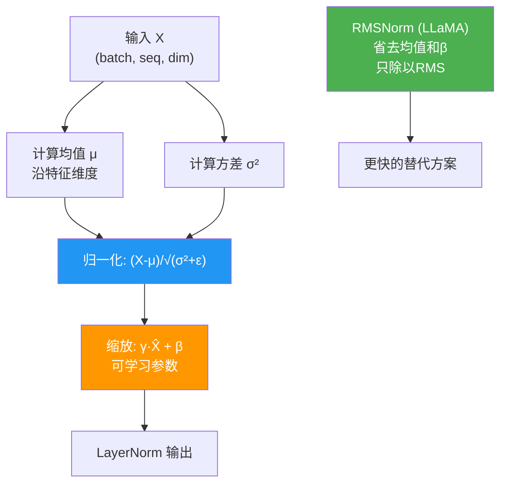

# 手撕RMSNorm

📌RMSNorm(Root Mean Square Normalization)是LayerNorm的一种变体,它的不同点在于不计算均值,而是直接使用输入的范数(即均方根,Root Mean Square)来进行标准化.这种方法减少了计算开销，同时也能提供类似的归一化效果.

### 1. RMSNorm的数学原理
RMSNorm 基于假设：模型层的输入能够通过基于均方根的重新缩放来稳定训练。去掉了均值中心化步骤，计算效率更高。

公式如下：
$$ \bar{x}_i = \frac{x_i}{\sqrt{\frac{1}{n} \sum_{j=1}^{n} x_j^2} + \epsilon} \cdot \gamma_i $$

### 2. 手撕RMSNorm代码

```python
import torch
import torch.nn as nn

class RMSNorm(nn.Module):
    def __init__(self, normalized_shape, eps=1e-5, elementwise_affine=True):
        """
        Args:
            normalized_shape: 输入形状中从末尾开始归一化的维度
            eps: 防止除零的小常数
            elementwise_affine: 是否引入可学习缩放参数 gamma。注意 RMSNorm 通常不使用 beta (偏移)
        """
        super(RMSNorm, self).__init__()
        self.eps = eps
        self.elementwise_affine = elementwise_affine
        if self.elementwise_affine:
            self.gamma = nn.Parameter(torch.ones(normalized_shape))
        else:
            self.register_parameter('gamma', None)

    def forward(self, x):
        # 1. 计算均方根 (RMS)
        # x**2: 元素平方
        # mean(..., dim=-1): 沿最后一个维度求均值
        # sqrt(...): 开根号
        rms = torch.sqrt(torch.mean(x ** 2, dim=-1, keepdim=True) + self.eps)
        
        # 2. 标准化 (缩放)
        x_normalized = x / rms
        
        # 3. 引入可学习参数 gamma 进行缩放
        if self.elementwise_affine:
            x_normalized = x_normalized * self.gamma
            
        return x_normalized
```

### 3. 架构对比流程图

```text
      LayerNorm                   RMSNorm
          │                           │
          ▼                           ▼
  ┌───────────────┐           ┌───────────────┐
  │ 计算均值 Mean │           │ 计算平方 X^2  │
  └───────┬───────┘           └───────┬───────┘
          │                           │
          ▼                           ▼
  ┌───────────────┐           ┌───────────────┐
  │ 计算方差 Var  │           │ 计算均方 RMS  │
  └───────┬───────┘           └───────┬───────┘
          │                           │
          ▼                           ▼
  ┌───────────────────┐     ┌───────────────────┐
  │ (X - mean) / std  │     │      X / RMS       │
  └─────────┬─────────┘     └─────────┬─────────┘
            │                         │
            ▼                         ▼
```

### 实战案例
RMSNorm 是 Llama 2/3、PaLM 等大模型的首选归一化层。相比 LayerNorm，它去掉了减去均值的操作，这通常能带来 5%-15% 的推理加速（取决于硬件），且减少了约 10-15% 的显存占用（不需要存储 mean 中间结果）。在实现时，`elementwise_affine` 通常只保留 `gamma`，去掉 `beta`（即偏置），这在大模型训练中被证明是稳定的且减少了参数量。

### 代码示例：高性能优化（Fused视角）
虽然 Python 代码如上所示，但在 CUDA Kernel 实现中，可以直接融合 `x^2` 和 `reduce_sum` 操作。
```python
# 伪代码示意：融合计算思路
def rmsnorm_fused(x, weight, eps):
    # 假设使用 einsum 或专用 kernel 避免生成 x^2 中间张量
    square_sum = torch.sum(x * x, dim=-1, keepdim=True)
    inv_rms = torch.rsqrt(square_sum / x.shape[-1] + eps)
    return (x * inv_rms) * weight
```


## 核心流程图



## 记忆要点

- 核心差异：去均值中心化，仅用均方根(RMS)归一化
- 计算公式：X / sqrt(mean(X²) + eps) * gamma
- 优势特点：计算量更少，推理速度更快，省去Beta参数
- 应用场景：Llama、PaLM等大模型首选归一化方式
- 数学假设：输入可通过重新缩放稳定训练，无需减均值


## 结构化回答

**30 秒电梯演讲：** 基于均方根的归一化，省去均值计算以降低开销。——打个比方，就像调节音响音量只看信号的平均能量（RMS）而不关心波形中心位置， LayerNorm既要稳住中心又要定能量。

**展开框架：**
1. **核心差异** — 去均值中心化，仅用均方根(RMS)归一化
2. **计算公式** — X / sqrt(mean(X²) + eps) * gamma
3. **优势特点** — 计算量更少，推理速度更快，省去Beta参数

**收尾：** 以上三点都能配合实战聊。您想深入聊哪一块？

## 视频脚本

> 预计时长：2 分钟 | 由浅入深

| 时间 | 画面/字幕 | 口播台词 | 讲解要点 |
|------|----------|----------|----------|
| 0:00 | 标题卡 | "手撕RMSNorm，30 秒讲清楚。" | 开场钩子 |
| 0:30 | 概念定义动画 | "一句话：基于均方根的归一化，省去均值计算以降低开销。" | 核心定义 |
| 1:00 | 核心差异图解 | "去均值中心化，仅用均方根(RMS)归一化" | 核心差异 |
| 1:30 | 总结卡 | "记好这几条，面试不慌。下期见。" | 收尾 |
