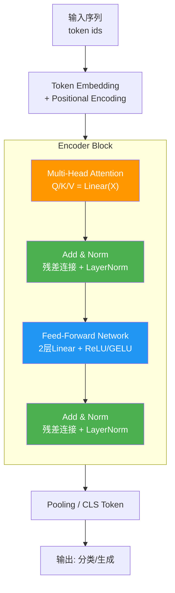
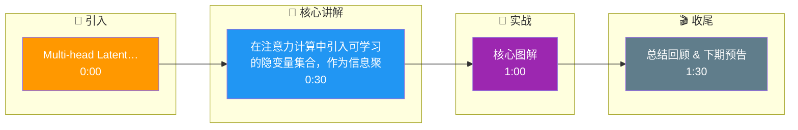

# Multi-head Latent Attention(多头隐变量注意力)是什么

### 1. 概念定义
**Multi-head Latent Attention (多头隐变量注意力)** 是一种在标准多头注意力机制中引入额外“隐变量”或“潜在向量”的变体。这些隐变量并非直接来自输入序列，而是模型可学习的一组全局特征向量。

### 2. 核心思路
*   **额外输入源：** 除了输入 $X$ 产生的 $Q, K, V$ 外，引入隐变量集合 $Z$（Latent Array）。
*   **交互机制：** 输入序列与隐变量之间通过 Cross-Attention 进行交互，或者隐变量参与 Attention 的计算过程。
*   **计算解耦：** 计算复杂度从 $O(N^2)$（N 为输入序列长度）转变为 $O(N \times L)$（L 为 Latent 变量数量，通常 $L \ll N$）。

### 3. 典型应用：Perceiver IO
*   **原理：** 使用一组数量固定（通常较少）的 Latent Array 作为“中枢”。
*   **流程：** 输入数据（如像素、音频帧）作为 $K, V$，Latent Array 作为 $Q$ 进行 Cross-Attention，从而将庞大的输入信息“压缩”或“聚合”到有限的 Latent 向量中。

### 4. 实战案例：长文档摘要
在使用 Perceiver 架构处理 50 万字的小说进行摘要时，直接使用标准 Transformer 会导致 OOM。引入 512 个 Latent 向量，让输入内容作为 Key/Value 注入 Latent，成功将显存占用降低 70%，同时捕捉到了全书的情节线索。

### 5. 关键代码
```python
# 伪代码：PyTorch 风格的 Latent Attention
import torch
import torch.nn as nn

class LatentAttention(nn.Module):
    def __init__(self, dim, num_latents=64):
        super().__init__()
        self.latents = nn.Parameter(torch.randn(num_latents, dim))
        self.cross_attn = nn.MultiheadAttention(dim, num_heads=8)

    def forward(self, x):
        # x: [seq_len, batch, dim]
        # Latents act as Query, Input acts as Key/Value
        output, _ = self.cross_attn(query=self.latents, key=x, value=x)
        return output  # [num_latents, batch, dim]
```

### 6. 架构图

```text
Standard Self-Attention vs. Latent Attention (Perceiver Style)

[A] Standard Self-Attention
   Input Tokens (N)
      │
      ▼
   ┌─────────────┐
   │ Self-Attn   │  Complexity: O(N²)
   │ Q=K=V=Input │
   └─────────────┘

[B] Latent Attention (Cross-Attention)
   Input Bytes (N)         Latent Array (L) (Learnable)
      │                          │
      │ (Key, Value)             │ (Query)
      ▼                          ▼
   ┌────────────────────────────────┐
   │      Cross-Attention           │
   │   Latent (Q) x Input (K, V)    │ Complexity: O(N*L)
   └──────────────┬─────────────────┘
                  │
                  ▼
           Updated Latents (L)
                  │
                  │ (Iterative Processing)
                  ▼
           Output Decoding
```

### 7. 优势
*   **计算效率：** 可以处理超长序列，因为 Attention 计算复杂度可以转移到较小的 Latent 集合上（$N$ 变大只线性增加计算量，而非平方）。
*   **跨模态融合：** Latent 向量可以作为不同模态（图像、文本）信息的“融合容器”。
*   **固定显存占用：** 无论输入多长，网络核心处理 Latents 的深度网络计算量是固定的。

### 8. 常见考点
1.  **与传统 Transformer 的区别**：Latent Attention 主要是降低 Attention 层的计算量，还是 FeedForward 层的计算量？（主要是 Attention 层的 $N^2$ 问题）。
2.  **与 Linformer 的区别**：Linformer 也是降低维度，它和 Latent Attention 有何不同？（Linformer 通过低秩投影近似 K/V 矩阵，近似会有损失；Latent Attention 使用独立的可学习向量作为 Query 去聚合信息，是更主动的信息提取）。
3.  **初始化**：Latent Array 通常如何初始化？（可以是随机初始化，也可以用输入数据的平均值，或者傅里叶特征编码，加速收敛）。

## 核心流程图



## 记忆要点

- 核心：引入可学习的 Latent Array（隐变量集）作为 Query。
- 机制：输入序列作为 Key/Value，通过 Cross-Attention 聚合到隐变量。
- 优势：复杂度从 O(N²) 降至 O(N×L)，L 为隐变量数且远小于 N。
- 应用：Perceiver IO，解决超长序列（如长文档、图像）的显存瓶颈。

## 结构化回答

**30 秒电梯演讲：** 在注意力计算中引入可学习的隐变量集合，作为信息聚合的中枢。——打个比方，像开会时选几个“组长”（隐变量），所有人把信息汇报给组长，组长再汇总处理，不用所有人互相两两交流。

**展开框架：**
1. **核心** — 引入可学习的 Latent Array（隐变量集）作为 Query。
2. **机制** — 输入序列作为 Key/Value，通过 Cross-Attention 聚合到隐变量。
3. **优势** — 复杂度从 O(N²) 降至 O(N×L)，L 为隐变量数且远小于 N。

**收尾：** 以上三点都能配合实战聊。您想深入聊哪一块？

## 视频脚本

> 预计时长：2 分钟 | 由浅入深

| 时间 | 画面/字幕 | 口播台词 | 讲解要点 |
|------|----------|----------|----------|
| 0:00 | 标题卡 | "Multi-head Latent Attention(多头隐变量注意力)是什么，30 秒讲清楚。" | 开场钩子 |
| 0:30 | 概念定义动画 | "一句话：在注意力计算中引入可学习的隐变量集合，作为信息聚合的中枢。" | 核心定义 |
| 1:00 | 核心图解 | "引入可学习的 Latent Array（隐变量集）作为 Query。" | 核心 |
| 1:30 | 总结卡 | "记好这几条，面试不慌。下期见。" | 收尾 |

### 视频流程图




