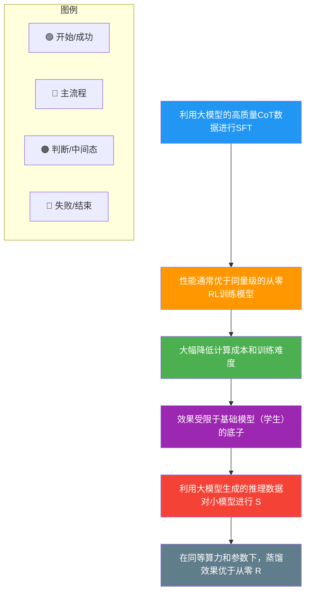

# Deepseek中蒸馏R1是什么?是否比从零RL训练是否更好

### 定义

在 DeepSeek 的研究中，**蒸馏** 指将大型模型（如 DeepSeek-R1）的知识通过监督微调(SFT)传递到较小的模型中。具体而言，使用 DeepSeek-R1 生成的数据，对较小的模型（如 Llama 和 Qwen 系列）进行微调，使其具备类似的推理能力。

### 1. 蒸馏与从零开始的强化学习(RL)训练的比较

**性能表现：** 研究表明，蒸馏模型在推理任务中的表现优于直接通过 RL 训练的小模型。例如，DeepSeek-R1-Distill-Qwen-7B 在 AIME 2024 基准测试中超越了 QwQ-32B-Preview。

**计算成本：** 从零开始对小模型进行 RL 训练需要巨大的计算资源和探索时间。相比之下，蒸馏策略更为经济高效，能够在较小的模型上快速实现出色的推理能力。

**基础模型质量：** 尽管蒸馏策略有效，但其效果仍取决于基础模型的质量。通常，参数量更大、基座能力更强的模型，蒸馏后的性能更佳。

### 2. 结果分析

**数据质量：** 蒸馏过程中使用的高质量推理数据，使得小模型能够直接学习到有效的推理模式，而无需经历 RL 训练中的试错探索过程。

**训练稳定性：** 直接对小模型进行 RL 训练可能导致不稳定（如奖励黑客），而蒸馏通过 SFT 提供了稳定的训练目标，减少了训练难度。

**资源效率：** 蒸馏策略在计算资源和时间成本上更具优势，特别是在资源有限的情况下，是获得高性能小模型的最佳路径。

**结论：** 通过蒸馏将大型模型的推理能力传递给小模型，比从零开始对小模型进行 RL 训练更为有效和高效。

### 3. 蒸馏的详细实施流程

*   **数据生成**：使用 DeepSeek-R1-Zero 和 DeepSeek-R1 生成海量的推理数据。
*   **数据筛选**：并非所有生成数据都是好的。通常需要筛选出推理链清晰、最终答案正确的样本，或者过滤掉过于冗长混乱的思维链。
*   **知识迁移**：
    *   **黑盒蒸馏**：只使用 R1 的输出作为训练目标。
    *   **白盒蒸馏（如果有参数访问权）**：还可以利用 Teacher 模型的隐藏层特征或 Logits 进行对齐（但在 DeepSeek 开源背景下，主要是基于输出的 SFT）。

### 4. 架构图

```text
┌─────────────────────────────────────────────────────┐
│              Teacher Model (DeepSeek-R1)            │
│            (数千亿参数，强大的推理能力)               │
└───────────────────┬─────────────────────────────────┘
                    │ 生成推理数据 (Prompt + Chain of Thought + Answer)
                    ▼
          ┌───────────────────────┐
          │   构建蒸馏数据集        │
          │ (清洗、去重、格式化)     │
          └───────────┬───────────┘
                      │
                      ▼
┌─────────────────────────────────────────────────────┐
│              Student Model (e.g., Qwen-7B)           │
│                  (监督微调 SFT)                       │
└───────────────────┬─────────────────────────────────┘
                    │ 学习推理模式
                    ▼
              ┌───────────────┐
              │  蒸馏后的小模型  │
              │ (具备强推理能力)  │
              └───────────────┘
```

### 5. 实战补充

**实战案例**：在尝试将 70B 模型的推理能力蒸馏到 8B 模型时，直接使用 R1 的原始长 CoT（Chain of Thought）往往会导致小模型“学偏”，反而丢失了原本的指令遵循能力。工程上常采用“CoT 蒸馏 + 原始指令微调”混合训练的策略来平衡这两者。

**代码示例**：使用 HuggingFace Trainer 进行知识蒸馏（简化版）
```python
from transformers import Trainer, TrainingArguments
import torch
import torch.nn.functional as F

class DistillationTrainer(Trainer):
    def compute_loss(self, model, inputs, return_outputs=False):
        # Student 模型的输出
        outputs_student = model(**inputs)
        logits_student = outputs_student.logits
        labels = inputs.get("labels")
        
        # 假设 inputs 中包含了 Teacher 的 logits (需预处理阶段准备好)
        logits_teacher = inputs.get("teacher_logits")
        
        # 1. 标准的 CrossEntropy Loss (针对真实标签)
        loss_ce = F.cross_entropy(logits_student.view(-1, self.model.config.vocab_size), 
                                  labels.view(-1))
        
        # 2. 蒸馏 Loss (让 Student 的分布逼近 Teacher)
        # 通常温度 T > 1，这里简化为 T=1.0
        loss_kd = F.kl_div(
            F.log_softmax(logits_student, dim=-1),
            F.softmax(logits_teacher, dim=-1),
            reduction="batchmean"
        )
        
        # 损失加权：通常 alpha * CE + (1-alpha) * KD
        loss = 0.7 * loss_ce + 0.3 * loss_kd
        return (loss, outputs_student) if return_outputs else loss
```

## 常见考点
1. **为什么蒸馏比小模型直接 RL 好？**：RL 探索成本极高且不稳定，小模型参数容量小，难以从零探索出复杂的推理策略。蒸馏相当于“直接把做题公式教给学生”，效率更高。
2. **蒸馏是否总是有效的？**：如果 Teacher 模型的推理过程包含 Student 模型参数容量无法理解的复杂模式，或者存在大量幻觉，强行蒸馏可能会导致灾难性遗忘。


## 核心流程图



## 记忆要点

- 定义：利用大模型（R1）生成的推理数据，通过SFT将知识迁移给小模型。
- 对比结论：蒸馏比从零RL训练更好，成本低、稳定性高、性能更强。
- 核心优势：小模型直接学习有效推理模式，跳过了RL试错过程，避免奖励黑客。
- 实施关键：需筛选高质量推理数据，且混合原始指令微调以防丢失指令遵循能力。


## 结构化回答

**30 秒电梯演讲：** 用大模型生成的推理数据教小模型，比小模型自己学RL更高效。——打个比方，直接让天才老师（大模型）把笔记（推理数据）给学生（小模型），比让学生自己瞎琢磨效率高。

**展开框架：**
1. **定义** — 利用大模型（R1）生成的推理数据，通过SFT将知识迁移给小模型。
2. **对比结论** — 蒸馏比从零RL训练更好，成本低、稳定性高、性能更强。
3. **核心优势** — 小模型直接学习有效推理模式，跳过了RL试错过程，避免奖励黑客。

**收尾：** 以上三点都能配合实战聊。您想深入聊哪一块？

## 视频脚本

> 预计时长：2 分钟 | 由浅入深

| 时间 | 画面/字幕 | 口播台词 | 讲解要点 |
|------|----------|----------|----------|
| 0:00 | 标题卡 | "Deepseek中蒸馏R1是什么，30 秒讲清楚。" | 开场钩子 |
| 0:30 | 概念定义动画 | "一句话：用大模型生成的推理数据教小模型，比小模型自己学RL更高效。" | 核心定义 |
| 1:00 | 定义图解 | "利用大模型（R1）生成的推理数据，通过SFT将知识迁移给小模型。" | 定义 |
| 1:30 | 总结卡 | "记好这几条，面试不慌。下期见。" | 收尾 |

---

## 延伸：Deepseek中蒸馏R1

> 合并自 `xhw-074`（相似度 70%）

### DeepSeek 中蒸馏 R1 是什么？是否比从零 RL 训练更好？

#### 1. 什么是蒸馏 R1？
蒸馏是指将大型教师模型（DeepSeek-R1 或 R1-Zero）的知识迁移到小型学生模型（如 Qwen-7B, Llama-8B 等）的过程。
具体做法是：**使用 R1 模型生成的大量推理数据，对较小的开源模型进行监督微调（SFT）**。这使得小模型能够学习到大模型的思维链和推理模式，而无需自己进行昂贵的 RL 训练。

#### 2. 蒸馏 vs. 从零 RL 训练
**结论：在同等规模下，蒸馏通常比从零开始进行 RL 训练更好。**

**2.1 性能表现**
- **蒸馏更优**：蒸馏得到的模型（如 DeepSeek-R1-Distill-Qwen-7B）在多项基准测试中，性能往往优于直接通过 RL 训练的同等规模小模型，甚至能超越参数量更大的模型（如 QwQ-32B）。
- **原因**：大模型通过 RL 探索出的高质量推理路径直接“教”给了小模型，这是一种高效的知识传递。小模型不仅学习到了结果，更重要的是学习到了“如何思考”的分布。

**2.2 计算成本**
- **蒸馏极具性价比**：RL 训练需要消耗巨大的算力进行成千上万次的交互和采样。而蒸馏只需要进行一次 SFT，成本远低于 RL。
- **从零 RL 昂贵**：对小模型进行 RL 训练同样需要大量的搜索和尝试，资源利用率低，且小模型的探索能力弱于大模型。

**2.3 稳定性**
- **蒸馏稳定**：SFT 过程相对稳定，不易出现模式崩塌，训练流程成熟可控。
- **RL 不稳定**：小模型参数容量有限，直接进行 RL 可能难以收敛或导致语言能力退化（遗忘灾难）。

**蒸馏流程图：**
```text
教师模型 [R1 (671B)]
    |
    +---> 生成大量 [问题 + 推理过程 + 答案] (约 80万样本)
                |
                V
学生模型 [Qwen/Llama (1.5B-32B)] --(SFT)--> [蒸馏后小模型]
                |
                +---> 获得推理能力，无需自行探索
```

#### 3. 局限性
蒸馏的效果受限于**学生模型的基础能力**。如果基础模型本身的智能程度较低（例如参数量太小或预训练不足），即使强行灌输 R1 的思维链，也无法完美复现大模型的推理能力，可能出现“消化不良”的现象。

---

### 深化内容

#### 实战案例
在复现 DeepSeek 蒸馏过程时，我们发现直接使用 32k 长度的完整 CoT 训练 7B 参数的小模型会导致严重的“中间迷失”现象，即模型在推理中途逻辑断裂。**解决方案**是将超长 CoT 进行“分块蒸馏”或截取关键推理步骤，这显著提升了小模型在长链条任务中的推理成功率。

#### 代码示例 (Python/Transformers)
```python
# 关键：处理教师模型生成的 Thinking 过程，构建 SFT 数据集
def prepare_distillation_sample(raw_sample):
    # raw_sample 包含: question, thinking (long), answer
    # 技巧：给 thinking 加上特殊标记，帮助模型区分推理与最终答案
    prompt = f"<|user|>\n{raw_sample['question']}<|end|>\n<|think|>"
    
    # 截断或摘要过长的 thinking 过程以适应小模型上下文
    thinking_content = truncate_long_thinking(raw_sample['thinking'], max_len=2048)
    
    completion = f"{thinking_content}<|end|>\n<|assistant|>\n{raw_sample['answer']}<|end|>"
    return {"text": prompt + completion}
```

#### 对比表格：蒸馏 R1 vs 从零 RL 训练

| 维度 | DeepSeek 蒸馏 (SFT) | 从零 RL 训练 (如 R1-Zero 流程) |
| :--- | :--- | :--- |
| **核心原理** | 模仿学习：拟合大模型推理分布 | 强化学习：通过 Reward 信号探索最优策略 |
| **算力消耗** | **低**：仅需常规 SFT 资源 (几十张 H100) | **极高**：需海量采样与多轮交互 (数千张 H800) |
| **训练稳定性** | **高**：收敛曲线平滑，不易发散 | **低**：Reward Hacking 风险高，语言能力易退化 |
| **数据依赖** | 依赖高质量教师数据 (约 80万样本) | 依赖高质量 Reward Model 和环境反馈 |
| **推理能力上限** | 受限于教师模型及学生基座容量 | 理论上可探索出教师未发现的新路径 |
| **落地适用性** | **极高**：适合企业快速落地小模型推理 | **低**：仅适合头部大厂预训练基础模型 |

#### 常见考点
1. **蒸馏的数据来源**：主要包含 R1-Zero 和 R1 生成的混合数据，保留了长思考链特征。
2. **蒸馏后的模型是否还具备 RL 能力**：蒸馏是 SFT 过程，得到的模型是静态的，不具备像 R1 那样在推理时实时强化学习的能力，但它已经学会了推理的模式。
3. **为什么不开源 RL 过程只开源蒸馏模型**：RL 的训练过程涉及巨大的算力和复杂的 reward engineering，而蒸馏模型可以让开发者低成本使用高质量的推理能力。


## 核心流程图


## 记忆要点

- 蒸馏指用R1生成的推理数据对小模型进行SFT，迁移推理能力。
- 对比从零RL：蒸馏性能更优、成本更低、稳定性更高，性价比极高。
- 局限性：效果受限于学生模型的基础容量，太小模型可能无法消化长CoT。


## 结构化回答

**30 秒电梯演讲：** 将大模型的推理数据用于微调小模型，比直接对小模型做RL训练更高效且效果更好。——打个比方，像让学霸记好笔记（R1生成数据），直接借给普通学生（小模型）背诵，比让普通学生自己去大海捞针（RL）解题效率高得多。

**展开框架：**
1. **蒸馏指用R1生成** — 蒸馏指用R1生成的推理数据对小模型进行SFT，迁移推理能力。
2. **对比从零RL** — 蒸馏性能更优、成本更低、稳定性更高，性价比极高。
3. **局限性** — 效果受限于学生模型的基础容量，太小模型可能无法消化长CoT。

**收尾：** 以上三点都能配合实战聊。您想深入聊哪一块？

## 视频脚本

> 预计时长：3 分钟 | 由浅入深

| 时间 | 画面/字幕 | 口播台词 | 讲解要点 |
|------|----------|----------|----------|
| 0:00 | 标题卡 | "Deepseek中蒸馏R1，30 秒讲清楚。" | 开场钩子 |
| 0:36 | 概念定义动画 | "一句话：将大模型的推理数据用于微调小模型，比直接对小模型做RL训练更高效且效果更好。" | 核心定义 |
| 1:12 | 要点图解 | "蒸馏指用R1生成的推理数据对小模型进行SFT，迁移推理能力。" | 要点 |
| 1:48 | 对比从零RL图解 | "蒸馏性能更优、成本更低、稳定性更高，性价比极高。" | 对比从零RL |
| 2:24 | 总结卡 | "记好这几条，面试不慌。下期见。" | 收尾 |
