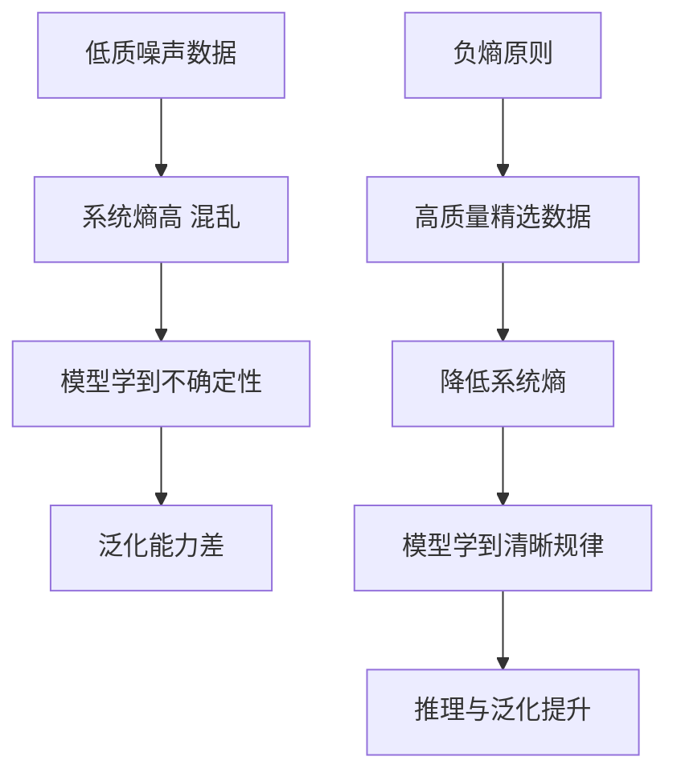

# Llama 3.1 的「负熵原则」是什么含义?为什么高质量数据能提升模型

- **负熵原则:**
源自信息论。在训练中引入高质量外部数据，相当于向系统注入「秩序」（负熵），降低信息熵，提升模型确定性。

- **Llama 3.1 的实践:**
1. **多层次数据过滤** - 质量分类器 + 去重 + 安全过滤
2. **行级别去重** - 精确到文本行，而非文档级
3. **负熵效果** - 噪声减少 → 信息密度提升 → 模型学到的模式更纯粹

- **关键:** 数据质量 > 数据数量。少量高质量数据比大量噪声数据更有效。

### 补充关键细节

*   **负熵的数学直觉**:
    信息熵 $H(X) = -\sum p(x) \log p(x)$ 表示不确定性。无标注的爬虫网页数据通常充满噪声、逻辑混乱，熵极高（不确定性大）。经过人工撰写、审核的高质量数据（如教科书、Wiki、代码），其语言结构严谨、逻辑清晰，条件概率分布更“尖锐”，不确定性低，即低熵。
*   **Scaling Laws 的修正**:
    传统的缩放定律认为性能主要与计算量和数据量正相关。Llama 3.1 的观点是：如果数据是低质量的，增加数据量带来的边际收益递减极快；如果能注入高质量数据，可以在更少的 Token 数量下达到更高的性能上限。
*   **课程学习的视角**:
    负熵原则也可以理解为课程学习的一种形式：先让模型学习秩序井然的知识（建立低熵的认知结构），再逐步引入更复杂或稍带噪声的数据。

### 3. 实战补充

**实战案例**：在微调特定垂直领域（如金融医疗）模型时，若直接使用 Common Crawl 数据进行预训练，模型在专业术语上的一致性极差（同义词混用）。若替换为经过专家校验的财报或诊断书（负熵数据），模型在下游任务上的准确率可提升 20% 以上，且收敛速度显著加快。

**代码示例**：基于行级别的去重脚本
```python
import hashlib

def deduplicate_lines_by_content(file_path):
    """
    Llama 3.1 风格的行级去重：去除重复的 boilerplate 文本（如页脚页眉）
    这能显著降低数据的冗余熵，提高训练效率。
    """
    seen_hashes = set()
    unique_lines = []
    
    with open(file_path, 'r', encoding='utf-8') as f:
        for line in f:
            # 计算行内容的哈希值（去除首尾空白）
            line_hash = hashlib.md5(line.strip().encode('utf-8')).hexdigest()
            if line_hash not in seen_hashes:
                seen_hashes.add(line_hash)
                unique_lines.append(line)
            
    return unique_lines
```

## 常见考点
1. **如何量化数据的“质量”？**：Llama 团队使用了基于强模型（如 Llama 2/3）的打分模型来对网页数据进行打分，或者使用启发式规则（如是否包含特定格式、是否来自高信誉域名）。
2. **什么是行级别去重？**：文档级去重可能删除了整个重复的网页，但网页内部可能包含通用的页眉页脚，行级别去重能更精细地去除重复的 boilerplate 文本，提高每条数据的独特性。
3. **为什么高质量数据能提升泛化能力？**：高质量数据往往具有更本质的逻辑和事实模式。学习这些核心模式有助于模型在新任务上进行零样本或少样本迁移，而噪声数据可能只是让模型死记硬背错误的关联。

## 流程图




## 记忆要点

- 负熵原则：引入高质量数据即注入秩序（负熵），降低系统不确定性，提升模型确定性。
- 核心逻辑：数据质量大于数量，高质量低熵数据比大量噪声数据更能提升性能上限。
- 实践手段：多层次过滤、行级别去重，去除噪声和冗余Boilerplate。
- 效果：减少噪声使模型学到更纯粹的模式，提升泛化能力和收敛速度。


## 结构化回答

**30 秒电梯演讲：** 引入高质量数据减少系统熵（混乱度），提升模型秩序。——打个比方，喂给模型精读的教材（高质量数据）比喂一堆乱码报纸（低质数据）学得更快。

**展开框架：**
1. **负熵原则** — 引入高质量数据即注入秩序（负熵），降低系统不确定性，提升模型确定性。
2. **核心逻辑** — 数据质量大于数量，高质量低熵数据比大量噪声数据更能提升性能上限。
3. **实践手段** — 多层次过滤、行级别去重，去除噪声和冗余Boilerplate。

**收尾：** 以上三点都能配合实战聊。我可以展开任一要点，比如「如何设计数据质量分类器」这类追问您感兴趣吗？

## 视频脚本

> 预计时长：2 分钟 | 由浅入深

| 时间 | 画面/字幕 | 口播台词 | 讲解要点 |
|------|----------|----------|----------|
| 0:00 | 标题卡 | "Llama 3.1 的「负熵原则」是什么含义，30 秒讲清楚。" | 开场钩子 |
| 0:30 | 概念定义动画 | "一句话：引入高质量数据减少系统熵（混乱度），提升模型秩序。" | 核心定义 |
| 1:00 | 负熵原则图解 | "引入高质量数据即注入秩序（负熵），降低系统不确定性，提升模型确定性。" | 负熵原则 |
| 1:30 | 总结卡 | "记好这几条，面试不慌。下期见。" | 收尾 |
