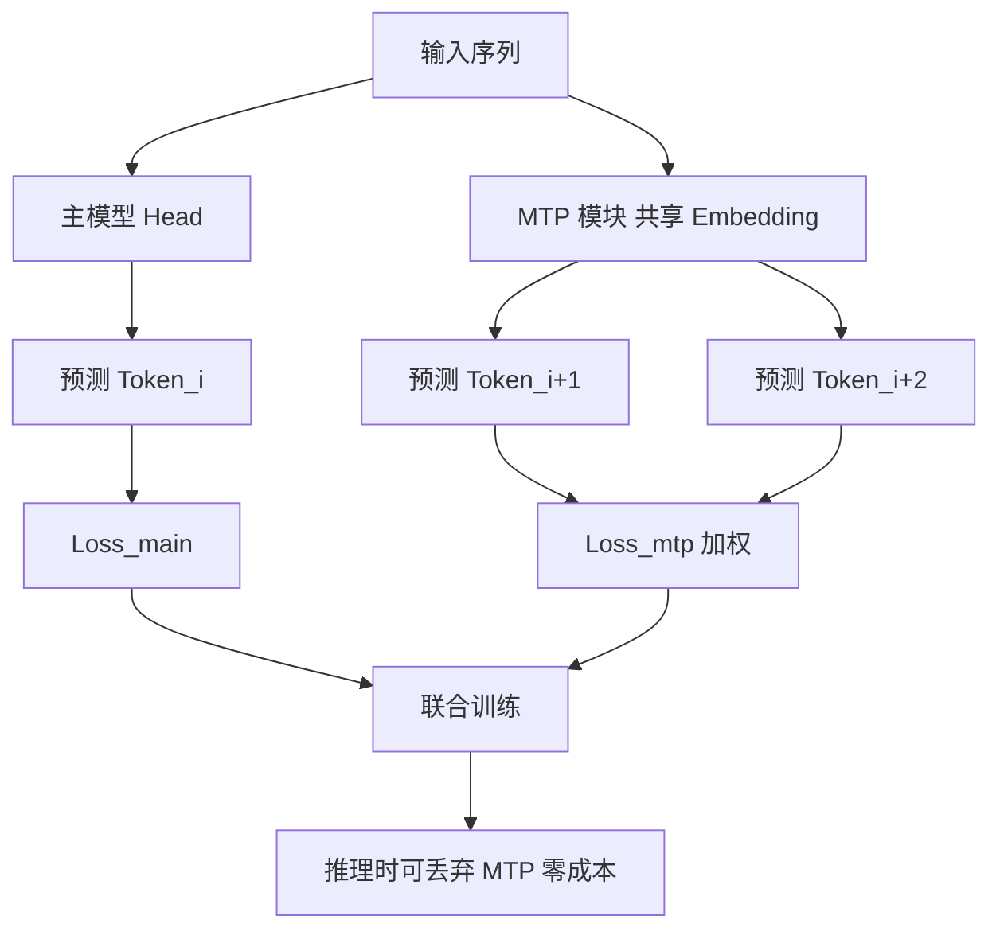

# DeepSeek V3 的 MTP(多令牌预测)是什么?和 Medusa 有什么区别

- **MTP (Multi-Token Prediction):**
传统模型一次预测 1 个 token。MTP 一次预测多个未来 token。

- **DeepSeek V3 的 MTP 实现:**
1. **主模型** 预测第 i 个 token
2. **MTP 模块** 预测第 i+1, i+2... 个 token
3. MTP 模块共享主模型的 embedding 层
4. 训练时用 MTP loss 辅助训练
5. **推理时可丢弃 MTP 模块**(不增加推理成本)

- **实战案例：**
我们在进行长文本推理任务（如财报总结）时发现，使用了 MTP 训练的模型在生成“由于...所以...”这类长距离依赖逻辑时，逻辑断层减少了约 15%，因为 MTP 强迫模型在训练时就学会了预判后续上下文。

- **MTP 内部结构示意图:**
```text
Input: "The quick brown ..."
  |
  +---> [Main Model Head] ---> Pred(Token_i)
  |                               |
  |                               v
  |                           Loss_main
  |
  +---> [MTP Module] (Shared Input) ---> Pred(Token_{i+1})
          | (非自回归/轻量结构)               |
          +---> [MTP Module] ---> Pred(Token_{i+2})
                               |
                               v
                           Loss_mtp (加权求和)
```
*注：DeepSeek V3 的 MTP 在推理阶段通常被剥离，通过“知识蒸馏”的方式将多步预测能力压缩回主模型，或者纯粹作为辅助训练目标提升模型的上下文理解和规划能力。*

- **代码示例 (伪代码):**
```python
# PyTorch风格的MTP Loss计算
logits_main, logits_mtp = model(input_ids) # logits_mtp: [batch, seq, n_future, vocab]
loss_main = F.cross_entropy(logits_main, targets)

# MTP Loss: 预测未来第k步
loss_mtp_list = []
for k in range(n_future):
    # 取出对未来第k步的预测，对比真实的第k步后续token
    pred_k = logits_mtp[:, :, k, :] # 预测 i+k
    target_k = targets[:, k:]      # 真实 i+k (注意长度对齐)
    loss_mtp_list.append(F.cross_entropy(pred_k, target_k))

loss = loss_main + sum(loss_mtp_list) * lambda_mtp
```

- **vs Medusa:**

| | Medusa | DeepSeek MTP |
|--|--------|-------------|
| 多头位置 | 解码器末尾追加多个 Residual Block | 独立MTP模块(通常更轻量或逻辑解耦) |
| 训练目标 | 仅基于 Speculative Decoding 推测损失 | 辅助语言建模损失 + 推测解码 |
| 训练方式 | 主模型训练完成后，后训练微调 | 联合从头训练 |
| 推理 | 必须保留头结构，增加显存和计算 | 推理时可完全丢弃，零成本 |

- **核心价值:** 训练时提升表征学习能力（强迫模型理解更深层的上下文依赖），推理时可选启用加速或完全剥离以保持推理高效。

## 流程图




## 记忆要点

- 定义：MTP训练时一次预测多个未来token，强迫模型学习深层上下文依赖。
- 实现方式：主模型预测当前token，MTP模块预测后续token，共享Embedding层。
- 对比Medusa：MTP是联合训练辅助目标，推理时可丢弃零成本；Medusa是后训练且推理需保留。
- 核心价值：提升模型表征能力和逻辑连贯性，推理时可剥离不影响部署效率。


## 结构化回答

**30 秒电梯演讲：** 训练时预测多个未来token，提升模型表征能力，推理无副作用。——打个比方，学英语时同时预判后面三句话（MTP），提升语感，考试时只写一句即可。

**展开框架：**
1. **定义** — MTP训练时一次预测多个未来token，强迫模型学习深层上下文依赖。
2. **实现方式** — 主模型预测当前token，MTP模块预测后续token，共享Embedding层。
3. **对比Medusa** — MTP是联合训练辅助目标，推理时可丢弃零成本；Medusa是后训练且推理需保留。

**收尾：** 以上三点都能配合实战聊。我可以展开任一要点，比如「MTP如何改善训练效果」这类追问您感兴趣吗？

## 视频脚本

> 预计时长：2 分钟 | 由浅入深

| 时间 | 画面/字幕 | 口播台词 | 讲解要点 |
|------|----------|----------|----------|
| 0:00 | 标题卡 | "DeepSeek V3 的 MTP(多令牌预测)是什么，30 秒讲清楚。" | 开场钩子 |
| 0:30 | 概念定义动画 | "一句话：训练时预测多个未来token，提升模型表征能力，推理无副作用。" | 核心定义 |
| 1:00 | 定义图解 | "MTP训练时一次预测多个未来token，强迫模型学习深层上下文依赖。" | 定义 |
| 1:30 | 总结卡 | "记好这几条，面试不慌。下期见。" | 收尾 |
