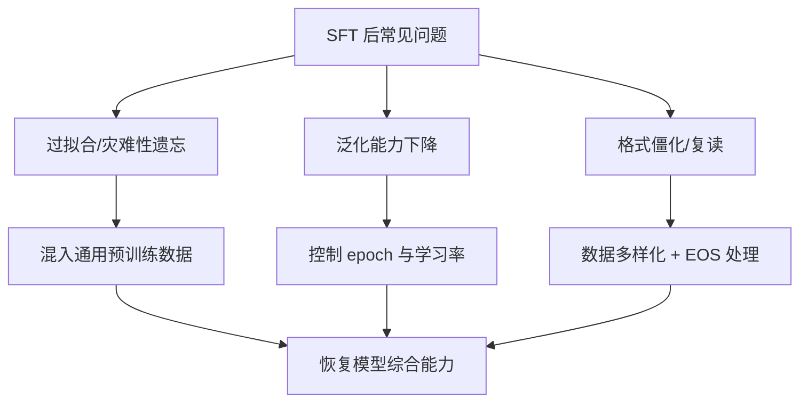

# SFT(监督微调)后会出现哪些常见问题?如何缓解

- **SFT 后的五大问题:**

1. **过拟合**
- 模型在小数据集上过度拟合
- 缓解:数据增强、Dropout、早停、减小训练轮数

2. **灾难性遗忘**
- 忘记预训练知识
- 缓解:低学习率(2e-5)、LoRA(冻结主干)、混合预训练数据

3. **模型偏差增加**
- SFT 数据集的偏差被放大
- 缓解:数据均衡、多样化来源

4. **泛化能力下降**
- 只在 SFT 任务上表现好，其他任务退化
- 缓解:通用+领域混合训练、指令多样化

5. **鲁棒性降低**
- 对输入扰动敏感
- 缓解:对抗训练、输入增强

- **实战案例：**
在做垂直领域（如医疗问答）SFT 时，我们发现模型突然失去了基础的“写代码”能力。通过在训练集中混入 10% 的 StarCoder 数据（DPO/SFT 混合策略），才恢复了基础通用能力，避免了“学会看病忘了写字”的尴尬。

- **问题间的关系与缓解策略全景:**
```text
预训练模型 (基础能力)
     |
     v
[ SFT 微调过程 ] <---(数据质量/偏差)---> [ 1.偏差增加 ]
     |                                  |
     +----> [ 2.灾难性遗忘 ] <---------+ (数据分布偏移)
     |
     +----> [ 3.过拟合 ] <------------+ (数据量不足)
     |
     v
部署模型
     |
     +----> [ 4.泛化下降 ] (OOD能力弱)
     +----> [ 5.鲁棒性降低 ] (敏感度高)
```

- **代码示例 (数据混合策略):**
```python
from datasets import concatenate_datasets, load_dataset

# 1. 加载领域数据
_domain_ds = load_dataset("csv", data_files="medical_qa.csv")["train"]

# 2. 加载通用预训练数据用于抗遗忘
_general_ds = load_dataset("c4", "en", split="train[:10000]")

# 3. 混合策略: 90% 领域 + 10% 通用
mixed_ds = concatenate_datasets([
    _domain_ds.shuffle(seed=42).select(range(9000)),
    _general_ds.shuffle(seed=42).select(range(1000))
]).shuffle(seed=42) # 再次打散确保分布均匀
```

- **最佳实践:** LoRA微调 + 混合数据(领域20%+通用80%) + 低学习率 + 监控验证集 loss。针对遗忘问题，建议在 SFT 数据中混入约 5%-10% 的原始预训练 corpus 数据。

## 流程图



## 记忆要点

- 五大问题：过拟合、灾难性遗忘、偏差增加、泛化下降、鲁棒性降低
- 遗忘缓解：低学习率(2e-5)、LoRA冻结主干、混入10%通用数据
- 过拟合缓解：数据增强、Dropout、早停、减小训练轮数
- 偏差缓解：数据均衡、来源多样化，避免单一数据源主导


## 结构化回答

**30 秒电梯演讲：** SFT易导致过拟合、遗忘知识和泛化下降，需通过数据和控制缓解。——打个比方，考前突击（SFT）可能提高该科成绩，但可能忘掉其他科（遗忘），且不会变通（泛化差）。

**展开框架：**
1. **五大问题** — 过拟合、灾难性遗忘、偏差增加、泛化下降、鲁棒性降低
2. **遗忘缓解** — 低学习率(2e-5)、LoRA冻结主干、混入10%通用数据
3. **过拟合缓解** — 数据增强、Dropout、早停、减小训练轮数

**收尾：** 以上三点都能配合实战聊。我可以展开任一要点，比如「如何判断是否发生了灾难性遗忘」这类追问您感兴趣吗？

## 视频脚本

> 预计时长：2 分钟 | 由浅入深

| 时间 | 画面/字幕 | 口播台词 | 讲解要点 |
|------|----------|----------|----------|
| 0:00 | 标题卡 | "SFT(监督微调)后会出现哪些常见问题，30 秒讲清楚。" | 开场钩子 |
| 0:30 | 概念定义动画 | "一句话：SFT易导致过拟合、遗忘知识和泛化下降，需通过数据和控制缓解。" | 核心定义 |
| 1:00 | 五大问题图解 | "过拟合、灾难性遗忘、偏差增加、泛化下降、鲁棒性降低" | 五大问题 |
| 1:30 | 总结卡 | "记好这几条，面试不慌。下期见。" | 收尾 |
