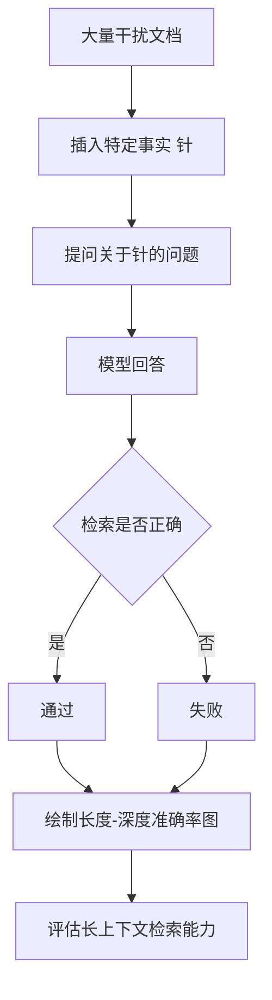

# 「大海捞针」测试是什么?它如何评估长上下文模型的检索能力

- **大海捞针测试:**
在超长上下文中插入一个特定事实（「针」），测试模型能否精准定位并回答关于该事实的问题。

- **实战案例:** 在开发RAG系统时，曾发现模型在检索到10篇相关文档后，若答案位于第5篇文档的中间段落（非首尾），模型准确率从95%暴跌至20%。这揭示了单纯增加上下文长度并不能解决检索失效问题，需要使用重排序优化输入文档顺序。

- **代码示例:**
```python
import random

def generate_needle_test(prompt, context_documents, needle_fact, depth_percent):
    # depth_percent: 0-100, needle position in context
    insert_idx = int(len(context_documents) * depth_percent / 100)
    context_documents.insert(insert_idx, needle_fact)
    full_context = "\n".join(context_documents)
    return f"Context:\n{full_context}\n\nQuestion: {prompt}"
```

- **测试流程:**
1. **构建语境**：准备一段长文本（如 100K tokens 的文档，通常由不同书籍/文章拼接而成）。  
2. **插入针**：在文本的特定位置（Depth %）插入一句关键信息（「针」）。
   - 例：「这本书的特别密码是 42-7-3，请记住它。」  
3. **提问**：Prompt 要求模型仅根据上下文回答问题。
   - 例：「请告诉我书中提到的特别密码是什么？」  
4. **变量控制**：遍历「针」的位置（0%, 10%, ... 100%）和总长度（4K, 8K, ... 128K）。  
5. **评估**：生成热力图，X轴为位置，Y轴为长度，颜色为准确率。

- **评估维度与热力图分析:**
```text
准确率
  1.0 |  #  #  #  #  #  #  #  #  #  #  (开头通常效果好)
      |  #  #  #  #  #  #  #  #  #  #
  0.5 |  .  .  .  .  .  .  .  .  .  .  (中间可能出现 "Lost in the Middle" U型谷)
      |  #  #  #  #  #  #  #  #  #  #
  0.0 +-----------------------------------> 位置 (Depth %)
       0%              50%           100%
```
- **深度:** 针在不同深度位置时的检索准确率。
- **长度:** 不同上下文长度下的表现（长度增加通常导致准确率下降）。
- **多针:** 插入多个针测试多跳检索能力。

- **常见现象:**
- **U型曲线:** 大多数模型在开头和结尾准确率高，中间位置准确率低。
- **突变点:** 某些模型在超过特定长度（如 32K）后性能断崖式下跌。

- **对比:** Claude/GPT-4 在 200K 上下文中，大部分位置能保持高准确率找回针；早期的开源模型（Llama 2 等）在 32K 以上中间位置开始显著下降。长文本模型（如 Yi-200K, Moonshot）的核心优化点即为拉平这个 U 型曲线。

## 流程图



## 记忆要点

- 定义：长上下文中插入特定事实(针)，测试模型精准检索回答能力
- 流程：构建长文->插入针->提问->遍历位置(0-100%)和长度->画热力图
- 现象：U型曲线，首尾准确率高，中间位置(Lost in Middle)准确率低
- 应用：评估长文本模型(如128k)的检索失效点，指导RAG重排序

## 结构化回答

**30 秒电梯演讲：** 在大量干扰信息中插入特定事实，测试模型检索并利用该信息的能力。——打个比方，在干草堆里藏一根针，让人把它找出来，测试眼光和耐心。

**展开框架：**
1. **定义** — 长上下文中插入特定事实(针)，测试模型精准检索回答能力
2. **流程** — 构建长文->插入针->提问->遍历位置(0-100%)和长度->画热力图
3. **现象** — U型曲线，首尾准确率高，中间位置(Lost in Middle)准确率低

**收尾：** 以上三点都能配合实战聊。我可以展开任一要点，比如「如何缓解Lost in the Middle」这类追问您感兴趣吗？

## 视频脚本

> 预计时长：2 分钟 | 由浅入深

| 时间 | 画面/字幕 | 口播台词 | 讲解要点 |
|------|----------|----------|----------|
| 0:00 | 标题卡 | "「大海捞针」测试是什么，30 秒讲清楚。" | 开场钩子 |
| 0:30 | 概念定义动画 | "一句话：在大量干扰信息中插入特定事实，测试模型检索并利用该信息的能力。" | 核心定义 |
| 1:00 | 定义图解 | "长上下文中插入特定事实(针)，测试模型精准检索回答能力" | 定义 |
| 1:30 | 总结卡 | "记好这几条，面试不慌。下期见。" | 收尾 |

### 视频流程图


---

## 延伸：什么是长上下文窗口中的“大海捞针”测试？它主要评估模型的什么能力？

> 合并自 `tr5-008`（相似度 67%）

"大海捞针" 测试是评估大模型长上下文处理能力的一种基准测试方法。其核心机制是：在一个非常长的上下文文档（通常从 4k 到 128k Token 甚至更长）中，随机插入一个与上下文其他内容无关的特定句子（即“针”），然后要求模型根据这个特定句子回答问题。该测试主要评估模型在极长文本中的信息检索能力和抗干扰能力。具体来说，它考察模型是否能在海量无关信息的干扰下，精准定位并记住关键信息，而不受上下文长度增加导致的信息遗忘或中间迷失的影响。这是衡量 RAG 系统或长文档分析模型性能的关键指标，因为在实际应用中，关键信息往往埋藏在大量噪音文本中。

## 记忆要点

- 一句话定义：在长文本（4k-128k+）中随机插入无关特定句（针），测试模型能否精准提取。
- 核心评估两大能力：极长文本的「信息检索能力」与「抗干扰能力」。
- 主要对抗痛点：解决大模型因上下文过长导致的「信息遗忘」或「中间迷失」问题。

## 结构化回答

**30 秒电梯演讲：** 在长文本噪音中精准检索关键信息的能力测试。——打个比方，就像在万页书中找到夹的一张小纸条。

**展开框架：**
1. **一句话定义** — 在长文本（4k-128k+）中随机插入无关特定句（针），测试模型能否精准提取。
2. **核心评估两大能力** — 极长文本的「信息检索能力」与「抗干扰能力」。
3. **主要对抗痛点** — 解决大模型因上下文过长导致的「信息遗忘」或「中间迷失」问题。

**收尾：** 以上三点都能配合实战聊。您想深入聊哪一块？

## 视频脚本

> 预计时长：2 分钟 | 由浅入深

| 时间 | 画面/字幕 | 口播台词 | 讲解要点 |
|------|----------|----------|----------|
| 0:00 | 标题卡 | "长上下文窗口中的“大海捞针”测试，30 秒讲清楚。" | 开场钩子 |
| 0:30 | 概念定义动画 | "一句话：在长文本噪音中精准检索关键信息的能力测试。" | 核心定义 |
| 1:00 | 一句话定义图解 | "在长文本（4k-128k+）中随机插入无关特定句（针），测试模型能否精准提取。" | 一句话定义 |
| 1:30 | 总结卡 | "记好这几条，面试不慌。下期见。" | 收尾 |
