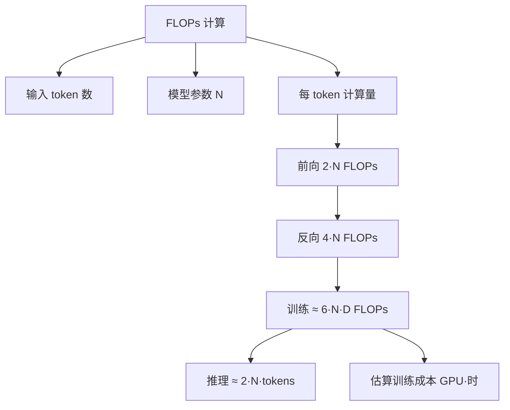

# FLOPs计算

- **FLOPs定义**: 浮点运算次数，衡量计算量，区别于 FLOPS (Floating Point Operations Per Second, 每秒运算次数/吞吐量)。

- **实战案例:** 在优化推理服务时，通过计算FLOPs发现瓶颈主要在Attention层的$O(N^2)$计算上，而非MLP层。这指导我们采用了FlashAttention优化而非立即进行层剪枝，从而在不改变模型精度的前提下提升了30%的吞吐量。

- **计算公式**: 输入 $(M, N)$ 和 $(N, L)$ 的矩阵乘法需 $2MNL$ 次运算 (乘法+加法)。
  - *补充细节*: MAC (Multiply-Accumulate) 操作通常被视为 1 个 FLOP 还是 2 个 FLOP 取决于定义，深度学习领域通常计为 2 次浮点运算。

- **Transformer各模块计算 (Batch=b, Seq=s, Hidden=h)**:
  - **Embedding**: 查表操作，不计FLOPs (但在推理中影响显存带宽)。
  - **Self-Attention**:
    - QKV映射: $3 \times 2bsh^2$ (注意输入已经是 $h$ 维)。
    - Attention Score ($QK^T$): $2bs^2h$ (这里是 $s^2$ 而非 $h^2$，原答案有误，已修正)。
    - Score乘V: $2bs^2h$。
    - Output映射: $2bsh^2$。
  - **MLP**:
    - 升维 ($h \to 4h$): $8bsh^2$。
    - 降维 ($4h \to h$): $8bsh^2$。
  - **Output层**: Logits映射 $2bshV$ (V为词表大小)。

- **单层总FLOPs**: $24bsh^2 + 4bs^2h + 2bshV$。
  - *补充细节*: 当序列长度 $s$ 较大时，Attention 的计算复杂度 $O(s^2)$ 会成为瓶颈。

- **训练与推理显存 (参数量$\phi$)**:
  - **训练**: 需存FP16参数、梯度、FP32优化器状态、FP32参数副本。约 $20\phi$ 字节 (忽略FP32梯度)。
  - **推理**: 仅存FP16参数及KV Cache。

- **激活值显存 (FP16)**:
  - Attention块: 约 $11bsh + 5bsh^2$ (含Dropout mask等)。
  - MLP块: 约 $19bsh$。
  - LN: 约 $4bsh$。
  - **总激活**: $L \times (34bsh + 5bsh^2)$ (L为层数)。

- **KV Cache**:
  - 存储Prefill阶段计算的K, V用于Decoding。
  - 显存占用: $2 \times b(s+n)h \times L \times 2$ 字节 (FP16, n为生成长度)。
  - *补充细节*: 多轮对话中，KV Cache 会随着生成长度 $n$ 线性增长，是长文本推理显存瓶颈的主要来源。

## 常见考点
1. **Mac vs FLOPs**: 常被问到 MAC (乘加累加) 计数与 FLOPs 的关系（通常 1 MAC = 2 FLOPs）。
2. **KV Cache 显存优化**: 如何减少 KV Cache 占用（如 FlashAttention、INT8 量化、Multi-Query Attention/Grouped-Query Attention）。
3. **计算/通信比**: 在分布式训练中，如何根据 FLOPs 和参数量计算通信瓶颈。
4. **LoRA 微调显存**: 相比全量微调，LoRA 如何减少训练显存占用（主要减少了优化器状态和梯度的存储）。

## 技术原理

FLOPs（Floating Point Operations，注意小写 s）是衡量**模型计算复杂度的总量指标**，与硬件无关；FLOPS（每秒浮点运算次数）是硬件吞吐量。混淆这两个概念是面试高频错误点。

- **矩阵乘法的 FLOPs 推导**：矩阵 `(M,N) @ (N,L)` 得到 `(M,L)`，每个输出元素需要 N 次乘法 + (N-1) 次加法 ≈ 2N 次浮点运算。共 M*L 个输出元素，总 FLOPs = 2MNL。深度学习硬件（GPU/TPU）的 FMA 指令把"乘加"合并成 MAC（Multiply-Accumulate），硬件报告 1 MAC，但算法层计 2 FLOPs。所以 A100 的 312 TFLOPS = 156 TMACS。
- **Transformer 各模块 FLOPs 推导（Batch=b, Seq=s, Hidden=h, 词表=V, 层数=L）**：
  - **Attention QKV 投影**：3 次矩阵乘 `(b,s,h)@(h,h)` = 3 × 2bsh² = 6bsh² FLOPs
  - **Attention Score (Q@K^T)**：`(b,s,h)@(h,s)` = 2bs²h（注意是 s² 而非 h²，这是序列长度敏感的根因）
  - **Score@V**：`(b,s,s)@(s,h)` = 2bs²h
  - **Output 投影**：`2bsh²`
  - **MLP（升维 h→4h + 降维 4h→h）**：2 × 2bs(h)(4h) = 16bsh²
  - **单层总和**：约 `24bsh² + 4bs²h`
  - **关键观察**：当 `s < 6h`（如 GPT-3 h=12288，s<73K），MLP 项主导；当 `s > 6h`，Attention 的 s² 项主导。所以长上下文模型（32K/128K）的瓶颈在 Attention，必须用 FlashAttention。
- **训练显存的 20× 法则**：7B 模型训练显存约 140GB（20 × 7B），由 FP16 参数（14GB）+ FP16 梯度（14GB）+ FP32 Adam 优化器状态（m+v 共 56GB）+ FP32 主权重（28GB）组成。这是 ZeRO/PPO 必须分片的主因。
- **KV Cache 的显存线性增长**：每生成 1 token，每层都要存 K、V 两个向量。总显存 = 2 × L × (s+n) × h × 2 bytes（FP16）。Llama-7B（L=32, h=4096）跑 4K 上下文，KV Cache 约 2GB——和参数本身相当。这是长文本推理的最大瓶颈，催生了 PagedAttention、GQA、KV 量化等技术。

## 代码示例

```python
# 1. 计算 Transformer 模型的 FLOPs（输入形状推导）
def transformer_flops(batch, seq, hidden, vocab, num_layers, causal=True):
    """估算 Transformer 单次前向 FLOPs（不含反向，反向约 2× 前向）"""
    b, s, h, V, L = batch, seq, hidden, vocab, num_layers

    # Attention（QKV投影 + QK^T + softmax*V + output投影）
    qkv_proj = 4 * 2 * b * s * h * h          # 4 次 (h,h) 矩阵乘
    attn_scores = 2 * b * s * s * h            # Q @ K^T
    attn_value = 2 * b * s * s * h             # score @ V
    attn = qkv_proj + attn_scores + attn_value

    # MLP（升维 + 降维，激活函数额外开销忽略）
    mlp = 2 * 2 * b * s * h * (4 * h)          # 2 次 (h, 4h) 矩阵乘

    # 每层 + LM Head
    per_layer = attn + mlp
    lm_head = 2 * b * s * h * V

    forward = L * per_layer + lm_head
    return forward

# Llama-7B 估算（h=4096, L=32, V=32000, s=2048, b=1）
flops = transformer_flops(1, 2048, 4096, 32000, 32)
print(f"Llama-7B 单次前向: {flops/1e12:.2f} TFLOPs")
# 约 1.4 TFLOPs，A100 (312 TFLOPS FP16) 理论 ~0.005s，实际 ~0.05s（MFU ~10%）
```

```python
# 2. 训练显存估算（混合精度 + AdamW）
def train_memory(params_billion, optimizer="adam", precision="fp16"):
    """估算训练显存（GB），返回各组件占比"""
    P = params_billion * 1e9
    bytes_per_elem = 2 if precision == "fp16" else 4

    # FP16 参数 + FP16 梯度
    params_mem = P * bytes_per_elem / 1e9
    grad_mem = P * bytes_per_elem / 1e9

    # FP32 优化器状态（Adam 的 m、v）+ FP32 主权重
    if optimizer == "adam":
        optim_mem = P * 4 * 2 / 1e9   # m + v
        master_mem = P * 4 / 1e9      # FP32 参数副本
    else:
        optim_mem = 0
        master_mem = 0

    total = params_mem + grad_mem + optim_mem + master_mem
    return {
        "params_GB": params_mem,
        "grad_GB": grad_mem,
        "optim_GB": optim_mem,
        "master_GB": master_mem,
        "total_GB": total,
        "ratio": total / params_mem,
    }

# 7B 模型训练显存估算
print(train_memory(7))
# {'params_GB': 14.0, 'grad_GB': 14.0, 'optim_GB': 56.0, 'master_GB': 28.0,
#  'total_GB': 112.0, 'ratio': 8.0}
# 加上激活值（按序列长度），实际约 140-160GB（符合 20× 法则）
```

```python
# 3. KV Cache 显存估算
def kv_cache_memory(seq_len, num_layers, hidden, num_heads, kv_heads,
                    batch=1, precision="fp16"):
    """计算 KV Cache 显存（GB）"""
    bytes_per_elem = 2 if precision == "fp16" else 1
    # GQA: kv_heads 个 head，每个 head 维度 = hidden / num_heads
    head_dim = hidden // num_heads
    # 每层每 token 的 KV 字节数
    per_token_per_layer = 2 * kv_heads * head_dim * bytes_per_elem   # K + V
    # 总 KV Cache
    total_bytes = batch * seq_len * num_layers * per_token_per_layer
    return total_bytes / 1e9

# Llama-7B：32 层，4096 hidden，32 heads，32 KV heads（MHA），4K 上下文
mha = kv_cache_memory(4096, 32, 4096, 32, 32)
print(f"MHA KV Cache: {mha:.2f} GB")
# 约 2.0 GB（与 7B 参数显存相当）

# 改用 GQA（8 个 KV head）：显存降到 1/4
gqa = kv_cache_memory(4096, 32, 4096, 32, 8)
print(f"GQA KV Cache: {gqa:.2f} GB")
# 约 0.5 GB
```

## 对比选型

| 维度 | 全精度（FP32） | FP16 混合精度 | BF16 | INT8 量化 |
| :--- | :--- | :--- | :--- | :--- |
| **每元素字节数** | 4 | 2 | 2 | 1 |
| **训练显存（参数）** | 4× params | 2× params | 2× params | 不用于训练 |
| **FLOPS（同硬件）** | 基准 | 2-4× | 2-4× | 4-8× |
| **数值范围** | 大 | 小（易溢出） | 大（同 FP32 范围） | 小（需校准）|
| **精度损失** | 0 | <0.5% | <0.5% | 1-3% |
| **适用阶段** | 早期训练 | 主流训练 | 大模型训练 | 推理 |

## 常见坑

- **FLOPs vs FLOPS 混淆**：FLOPs 是总量（模型复杂度），FLOPS 是吞吐（硬件性能）。"GPT-3 训练需要 3.14e23 FLOPs" vs "A100 提供 312 TFLOPS"——前者是计算量，后者是每秒处理量。
- **MAC 计数因厂商而异**：NVIDIA 报 TFLOPS 通常按 1 MAC=2 FLOPs 换算，TPU 文档可能直接报 TMACS。对比硬件时先统一单位。
- **忽略激活值显存**：训练显存不只参数，激活值随序列长度平方增长（attention 矩阵 bs²）。激活检查点（Gradient Checkpointing）用时间换显存，长序列训练必开。
- **推理 FLOPs 与实际延迟脱钩**：FLOPs 是计算量，实际延迟还受内存带宽（memory-bound）影响。Llama-7B 在 A100 上推理是 memory-bound，FLOPs 利用率（MFU）只有 30-40%，加 batch 提升吞吐更有效而非减 FLOPs。
- **KV Cache 显存易超预期**：7B 模型跑 4K 上下文，KV Cache 2GB——超过很多人直觉。多用户并发时 N × 2GB 直接撑爆 GPU，这是 PagedAttention 要解决的核心问题。
- **LoRA 显存节省的是优化器**：LoRA 冻结原参数，只训练低秩矩阵（参数量 1%）。显存省在优化器状态和梯度（按 LoRA 参数算），但激活值仍按全模型算——所以长序列 LoRA 训练仍可能 OOM。

## 流程图




## 记忆要点

- FLOPs定义：浮点运算次数，区别于FLOPS(每秒吞吐量)，1 MAC=2 FLOPs
- 矩阵乘法：输入(M,N)*(N,L)计算量为2MNL(乘加各一次)
- Transformer瓶颈：Attention层O(S^2)，序列长时计算量激增
- 显存：训练约20倍参数量，推理KV Cache随生成长度线性增长


## 结构化回答

**30 秒电梯演讲：** 量化模型训练或推理过程中的浮点运算次数，用于衡量计算成本。——打个比方，像数搬砖的次数，不管砖多大，搬一次算一次。

**展开框架：**
1. **FLOPs定义** — 浮点运算次数，区别于FLOPS(每秒吞吐量)，1 MAC=2 FLOPs
2. **矩阵乘法** — 输入(M,N)*(N,L)计算量为2MNL(乘加各一次)
3. **Transfor** — Transformer瓶颈：Attention层O(S^2)，序列长时计算量激增

**收尾：** 以上三点都能配合实战聊。您想深入聊哪一块？

## 视频脚本

> 预计时长：4 分钟 | 由浅入深

| 时间 | 画面/字幕 | 口播台词 | 讲解要点 |
|------|----------|----------|----------|
| 0:00 | 标题卡 | "FLOPs计算，30 秒讲清楚。" | 开场钩子 |
| 0:40 | 概念定义动画 | "一句话：量化模型训练或推理过程中的浮点运算次数，用于衡量计算成本。" | 核心定义 |
| 1:20 | FLOPs定义图解 | "浮点运算次数，区别于FLOPS(每秒吞吐量)，1 MAC=2 FLOPs" | FLOPs定义 |
| 2:00 | 矩阵乘法图解 | "输入(M,N)*(N,L)计算量为2MNL(乘加各一次)" | 矩阵乘法 |
| 2:40 | 要点图解 | "Transformer瓶颈：Attention层O(S^2)，序列长时计算量激增" | 要点 |
| 3:20 | 总结卡 | "记好这几条，面试不慌。下期见。" | 收尾 |
