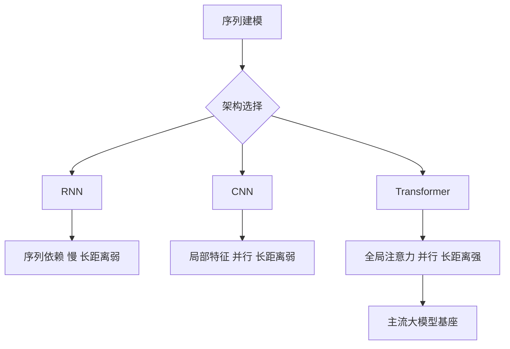

# RNN/CNN/Transformer对比

- **RNN**:
  - **结构**: 线性序列，依赖前序状态 ($h_t = f(h_{t-1}, x_t)$)。
  - **缺点**: 长序列反向传播易梯度消失/爆炸（即使有 LSTM/GRU 缓解，并行能力仍受限）；难以并行训练。

- **CNN**:
  - **结构**: 局部感受野，保留相对位置。
  - **优点**: 并行能力强，优于RNN。
  - **缺点**: 长距离特征捕获能力弱于Transformer和RNN（需要堆叠多层或使用大 Kernel 扩大感受野）。

- **Transformer**:
  - **结构**: 自注意力机制，全局建模 ($Attention(Q,K,V)$)。
  - **优点**: 并行性强（序列长度维并行），长距离捕获能力优秀（任意两 token 路径长度为 1），综合效果最佳。

- **实战案例:** 在处理时间序列预测（如工业传感器数据）时，发现Transformer虽然精度高，但推理延迟是TCN（时间卷积网络）的10倍。最终在长历史依赖场景选用Transformer，而在高频实时边缘端节点采用了轻量化CNN模型进行替换。

- **对比表格:**

| 特性 | RNN (LSTM/GRU) | CNN (TCN/Conv1D) | Transformer |
| :--- | :--- | :--- | :--- |
| **并行计算能力** | 差 (需等待t-1时刻) | 优 (所有位置并行) | 优 (所有位置并行) |
| **长距离依赖** | 中等 (受限于梯度传播) | 差 (受限于感受野/层数) | 优 (任意两步距离为1) |
| **计算复杂度** | O(L) | O(k*L) (k为核大小) | O(L²) |
| **位置信息** | 隐式 (时间顺序) | 显式 (局部相对位置) | 需显式编码 |
| **主要应用场景** | 语音、短文本 | NLP分类、CV、时序 | 机器翻译、大模型 |

- **交叉熵**:
  - **公式**:
    - 二分类: $L = -[y \log(\hat{y}) + (1-y) \log(1-\hat{y})]$
    - 多分类: $L = -\sum y \log(\hat{y})$
  - **求导**: $\frac{\partial L}{\partial \hat{y}} = -[\frac{y}{\hat{y}} - \frac{1-y}{1-\hat{y}}]$ (链式法则结合Sigmoid导数)。

- **代码实现 (二分类)**:
```python
def binary_cross_entropy_loss(y_pred, y_true):
    y_pred = torch.sigmoid(y_pred)
    y_pred = torch.clamp(y_pred, 1e-7, 1.0 - 1e-7)
    return - (y_true * torch.log(y_pred) + (1 - y_true) * torch.log(1 - y_pred)).mean()
```

## 常见考点
1. **Transformer 复杂度**: Attention 为何是 $O(N^2)$？如何优化（线性 Attention、FlashAttention）？
2. **位置编码**: RNN/CNN 如何隐式包含位置信息？Transformer 为何需要显式位置编码（Sinusoidal/RoPE）？
3. **梯度消失**: RNN 相比 Transformer 更容易出现梯度消失的具体原因（长时间步的矩阵连乘）。

## 流程图




## 记忆要点

- RNN：串行难并行，长距梯度消失，适合语音/短时序
- CNN：并行强，局部感受野，长距捕获弱，需堆叠层或大Kernel
- Transformer：全局Attention，并行强，长距依赖优，计算复杂度O(L^2)
- 对比：RNN/CNN隐式含位置，Transformer需显式位置编码


## 结构化回答

**30 秒电梯演讲：** RNN重序列但慢，CNN重局部且并行，Transformer重全局且高效。——打个比方，RNN像接力跑(一人传一人)，CNN像多人分工看局部拼图，Transformer像圆桌会议每个人直接看所有人。

**展开框架：**
1. **RNN** — 串行难并行，长距梯度消失，适合语音/短时序
2. **CNN** — 并行强，局部感受野，长距捕获弱，需堆叠层或大Kernel
3. **Transfor** — Transformer：全局Attention，并行强，长距依赖优，计算复杂度O(L^2)

**收尾：** 以上三点都能配合实战聊。您想深入聊哪一块？

## 视频脚本

> 预计时长：4 分钟 | 由浅入深

| 时间 | 画面/字幕 | 口播台词 | 讲解要点 |
|------|----------|----------|----------|
| 0:00 | 标题卡 | "RNN/CNN/Transformer对比，30 秒讲清楚。" | 开场钩子 |
| 0:40 | 概念定义动画 | "一句话：RNN重序列但慢，CNN重局部且并行，Transformer重全局且高效。" | 核心定义 |
| 1:20 | RNN图解 | "串行难并行，长距梯度消失，适合语音/短时序" | RNN |
| 2:00 | CNN图解 | "并行强，局部感受野，长距捕获弱，需堆叠层或大Kernel" | CNN |
| 2:40 | Transformer图解 | "全局Attention，并行强，长距依赖优，计算复杂度O(L^2)" | Transformer |
| 3:20 | 总结卡 | "记好这几条，面试不慌。下期见。" | 收尾 |
