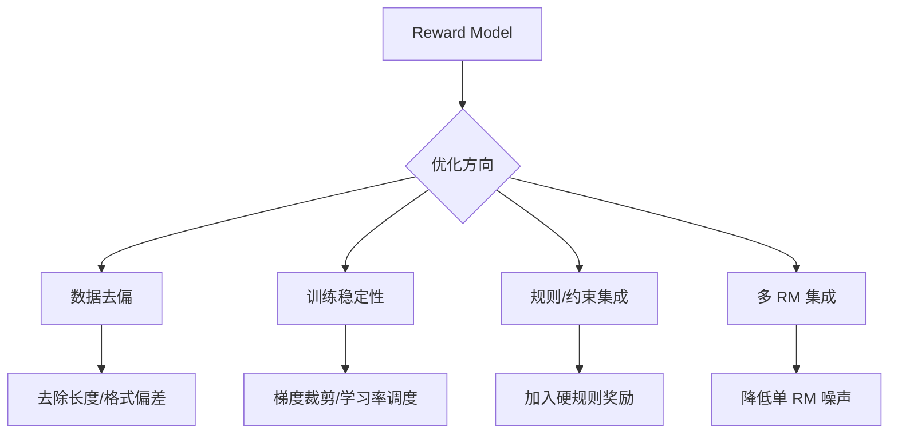

# Reward Model有什么优化的方法吗

- **奖励模型 (RM) 优化方法**:

  - **减少长度偏差**:
    - **问题**: 人类偏好较长回复，导致RM过拟合长度而非质量。
    - **方案**: 按 Chosen/Rejected 长度差分桶，平衡桶内样本（使两类数据长度差分布一致），降低模型对长度特征的依赖。

  - **提升训练稳定性**:
    - **问题**: 奖励分数波动大导致训练不稳定。
    - **方案**: 引入 L2 正则化，约束奖励分数分布的波动范围。
      $$ L_{total} = L_{RM} + \lambda \cdot ||r||^2 $$

  - **基于规则的奖励**:
    - **场景**: 数学、代码等有明确客观答案的任务。
    - **方案**: 直接使用规则（编译器、测试用例）计算奖励，替代或辅助RM，防止Reward Hacking。

  - **利用 CoT 降低 Hack**:
    - **方法**: 在训练数据中包含得出奖励的思维链，帮助RM理解奖励来源，减少表面特征 exploitation。

  - **模型集成**:
    - **目的**: 降低RM方差，缓解 Policy 过度优化错误 RM。
    - **策略**:
      - **Mean**: 均值集成。
      - **Worst-Case**: 取最小值，保守策略。
      - **Uncertainty-Weighted**: 结合均值与方差，惩罚高不确定性样本。
  - **实战案例**: 训练代码生成RM时，发现模型只关注代码格式是否正确（缩进、语法），而非逻辑是否通过测试。引入基于测试用例的Pass@k作为硬约束或额外特征后，效果显著提升。
  - **代码示例**:
```python
def loss_rm(logits, chosen_idx, rejected_idx, length_norm=True):
    # 计算 Chosen 和 Rejected 的 log_prob
    chosen_logit = logits[torch.arange(len(chosen_idx)), chosen_idx]
    rejected_logit = logits[torch.arange(len(rejected_idx)), rejected_idx]
    
    # 计算交叉熵损失差异 (Batch Pairwise Loss)
    loss = -torch.log(torch.sigmoid(chosen_logit - rejected_logit)).mean()
    
    # 长度偏差校正示例：根据长度差反向加权
    # if length_norm: loss = apply_length_norm(loss, ...)
    return loss

## 技术原理

**通过长度分桶平衡数据，消除模型对长度的偏见**
人类标注偏好倾向于给更长的回复打高分（"看起来更用心"），导致 RM 过拟合长度特征而非内容质量。优化方法：按 Chosen 和 Rejected 的长度差分桶，在每个桶内平衡正负样本（让长短回复的分布一致），迫使 RM 关注内容本身而非长度。这是 InstructGPT 论文中明确提到的去偏手段。

**加入 L2 正则化稳定奖励分数的输出**
RM 训练中奖励分数容易剧烈波动，导致 PPO 阶段策略不稳定。引入 L2 正则化约束奖励值的范数：`L_total = L_RM + λ·||r||²`，限制分数的绝对值幅度，防止 RM 对某些样本给出极端高分/低分，提升训练稳定性。

**对有标准答案的任务采用规则奖励替代模型**
对于数学、代码等有客观评判标准的任务，用规则（编译器、单元测试、Pass@k）直接计算奖励，替代 RM 的主观打分。这样能彻底杜绝 Reward Hacking（模型学会欺骗 RM 拿高分但实际答案错误），因为规则是客观且不可欺骗的。

**集成多个 RM 或引入不确定性加权以降低方差**
单一 RM 的方差大、容易过拟合。集成多个 RM 取均值（Mean）或最小值（Worst-Case）能降低方差，缓解 Policy 过度优化某个错误 RM 的问题。更高级的做法是结合均值与方差的不确定性加权，对高不确定样本降低权重。

## 代码示例

```python
# 1. 长度分桶去偏（数据预处理）
def length_balanced_sampling(pairs, num_buckets=10):
    # pairs: [(chosen, rejected), ...]
    diffs = [len(c) - len(r) for c, r in pairs]
    # 按长度差分桶
    buckets = np.histogram(diffs, bins=num_buckets)[1]
    bucket_idx = np.digitize(diffs, buckets)
    # 每个桶内平衡正负样本数量
    balanced = []
    for b in range(num_buckets):
        samples = [p for p, i in zip(pairs, bucket_idx) if i == b]
        balanced.extend(resample(samples, n_samples=target_per_bucket))
    return balanced
```

```python
# 2. RM 损失函数：Pairwise Loss + L2 正则
import torch
import torch.nn.functional as F

def reward_model_loss(chosen_rewards, rejected_rewards, lam=0.001):
    # Bradley-Terry pairwise loss
    loss = -F.logsigmoid(chosen_rewards - rejected_rewards).mean()
    # L2 正则：约束奖励分数幅度
    l2_reg = lam * (chosen_rewards.pow(2).mean() +
                    rejected_rewards.pow(2).mean())
    return loss + l2_reg
```

## 注意事项

- 长度偏差：按长度差分桶平衡样本，防止 RM 过拟合长度而非质量。
- 稳定性：引入 L2 正则化约束奖励分数波动，防止训练震荡。
- 规则奖励：数学代码等客观任务，直接用测试用例或编译器结果替代 RM。
- 模型集成：取均值或最小值降低方差，缓解 Policy 过度优化错误 RM。
- 用 CoT（思维链）数据训练 RM，让其理解奖励来源，减少对表面特征的 exploitation。

## 流程图




## 记忆要点

- 长度偏差：按长度差分桶平衡样本，防止RM过拟合长度而非质量。
- 稳定性：引入L2正则化约束奖励分数波动，防止训练震荡。
- 规则奖励：数学代码等客观任务，直接用测试用例或编译器结果替代RM。
- 模型集成：取均值或最小值降低方差，缓解Policy过度优化错误RM。


## 结构化回答

**30 秒电梯演讲：** 通过去偏、稳定训练和规则集成等手段提升奖励模型的准确性和鲁棒性。——打个比方，像请多个老师给试卷打分，去掉最高最低分，或者用标准答案机辅助阅卷，防止评分不公。

**展开框架：**
1. **长度偏差** — 按长度差分桶平衡样本，防止RM过拟合长度而非质量。
2. **稳定性** — 引入L2正则化约束奖励分数波动，防止训练震荡。
3. **规则奖励** — 数学代码等客观任务，直接用测试用例或编译器结果替代RM。

**收尾：** 以上三点都能配合实战聊。我可以展开任一要点，比如「奖励模型训练中如何处理标注者分歧」这类追问您感兴趣吗？

## 视频脚本

> 预计时长：2 分钟 | 由浅入深

| 时间 | 画面/字幕 | 口播台词 | 讲解要点 |
|------|----------|----------|----------|
| 0:00 | 标题卡 | "Reward Model有什么优化的方法吗，30 秒讲清楚。" | 开场钩子 |
| 0:30 | 概念定义动画 | "一句话：通过去偏、稳定训练和规则集成等手段提升奖励模型的准确性和鲁棒性。" | 核心定义 |
| 1:00 | 长度偏差图解 | "按长度差分桶平衡样本，防止RM过拟合长度而非质量。" | 长度偏差 |
| 1:30 | 总结卡 | "记好这几条，面试不慌。下期见。" | 收尾 |
