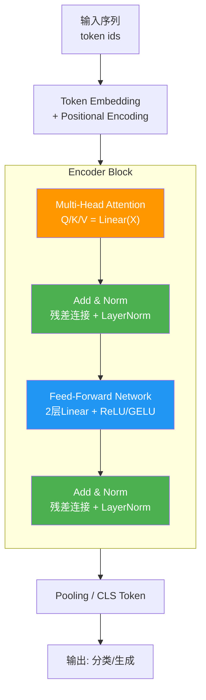

# RoPE旋转位置编码手撕

### RoPE 旋转位置编码原理及实现

RoPE (Rotary Positional Embedding) 通过绝对位置编码实现相对位置感知。其核心思想是将 query 和 key 向量通过旋转矩阵进行旋转，旋转角度由位置索引决定。

#### 1. 数学原理（复数形式）
在二维情况下，对于向量 $q$，RoPE 的形式如下：
$$ f(q, m) = (\|q\| e^{i\theta(q)}) e^{im\theta} = \|q\| e^{i(\theta(q) + m\theta)} $$
这就相当于在复平面上将向量 $q$ 旋转 $m\theta$ 角度。在 $d$ 维空间中，将向量维度两两分组，分别进行旋转。

#### 2. Llama3 实现代码

```python
import torch

def precompute_freqs_cis(dim: int, end: int, theta: float = 10000.0):
    """
    预计算旋转位置嵌入的频率
    返回: (end, dim // 2) 的 complex64 tensor
    """
    # 计算频率: theta^(-2i/d)
    freqs = 1.0 / (theta ** (torch.arange(0, dim, 2)[: (dim // 2)].float() / dim))
    # 生成时间步 t = [0, 1, ..., end-1]
    t = torch.arange(end, device=freqs.device, dtype=torch.float32)
    # 计算外积: freqs = t * freqs
    freqs = torch.outer(t, freqs)
    # 转换为复数形式: e^(i * freqs) = cos(freqs) + i*sin(freqs)
    freqs_cis = torch.polar(torch.ones_like(freqs), freqs)
    return freqs_cis

def reshape_for_broadcast(freqs_cis, x):
    """调整频率张量的形状以便广播"""
    ndim = x.ndim
    assert 0 <= 1 < ndim
    assert freqs_cis.shape == (x.shape[1], x.shape[-1])
    shape = [d if i == 1 or i == ndim - 1 else 1 for i, d in enumerate(x.shape)]
    return freqs_cis.view(*shape)

def apply_rotary_emb(xq, xk, freqs_cis):
    """应用 RoPE 到 Query 和 Key"""
    # 将实数对 转换为复数 a+bi
    # xq shape: [batch, seq_len, n_heads, head_dim]
    xq_ = torch.view_as_complex(xq.float().reshape(*xq.shape[:-1], -1, 2))
    xk_ = torch.view_as_complex(xk.float().reshape(*xk.shape[:-1], -1, 2))
    
    freqs_cis = reshape_for_broadcast(freqs_cis, xq_)
    
    # 复数相乘即旋转，然后转回实数
    xq_out = torch.view_as_real(xq_ * freqs_cis).flatten(-2)
    xk_out = torch.view_as_real(xk_ * freqs_cis).flatten(-2)
    
    return xq_out.type_as(xq), xk_out.type_as(xk)
```

#### 3. 关键函数解析

*   **`torch.outer(t, freqs)`**: 计算向量 $t$ 和 $freqs$ 的外积，生成形状为 `(len(t), len(freqs))` 的矩阵，表示每个时间步对应的各个维度的旋转角度。
*   **`torch.polar(abs, angle)`**: 根据模长和角度生成复数。这里 `abs=1`，`angle=freqs`，生成 $e^{i\cdot angle}$。
*   **`torch.view_as_complex`**: RoPE 的加速核心，将向量两两组合进行复数乘法，比显式构造旋转矩阵计算快得多。

#### 4. 实战与优化
*   **实战案例**: 在处理超长文本（如100k context）时，预计算`freqs_cis`可能占用大量显存。实践中常在推理时动态计算当前段的RoPE，或使用线性缩放（NTK-aware scaling）来外推到训练长度之外的位置。
*   **代码示例 (推理阶段动态取片段)**:
```python
# 推理时，freqs_cis 通常预计算到最大长度 (max_seq_len)
# 为了避免显存浪费或支持动态长度，只需切片取当前位置对应的编码
def apply_rotary_emb_inference(xq, xk, freqs_cis_cache, start_pos):
    # xq shape: [bsz, 1, n_heads, head_dim] (单步推理)
    # 仅取当前 start_pos 对应的旋转角度
    freqs_cis = freqs_cis_cache[start_pos] # (dim // 2)
    # 广播到对应维度进行复数乘法
    # ... (后续复数旋转逻辑同上)
    return xq_out, xk_out
```


## 核心流程图



## 记忆要点

- 原理：通过绝对位置编码的旋转实现相对位置感知，复数乘法即向量旋转。
- 公式：$f(q,m) = \|q\| e^{i(\theta(q) + m\theta)}$，维度两两分组旋转。
- 实现：预计算freqs_cis（复数形式），推理时与q、k复数相乘再转回实数。
- 优化：利用torch.view_as_complex加速，推理时切片取当前编码节省显存。


## 结构化回答

**30 秒电梯演讲：** 通过绝对位置的旋转变换，让Attention具备相对位置感知能力。——打个比方，就像在向量空间中，根据词语在句子中的位置，对它的指向做不同角度的旋转，位置相邻的词旋转角度相近。

**展开框架：**
1. **原理** — 通过绝对位置编码的旋转实现相对位置感知，复数乘法即向量旋转。
2. **公式** — $f(q,m) = \|q\| e^{i(\theta(q) + m\theta)}$，维度两两分组旋转。
3. **实现** — 预计算freqs_cis（复数形式），推理时与q、k复数相乘再转回实数。

**收尾：** 以上三点都能配合实战聊。我可以展开任一要点，比如「CAS 存在什么问题？如何解决」这类追问您感兴趣吗？

## 视频脚本

> 预计时长：2 分钟 | 由浅入深

| 时间 | 画面/字幕 | 口播台词 | 讲解要点 |
|------|----------|----------|----------|
| 0:00 | 标题卡 | "RoPE旋转位置编码手撕，30 秒讲清楚。" | 开场钩子 |
| 0:30 | 概念定义动画 | "一句话：通过绝对位置的旋转变换，让Attention具备相对位置感知能力。" | 核心定义 |
| 1:00 | 原理图解 | "通过绝对位置编码的旋转实现相对位置感知，复数乘法即向量旋转。" | 原理 |
| 1:30 | 总结卡 | "记好这几条，面试不慌。下期见。" | 收尾 |

---

## 延伸：手撕RoPE

> 合并自 `llm-059`（相似度 78%）

RoPE 通过旋转矩阵将位置信息注入 Query 和 Key。其核心思想是将向量元素分组进行 2D 旋转。

```python
import torch
import torch.nn as nn
import math

def precompute_freqs_cis(dim: int, end: int, theta: float = 10000.0):
    """
    预计算频率的复数形式，效率更高
    dim: head 维度
    end: 最大序列长度
    theta: 基础频率
    """
    # 计算索引 i 对应的频率 theta_i
    freqs = 1.0 / (theta ** (torch.arange(0, dim, 2)[: (dim // 2)].float() / dim))
    # 生成位置索引 t
    t = torch.arange(end, device=freqs.device)  # type: ignore
    # 外积计算 freqs * t
    freqs = torch.outer(t, freqs).float()  # (end, dim/2)
    # 极坐标表示：复数 e^(i*theta) = cos(theta) + i*sin(theta)
    freqs_cis = torch.polar(torch.ones_like(freqs), freqs)  # (end, dim/2)
    return freqs_cis

def reshape_for_broadcast(freqs_cis: torch.Tensor, x: torch.Tensor):
    """
    调整 freqs_cis 的维度以便与 x 进行广播运算
    x: (batch, seq_len, head, head_dim) 或 (batch, head, seq_len, head_dim)
    """
    ndim = x.ndim
    assert 0 <= 1 < ndim
    assert freqs_cis.shape == (x.shape[1], x.shape[-1]), f"{freqs_cis.shape} vs {x.shape}"
    shape = [d if i == 1 or i == ndim - 1 else 1 for i, d in enumerate(x.shape)]
    return freqs_cis.view(*shape)

def apply_rotary_emb(
    xq: torch.Tensor,
    xk: torch.Tensor,
    freqs_cis: torch.Tensor,
) -> tuple[torch.Tensor, torch.Tensor]:
    """
    应用 RoPE
    xq, xk: (batch, seq_len, head, head_dim)
    """
    # 将实数向量视为复数
    xq_ = torch.view_as_complex(xq.float())
    xk_ = torch.view_as_complex(xk.float())
    
    # 广播复数旋转
    freqs_cis = reshape_for_broadcast(freqs_cis, xq_)
    xq_out = torch.view_as_real(xq_ * freqs_cis).flatten(-2)
    xk_out = torch.view_as_real(xk_ * freqs_cis).flatten(-2)
    return xq_out.type_as(xq), xk_out.type_as(xk)
```

### 实战案例
在实际推理加速中，使用 `torch.polar` 和复数乘法虽然代码简洁，但在某些特定硬件或旧版 PyTorch 上可能并非最优。为了极致性能，工业级实现（如 vLLM）通常会手动拆分实部和虚部计算，利用 `Fused` 算子融合 Cos/Sin 生成与旋转操作，减少 Kernel 启动开销。此外，需注意 `head_dim` 必须是偶数，若遇到奇数维度需进行 Padding。

### 常见考点
*   **复数形式 vs 实数矩阵**：为什么在实现中常使用复数乘法来代替 2x2 的实数旋转矩阵？效率提升了多少？
*   **外推性**：RoPE 在长度超过训练长度时为什么性能会下降？有哪些改进方法（如 NTK-aware scaling）？
*   **Q与K的关系**：为什么 RoPE 只旋转 Q 和 K，而不旋转 V？


## 核心流程图


## 记忆要点

- 核心思想：将位置信息通过旋转矩阵注入Query和Key
- 复数实现：将向量视为复数，乘以e^(iθ)实现2D旋转
- 分组旋转：两两元素一组进行旋转，保持向量模长不变
- 相对感知：利用旋转矩阵性质，天然具备相对位置感知能力
- 应用范围：仅旋转Q和K，Value不参与位置编码


## 结构化回答

**30 秒电梯演讲：** 通过旋转变换将位置信息注入向量，保持相对位置感知。——打个比方，RoPE 就像给向量的每个维度加上一个旋转的“角度标签”，角度随位置变化，让模型知道词之间的相对距离。

**展开框架：**
1. **核心思想** — 将位置信息通过旋转矩阵注入Query和Key
2. **复数实现** — 将向量视为复数，乘以e^(iθ)实现2D旋转
3. **分组旋转** — 两两元素一组进行旋转，保持向量模长不变

**收尾：** 以上三点都能配合实战聊。我可以展开任一要点，比如「什么是覆盖索引？有什么优势」这类追问您感兴趣吗？

## 视频脚本

> 预计时长：2 分钟 | 由浅入深

| 时间 | 画面/字幕 | 口播台词 | 讲解要点 |
|------|----------|----------|----------|
| 0:00 | 标题卡 | "手撕RoPE，30 秒讲清楚。" | 开场钩子 |
| 0:30 | 概念定义动画 | "一句话：通过旋转变换将位置信息注入向量，保持相对位置感知。" | 核心定义 |
| 1:00 | 核心思想图解 | "将位置信息通过旋转矩阵注入Query和Key" | 核心思想 |
| 1:30 | 总结卡 | "记好这几条，面试不慌。下期见。" | 收尾 |

---

## 延伸：RoPE旋转位置编码的原理是什么？

> 合并自 `slt2-004`（相似度 73%）

RoPE（Rotary Position Embedding）通过旋转矩阵将位置信息注入到Query和Key向量中。

**核心原理（几何视角）**：
在二维空间中，将向量按照其位置索引旋转一定角度。对于多维向量，将其两两分组视为复数，进行复数乘法旋转。两个token的Attention内积仅取决于它们的相对位置差（即角度差），实现了相对位置编码。

**数学公式**：
对于位置m的向量q，维度为d，将其分为d/2个二元组。对于第i个二元组 $(q_{2i}, q_{2i+1})$：
$$ q'_m = R(m, \theta_i) \cdot q_m $$
其中旋转矩阵 $R(m, \theta_i)$ 对应复数 $e^{im\theta_i}$ 的旋转。
$$ \begin{pmatrix} q'_{2i} \\ q'_{2i+1} \end{pmatrix} = \begin{pmatrix} \cos(m\theta_i) & -\sin(m\theta_i) \\ \sin(m\theta_i) & \cos(m\theta_i) \end{pmatrix} \begin{pmatrix} q_{2i} \\ q_{2i+1} \end{pmatrix} $$
这里 $\theta_i = 10000^{-2i/d}$ 是预设的频率。

**计算流程图**：
```text
Token at position m
  │
  ▼ Split into pairs (x, y)
  │
  ├──────────────────────────────┐
  │                              │
  ▼                              ▼
Compute Rotation Angle:       Compute Rotation Matrix:
theta = m * base^{-2i/d}      (cos theta, -sin theta)
                                 (sin theta,  cos theta)
  │                              │
  └──────────┬───────────────────┘
             ▼
      Matrix Multiplication
  (x', y') = R(theta) * (x, y)
             │
             ▼
      Concatenate all pairs -> Rotated Query/Key
```

**优势**：
1. **相对位置编码**：$Attention(q_m, k_n)$ 只依赖于 $m-n$，符合Transformer对局部和全局关系的建模需求。
2. **长度外推性**：虽然训练长度有限，但通过线性衰减位置ID或NTK-aware Scaling（插值频率），推理时可以处理比训练时更长的序列（如4K训练，8K/32K推理）。
3. **远距离衰减**：随着相对距离增加，高频维度的分辨率变化更明显，天然具备一定的距离衰减特性。
4. **实现高效**：无需额外的参数表，计算仅为逐元素操作，易于融合进FlashAttention。

Llama、Qwen、DeepSeek、Baichuan等主流现代LLM均使用RoPE。

**实战案例**：
当使用训练长度为4K的模型推理16K长文本时，若不调整RoPE参数（直接扩展位置索引），模型在文本后半部分注意力会完全崩塌（出现重复或乱码）。采用YaRN或NTK-aware Scaling动态调整base后，可在几乎无精度损失的情况下完成超长推理。

**代码示例（Python，RoPE计算核心）**：
```python
import torch

def apply_rotary_pos_emb(x, cos, sin):
    # x: [batch, seq_len, num_heads, head_dim]
    # cos, sin: [seq_len, head_dim] (precomputed)
    
    # 将 head_dim 分为两半，对应复数的实部和虚部
    x1, x2 = x[..., :x.shape[-1]//2], x[..., x.shape[-1]//2:]
    
    # 旋转变换: (x + iy) * (cos + i*sin) = (x*cos - y*sin) + i(x*sin + y*cos)
    # 对应: x_new = x1*cos - x2*sin, x2_new = x1*sin + x2*cos
    # 使用 torch.stack 聚合计算以利用 SIMD 指令
    rotate_half = torch.stack((-x2, x1), dim=-1).flatten(-2)
    
    # 广播乘法
    cos = cos.unsqueeze(0).unsqueeze(0) # [1, 1, seq_len, head_dim]
    sin = sin.unsqueeze(0).unsqueeze(0)
    
    return (x * cos) + (rotate_half * sin)
```

## 常见考点
1. **NTK-aware Scaling**：当推理长度超过训练长度时，如何修改RoPE的base或theta来避免性能剧烈下降？（通过扩大高频分量的频率，避免高频维度Aliasing）
2. **LongLoPe / YaRN**：这些最新的长文本外推技术与RoPE结合的原理是什么？（结合了线性插值和NTK scaling）
3. **RoPE的实现细节**：为何在推理时需要对RoPE的缓存进行特定的处理？


## 核心流程图


## 记忆要点

- 原理：通过旋转矩阵将位置信息注入Q和K，实现相对位置编码。
- 特性：Attention内积仅依赖相对位置差，具备长度外推能力。
- 优势：无需额外参数，计算高效，支持长文本扩展（如NTK Scaling）。


## 结构化回答

**30 秒电梯演讲：** 旋转向量注入绝对位置，保留相对距离信息。——打个比方，两个指针旋转，相对角度只取决于转过的差值，跟起点的绝对角度无关。

**展开框架：**
1. **原理** — 通过旋转矩阵将位置信息注入Q和K，实现相对位置编码。
2. **特性** — Attention内积仅依赖相对位置差，具备长度外推能力。
3. **优势** — 无需额外参数，计算高效，支持长文本扩展（如NTK Scaling）。

**收尾：** 以上三点都能配合实战聊。您想深入聊哪一块？

## 视频脚本

> 预计时长：3 分钟 | 由浅入深

| 时间 | 画面/字幕 | 口播台词 | 讲解要点 |
|------|----------|----------|----------|
| 0:00 | 标题卡 | "RoPE旋转位置编码的原理是什么，30 秒讲清楚。" | 开场钩子 |
| 0:36 | 概念定义动画 | "一句话：旋转向量注入绝对位置，保留相对距离信息。" | 核心定义 |
| 1:12 | 原理图解 | "通过旋转矩阵将位置信息注入Q和K，实现相对位置编码。" | 原理 |
| 1:48 | 特性图解 | "Attention内积仅依赖相对位置差，具备长度外推能力。" | 特性 |
| 2:24 | 总结卡 | "记好这几条，面试不慌。下期见。" | 收尾 |

---

## 延伸：RoPE位置编码

> 合并自 `xhw-022`（相似度 76%）

RoPE (Rotary Positional Embedding，旋转位置编码) 通过**绝对位置编码的形式实现了相对位置编码**的效果。

**1. 核心思想**
通过将位置索引 $m$ 体现为旋转矩阵，对 Query 和 Key 向量进行旋转变换。变换后的向量内积等价于加入了相对位置 $m-n$ 的信息，即：
$$ \langle f(q, m), f(k, n) \rangle = g(q, k, m-n) $$

**2. 实现原理**
*   **复数视角**：将向量维度两两分组视为复数。位置 $m$ 的编码对应于乘以 $e^{im\theta}$。
*   **几何旋转**：随着位置 $m$ 的增加，向量在高维空间中发生旋转。当计算 $Q$ 和 $K$ 的点积时，旋转角度的差值（即相对位置）自然地影响了最终结果。
    *   **公式细节**：$f(x, m) = (x_1, x_2) \begin{pmatrix} \cos m\theta & -\sin m\theta \\ \sin m\theta & \cos m\theta \end{pmatrix}$。
*   **相对位置感知**：模型不需要显式地学习相对位置矩阵，而是通过几何性质自然获得相对位置信息。

**3. 优势**
*   **远距离衰减**：RoPE 具有良好的外推性，能够自然地随着相对距离增加而降低关注度（符合语言直觉）。
*   **通用性**：不仅适用于标准的 Attention，也能无缝迁移到 Linear Attention 等变体。
*   **无需额外参数**：位置信息通过确定性的旋转注入，不增加可训练参数量。

**2D 旋转示意图**：
```text
      Im (y)
       │
   (m=1)•  
      / │ \\
  Rotate │  \\  (根据位置 m 旋转)
    /    │   \\\n  ───────•─────── Re (x)
   (m=0)
```

**4. 实战补充**
*   **实战案例**：在将 LLaMA-2 模型的上下文长度从 4k 扩展到 16k 时，直接截断或使用插值法往往导致模型在长文本末尾的“幻觉”增加。应用 **NTK-aware Scaling**（一种 RoPE 的变体，动态调整频率基底 $	heta$）进行微调后，模型成功保持了远距离信息的依赖关系，解决了长文档摘要效果变差的问题。
*   **代码示例**：RoPE 的 PyTorch 实现核心逻辑（Llama 风格）：
```python
import torch

def apply_rotary_emb(x, cos, sin):
    # x: [bs, seq_len, heads, head_dim]
    # 将 head_dim 分为两半，分别看作复数的实部和虚部
    x1, x2 = x[..., :x.shape[-1]//2], x[..., x.shape[-1]//2:]
    
    # 应用旋转: (x + iy) * (cos + i*sin) = (x*cos - y*sin) + i(x*sin + y*cos)
    # 这里的 cos, sin 预先计算好对应位置的旋转角度
    out = torch.stack([
        x1 * cos - x2 * sin,
        x1 * sin + x2 * cos
    ], dim=-1)
    
    return out.flatten(-2) # 拼接回原维度
```

**5. RoPE vs ALiBi vs Sinusoidal 对比**

| 特性 | RoPE (Rotary PE) | ALiBi (Attention with Linear Biases) | Sinusoidal (Absolute) |
| :--- | :--- | :--- | :--- |
| **编码形式** | 绝对位置 (操作 Q/K) | 无编码 (操作 Attention Score) | 绝对位置 (加到 Input) |
| **相对位置** | 显式包含 (通过几何性质) | 显式包含 (固定线性偏置) | 隐式包含 (模型需学习) |
| **外推能力** | 较好 (需插值技术辅助) | **极好** (天然支持长序列) | 较差 (超出训练长度急剧下降) |
| **参数量** | 0 | 0 (超参数控制) | 0 (固定公式) |
| **主要应用** | LLaMA, PaLM, ChatGLM | BLOOM, MPT | BERT (部分变体), GPT-1/2 |

## 常见考点
1.  **外推性**：RoPE 在处理超过训练长度的序列时表现如何？（比绝对位置编码好，但依然会有性能下降，通常使用 NTK-aware scaling 或 YaRN 等插值技术来增强外推能力）。
2.  **维度独立性**：为什么 RoPE 需要将维度两两配对？（复数乘法需要实部和虚部，即二维旋转；奇数维度通常补零或丢弃）。
3.  **与 ALiBi 的区别**：（ALiBi 在 Attention Score 上直接加与距离成负相关的偏置，不修改 Q/K；RoPE 修改 Q/K 向量本身，通过几何性质体现位置）。


## 核心流程图


## 记忆要点

- 核心思想：RoPE用绝对位置编码的形式(对Q/K旋转)，实现了相对位置编码的效果。
- 数学本质：将向量维度两两分组视为复数，乘以e^{imθ}进行高维空间旋转。
- 主要优势：无需额外参数，且注意力分数自带远距离衰减特性，外推性好。
- 实战扩展：处理超长文本外推时，常配合NTK-aware Scaling或YaRN等插值技术。


## 结构化回答

**30 秒电梯演讲：** 通过旋转向量注入位置信息，使点积结果包含相对距离。——打个比方，把向量当成时钟指针，不同位置转不同角度，指针间的夹角就代表距离。

**展开框架：**
1. **核心思想** — RoPE用绝对位置编码的形式(对Q/K旋转)，实现了相对位置编码的效果。
2. **数学本质** — 将向量维度两两分组视为复数，乘以e^{imθ}进行高维空间旋转。
3. **主要优势** — 无需额外参数，且注意力分数自带远距离衰减特性，外推性好。

**收尾：** 以上三点都能配合实战聊。您想深入聊哪一块？

## 视频脚本

> 预计时长：4 分钟 | 由浅入深

| 时间 | 画面/字幕 | 口播台词 | 讲解要点 |
|------|----------|----------|----------|
| 0:00 | 标题卡 | "RoPE位置编码，30 秒讲清楚。" | 开场钩子 |
| 0:40 | 概念定义动画 | "一句话：通过旋转向量注入位置信息，使点积结果包含相对距离。" | 核心定义 |
| 1:20 | 核心思想图解 | "RoPE用绝对位置编码的形式(对Q/K旋转)，实现了相对位置编码的效果。" | 核心思想 |
| 2:00 | 数学本质图解 | "将向量维度两两分组视为复数，乘以e^{imθ}进行高维空间旋转。" | 数学本质 |
| 2:40 | 主要优势图解 | "无需额外参数，且注意力分数自带远距离衰减特性，外推性好。" | 主要优势 |
| 3:20 | 总结卡 | "记好这几条，面试不慌。下期见。" | 收尾 |
