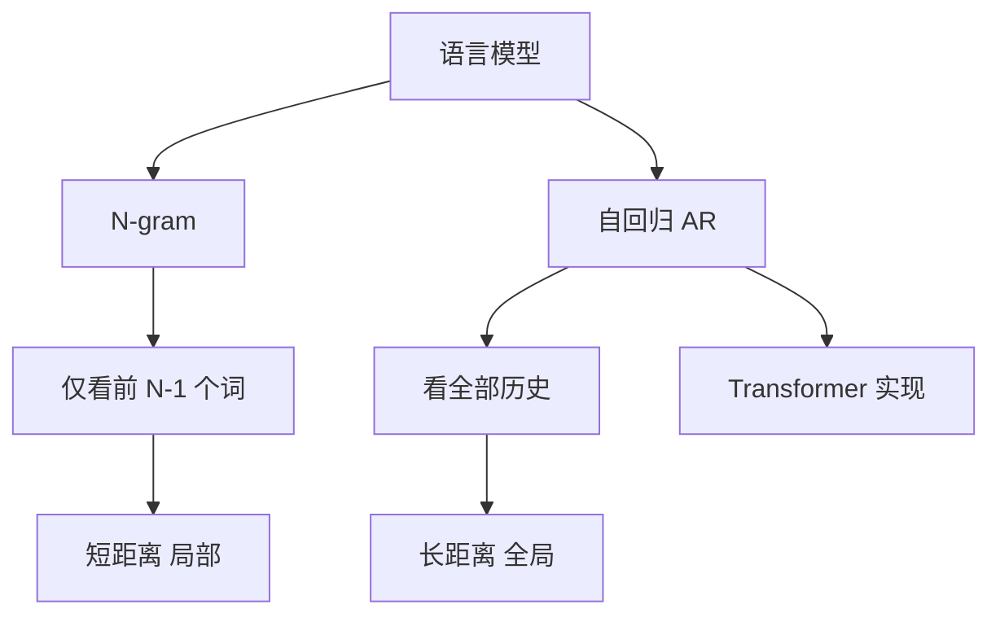

# 什么是自回归语言模型和n-gram模型

### 自回归语言模型与 N-gram 模型

#### 1. 自回归语言模型
自回归模型根据之前的所有历史信息来预测下一个词。

*   **原理**：给定序列 $x_{1:i-1}$，预测下一个 token $x_i$ 的概率分布：
    $$ P(x_i | x_{1}, x_{2}, ..., x_{i-1}) $$
    即当前词的生成依赖于整个历史上下文。
*   **推理过程**：逐个生成 token，将新生成的 token 加入历史序列，用于预测下一个词。
*   **温度参数**：在实际采样时，通常引入温度参数 $T$ 来控制输出的随机性：
    $$ P(x_i) \propto \exp(\log P(x_i) / T) $$
    计算后需要重新归一化概率。$T$ 越大，分布越平缓（随机性越强）；$T$ 越小，分布越尖锐（确定性越强）。

#### 2. N-gram 模型
N-gram 模型是一种简化的自回归模型，它基于“有限历史假设”。

*   **原理**：假设一个词的出现概率仅依赖于它前面的 $n-1$ 个词，而不是整个历史。这种假设也被称为马尔可夫假设。
*   **公式**：
    $$ P(x_i | x_{1}, ..., x_{i-1}) \approx P(x_i | x_{i-(n-1):i-1}) $$
*   **特点**：
    *   **参数稀疏**：相比依赖全历史的模型，N-gram 的参数空间大幅减小。
    *   **长距离依赖缺失**：当 $n$ 较小时（如 bigram 或 trigram），模型无法捕捉超过 $n-1$ 个步长的长距离语义依赖。
    *   **数据稀疏**：容易出现 $n$ 元组在训练集中未出现的情况（零概率问题），通常需要平滑算法（如 Add-k Smoothing, Kneser-Ney）处理。

#### 3. 实战与对比
*   **实战案例**: 在简单的拼写纠错或输入法联想中，N-gram 因其低延迟和高可解释性仍有应用；但在机器翻译或长文本生成中，必须使用Transformer类的自回归模型以解决长距离遗忘问题。
*   **对比表格**:

| 特性 | 自回归模型 | N-gram 模型 |
| :--- | :--- | :--- |
| **上下文范围** | 全局历史 (理论上无限) | 固定窗口 (n-1 个词) |
| **泛化能力** | 强 (基于语义相似度) | 弱 (依赖精确匹配) |
| **计算复杂度** | 高 (随序列长度累积) | 低 (查表或简单计算) |
| **数据稀疏性** | 低 (Subword缓解) | 高 (需平滑技术) |
| **典型代表** | GPT, Llama, RNN | SRILM, KenLM |

## 常见考点
1. **平滑算法**: Kneser-Ney 平滑的基本思想是什么？（基于续写次数而非出现次数来估计 n-gram 概率）。
2. **困惑度**: 解释 PPL (Perplexity) 的物理意义，以及与 N-gram 概率的关系。$PPL = \exp(-\frac{1}{N}\sum \log P(x_i))$。
3. **Decoder-only vs Encoder-decoder**: 自回归特性与 BERT（自编码）的对比，以及两者适用的场景差异。

## 技术原理

**自回归利用完整历史序列预测未来**
自回归语言模型（Autoregressive LM）基于完整历史序列预测下一个 token：`P(x_i | x_1, x_2, ..., x_{i-1})`。理论上它可以建模任意长距离依赖，因为每次预测都能"看到"之前所有内容。现代 Transformer-based 的 Decoder-only 模型（GPT、Llama、Qwen）都是自回归模型，通过自注意力机制实现全局上下文感知，适合长文本生成、对话、代码生成。

**N-gram 基于马尔可夫假设，只看局部窗口**
N-gram 模型是自回归的简化版，基于马尔可夫假设：一个词的出现只依赖前面的 n-1 个词，即 `P(x_i) ≈ P(x_i | x_{i-(n-1):i-1})`。这大大减少了参数量（bigram 只需统计相邻词对），但牺牲了长距离依赖能力——n=2 时模型"记忆"只有 1 个词，无法理解超过 1 步的上下文关联。

**温度参数 T 控制生成的随机性与确定性**
采样时引入温度参数对 logits 缩放：`p_i ∝ exp(log p_i / T)`。T 越大分布越平坦（随机性强、更有创意），T 越小分布越尖锐（确定性强、更保守）。T→0 退化为贪心解码，T→∞ 退化为均匀采样。温度参数是控制自回归模型输出多样性的核心手段。

**N-gram 计算简单但缺乏长距离依赖能力**
N-gram 的优势是计算极快（查表即可）、可解释性强，在拼写纠错、输入法联想等低延迟场景仍有应用。但它的致命缺陷是数据稀疏——很多 n 元组在训练集中从未出现（零概率），需要平滑算法（Add-k、Kneser-Ney）处理；且无法捕捉超过 n-1 步的语义依赖，不适合长文本生成。

## 代码示例

```python
# 1. N-gram 模型训练（bigram 示例）
from collections import defaultdict, Counter

class BigramModel:
    def __init__(self):
        self.counts = defaultdict(Counter)   # {prev_word: {next_word: count}}

    def train(self, corpus):
        for sentence in corpus:
            words = sentence.split()
            for i in range(len(words) - 1):
                self.counts[words[i]][words[i+1]] += 1

    def predict(self, prev_word):
        # 查表：返回该词之后最常出现的下一个词
        return self.counts[prev_word].most_common(1)[0][0]
```

```python
# 2. 自回归模型推理（HuggingFace）
from transformers import AutoModelForCausalLM, AutoTokenizer

model = AutoModelForCausalLM.from_pretrained("Qwen/Qwen2-7B")
tokenizer = AutoTokenizer.from_pretrained("Qwen/Qwen2-7B")

inputs = tokenizer("今天天气真好，我想", return_tensors="pt")
outputs = model.generate(
    **inputs,
    max_new_tokens=50,
    temperature=0.8,        # 温度参数控制随机性
    top_p=0.9,
    do_sample=True,
)
# 自回归：每次基于完整历史预测下一个 token，循环生成
```

## 注意事项

- 自回归：基于全历史序列预测下一词，$P(x_i | x_{1:i-1})$，适合长文本生成。
- N-gram：基于有限窗口（前 n-1 词）的马尔可夫假设，参数少但缺失长距离依赖。
- 对比：自回归泛化强但计算高；N-gram 速度快但数据稀疏，需平滑处理。
- 温度参数：控制采样随机性，T 越大分布越平缓，T 越小越确定。
- N-gram 的 PPL（困惑度）可用于评估语言模型质量：`PPL = exp(-1/N · Σ log P(x_i))`。

## 流程图



## 记忆要点

- 自回归：基于全历史序列预测下一词，$P(x_i | x_{1:i-1})$，适合长文本生成。
- N-gram：基于有限窗口（前n-1词）的马尔可夫假设，参数少但缺失长距离依赖。
- 对比：自回归泛化强但计算高；N-gram速度快但数据稀疏，需平滑处理。
- 温度参数：控制采样随机性，T越大分布越平缓，T越小越确定。

## 结构化回答

**30 秒电梯演讲：** 自回归依赖全部历史，N-gram仅依赖有限的前N-1个词。——打个比方，自回归像记忆力超好的人记得所有对话；N-gram像只有短期记忆的人，只记得刚才说的几个字。

**展开框架：**
1. **自回归** — 基于全历史序列预测下一词，$P(x_i | x_{1:i-1})$，适合长文本生成。
2. **N-gram** — 基于有限窗口（前n-1词）的马尔可夫假设，参数少但缺失长距离依赖。
3. **对比** — 自回归泛化强但计算高；N-gram速度快但数据稀疏，需平滑处理。

**收尾：** 以上三点都能配合实战聊。您想深入聊哪一块？

## 视频脚本

> 预计时长：2 分钟 | 由浅入深

| 时间 | 画面/字幕 | 口播台词 | 讲解要点 |
|------|----------|----------|----------|
| 0:00 | 标题卡 | "自回归语言模型和n-gram模型，30 秒讲清楚。" | 开场钩子 |
| 0:30 | 概念定义动画 | "一句话：自回归依赖全部历史，N-gram仅依赖有限的前N-1个词。" | 核心定义 |
| 1:00 | 自回归图解 | "基于全历史序列预测下一词，$P(x_i | x_{1:i-1})$，适合长文本生成。" | 自回归 |
| 1:30 | 总结卡 | "记好这几条，面试不慌。下期见。" | 收尾 |

### 视频流程图


