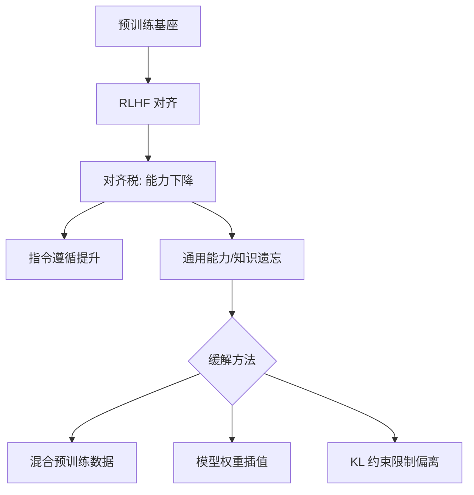

# 什么是对齐税 Alignment Tax?如何缓解

大模型在RLHF（基于人类反馈的强化学习）对齐过程中，为了迎合人类偏好（如安全性、有用性），可能遗忘预训练阶段学到的通用知识（如推理能力、编程能力），导致基准性能下降，这种现象被称为对齐税。

**核心原理与缓解方法**：
1.  **PPO-ptx (Pre-training eXperience)**：在PPO目标函数中，除了策略梯度和KL散度惩罚外，增加预训练数据的负对数似然损失。
    *   *数学形式*：$L_{final} = L_{RLHF} + \lambda \cdot L_{PTX}$。$\lambda$ 为控制强度的超参。
    *   *作用*：在优化奖励模型的同时，约束模型分布不偏离预训练数据分布，防止灾难性遗忘。
2.  **模型平均**：在预训练模型（$\theta_{SFT}$）和RLHF训练结束后的模型（$\theta_{RLHF}$）之间进行权重线性插值。
    *   *公式*：$\theta_{new} = (1-\alpha) \cdot \theta_{SFT} + \alpha \cdot \theta_{RLHF}$。通常 $\alpha \in [0, 1]$ 较小。
    *   *作用*：经验证明，线性插值后的模型能在对齐性能和基准能力之间找到更好的帕累托最优边界。
3.  **异构模型平均 / DARE (Drop And REscale)**：研究发现不同微调阶段的模型权重在方向上具有相似性，可以通过重置部分随机权重并按比例放大剩余权重来融合模型，甚至可以跨不同微调数据集的模型进行融合，在不接触原始数据的情况下缓解遗忘。

**实战案例**：
在开源大模型（如Llama-2/3）的DPO训练中，常见的问题是模型学会了“多说废话”来迎合安全性奖励，导致GSM8K数学集得分暴跌。实际工程中，我们通常在DPO loss中加入原本预训练数据的Next Token Prediction Loss，或者直接取Chat模型（SFT）与DPO模型权重的线性插值，能在保持Helpful风格的同时恢复90%以上的逻辑推理能力。

**代码示例 (PyTorch)**：
```python
# PPO-ptx Loss 实现
def compute_ppo_ptx_loss(log_probs, old_log_probs, advantages, kl_coef, ptx_logits, ptx_labels, ptx_coef):
    # 1. PPO Clip Loss
    ratio = torch.exp(log_probs - old_log_probs)
    pg_losses = -advantages * ratio
    pg_losses2 = -advantages * torch.clamp(ratio, 1.0 - 0.2, 1.0 + 0.2)
    loss_ppo = torch.max(pg_losses, pg_losses2).mean()

    # 2. PTX Regularization (标准CrossEntropy)
    loss_ptx = F.cross_entropy(ptx_logits.view(-1, vocab_size), ptx_labels.view(-1))
    
    # 3. Combined Loss
    return loss_ppo + ptx_coef * loss_ptx
```

**常见考点**：
1. 为什么会出现对齐税？（优化目标不一致，RLHF奖励模型可能忽略了预训练的无监督通用特征）
2. PPO-ptx中的系数 $\lambda$ 如何设置？（通常通过验证集上的Grid Search，过大会导致模型不对齐，过小无法缓解遗忘）
3. 除了上述方法，还有哪些策略？（如CAI: Constrained Alignment，通过数据筛选而非后处理来缓解）

## 技术原理

- **对齐税的本质——优化目标错位**：预训练目标是"预测下一个 token"（覆盖所有知识），RLHF 目标是"最大化人类偏好 reward"（聚焦安全/有用）。这两个目标的梯度方向**不一致**——RLHF 会让模型在"奖励高但偏离预训练分布"的方向移动，丢弃与偏好无关但有用的能力（如严格逻辑推理、代码生成）。这不是 bug，是单目标优化的必然副作用。
- **PPO-ptx 的约束机制**：原始 PPO 损失 $L = -E[r(s,a)] + \beta \cdot KL(\pi || \pi_{ref})$ 只约束"不偏离 SFT 模型"。PPO-ptx 加上**预训练数据的 NLL 损失**：$L = L_{PPO} + \lambda \cdot L_{PTX}$，其中 $L_{PTX} = -E_{x \sim D_{pretrain}}[\log P(x)]$。这相当于在优化 reward 的同时，强迫模型保持对预训练数据的预测能力，相当于"边补习边复习基础知识"。
- **模型平均的几何解释**：SFT 模型 $\theta_{SFT}$ 和 RLHF 模型 $\theta_{RLHF}$ 在参数空间中是两个点。线性插值 $\theta_{new} = (1-\alpha)\theta_{SFT} + \alpha \theta_{RLHF}$ 取两者连线上的点。经验上，这条连线上的点常能同时保持预训练能力（来自 SFT）和对齐效果（来自 RLHF），找到帕累托最优。**这是因为微调通常在参数空间"小幅移动"**，SFT 和 RLHF 的差异是低维的，插值不会破坏任一方。
- **DARE（Drop And REscale）的精妙**：研究发现微调后的权重 $\Delta\theta = \theta_{finetune} - \theta_{base}$ 大部分是冗余的——随机丢弃 90% 的 $\Delta\theta$ 并 rescale 剩余 10%，效果几乎不变。这意味着不同任务的 $\Delta\theta$ 在参数空间"几乎不重叠"，可以安全融合。DARE 用于多模型合并（如数学模型 + 代码模型 → 一个全能模型），无需重新训练。

## 代码示例

```python
import torch
import torch.nn.functional as F

# ============ 1. PPO-ptx：RLHF + 预训练 NLL ============
def ppo_ptx_loss(policy_log_probs, old_log_probs, advantages,
                 ptx_logits, ptx_labels,
                 kl_coef=0.1, ptx_coef=0.01):
    # PPO Clip
    ratio = torch.exp(policy_log_probs - old_log_probs)
    pg1 = -advantages * ratio
    pg2 = -advantages * torch.clamp(ratio, 1 - 0.2, 1 + 0.2)
    loss_ppo = torch.max(pg1, pg2).mean()

    # PTX：预训练数据的 Next Token Prediction Loss
    loss_ptx = F.cross_entropy(
        ptx_logits.view(-1, ptx_logits.size(-1)),
        ptx_labels.view(-1)
    )

    return loss_ppo + kl_coef * kl_penalty + ptx_coef * loss_ptx

# ============ 2. 模型平均（权重插值）============
def model_averaging(model_sft, model_rlhf, alpha=0.5):
    """alpha=0 偏向 SFT，alpha=1 偏向 RLHF"""
    sft_state = model_sft.state_dict()
    rlhf_state = model_rlhf.state_dict()
    merged = {}
    for key in sft_state:
        merged[key] = (1 - alpha) * sft_state[key] + alpha * rlhf_state[key]
    model_merged = type(model_sft)()
    model_merged.load_state_dict(merged)
    return model_merged

# ============ 3. DARE：随机丢弃 + rescale ============
def dare_merge(model_base, model_finetuned, drop_rate=0.9):
    """drop 90% 的 Δθ，rescale 剩余 10% 补偿"""
    base = model_base.state_dict()
    ft = model_finetuned.state_dict()
    merged = {}
    for key in base:
        delta = ft[key] - base[key]                       # 微调带来的变化
        mask = (torch.rand_like(delta) > drop_rate).float()  # 保留 10%
        scaled_delta = delta * mask / (1 - drop_rate)      # rescale 补偿
        merged[key] = base[key] + scaled_delta
    return merged
```

## 对比/选型

| 缓解方法 | 原理 | 实现难度 | 效果 | 适用 |
|---------|------|---------|------|------|
| **PPO-ptx** | RLHF loss + 预训练 NLL | 中（需预训练数据） | 强（约束分布漂移） | 大规模 RLHF |
| **模型平均** | SFT 与 RLHF 权重插值 | 极简（无需训练） | 中（经验性） | 快速缓解 |
| **DARE/TIES 合并** | 智能丢弃冗余 Δθ | 中 | 强（多任务合并） | 多模型融合 |
| **数据混合** | SFT 数据混入预训练数据 | 极简 | 中 | DPO/SFT 阶段 |
| **CAI（Constitutional AI）** | 用规则约束数据筛选 | 高 | 强 | 安全对齐 |
| **早期停止** | 监控 benchmark 停训 | 极简 | 弱 | 兜底手段 |

## 常见坑/注意事项

- **对齐税不可完全消除**：任何对齐都会带来一定性能损失，这是 alignment 与 capability 的内在张力。目标是找到帕累托最优，而非"零损失"。InstructGPT 论文显示 RLHF 后部分 benchmark 下降 5~15% 属正常。
- **PPO-ptx 的 $\lambda$ 调参敏感**：$\lambda$ 太大 → 模型几乎不学 reward（不对齐）；$\lambda$ 太小 → 对齐税严重。需在验证集 grid search，典型值 0.001~0.01。
- **模型平均要求架构一致**：$\theta_{SFT}$ 和 $\theta_{RLHF}$ 必须是同一架构、同一初始化。跨架构（如 7B + 13B）平均无意义。即使同架构，若 SFT 后做了 LoRA 微调，需先 merge LoRA 再平均。
- **DPO 也需要对齐税防护**：DPO 看似"无 RM"，但仍在优化偏好对比，同样会让模型偏离预训练。实践中常在 DPO 数据中混入 SFT 数据（`rpo_alpha` 参数），或对 SFT/DPO 模型做权重插值。
- **评测要覆盖"对齐前"能力**：仅看 reward/人类偏好分数会忽略对齐税。必须用预训练 benchmark（MMLU、GSM8K、HumanEval）持续监控，发现下降超阈值即停止训练。

## 流程图



## 记忆要点

- 定义：RLHF对齐导致模型遗忘预训练知识（如推理能力），基准性能下降。
- PPO-ptx：在RLHF损失中加入预训练数据的NLL损失，约束分布不偏离。
- 模型平均：对SFT与RLHF模型权重做线性插值，寻找帕累托最优边界。
- 实战：DPO训练中常混入预训练数据或做权重插值，以恢复逻辑能力。


## 结构化回答

**30 秒电梯演讲：** RLHF对齐导致预训练能力遗忘，通过混合训练或模型插值缓解。——打个比方，像为了考试补习（RLHF）导致基础知识遗忘（预训练能力），解决办法是同时复习基础知识（PPO-ptx）或把补习前后的笔记按章节比例融合（异构模型平均）。

**展开框架：**
1. **定义** — RLHF对齐导致模型遗忘预训练知识（如推理能力），基准性能下降。
2. **PPO-ptx** — 在RLHF损失中加入预训练数据的NLL损失，约束分布不偏离。
3. **模型平均** — 对SFT与RLHF模型权重做线性插值，寻找帕累托最优边界。

**收尾：** 以上三点都能配合实战聊。我可以展开任一要点，比如「对齐税和灾难性遗忘的关系」这类追问您感兴趣吗？

## 视频脚本

> 预计时长：2 分钟 | 由浅入深

| 时间 | 画面/字幕 | 口播台词 | 讲解要点 |
|------|----------|----------|----------|
| 0:00 | 标题卡 | "对齐税 Alignment Tax，30 秒讲清楚。" | 开场钩子 |
| 0:30 | 概念定义动画 | "一句话：RLHF对齐导致预训练能力遗忘，通过混合训练或模型插值缓解。" | 核心定义 |
| 1:00 | 定义图解 | "RLHF对齐导致模型遗忘预训练知识（如推理能力），基准性能下降。" | 定义 |
| 1:30 | 总结卡 | "记好这几条，面试不慌。下期见。" | 收尾 |
