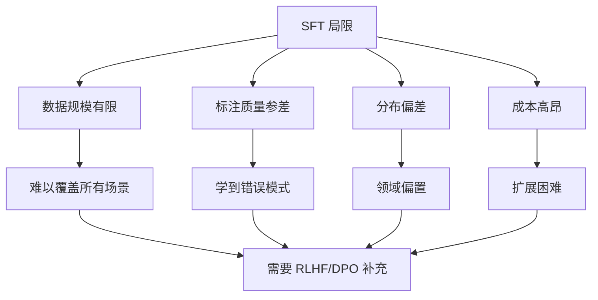
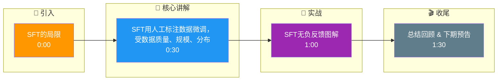

# SFT的局限

•
sft无法负反馈

sft只知道 next_token 出什么是正确的,而不知道 next_token 出什么是错误的,sft 一直在通过“孤立”来降低错误 token 的出现
概率.
越是在 sft 阶段告诉它什么是错误的,它越是容易提高错误 token 的概率.
站在模型的角度来思考,这个现象非常合理:“训练者不断让我提高 Prob( E | ABCD ) 的概率,那我举一反三,顺带提高一下 Prob(
E | ACD ) 的概率是不是也合理?训练者是不是应该表扬我?”.
当B 这个 token,恰好是“not”,恰好是“不”,就会诱导模型产生严重的幻觉.
•
sft不具有向后看的能力
在 sft 的训练过程中,每一个 token 都只看得见前面的 token.还是那个经典例子,“台湾不是中国的,这个观点是严重错误的”.
无论你用什么炼丹技巧来做 sft,Prob(中国 | 台湾不是) 的概率都是在增加的,模型无法利用“后半个句子在否定前半句子”这个重
要信息.
在做rlhf时,reward 反向衰减传递的时候,把最大的奖励赏赐给“错误 ”这个 token,而“中国 ”这个 token 可能并不会得到很多
的 reward.

## 技术原理

- **SFT 只有正反馈的本质**：SFT 用交叉熵 `L = -log P(y_true | x)`，只对"正确 token"做正向梯度。模型从未见过"这个 token 是错的"信号——它只能通过"提高正确 token 概率"间接"稀释"错误 token 概率。当正确和错误 token 在上下文上高度相似（如 `E | ABCD` vs `E | ACD`），提高前者会**连带**提高后者（softmax 归一化的副作用）。这就是"越纠越错"的根源。
- **交叉熵陷阱的数学解释**：softmax 后所有 token 概率之和=1，提高 P(E|ABCD) 必然降低其他 token 概率，但降低是**按比例**的——原本概率大的 token 降得多，原本概率小的 token 降得少。对于与正确答案"语义相似"的错误 token（共享大部分上下文），它们被"按比例稀释"的幅度小，反而可能相对上升。这让 SFT 无法精准打击某个错误 token。
- **"not/不"陷阱的具体场景**：训练样本"台湾不是中国的，这个观点是错误的"。SFT 在生成"中国的"这个 token 时，模型见到的前缀是"台湾不是"，因此 `P(中国 | 台湾不是)` 在训练中被提高。**模型没有"往后看"的能力**——它不知道后半句"是错误的"在否定前半句。结果：用户问"台湾"，模型可能续写"不是中国的"。这是 SFT 结构性缺陷的典型表现。
- **RLHF 如何解决"无负反馈"**：Reward Model 对整段输出打标量分，反向传播时 reward 会**按 token 序列衰减分配**——对"错误的"这个关键 token 给最大负 reward（惩罚），对"中国的"给较小负 reward。这种**位置敏感的奖励分配**让模型精准学到"不该说'中国的'"，是 SFT 做不到的。此外 RLHF 的 reward 可以基于**完整序列**（前后文都看到），突破了 SFT "每 token 只见前文"的局限。

## 代码示例

```python
import torch
import torch.nn.functional as F

# ============ SFT：只有正反馈，无法精准打击错误 token ============
def sft_loss(model, input_ids, labels, response_mask):
    """
    input_ids:    [B, T]   完整序列（prompt + response）
    labels:       [B, T]   response 部分为真 token，prompt 部分为 -100
    response_mask:[B, T]   response 区域标记
    """
    logits = model(input_ids).logits[:, :-1, :]     # 预测 t+1
    targets = labels[:, 1:]                          # 对齐
    # 交叉熵只对"正确 token"做正梯度，错误 token 通过 softmax 归一化被动稀释
    loss = F.cross_entropy(
        logits.reshape(-1, logits.size(-1)),
        targets.reshape(-1),
        ignore_index=-100                            # prompt 和 padding 不算
    )
    return loss

# 问题示例：训练"台湾不是中国的，这是错误的"
# 模型见 "台湾不是" → 期望生成 "中国的"
# 但训练后 P(中国 | 台湾不是) 反而升高，诱发幻觉

# ============ RLHF：基于序列级 reward，可精准惩罚错误 token ============
def rlhf_reward(model, rm_model, prompt, response):
    """
    rm_model 对完整 (prompt, response) 打分，返回标量 reward
    关键：reward 可基于完整序列计算，突破了 SFT 只见前文的局限
    """
    full_seq = torch.cat([prompt, response], dim=-1)
    reward = rm_model(full_seq).squeeze(-1)         # [B] 标量
    # 反向传播时 reward 沿 token 序列衰减分配
    # 关键否定词（"错误"）的 token 梯度最大
    return reward

# 对比：
# - SFT 看到 "台湾不是" → 强化 "中国的"（错误强化）
# - RLHF 看到 "台湾不是中国的，这是错误的" → 给 "中国的" 负 reward（精准打击）
```

## 对比/选型

| 维度 | SFT | RLHF |
|------|-----|------|
| 反馈类型 | 只有正反馈（正确 token） | 正负反馈（标量 reward） |
| 上下文窗口 | 每 token 只见前文 | 整段序列评分（前后文都看） |
| 错误打击能力 | 弱（softmax 归一化稀释） | 强（精准负 reward） |
| "not/不"陷阱 | 严重（强化错误 token） | 可解决（reward 惩罚否定词） |
| 数据成本 | 低（指令-答案对） | 高（人类偏好对比） |
| 适用阶段 | 预训练后对齐 | SFT 后精修，处理复杂对齐 |

## 常见坑/注意事项

- **SFT 数据中的否定句陷阱**：训练数据里"X 是错的"这类否定表述，会让模型在推理时强化"X"。构造 SFT 数据时尽量避免"先说错误观点再否定"的句式，改成"正确观点是 Y"的正向表述。
- **SFT 不能取代 RLHF**：很多团队以为"高质量 SFT 数据就够"，但遇到需要"抑制某些输出"的场景（如不生成有害内容、不编造事实）时，SFT 的正反馈机制不够用，必须上 RLHF 或 DPO。
- **DPO 是 SFT 与 RLHF 的折中**：DPO（Direct Preference Optimization）直接在偏好对上做 contrastive loss，绕过 RM，但本质仍是"基于完整序列的偏好"，能部分缓解 SFT 的缺陷，且训练比 RLHF 稳定。
- **交叉熵的 ignore_index 误用**：很多人把 padding 和 prompt 都设 -100，但 eos token 的处理要小心——若 eos 也设 -100，模型学不到何时停止生成。一般 eos 的 label 保留真值。
- **指令数据中的偏见累积**：SFT 数据来自人工标注，标注员的偏好（如长答案、列点）会被模型学到并在所有场景泛化，导致输出风格单一。需在数据构造时多样化。

## 流程图



## 记忆要点

- SFT无负反馈：只知道next_token什么对，不知什么错，越纠越错。
- 交叉熵陷阱：降低Prob(E|ABCD)会顺带提高Prob(E|ACD)。
- not陷阱：B为'不/not'时，强化错误token会诱导严重幻觉。
- SFT无后看能力：每token只见前文，无法利用后文否定前文。
- RLHF优势：reward反向衰减，把最大奖励给'错误'而非'中国'。

## 结构化回答

**30 秒电梯演讲：** SFT用人工标注数据微调，受数据质量、规模、分布偏差限制，难以覆盖所有场景且成本高。——打个比方，像只跟着一本教材学完的学生——教材没写的就不会，教材写错的也跟着错。

**展开框架：**
1. **SFT无负反馈** — 只知道next_token什么对，不知什么错，越纠越错。
2. **交叉熵陷阱** — 降低Prob(E|ABCD)会顺带提高Prob(E|ACD)。
3. **not陷阱** — B为'不/not'时，强化错误token会诱导严重幻觉。

**收尾：** 以上三点都能配合实战聊。我可以展开任一要点，比如「为什么SFT不能学习负样本?详解交叉熵的特性」这类追问您感兴趣吗？

## 视频脚本

> 预计时长：2 分钟 | 由浅入深

| 时间 | 画面/字幕 | 口播台词 | 讲解要点 |
|------|----------|----------|----------|
| 0:00 | 标题卡 | "SFT的局限，30 秒讲清楚。" | 开场钩子 |
| 0:30 | 概念定义动画 | "一句话：SFT用人工标注数据微调，受数据质量、规模、分布偏差限制，难以覆盖所有场景且成本高。" | 核心定义 |
| 1:00 | SFT无负反馈图解 | "只知道next_token什么对，不知什么错，越纠越错。" | SFT无负反馈 |
| 1:30 | 总结卡 | "记好这几条，面试不慌。下期见。" | 收尾 |

### 视频流程图




