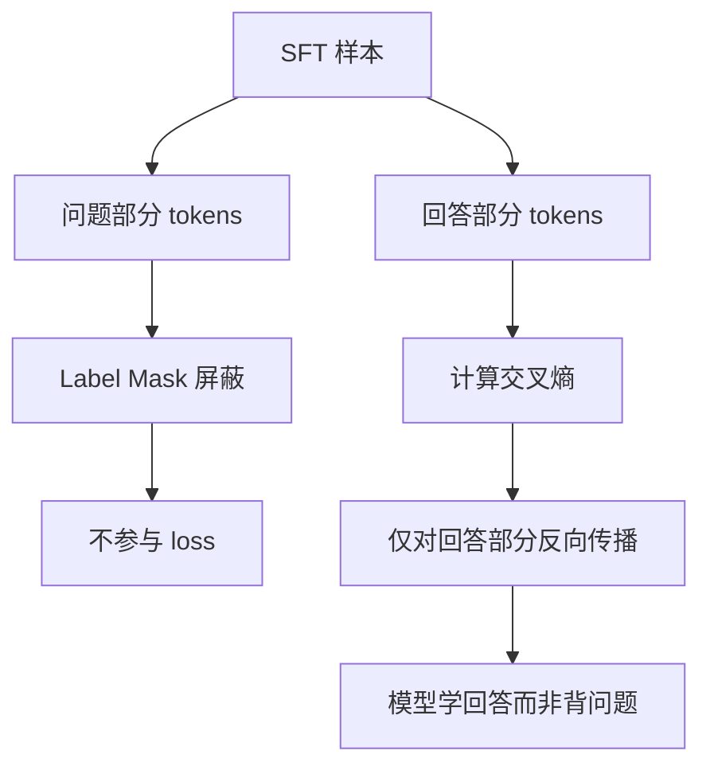

# SFT中的loss是怎么做计算的

SFT（监督微调）中的 Loss 计算主要针对模型生成的 Response 部分，忽略 Prompt 部分。具体流程如下：

1.  **数据处理**：构建输入序列 `[Prompt, Response]`，构造对应的 Label 和 Attention Mask。其中，Prompt 部分的 Label 通常设为 `-100`（在 PyTorch 中 `CrossEntropyLoss` 的 `ignore_index`），Response 部分的 Label 为对应的 Token ID。
2.  **前向传播**：模型输出 Logits `[B, Seq_Len, Vocab_Size]`，通常需进行 Shift 操作（即预测第 $i+1$ 个 Token 时输入第 $i$ 个 Token），使 Logits 与 Label 对齐。
3.  **计算 Loss**：计算 Shift 后的 Logits 与 Label 之间的交叉熵损失。

**关键细节**：
- **Padding Mask**：对于 Padding 部分，需通过 Attention Mask 屏蔽，同时 Label 中的 Padding Token 也设为 `-100`，不参与梯度计算。
- **Loss 权重**：若任务需要，可对不同 Token 设置不同权重（如强化 EOS Token 的学习）。

```text
输入序列:  [User] Hello [Asst] Hi there EOS [PAD] [PAD]
Labels:   [-100] -100 [-100]   3892   234   2  -100  -100
                                        ^^^^^^^^^^^^
                                        计算Loss的区域
```

## 技术原理

- **为什么要 mask prompt（只算 response loss）**：SFT 的目标是让模型学会"如何回答"，而非"如何提问"。若 prompt 也算 loss，模型会同时学习"模仿用户提问风格"，导致：①训练信号被稀释（prompt 占比可能 >80%，gradient 被提问部分主导）；②模型可能学到"生成用户问题"而非"生成回答"；③与预训练目标重叠，浪费训练容量。mask prompt 后，所有梯度都用在"生成正确回答"上，训练效率最高。
- **Shift 操作的对齐逻辑**：Transformer 是自回归模型，位置 $t$ 的 token 预测位置 $t+1$ 的 token。因此模型的 logits `[B, T, V]` 中，第 $t$ 个位置的输出是"下一个 token 的预测分布"。Loss 计算时要把 logits 和 labels **错位对齐**——`logits[:, :-1]`（去掉最后一个，因为最后一个没有"下一个"）与 `labels[:, 1:]`（去掉第一个，因为第一个是输入不需要预测）做交叉熵。这是 NLP 中最常见的"shift by 1"操作。
- **`ignore_index=-100` 的机制**：PyTorch 的 `CrossEntropyLoss(ignore_index=-100)` 会跳过 label=-100 的位置，不参与 loss 计算和梯度回传。SFT 把 prompt 和 padding 的 label 都设 -100，等价于"这些位置不算 loss"。HuggingFace 的 `DataCollatorForSeq2Seq` 会自动做这个 mask。
- **损失归一化的两种方式**：①**token-mean**（默认）：loss 除以"参与计算的 token 数"（response 长度之和），短回答样本的 loss 不会被稀释；②**sample-mean**：loss 除以样本数，每个样本权重相等。短回答样本的梯度更密集。实践中 token-mean 更常用，但要注意长回答样本天然权重更大。

## 代码示例

```python
import torch
import torch.nn.functional as F
from transformers import AutoModelForCausalLM

def sft_forward(model, batch):
    """
    batch 包含:
      input_ids:      [B, T]   完整序列（prompt + response + eos + pad）
      attention_mask: [B, T]   1 表示有效 token，0 表示 padding
      labels:         [B, T]   response 部分为真 token id，其余为 -100
    """
    input_ids = batch["input_ids"]            # [B, T]
    attn_mask = batch["attention_mask"]       # [B, T]
    labels = batch["labels"]                  # [B, T]，prompt/pad 为 -100

    # 1. 前向传播
    outputs = model(input_ids=input_ids, attention_mask=attn_mask)
    logits = outputs.logits                   # [B, T, V]

    # 2. Shift 对齐：位置 t 预测 t+1
    shift_logits = logits[:, :-1, :].contiguous()   # [B, T-1, V]
    shift_labels = labels[:, 1:].contiguous()        # [B, T-1]

    # 3. 交叉熵，ignore_index=-100 自动 mask 掉 prompt 和 padding
    loss = F.cross_entropy(
        shift_logits.view(-1, shift_logits.size(-1)),
        shift_labels.view(-1),
        ignore_index=-100,
        reduction="mean"                      # 默认 token-mean
    )
    return loss

# ===== 构造 labels 的数据预处理 =====
def build_labels(prompt_ids, response_ids, eos_id, max_len=512):
    """把 prompt 和 response 拼接，prompt 部分 label 设 -100"""
    input_ids = prompt_ids + response_ids + [eos_id]
    labels = [-100] * len(prompt_ids) + response_ids + [eos_id]
    # padding
    pad_len = max_len - len(input_ids)
    input_ids += [0] * pad_len
    labels += [-100] * pad_len                # padding 也设 -100
    return input_ids[:max_len], labels[:max_len]

# 示例：
# prompt_ids   = [101, 2023, 2003]      # "[CLS] Hello how"
# response_ids = [1037, 4660]            # "are you"
# input_ids = [101, 2023, 2003, 1037, 4660, 102, 0, 0]
# labels    = [-100,-100, -100,  1037,  4660, 102, -100, -100]
#                       prompt被mask ↑   response算loss ↑
```

## 对比/选型

| 维度 | Pretrain Loss | SFT Loss | RLHF Policy Loss |
|------|--------------|----------|------------------|
| mask 范围 | 无 mask（整段算） | mask prompt，只算 response | 基于 reward 加权，无 mask |
| Label 来源 | 文本本身（自监督） | 人工标注的 response | RM 打分 |
| Shift | 是（预测下一 token） | 是 | 是（PPO 在 token 序列上） |
| reduction | token-mean | token-mean | reward 衰减加权 |
| 学习目标 | 通用语言建模 | 指令遵循、对话风格 | 人类偏好对齐 |

## 常见坑/注意事项

- **eos token 的 label 处理**：很多人把 eos 也设 -100，导致模型学不到"何时停止"，推理时无限生成。正确做法是 eos 的 label 保留其 token id，让模型学到"回答结束要输出 eos"。
- **shift 方向错误**：常见 bug 是 `logits[:, :-1]` 配 `labels[:, :-1]`（没 shift labels），导致模型学的是"用 token t 预测 token t"（恒等映射），训练 loss 极低但模型什么都没学到。务必 logits 和 labels 都 shift。
- **多轮对话的 mask 策略**：多轮对话 `[user1, assistant1, user2, assistant2]` 中，一般只对 assistant 部分算 loss，user 部分 mask。但也有做法把所有 assistant 拼接统一算 loss，或分轮计算。具体取决于任务设计。
- **长尾样本的梯度不均衡**：极短回答（1-2 token）的 loss 被少数 token 主导，梯度噪声大；极长回答（1000+ token）的 loss 被 token 数稀释。可用 sample-mean 归一化或按长度分桶训练。
- **DeepSpeed/FSDP 下的 loss 计算**：分布式训练时，`reduction="mean"` 在每个 rank 上本地求平均，再 all-reduce 求全局平均——这是错的（应该是先全局 sum 再除以全局 count）。需用 `reduction="sum"` + 手动 all-reduce token 数。HuggingFace Trainer 已处理，但自定义 training loop 要小心。

## 流程图



## 核心知识点图


## 记忆要点

- 只计算Response部分的Loss，Prompt部分Label设为-100忽略
- 需对Logits进行Shift操作，使预测Token与Label对齐
- 使用CrossEntropyLoss，Padding和Prompt部分不参与梯度计算


## 结构化回答

**30 秒电梯演讲：** 只对回答部分计算交叉熵，屏蔽问题部分——打个比方，像考试时只批改主观题答案，不看题目部分

**展开框架：**
1. **只计算Respo** — 只计算Response部分的Loss，Prompt部分Label设为-100忽略
2. **需对Logits** — 需对Logits进行Shift操作，使预测Token与Label对齐
3. **使用CrossE** — 使用CrossEntropyLoss，Padding和Prompt部分不参与梯度计算

**收尾：** 以上三点都能配合实战聊。我可以展开任一要点，比如「loss_mask在SFT中的作用是什么」这类追问您感兴趣吗？

## 视频脚本

> 预计时长：3 分钟 | 由浅入深

| 时间 | 画面/字幕 | 口播台词 | 讲解要点 |
|------|----------|----------|----------|
| 0:00 | 标题卡 | "SFT中的loss是怎么做计算的，30 秒讲清楚。" | 开场钩子 |
| 0:36 | 概念定义动画 | "一句话：只对回答部分计算交叉熵，屏蔽问题部分" | 核心定义 |
| 1:12 | 要点图解 | "只计算Response部分的Loss，Prompt部分Label设为-100忽略" | 要点 |
| 1:48 | 要点图解 | "需对Logits进行Shift操作，使预测Token与Label对齐" | 要点 |
| 2:24 | 总结卡 | "记好这几条，面试不慌。下期见。" | 收尾 |
