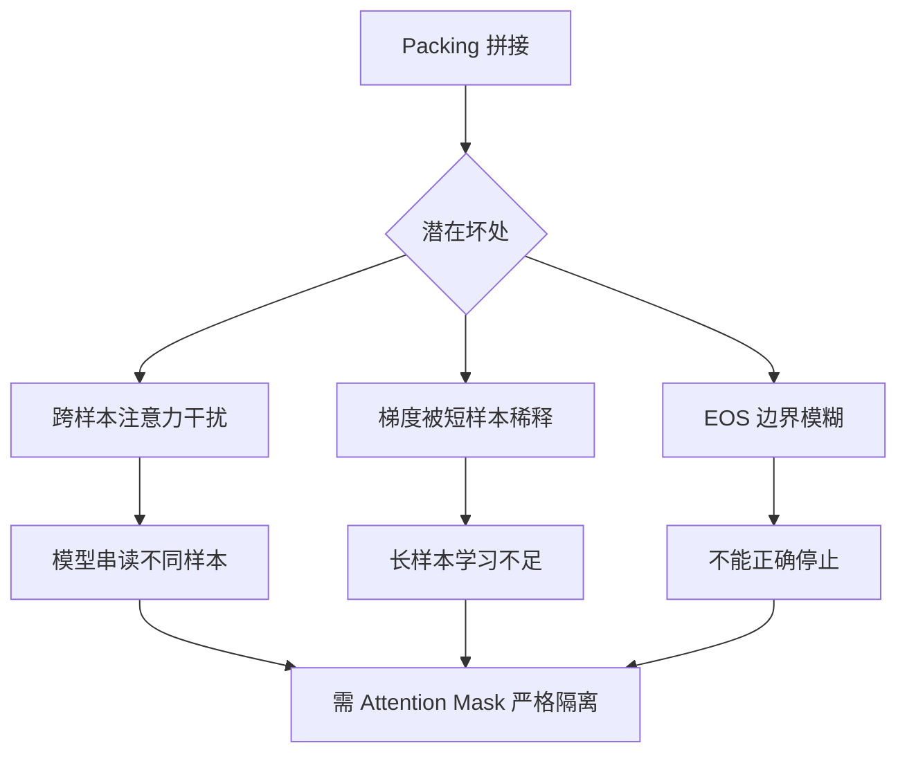

# 作packing可能有什么坏处

SAME

## 技术原理

- **梯度稀释导致难样本拟合变弱**：拼接后的序列 loss 是各 token loss 的平均。一条 4K 长序列里若含 4 个 1K 样本，每个样本对梯度的贡献被均摊到 1/4，且长短样本拼一起时长样本 token 多但梯度信号被短样本"稀释"。结果：模型对难样本（高 loss 样本）的拟合强度下降，整体训练效率不如 unbatched。
- **标准 Attention 无法彻底隔断多轮对话上下文**：标准 self-attention 让序列内每个 token 都能 attend 到其他所有 token，拼接的多个样本之间会产生跨样本注意力——样本 A 的 token 会"看到"样本 B 的内容。对单轮指令样本影响有限，但对**多轮对话**样本（如 ChatML 格式）会导致当前轮次和历史对话混淆，模型分不清"用户当前在问什么"。
- **模型可能混淆当前轮次与历史对话信息**：尤其在 SFT 多轮场景，packing 后不同对话片段之间没有硬隔离，模型生成时会错误地参考"隔壁"样本的对话历史，产生语境串扰。
- **Block Attention 是解决该问题的理想方案**：用 Block/Document-level Attention Mask 强制每个样本（或每个对话回合）只能 attend 自身范围内的 token，硬隔离跨样本注意力；配合 Position IDs 在每个样本边界重置，避免位置错乱。

## 代码示例

```python
import torch
import torch.nn.functional as F

def packed_attention_with_block_mask(q, k, v, sample_lengths):
    """
    q,k,v: (batch, heads, packed_len, dim)  拼接后的序列
    sample_lengths: list[int]  各样本长度，如 [128, 256, 64]
    构建 block mask 让样本间互不可见
    """
    total = sum(sample_lengths)
    # 1. 构造 block diagonal mask：每个样本内可见，样本间屏蔽
    mask = torch.zeros(total, total, dtype=torch.bool)
    pos = 0
    for L in sample_lengths:
        mask[pos:pos+L, pos:pos+L] = True        # 块内可见
        pos += L
    # 2. 叠加因果 mask（块内仍需因果）
    causal = torch.tril(torch.ones(total, total, dtype=torch.bool))
    attn_mask = mask & causal
    # 3. 配合 position_ids 重置（每块从 0 开始）
    position_ids = []
    for L in sample_lengths:
        position_ids += list(range(L))
    position_ids = torch.tensor(position_ids)

    return F.scaled_dot_product_attention(q, k, v, attn_mask=attn_mask)

# 错误示范：直接拼接不隔离 → 跨样本污染
# packed = torch.cat([sample_a_tokens, sample_b_tokens])  # 标准 attention 全互通
```

## 常见坑/注意事项

- **Position IDs 必须重置**：拼接后若沿用全局递增 position id，第二个样本从位置 1000 开始，模型学到错误位置编码，长此以往位置感知失准。每块要从 0 重新编号。
- **Attention Mask 屏蔽跨样本**：必须构造 block-diagonal mask 隔离样本，否则跨样本 attend 会污染语义。HF Transformers 的 `DataCollatorWithFlattening` 默认不做这件事，需自定义或用 `FlashAttention2` 的 variable-length API。
- **Loss 计算要按样本加权**：直接对拼接序列求平均 loss 会让长样本被稀释，可按 token 数加权或对每个样本独立算 loss 再平均。
- **多轮对话 packing 更危险**：多轮对话本身的回合边界 + packing 的样本边界，两层都要用 attention mask 隔离（ChatML 的 `<|im_start|>` 等特殊 token 也要正确处理）。
- **训练不稳定**：不同分布的样本拼接可能导致单步梯度方向冲突，建议同 batch 内尽量同质，或减小 packing 数量。
- **变长 packing 与 sorted batching**：按长度排序再 packing 能减少 padding，但要打乱样本顺序避免模型学到排序偏差。

## 流程图



## 核心知识点图


## 记忆要点

- 位置信息错乱：若Position IDs未重置，模型会学到错误位置
- 注意力干扰：需确保Attention Mask屏蔽样本间的跨样本注意力
- 训练不稳定性：不同样本拼接可能导致梯度方向冲突


## 结构化回答

**30 秒电梯演讲：** 为提升计算效率拼接样本，但会稀释梯度并干扰上下文隔离。——打个比方，为了省油车把几个不认识的乘客塞进一辆车，乘客之间互相干扰，谁也没法专心。

**展开框架：**
1. **位置信息错乱** — 若Position IDs未重置，模型会学到错误位置
2. **注意力干扰** — 需确保Attention Mask屏蔽样本间的跨样本注意力
3. **训练不稳定性** — 不同样本拼接可能导致梯度方向冲突

**收尾：** 以上三点都能配合实战聊。您想深入聊哪一块？

## 视频脚本

> 预计时长：2 分钟 | 由浅入深

| 时间 | 画面/字幕 | 口播台词 | 讲解要点 |
|------|----------|----------|----------|
| 0:00 | 标题卡 | "作packing可能有什么坏处，30 秒讲清楚。" | 开场钩子 |
| 0:30 | 概念定义动画 | "一句话：为提升计算效率拼接样本，但会稀释梯度并干扰上下文隔离。" | 核心定义 |
| 1:00 | 位置信息错乱图解 | "若Position IDs未重置，模型会学到错误位置" | 位置信息错乱 |
| 1:30 | 总结卡 | "记好这几条，面试不慌。下期见。" | 收尾 |
