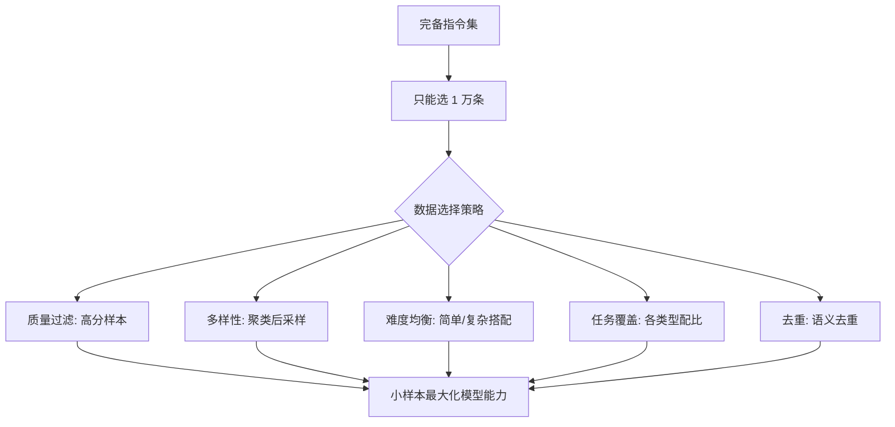

# 有一个非常完备的sft指令集,你只能选择1w条,你如何选择数据来使模型的能力更加提

1. **数据质量与多样性筛选**：确保指令清晰、无歧义，且覆盖广泛的任务类型。
2. **核心能力侧重**：重点覆盖推理和代码类任务，这类数据对提升模型泛化能力至关重要，可适当提高占比。
3. **多语言覆盖**：包含不同语言的数据以提升国际化能力。
4. **难度与长度均衡**：指令难度应呈一定分布（如由易到难），样本长度总体分布均匀，避免模型偏好特定长度。
5. **任务导向对齐**：根据具体的下游任务目标，针对性地添加相关领域或类型的数据。

**实战案例**：在实际工程中，直接采样容易导致模型陷入“平庸陷阱”，即学会了简单对话但丧失了复杂推理能力。我曾遇到过在混合数据集中，只有不到10%的数学推理题，导致模型在CoT（Chain of Thought）任务上表现急剧下降；后来通过引入**数据去重**和**质量打分**，优先保留了高困惑度的长尾数据，才恢复了模型逻辑能力。

**代码示例**（基于Python的数据筛选逻辑）：
```python
import numpy as np

# 假设 dataset 包含 'instruction', 'response', 'domain', 'length'
def select_data(dataset, limit=10000):
    # 1. 去重：基于Instruction语义去重（简单示例用长度过滤）
    dataset = [d for d in dataset if 10 < len(d['instruction']) < 500]
    
    # 2. 按核心能力加权采样：推理和代码权重更高
    weights = [2.0 if d['domain'] in ['reasoning', 'code'] else 1.0 for d in dataset]
    
    # 3. 难度分层：确保包含高难度样本（如长度分位数Top 20%）
    is_hard = [d['length'] > np.percentile([x['length'] for x in dataset], 80) for d in dataset]
    
    # 强制保留一部分Hard样本，其余加权随机采样
    hard_samples = [d for d, flag in zip(dataset, is_hard) if flag][:2000]
    remaining_pool = [d for d, flag in zip(dataset, is_hard) if not flag]
    
    # 简单加权采样剩余部分
    probs = np.array([w for d, w in zip(remaining_pool, weights) if not d in hard_samples])
    probs /= probs.sum()
    selected_others = np.random.choice(remaining_pool, size=limit - len(hard_samples), p=probs, replace=False)
    
    return hard_samples + list(selected_others)
```

**对比表格**（采样策略选型）：

| 策略 | 优点 | 缺点 | 适用场景 |
| :--- | :--- | :--- | :--- |
| **随机采样** | 实施简单，保持原始分布 | 容易被低质量或简单数据淹没 | 数据集分布极其均匀且高质量时 |
| **困难样本挖掘** | 显著提升模型推理上限 | 容易导致过拟合或训练不稳定 | 模型基础能力已达标，需冲刺SOTA |
| **基于权重的分层采样** | 平衡广度与深度，可控性强 | 需要人工定义权重和规则 | **通用SFT训练（推荐）** |
| **语义去重+核心重采样** | 极大提升数据利用效率 | 计算开销大，需聚类 | 指令集极度冗余时 |
| **QDO (Quality Data Optimization)** | 动态识别高价值数据 | 需要预训练参考模型 | 数据量极大，需自动化筛选时 |

## 技术原理

"1 万条指令选数据"本质上是一个**数据价值密度优化问题**。在预算约束下，目标是让模型的边际学习收益最大化——每条数据都要带新的信息量，避免冗余和低质量样本稀释学习信号。

- **数据质量的"四维评分"**：一条 SFT 数据的价值由四个维度决定——（1）正确性：response 是否准确无误，错样本是负向信号；（2）丰富度：包含推理步骤、代码逻辑、领域知识的长样本比"你好/好的"对话价值高得多；（3）独特性：与其他样本语义不重复（高困惑度、长尾数据）；（4）难度梯度：全易会让模型学不到推理，全难会让训练不稳定，需要分层分布。
- **LIMA 论文的启示——Less is More**：Meta 的 LIMA 实验证明，1000 条精挑细选的高质量数据，就能让 65B 模型达到接近 GPT-4 的对话能力。核心结论：**模型的能力主要来自预训练，SFT 是激活这些潜在能力而非"学会新知识"**。所以 SFT 数据要选"展示如何调用模型已有能力"的样本，而非追求"教新东西"。这正是为什么推理/代码类数据价值最高——它们示范了复杂能力的调用方式。
- **配比（Mixture Ratio）的影响**：不同任务配比直接影响模型能力分布。Llama 2 的实验显示，代码数据占 4.2% 时通用能力最强，超过 10% 后通用对话能力下降；推理数据占比过低（<5%）会让 CoT 能力急剧退化。推荐起点：通用对话 30%、代码 20%、数学推理 15%、多语言 15%、安全对齐 10%、其他 10%。
- **"数据沸腾"现象**：低质量或重复数据会让模型快速过拟合这些模式（loss 下降快），但泛化能力变差。这就是"平庸陷阱"——学会了简单对话但丧失了复杂推理。检测方法：监控不同任务子集的 loss 曲线，如果简单任务 loss 暴跌但推理任务 loss 不降，说明数据配比失衡。

## 代码示例

```python
# 1. 多维度数据质量打分
import numpy as np
from sentence_transformers import SentenceTransformer

class SFTDataSelector:
    def __init__(self):
        self.encoder = SentenceTransformer('BAAI/bge-large-zh')

    def score_quality(self, sample):
        """四维评分：长度、信息密度、领域权重、复杂度"""
        resp_len = len(sample['response'])
        # 长样本奖励（避免短回复）
        length_score = min(resp_len / 500, 1.0)
        # 信息密度：去停用词后剩余词比例
        density = len([w for w in sample['response'].split()
                       if w not in STOPWORDS]) / max(len(sample['response'].split()), 1)
        # 领域权重（推理/代码加权）
        domain_w = {'reasoning': 2.0, 'code': 2.0, 'math': 2.0,
                    'general': 1.0, 'chitchat': 0.3}.get(sample['domain'], 1.0)
        return length_score * 0.3 + density * 0.3 + (domain_w / 2.0) * 0.4

    def dedup_semantic(self, samples, threshold=0.9):
        """基于嵌入的语义去重，保留每个聚类的一条代表"""
        embeddings = self.encoder.encode([s['instruction'] for s in samples])
        # 简化的贪心去重：相似度高于阈值则丢弃后到的
        keep = []
        for i, emb in enumerate(embeddings):
            if all(np.dot(emb, embeddings[j]) < threshold for j in keep):
                keep.append(i)
        return [samples[i] for i in keep]
```

```python
# 2. 分层加权采样：确保关键能力不丢
def stratified_select(dataset, total=10000):
    """按领域分层 + 难度分层，每层独立采样"""
    # 推荐配比（Llama 2 / Alpaca 风格）
    DOMAIN_RATIO = {
        'reasoning': 0.15,   # 推理（CoT/数学）
        'code': 0.20,        # 代码
        'general': 0.25,     # 通用对话
        'multilingual': 0.15,  # 多语言
        'safety': 0.10,      # 安全对齐
        'knowledge': 0.15,   # 闭卷知识问答
    }

    selected = []
    for domain, ratio in DOMAIN_RATIO.items():
        n = int(total * ratio)
        pool = [d for d in dataset if d['domain'] == domain]
        # 在该领域内按质量分数排序，取 Top-N（保留少量随机性）
        pool.sort(key=lambda d: d['quality_score'], reverse=True)
        top_n = pool[:int(n * 0.8)]                  # 80% 取最高分
        random_n = np.random.choice(pool[int(n * 0.8):],
                                     size=int(n * 0.2), replace=False)  # 20% 随机
        selected.extend(top_n + list(random_n))
    return selected
```

```python
# 3. 用"参考模型困惑度"识别高价值数据（IFD 指标）
# Li et al. 2023 "On the Effectiveness of Low-impact Data"
def compute_ifd_score(dataset, ref_model, ref_tokenizer):
    """IFD = ppl(response) / ppl(instruction + response)
    分数 > 1 说明 response 对模型来说"意外"，价值高"""
    scores = []
    for sample in dataset:
        text = sample['instruction'] + sample['response']
        resp = sample['response']
        ppl_full = compute_perplexity(text, ref_model, ref_tokenizer)
        ppl_resp = compute_perplexity(resp, ref_model, ref_tokenizer)
        scores.append(ppl_resp / ppl_full)
    return scores

# 选 IFD 分数 Top-K，过滤"模型已经能轻松预测"的低价值样本
```

## 对比选型

| 策略 | 实施成本 | 数据利用率 | 适用规模 | 推荐度 |
| :--- | :--- | :--- | :--- | :--- |
| **纯随机采样** | 极低 | 低（被冗余稀释） | 1M+ 高质量数据集 | 不推荐 |
| **规则过滤（长度/关键词）** | 低 | 中 | 100K-1M | 基础步骤 |
| **质量打分 + 加权采样** | 中 | 高 | 10K-100K | 推荐 |
| **语义去重 + 分层采样** | 高 | 极高 | 10K-50K | 强烈推荐 |
| **IFD/困惑度筛选** | 高（需参考模型） | 极高 | <10K | 小预算最优 |
| **DPO/Auto 数据筛选** | 极高（训练筛选器） | 极高 | 大规模自动化 | 前沿 |

## 常见坑

- **不要按"回答长度"排序直接选最长**：长回答可能只是啰嗦，未必高价值。要结合密度、领域、IFD 等多维度评分。
- **数学/代码数据配比过低导致能力崩塌**：实战中通用对话占 70% 的数据集，推理能力会断崖式下降。CoT 类样本至少 15%。
- **去重过度导致多样性丧失**：语义去重阈值设太高（如 0.95）会丢掉"看起来相似但角度不同"的样本。一般 0.85-0.90 是甜区。
- **小数据集不需要过多 epoch**：1 万条数据训 5 epoch 就开始过拟合。监控验证集 loss，2-3 epoch 是常见甜点。
- **忽略指令模板的多样性**：相同意图用 5 种不同表达（"翻译""请翻译""translate"）能提升鲁棒性。模板单一会让模型过拟合特定 prompt 格式。
- **安全数据不要超过 15%**：过多安全对齐数据会让模型过度谨慎（什么都拒答），影响通用能力。一般 5-10%。
- **多语言数据要保证每种语言至少 500 条**：低于 500 条的语言基本学不会，反而占预算。

## 流程图



## 核心知识点图


## 记忆要点

- 优先保留推理和代码数据，提升模型泛化与逻辑能力
- 确保数据多样性，覆盖多语言、不同难度和任务类型
- 采用分层或加权采样，避免简单数据淹没高质量样本


## 结构化回答

**30 秒电梯演讲：** 在有限预算下，通过高质、多样、有侧重的小样本最大化模型能力。——打个比方，就像只读十本书，得选百科全书、逻辑题库和经典名著，不能全选漫画。

**展开框架：**
1. **优先保留推理和代** — 优先保留推理和代码数据，提升模型泛化与逻辑能力
2. **确保数据多样性** — 确保数据多样性，覆盖多语言、不同难度和任务类型
3. **采用分层或加权采** — 采用分层或加权采样，避免简单数据淹没高质量样本

**收尾：** 以上三点都能配合实战聊。您想深入聊哪一块？

## 视频脚本

> 预计时长：2 分钟 | 由浅入深

| 时间 | 画面/字幕 | 口播台词 | 讲解要点 |
|------|----------|----------|----------|
| 0:00 | 标题卡 | "有一个非常完备的sft指令集,你只能选择1w条，30 秒讲清楚。" | 开场钩子 |
| 0:30 | 概念定义动画 | "一句话：在有限预算下，通过高质、多样、有侧重的小样本最大化模型能力。" | 核心定义 |
| 1:00 | 要点图解 | "优先保留推理和代码数据，提升模型泛化与逻辑能力" | 要点 |
| 1:30 | 总结卡 | "记好这几条，面试不慌。下期见。" | 收尾 |
