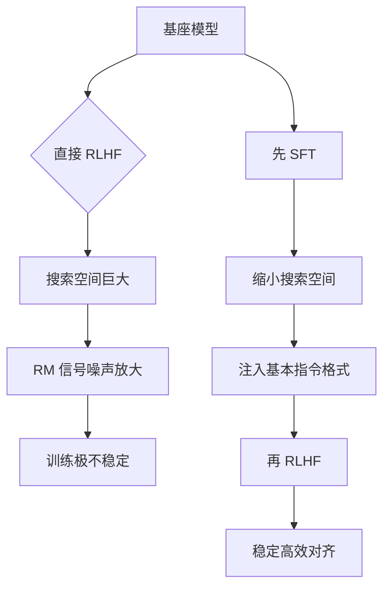

# 以跳过sft阶段直接进行RLHF么

不建议跳过 SFT 阶段，主要原因在于搜索空间优化和 Reward Model 的局限性。

1.  **缩小搜索空间**：
    -   LLM 的输出空间是离散且极其庞大的。直接从随机初始化或 Base Model 进行 RL，探索空间过大，很难收敛到有意义的高 Reward 区域。
    -   SFT 本质上是模仿学习，通过监督信号将模型约束在人类语言的合理流形附近，大幅降低了 RL 阶段的探索难度。

2.  **Reward Model (RM) 的泛化瓶颈**：
    -   RM 本身也是基于 SFT 模型初始化并训练的。如果跳过 SFT，RM 难以理解混乱的生成内容，导致无法给出有效的梯度信号。
    -   RM 的标注数据有限且昂贵，无法覆盖所有可能的生成分布。SFT 提供了一个先验分布，使得 RL 主要在这个“合理”分布的附近进行微调，而不是去修正完全离谱的输出。

3.  **训练稳定性**：
    -   SFT 提供了基础的 Warm-up。RLHF 中的 PPO 算法对超参数敏感，若起始策略太差，很容易导致 KL 散度爆炸或模式崩溃。

```text
优化路径示意:

Base Model (高熵，分布广)
      |
      | SFT (监督学习，收敛到人类数据流形)
      v
SFT Model (低熵，主要集中在高质量回复)
      |
      | RLHF (在流形表面微调，最大化 Reward)
      v
Aligned Model (高 Reward，低 KL)
```

**实战案例**：
在早期的 RLHF 尝试中（如 InstructGPT 之前的实验），直接对 Base Model 做 PPO 导致模型生成了大量不可读的乱码字符串。这是因为在离散的高维空间中，随机探索很难恰好“撞”到人类可读的句子，导致 Reward Signal 极其稀疏，训练无法收敛。

**对比表格**：SFT 阶段必要性对比

| 维度 | 直接 RL (Skip SFT) | SFT 后 RL (标准流程) |
| :--- | :--- | :--- |
| **探索难度** | 极高，搜索空间包含乱码和无效序列 | 较低，约束在人类语言流形附近 |
| **Reward 质量** | RM 难以理解 Base 输出，梯度噪声大 | RM 输出稳定，提供有效监督信号 |
| **样本效率** | 极低，需要海量 Trial-and-error | 高，在 SFT 基础上快速微调 |
| **收敛稳定性** | 容易发散、模式崩溃 | 相对稳定，KL 容易控制 |

## 技术原理

**SFT 将搜索空间收敛至合理范围**
LLM 的输出空间是离散且极其庞大的（词表动辄数万，序列长度上千），直接从随机初始化或 Base Model 做 RL，探索空间过大，几乎不可能收敛到有意义的高 Reward 区域。SFT 本质是模仿学习，通过监督信号把模型约束在人类语言的合理流形附近，把搜索空间从"所有可能的 token 序列"缩小到"人类可读的合理序列"，大幅降低 RL 探索难度。

**LLM 缺少客观的廉价 Reward 信号**
不同于棋类游戏有明确的胜负，或代码能通过测试用例验证，自然语言生成没有廉价且客观的奖励信号。Reward Model 本身也是基于 SFT 模型初始化训练的——如果跳过 SFT 直接 RL，RM 无法理解 Base Model 输出的乱码，给不出有效梯度。SFT 提供了让 RM 能"读懂"输出的先验分布。

**直接 RL 训练成本高且不稳定**
PPO 算法对超参数极其敏感。若起始策略太差（Base Model 未经过 SFT 的对齐），KL 散度容易爆炸或出现模式崩溃——模型生成大量不可读的乱码字符串，Reward 信号极其稀疏，训练无法收敛。早期 InstructGPT 之前的实验证实了这一点。

**SFT 是 RLHF 的基础保障**
标准 RLHF 流程是 Base → SFT → RM → RLHF。SFT 提供了 Warm-up，让模型先学会"说人话"，RLHF 再在此基础上精调"说好话"（对齐人类偏好）。跳过 SFT 等于让一个不会说话的人直接学演讲技巧，注定失败。

## 代码示例

```text
优化路径示意（标准 RLHF 流程）：

Base Model (高熵，分布广，可能输出乱码)
      │
      │ SFT（监督学习，收敛到人类数据流形）
      ▼
SFT Model (低熵，主要集中在高质量可读回复)
      │
      │ RLHF (在流形表面微调，最大化 Reward)
      ▼
Aligned Model (高 Reward，低 KL，对齐人类偏好)

跳过 SFT 的后果：
Base Model → 直接 RL → 探索空间含大量乱码
            → RM 无法理解 → 梯度噪声大
            → KL 散度爆炸 → 模式崩溃 → 训练发散
```

```python
# 标准三阶段训练代码结构（TRL 库）
from trl import SFTTrainer, PPOTrainer, RewardTrainer

# 阶段 1: SFT（不可跳过）
sft_trainer = SFTTrainer(model=base_model, ...)
sft_model = sft_trainer.train()        # 先学会说人话

# 阶段 2: 训练 Reward Model（基于 SFT 初始化）
rm_trainer = RewardTrainer(model=sft_model, ...)
reward_model = rm_trainer.train()      # RM 能读懂 SFT 输出

# 阶段 3: RLHF（基于 SFT 做 RL）
ppo_trainer = PPOTrainer(model=sft_model, reward_model=reward_model, ...)
aligned_model = ppo_trainer.train()    # 在合理空间内精调
```

## 注意事项

- 缩小搜索空间：SFT 将模型约束在人类语言流形，降低 RL 探索难度。
- RM 依赖 SFT：Reward Model 需基于 SFT 初始化，否则难以理解乱码输出。
- 提升稳定性：SFT 提供 Warm-up，避免直接 RL 导致 KL 散度爆炸。
- 即使是 RLHF 的替代方案（DPO），也需要先做 SFT 保证输出可读性。
- SFT 数据质量决定 RLHF 上限：脏数据会让模型学到错误流形，后续 RL 难以纠正。

## 流程图



## 核心知识点图


## 记忆要点

- 缩小搜索空间：SFT将模型约束在人类语言流形，降低RL探索难度
- RM依赖SFT：Reward Model需基于SFT初始化，否则难以理解乱码输出
- 提升稳定性：SFT提供Warm-up，避免直接RL导致KL散度爆炸


## 结构化回答

**30 秒电梯演讲：** SFT 缩小搜索空间，RLHF 精调对齐，跳过 SFT 会导致 RL 搜索代价过大。——打个比方，学开车先让教练手把手教几圈（SFT），再自己上路根据红绿灯调整（RL），不能上来就瞎撞。

**展开框架：**
1. **缩小搜索空间** — SFT将模型约束在人类语言流形，降低RL探索难度
2. **RM依赖SFT** — Reward Model需基于SFT初始化，否则难以理解乱码输出
3. **提升稳定性** — SFT提供Warm-up，避免直接RL导致KL散度爆炸

**收尾：** 以上三点都能配合实战聊。您想深入聊哪一块？

## 视频脚本

> 预计时长：2 分钟 | 由浅入深

| 时间 | 画面/字幕 | 口播台词 | 讲解要点 |
|------|----------|----------|----------|
| 0:00 | 标题卡 | "以跳过sft阶段直接进行RLHF么，30 秒讲清楚。" | 开场钩子 |
| 0:30 | 概念定义动画 | "一句话：SFT 缩小搜索空间，RLHF 精调对齐，跳过 SFT 会导致 RL 搜索代价过大。" | 核心定义 |
| 1:00 | 缩小搜索空间图解 | "SFT将模型约束在人类语言流形，降低RL探索难度" | 缩小搜索空间 |
| 1:30 | 总结卡 | "记好这几条，面试不慌。下期见。" | 收尾 |
