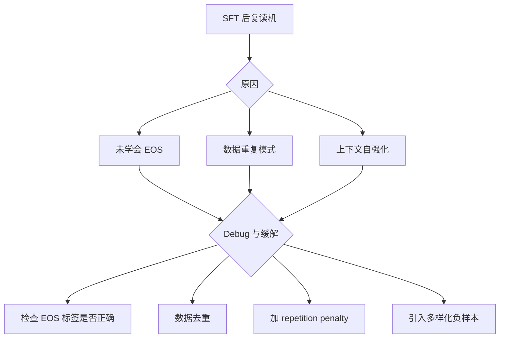

# 模型在SFT后会出现“复读机”情况该如何debug,以及出现的原因是什么

**原因分析**：
1.  **EOS Token 学习不足**：
    -   **Pre-train 阶段**：通常使用 Next Token Prediction，且大量数据是长文本拼接。模型在训练时，句尾往往紧接着另一段文本而非 EOS，导致模型缺乏强烈的“停止”意识。
    -   **SFT 阶段**：如果数据中 EOS 标记稀疏，或者 EOS 的 Loss 被平均化，模型可能会忽略 EOS。

2.  **概率循环陷阱**：
    -   生成器解码时，若模型对下一个 Token 的预测分布中，已有输出内容的 Token 概率过高（由于 Attention 机制强化了自身），模型容易陷入“重复上一个词”的死循环，导致概率分布坍塌。

3.  **数据质量问题**：
    -   训练数据中包含大量重复循环的文本（如日志文件、代码循环），模型可能将其学为一种合理的模式。

**Debug 与解决**：
1.  **增加 EOS 权重**：在计算 Loss 时，给 EOS Token 设置更高的 Loss Weight（如 2.0 或更高），强制模型学会结束。
2.  **调整采样策略**：
    -   推理时使用 `repetition_penalty` (如 1.1~1.2)。
    -   避免 Greedy Decoding，改用 Beam Search 或 Nucleus Sampling。
3.  **数据清洗**：移除训练数据中由于拼接错误导致的样本间粘连（即没有 EOS 导致两句话连在一起）。
4.  **Truncation 设置**：在生成长度达到一定阈值时强制截断，防止无限循环。

**实战案例**：
在某次金融领域问答模型微调中，训练数据包含大量“条款条款条款...”的重复文本（为了强调），导致模型生成回答时最后会陷入死循环重复“重要”二字。解决方法是清洗数据中的重复片段，并给 EOS Token 赋予 5.0 的 Loss Weight。

**代码示例**：
```python
# HuggingFace Transformers 中给 EOS Token 增加 Loss Weight
class WeightedEOSLossTrainer(Trainer):
    def compute_loss(self, model, inputs, return_outputs=False, **kwargs):
        labels = inputs.get("labels")
        # 复制一份标准权重
        loss_fct = torch.nn.CrossEntropyLoss(reduction='none')
        # ... 省略 logits 计算 ...
        losses = loss_fct(shift_logits.view(-1, self.model.config.vocab_size), shift_labels.view(-1))
        
        # 找到 EOS Token 的位置并增加权重
        eos_mask = (shift_labels == tokenizer.eos_token_id).float()
        weights = torch.ones_like(losses) + eos_mask * 4.0 # EOS 权重为 1+4=5
        loss = (losses * weights).mean()
        return (loss, outputs) if return_outputs else loss
```

## 技术原理

**Pretrain 阶段 Packing 导致缺少 EOS 学习**
预训练阶段为了提升 GPU 利用率，通常把多段文本拼接（Packing）成固定长度的序列。这导致句尾紧接着的不是 EOS Token，而是下一段文本的开头。模型在预训练中很少见到"句子结束后该输出 EOS"的模式，缺乏强烈的停止意识。这是"复读机"现象的根源之一。

**模型依赖上文 Context 进行预测**
自回归模型每次基于已有上下文预测下一个 token。当生成到某个位置时，Attention 机制会强化对自身已输出内容的关注，导致模型陷入"重复上一个词"的概率循环陷阱——概率分布坍塌到某个高频 token 上，越重复越倾向于继续重复。

**SFT 数据不足或质量差**
如果 SFT 训练数据中包含大量重复循环文本（如日志文件、法律条款的重复表述），模型会将其学为一种"合理模式"。此外若 SFT 数据中 EOS 标记稀疏，或 EOS 的 Loss 被平均化稀释，模型会忽略 EOS，不知道何时该停止生成。

**需加强 EOS 训练和惩罚重复**
解决方向有两类：训练侧——给 EOS Token 更高的 Loss Weight 强制模型学会停止，清洗训练数据中的粘连样本；推理侧——使用 repetition_penalty（重复惩罚）降低已出现 token 的概率，避免 Greedy Decoding 改用 Beam Search 或 Nucleus Sampling。

## 代码示例

```python
# HuggingFace Transformers：给 EOS Token 增加 Loss Weight
import torch
from transformers import Trainer

class WeightedEOSLossTrainer(Trainer):
    def compute_loss(self, model, inputs, return_outputs=False, **kwargs):
        labels = inputs["labels"]
        outputs = model(**inputs)
        logits = outputs.logits

        shift_logits = logits[..., :-1, :].contiguous()
        shift_labels = labels[..., 1:].contiguous()

        loss_fct = torch.nn.CrossEntropyLoss(reduction='none')
        losses = loss_fct(
            shift_logits.view(-1, shift_logits.size(-1)),
            shift_labels.view(-1)
        )

        # 找到 EOS Token 位置并赋更高权重
        eos_mask = (shift_labels.view(-1) == tokenizer.eos_token_id).float()
        weights = torch.ones_like(losses) + eos_mask * 4.0   # EOS 权重 = 5
        loss = (losses * weights).mean()
        return (loss, outputs) if return_outputs else loss
```

```python
# 推理侧：重复惩罚 + 采样防循环
outputs = model.generate(
    input_ids,
    max_new_tokens=200,
    repetition_penalty=1.2,    # 重复惩罚（1.0~1.3）
    no_repeat_ngram_size=3,    # 禁止 3-gram 重复
    do_sample=True,
    top_p=0.9,                 # 核采样替代贪心
)
```

## 注意事项

- 原因：EOS Token 学习不足或概率陷入循环陷阱。
- 解决：增加 EOS Token 的 Loss 权重，强制模型学会停止。
- 辅助：推理时使用重复惩罚，清洗数据中的粘连样本。
- 预训练 Packing 是 EOS 学习不足的根因，SFT 阶段需补充带 EOS 的完整样本。
- repetition_penalty 过高会导致输出不自然（甚至无法生成常见词），建议 1.1~1.3。

## 流程图



## 记忆要点

- 原因：EOS Token学习不足或概率陷入循环陷阱
- 解决：增加EOS Token的Loss权重，强制模型学会停止
- 辅助：推理时使用重复惩罚，清洗数据中的粘连样本


## 结构化回答

**30 秒电梯演讲：** 模型未学会 EOS 且依赖上下文，导致无限循环输出。——打个比方，像卡带了一样，不知道什么时候该停，就一直重复最后一句。

**展开框架：**
1. **原因** — EOS Token学习不足或概率陷入循环陷阱
2. **解决** — 增加EOS Token的Loss权重，强制模型学会停止
3. **辅助** — 推理时使用重复惩罚，清洗数据中的粘连样本

**收尾：** 以上三点都能配合实战聊。您想深入聊哪一块？

## 视频脚本

> 预计时长：2 分钟 | 由浅入深

| 时间 | 画面/字幕 | 口播台词 | 讲解要点 |
|------|----------|----------|----------|
| 0:00 | 标题卡 | "模型在SFT后会出现“复读机”情况该如何debug,以及出现的原因是什么，30 秒讲清楚。" | 开场钩子 |
| 0:30 | 概念定义动画 | "一句话：模型未学会 EOS 且依赖上下文，导致无限循环输出。" | 核心定义 |
| 1:00 | 原因图解 | "EOS Token学习不足或概率陷入循环陷阱" | 原因 |
| 1:30 | 总结卡 | "记好这几条，面试不慌。下期见。" | 收尾 |
