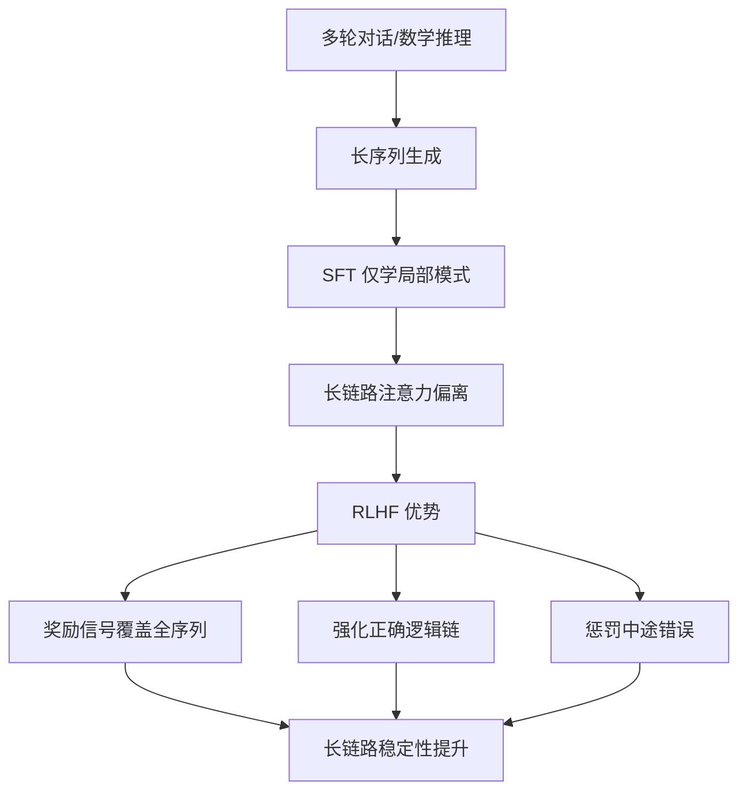
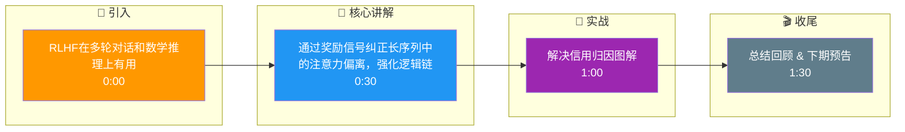

# 为什么RLHF在多轮对话和数学推理上有用

**核心原因：弥补 SFT 的“结果导向”局限，实现“过程引导”。**

1.  **解决 Credit Assignment（信用归因）问题**：
    -   在多轮对话和数学推理中，一个错误的结果往往源于推理链条早期的某一步失误。SFT 仅能从最终答案进行监督，难以纠正中间的逻辑错误。
    -   RLHF 通过 **Reward 信号回传**（如 PPO 中的 Value Function），能够根据最终 Reward 调整整条序列的策略，对导致错误的早期步骤施加惩罚，从而修正逻辑路径。

2.  **长序列注意力保持**：
    -   随着序列变长，模型的关键信息可能被 Attention 稀释。RLHF 的奖励机制鼓励模型保持对关键信息（如题目条件）的关注，直到输出最终结果，防止“跑题”。

3.  **探索超越 SFT 的最优解**：
    -   SFT 数据通常由人类撰写，质量虽高但可能不是最优解（如数学题的繁琐解法）。RL 可以通过尝试不同路径发现比人类示范更简洁或更优的推理路径。

```text
SFT vs RLHF 效果对比:

任务: 计算 23 * 45

SFT 路径 (拟合人类):
Step 1: 20*45 = 900
Step 2: 3*45 = 135
Step 3: 900+135 = 1035 (结果正确，但耗时)

RLHF 优化路径 (探索更优):
Step 1: 23*9*5 = 207*5 (探索尝试)
Step 2: 1035 (通过 Reward 验证，确认该路径更快或更准确)
若 Step 1 算错 -> Reward 低 -> 反向惩罚 Step 1 的策略参数
```

**实战案例**：
DeepSeek-Math 的训练过程中，虽然使用了大量的 SFT 数据，但在复杂数学竞赛题（如 AMC 12）上，SFT 模型容易在中间步骤产生微小计算偏差导致最终错误。引入 RL（GRPO）后，模型学会了“自我反思”式的推理路径，即当发现某一步计算复杂时，会尝试用倒推法验证，从而大幅提升了通过率。

**对比表格**：SFT 与 RLHF 在推理任务上的表现

| 特性 | SFT (监督微调) | RLHF (强化学习) |
| :--- | :--- | :--- |
| **优化目标** | 最大化与标准答案的似然度 | 最大化最终 Reward (结果/过程正确性) |
| **纠错机制** | 只能修正整体模式，无法定位中间某一步 | 通过 Reward 反向传播，精准惩罚错误的中间步 |
| **泛化能力** | 仅覆盖训练数据中的解法模式 | 能探索未见过的更优/更简洁的推理路径 |
| **长序列表现** | 容易随着推理步数增加而“遗忘”条件 | 受 Reward 激励，能始终保持对 Goal 的注意力 |

## 技术原理

**缓解长序列中的 Attention 稀释**
在多轮对话和数学推理中，序列往往很长，关键信息（如题目条件、对话开头的约束）会被 Attention 稀释——随着步数增加，模型对早期信息的注意力权重下降。RLHF 的 Reward 机制会奖励那些"始终关注关键条件直到得出结果"的生成，鼓励模型保持对 Goal 的注意力，防止"跑题"。

**利用客观结果区分推理优劣**
SFT 只能从最终答案做监督，无法定位中间步骤的错误。RLHF 通过最终 Reward 信号回传（如 PPO 的 Value Function），能根据结果好坏调整整条序列的策略——对导致错误的早期步骤施加惩罚，对正确的步骤施加奖励，实现细粒度的过程引导，这是 RLHF 在推理任务上的核心优势。

**细粒度强化每一步推理过程**
RLHF 的 Reward 信号反向传播时，会沿着生成序列的每一步分配信用（Credit Assignment）。这意味着即使最终答案正确，但中间某步推理低效，Reward 也能反映出来；反之最终错误但某些步骤有价值的也能得到部分奖励。这种细粒度反馈比 SFT 的"结果导向"更精准。

**弥补 SFT 仅拟合结果的不足**
SFT 数据由人类撰写，质量虽高但可能不是最优解——人类可能给出繁琐的解题路径。RL 可以通过探索尝试不同路径，发现比人类示范更简洁、更优的推理方式。例如数学题，RL 模型可能学会"倒推验证""分步检查"等人类未示范的策略。

## 代码示例

```text
SFT vs RLHF 在数学推理上的差异：

任务：计算 23 × 45

SFT 路径（拟合人类示范，只看结果）：
  Step 1: 20×45 = 900
  Step 2: 3×45  = 135
  Step 3: 900+135 = 1035   ✓ 结果正确但路径繁琐
  → SFT 无法知道 Step 1 是否最优，只能整体拟合

RLHF 路径（Reward 回传，过程引导）：
  Step 1: 23×9×5 = 207×5   ← 探索尝试新路径
  Step 2: = 1035           ← Reward 验证正确
  → 若 Step 1 算错 → Reward 低 → 反向惩罚 Step 1 策略
  → 若路径更简洁 → Reward 高 → 强化该路径
```

```python
# 数学推理 RL 训练（以 GRPO 为例，DeepSeek-Math 用法）
from trl import GRPOTrainer, GRPOConfig

config = GRPOConfig(
    reward_funcs=[
        "correctness_reward",    # 答案正确性（规则奖励）
        "format_reward",         # 推理格式（CoT 结构）
    ],
    beta=0.04,                   # KL 惩罚系数
    num_generations=8,           # 每个 prompt 生成 8 条用于对比
)
trainer = GRPOTrainer(
    model=sft_model,             # 基于 SFT 初始化
    reward_funcs=reward_funcs,
    args=config,
)
# RL 阶段模型学会"自我反思"式推理，提升 AMC 12 等竞赛题通过率
```

## 注意事项

- 解决信用归因：RLHF 能通过 Reward 回传修正中间推理步骤的错误。
- 长序列保持：Reward 机制鼓励模型保持对关键条件的注意力。
- 探索更优解：RL 能发现比 SFT 示范更简洁或正确的推理路径。
- 数学/代码任务可用规则 Reward（测试用例、答案匹配）替代主观 RM，杜绝 Hacking。
- RL 训练不稳定，需配合 KL 惩罚防止策略偏离 SFT 分布太远。

## 流程图



## 记忆要点

- 解决信用归因：RLHF能通过Reward回传修正中间推理步骤的错误
- 长序列保持：Reward机制鼓励模型保持对关键条件的注意力
- 探索更优解：RL能发现比SFT示范更简洁或正确的推理路径

## 结构化回答

**30 秒电梯演讲：** 通过奖励信号纠正长序列中的注意力偏离，强化逻辑链路。——打个比方，做题时不仅给答案打分，还对每一步演算过程指点，避免长跑中跑偏。

**展开框架：**
1. **解决信用归因** — RLHF能通过Reward回传修正中间推理步骤的错误
2. **长序列保持** — Reward机制鼓励模型保持对关键条件的注意力
3. **探索更优解** — RL能发现比SFT示范更简洁或正确的推理路径

**收尾：** 以上三点都能配合实战聊。我可以展开任一要点，比如「CAS 存在什么问题？如何解决」这类追问您感兴趣吗？

## 视频脚本

> 预计时长：2 分钟 | 由浅入深

| 时间 | 画面/字幕 | 口播台词 | 讲解要点 |
|------|----------|----------|----------|
| 0:00 | 标题卡 | "RLHF在多轮对话和数学推理上有用，30 秒讲清楚。" | 开场钩子 |
| 0:30 | 概念定义动画 | "一句话：通过奖励信号纠正长序列中的注意力偏离，强化逻辑链路。" | 核心定义 |
| 1:00 | 解决信用归因图解 | "RLHF能通过Reward回传修正中间推理步骤的错误" | 解决信用归因 |
| 1:30 | 总结卡 | "记好这几条，面试不慌。下期见。" | 收尾 |

### 视频流程图




