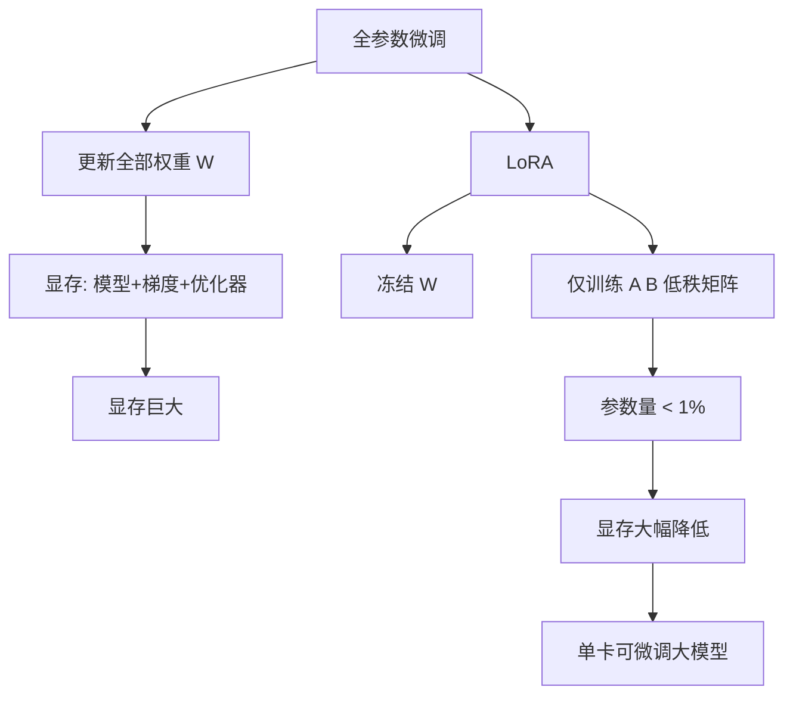

# Lora 相比全参数微调可以节省多少计算量和显存

**LoRA 相比全参数微调的资源节省**：

1. **显存 (VRAM) 节省**：
   - **训练时**：大幅减少。全量微调需要存储梯度和优化器状态（如 AdamW 需要存储一阶、二阶矩，是参数量的 2 倍）。LoRA 冻结了原模型权重，仅训练约 1%~10% 的参数，且优化器状态也仅针对这部分小参数。显存占用通常可降低 **3倍以上**（例如从 80GB 降至 24GB 级别）。
   - **推理时**：理论上无额外显存增加。LoRA 权重（$BA$）可通过 $W_{new} = W + \frac{\alpha}{r}BA$ 合并回原模型，推理时与原模型完全一致，无额外旁路开销。

2. **计算量 节省**：
   - **训练速度**：反向传播计算的参数量大幅减少，计算量从 $O(2d \cdot d)$ 降至 $O(2 \cdot r \cdot d)$（$r \ll d$），训练吞吐量通常提升 1.5~2 倍。
   - **推理速度**：合并后无额外计算开销；若不合并，会有微小的旁路计算延迟。

**原理**：
   - 基于 intrinsic dimension（本征维度）假设，即模型在特定任务上的参数更新实际上位于一个低维的子空间中，因此用低秩矩阵近似是可行的。

**实战案例**：在单张 A100 (40G) 上微调 Llama-2-7B，全量微调由于显存溢出（OOM）必须使用 DeepSpeed ZeRO-3 或 QLoRA，而使用 LoRA (rank=16) 可以直接在单卡高跑通，且 checkpoint 大小从 26GB 缩小到了 100MB 左右，极大方便了模型分发和部署。

**对比表格**：

| 指标 | 全参数微调 | LoRA 微调 |
| :--- | :--- | :--- |
| **可训练参数量** | 100% (例如 7B) | 0.1% ~ 1% (例如 10M) |
| **优化器状态显存** | 极大 (参数量的 2 倍 + 梯度) | 极小 (仅 LoRA 部分的 2 倍) |
| **训练吞吐量** | 低 (反向传播计算所有权重) | 高 (反向传播仅低秩矩阵) |
| **Checkpoint 大小** | 巨大 (数十 GB) | 极小 (MB 级别) |
| **推理延迟** | 基准 | 无差异 (权重合并后) |

**## 常见考点**
1. LoRA 为何能减少显存？（关键点：冻结主模型权重，无需为其计算梯度及存储优化器状态）
2. 推理阶段如何部署 LoRA？（合并权重 vs 旁路加法，各有何优缺点？）
3. LoRA 初始化策略为何是 A 为随机高斯分布，B 为零？（保证初始训练时 $\Delta W = 0$，模型行为与预训练模型完全一致）

## 技术原理

- **LoRA 的低秩分解**：全参数微调时，权重更新 $\Delta W \in \mathbb{R}^{d \times d}$。LoRA 假设 $\Delta W$ 是低秩的，用 $\Delta W = BA$ 近似，其中 $B \in \mathbb{R}^{d \times r}$，$A \in \mathbb{R}^{r \times d}$，$r \ll d$（如 $r=8$ vs $d=4096$）。参数量从 $d^2$（如 1677 万）降到 $2rd$（如 6.5 万），减少 256 倍。前向计算 $y = Wx + BAx$，$\Delta W = BA$ 在推理时可合并回 $W$。
- **显存节省的本质——优化器状态消失**：AdamW 优化器为每个可训练参数存①梯度 + ②一阶矩 + ③二阶矩，共 **3× 参数量**显存。全参数微调 7B 模型需要 7B×3×4字节(fp32) ≈ 84GB 优化器状态。LoRA 冻结主权重（不存梯度/状态），只对 LoRA 的 ~1% 参数存优化器状态，优化器显存从 84GB 降到 ~1GB。**这是 LoRA 省 3 倍显存的根本原因**——不是省了主权重本身，而是省了主权重对应的"梯度+优化器状态"。
- **本征维度（Intrinsic Dimension）的理论支撑**：Aghajanyan 等人发现，预训练模型在下游任务上的"有效参数维度"远小于参数总量——一个 7B 模型可能只需调整 ~10K 个参数就能学会新任务。这说明 $\Delta W$ 确实是低秩的，LoRA 的假设成立。但**对全新领域或大改动**（如学一门新语言），低秩假设可能失效，需要更大的 $r$ 或全参数微调。
- **初始化技巧（A 高斯、B 零）**：LoRA 中 $A$ 用高斯随机初始化，$B$ 初始化为 0。这样训练开始时 $BA = 0$，$\Delta W = 0$，模型行为完全等同预训练模型——避免随机初始化破坏预训练能力。若 $A$、$B$ 都随机，初始 $\Delta W \neq 0$，训练初期模型输出会乱。

## 命令演示

```python
from peft import LoraConfig, get_peft_model, TaskType
from transformers import AutoModelForCausalLM

model = AutoModelForCausalLM.from_pretrained("meta-llama/Llama-2-7b", torch_dtype="auto")

# LoRA 配置
config = LoraConfig(
    r=16,                                    # 秩，常见 8/16/32/64
    lora_alpha=32,                           # 缩放系数，通常 = 2r
    target_modules=["q_proj", "k_proj", "v_proj", "o_proj",
                    "gate_proj", "up_proj", "down_proj"],   # 应用到所有线性层
    lora_dropout=0.05,
    bias="none",
    task_type=TaskType.CAUSAL_LM,
)
model = get_peft_model(model, config)
model.print_trainable_parameters()
# 输出: trainable params: 13,631,488 || all params: 6,755,430,400 || trainable%: 0.20%

# ===== 训练后合并（推理零开销）=====
merged_model = model.merge_and_unload()
merged_model.save_pretrained("./llama-7b-lora-merged")

# ===== 不合并的多 LoRA 切换（vLLM/PEFT 推理）=====
# 同一基础模型挂多个 LoRA，按请求切换，节省显存
# vLLM 启动: --enable-lora --lora-modules sql=./lora-sql code=./lora-code
```

QLoRA（4bit 量化 + LoRA）进一步省显存：

```python
from transformers import BitsAndBytesConfig
bnb_config = BitsAndBytesConfig(
    load_in_4bit=True,                       # 基础模型 4bit 量化
    bnb_4bit_quant_type="nfpack",
    bnb_4bit_compute_dtype="float16",
)
# 7B 模型显存从 14GB(fp16) 降到 ~4GB(4bit)，LoRA 部分仍 fp16 训练
```

## 对比/选型

| 维度 | 全参数微调 | LoRA | QLoRA | Adapter |
|------|-----------|------|-------|---------|
| 可训练参数 | 100% | 0.1~1% | 0.1~1% | 1~5% |
| 训练显存（7B） | 80GB+ | 24GB | 8GB | 30GB |
| Checkpoint 大小 | 26GB | ~100MB | ~100MB | ~500MB |
| 训练速度 | 慢 | 快（1.5~2x） | 中（量化开销） | 中 |
| 推理开销 | 无 | 无（合并后） | 无（合并后） | 有（额外层） |
| 效果上限 | 最高 | 接近全参（r 足够大时） | 略低于 LoRA | 接近全参 |
| 适用 | 大改动、新领域 | 通用微调 | 消费级 GPU | 多任务 |

## 常见坑/注意事项

- **rank $r$ 的选择**：$r$ 太小（如 4）学不到复杂任务，太大（如 256）失去 LoRA 优势。通用任务 $r=16$ 起，复杂领域（代码、数学）建议 $r=64$。**不要盲目追大**——超过某个 $r$ 后效果饱和，但显存线性涨。
- **target_modules 必须覆盖关键层**：只挂 `q_proj`/`v_proj`（早期 LoRA 论文做法）效果有限。现代实践建议挂**所有线性层**（attention 的 q/k/v/o + FFN 的 gate/up/down），效果接近全参微调。
- **`lora_alpha` 的缩放**：实际生效的 $\Delta W = \frac{\alpha}{r} BA$。$\alpha$ 通常设为 $2r$（如 $r=16, \alpha=32$），让 $\Delta W$ 的数值范围与 $W$ 匹配。$\alpha$ 太大会让 LoRA 主导，破坏预训练能力。
- **LoRA 不能学"全新能力"**：低秩假设意味着 LoRA 擅长"微调已有能力"（如风格调整、领域适配），但不擅长"学全新知识"（如让英语模型学中文）。后者要全参数微调或 Continued Pretraining。
- **多 LoRA 合并的冲突**：多个 LoRA（如 SQL + Code）合并时可能权重冲突，效果下降。用 TIES-merge 或 DARE 等智能合并算法，或保留多 LoRA 在推理时动态切换（vLLM 支持）。

## 流程图




## 记忆要点

- 显存大幅降低：因冻结主权重，无需为其存梯度和优化器状态(省3倍以上显存)。
- Checkpoint极小：可训练参数量从100%降至约1%，保存体积由GB级降至MB级。
- 训练速度提升：反向传播计算量从$O(d^2)$降至$O(rd)$，吞吐量显著提升。
- 推理零开销：因为权重可无损合并($W_{new}=W+BA$)，所以推理显存和延迟与原模型一致。


## 结构化回答

**30 秒电梯演讲：** 通过低秩近似减少优化参数，大幅降低显存和计算开销。——打个比方，把搬整个家变成只搬几件重要家具，省车又省力。

**展开框架：**
1. **显存大幅降低** — 因冻结主权重，无需为其存梯度和优化器状态(省3倍以上显存)。
2. **Checkpoi** — Checkpoint极小：可训练参数量从100%降至约1%，保存体积由GB级降至MB级。
3. **训练速度提升** — 反向传播计算量从$O(d^2)$降至$O(rd)$，吞吐量显著提升。

**收尾：** 以上三点都能配合实战聊。您想深入聊哪一块？

## 视频脚本

> 预计时长：2 分钟 | 由浅入深

| 时间 | 画面/字幕 | 口播台词 | 讲解要点 |
|------|----------|----------|----------|
| 0:00 | 标题卡 | "Lora 相比全参数微调可以节省多少计算量和显存，30 秒讲清楚。" | 开场钩子 |
| 0:30 | 概念定义动画 | "一句话：通过低秩近似减少优化参数，大幅降低显存和计算开销。" | 核心定义 |
| 1:00 | 显存大幅降低图解 | "因冻结主权重，无需为其存梯度和优化器状态(省3倍以上显存)。" | 显存大幅降低 |
| 1:30 | 总结卡 | "记好这几条，面试不慌。下期见。" | 收尾 |
