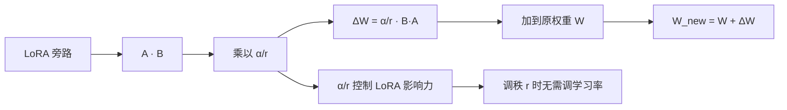

# 知道Lora中的scale吗

$h = W x + \Delta W x = W x + (\alpha/r) B A x$，其中 $\alpha$ 是一个常数缩放因子，$r$ 是秩。

**详细解析**：
- $A \in \mathbb{R}^{r \times k}$, $B \in \mathbb{R}^{d \times r}$，其中 $k, d$ 是输入/输出维度，$r \ll \min(d, k)$。
- **缩放因子 $\alpha$**：用于在调整秩 $r$ 时平衡训练的稳定性。由于更新量 $\Delta W = \frac{\alpha}{r}BA$，当改变 $r$ 时，若不调整 $\alpha$，更新的初始幅度会变化（$A$ 初始化方差通常为 $1/r$）。
- **参数设置**：调整 $\alpha$ 大致等同于调整学习率。通常将 $\alpha$ 设置为 $r$（如 $r=8, \alpha=16$ 或 $r=8, \alpha=8$），使得缩放比为 1，简化调参。

**实战案例**：在一次代码生成任务微调中，我将 rank 从 8 增加到 64 但保持 alpha=16，结果模型 Loss 震荡不收敛。这是因为 $\alpha/r$ 变成了 0.25，导致有效更新步长过小。随后我将 alpha 同步调整为 64，训练迅速恢复稳定，这说明调节 ratio 比单纯调节 r 更关键。

**代码示例**：
```python
# 伪代码：LoRA 缩放计算
def forward(x, W, lora_A, lora_B, alpha, rank):
    # 原始输出
    base_out = torch.nn.functional.linear(x, W)
    # LoRA 旁路
    lora_out = torch.nn.functional.linear(
        torch.nn.functional.linear(x, lora_A), 
        lora_B
    )
    # 关键：应用 scaling 因子
    scaling = alpha / rank 
    return base_out + lora_out * scaling
```

**## 常见考点**
1. 为什么 $\alpha$ 通常设置为 $r$？（为了在不同秩下保持相似的初始化更新幅度）
2. 如果 $r$ 设置得过大（接近 $d$），LoRA 还有效吗？（退化为全量微调，失去了节省显存的优势）

## 技术原理

LoRA 缩放因子的设计动机来自「跨秩训练稳定性」这一深层问题：

- **初始化方差的耦合**：LoRA 中 $A$ 用高斯分布 $\mathcal{N}(0, \sigma^2)$ 初始化，$B$ 初始化为零。第一步反向传播后 $B$ 获得梯度，$\Delta W = BA$ 的方差近似为 $\text{Var}(\Delta W) \propto r \cdot \sigma_A^2 \cdot \text{Var}(\nabla B)$。$A$ 的初始化方差常取 $\sigma_A^2 = 1/r$，因此 $\Delta W$ 的初始尺度与 $r$ 强耦合。
- **缩放因子的解耦作用**：引入 $\alpha/r$ 后，有效更新变为 $(\alpha/r) \cdot BA$，把 $r$ 从初始幅度公式中约掉，让「调秩」和「调学习率」解耦——换 $r$ 不再需要重新调学习率，这是 LoRA 工程化的关键。
- **等价于学习率缩放**：从优化视角看，$\alpha/r$ 完全可以吸收进 $A$、$B$ 的学习率里。但显式写出来有两个好处：(1) 论文可复现性强；(2) 框架层面统一管理 scaling，避免不同 rank 配置的代码分叉。
- **QLoRA 的延伸**：QLoRA 在 4-bit 量化基座上叠加 LoRA，此时 $\alpha$ 还承担「补偿量化误差」的作用，通常把 $\alpha$ 设得更大（如 $r=16, \alpha=32$ 甚至 64）以增强旁路表达能力。

## 注意事项

- **盲目调大 $\alpha$ 会有副作用**：过大的 $\alpha$ 等效于过大的学习率，初期 Loss 震荡甚至发散，且容易过拟合偏好数据。一般 $\alpha/r \in [1, 2]$ 是安全区。
- **多 LoRA 适配器的 scaling**：当同时挂载多个 LoRA（如多任务适配器）做加权和时，每个适配器的 $\alpha$ 需独立缩放，否则权重失衡。常见错误是直接相加。
- **rank 自适应方法**：AdaLoRA 等方法让 $r$ 在训练中动态变化，此时 $\alpha$ 也需同步更新，否则 scaling 公式失效。
- **推理时是否合并**：合并权重 $\hat{W} = W + (\alpha/r) BA$ 后无延迟；不合并（多租户场景）每次前向多一次矩阵乘，需要保留 scaling 系数。
- **不同框架的默认值差异**：PEFT 默认 $\alpha=8$；Hugging Face 的 LoRA 示例常用 $\alpha=2r$；原论文实验用 $\alpha=r$。迁移代码时务必检查 $\alpha$ 是否同步调整，否则相同 rank 下行为差异很大。
- **scaling 与 dropout 的交互**：LoRA 旁路常加 dropout 防过拟合。dropout 在 scaling 之前应用时，有效更新幅度会被随机缩减；放在 scaling 之后则保持。框架实现各异，对收敛速度有影响。
- **不同 rank 下 $\alpha$ 的经验值**：$r=4$ 时常用 $\alpha=8$（比例 2）；$r=8$ 时 $\alpha=8$ 或 16；$r=64$ 时 $\alpha=64$。规律是 rank 越大，$\alpha/r$ 越接近 1，因为高 rank 本身表达力够强，不需要额外放大。
- **跨任务迁移时 $\alpha$ 要重标定**：在 NLP 任务上调好的 LoRA 配置直接迁移到代码任务可能失效，因为不同任务的梯度尺度差异大。迁移时建议先用 grid search 在小数据上扫 $\alpha \in \{r/2, r, 2r\}$。

## 流程图



## 核心知识点图


## 记忆要点

- 缩放公式：更新量需乘以$scaling=\alpha/r$，用于调整旁路更新幅度。
- 调参核心：调$\alpha$等同于调学习率，通常设为$r$的1或2倍（如$r=8, \alpha=16$）。
- 关键作用：因为改变秩$r$会影响初始更新幅度，所以需要$\alpha$来稳定不同秩下的训练。


## 结构化回答

**30 秒电梯演讲：** LoRA通过缩放因子α/r控制低秩更新的影响。——打个比方，就像调节音量旋钮，α/r 相当于音量大小，控制更新声音的强弱。

**展开框架：**
1. **缩放公式** — 更新量需乘以$scaling=\alpha/r$，用于调整旁路更新幅度。
2. **调参核心** — 调$\alpha$等同于调学习率，通常设为$r$的1或2倍（如$r=8, \alpha=16$）。
3. **关键作用** — 因为改变秩$r$会影响初始更新幅度，所以需要$\alpha$来稳定不同秩下的训练。

**收尾：** 以上三点都能配合实战聊。您想深入聊哪一块？

## 视频脚本

> 预计时长：2 分钟 | 由浅入深

| 时间 | 画面/字幕 | 口播台词 | 讲解要点 |
|------|----------|----------|----------|
| 0:00 | 标题卡 | "知道Lora中的scale吗，30 秒讲清楚。" | 开场钩子 |
| 0:30 | 概念定义动画 | "一句话：LoRA通过缩放因子α/r控制低秩更新的影响。" | 核心定义 |
| 1:00 | 缩放公式图解 | "更新量需乘以$scaling=\alpha/r$，用于调整旁路更新幅度。" | 缩放公式 |
| 1:30 | 总结卡 | "记好这几条，面试不慌。下期见。" | 收尾 |
