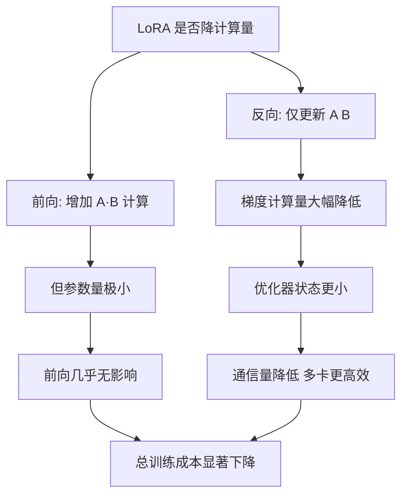

# Lora是否能降低计算量

LoRA 确实能降低计算量，主要体现在梯度计算和通信开销上。

**1. 梯度计算量降低**：
全参数微调需要对 $W$ 计算梯度。LoRA 冻结了 $W$，只需对低秩矩阵 $A$ 和 $B$ 计算梯度。

计算公式对比：
- 全量微调权重更新：$W \leftarrow W - \eta \cdot \frac{\partial L}{\partial W}$ （计算量 $O(d^2)$）
- LoRA 权重更新：$A \leftarrow A - \eta \cdot \frac{\partial L}{\partial A}$, $B \leftarrow B - \eta \cdot \frac{\partial L}{\partial B}$ （计算量 $O(r \cdot d)$，$r \ll d$）

**2. 其他优化原因**：
1. **只更新了部分参数**：比如 LoRA 原论文选择只更新 Attention 中的 $W_q, W_v$，实际使用时还可以选择只更新部分层（如仅后几层）的参数，进一步减少计算。
2. **减少了通信时间**：由于更新的参数量变少了，在多卡分布式训练（如 DDP、ZeRO）时，梯度同步和参数广播的数据量大幅减少，从而减少了传输时间（通信往往是瓶颈）。
3. **采用了低精度加速技术**：配合 FP16、BF16 混合精度训练，或 FP8/INT8 量化技术，加速矩阵乘法运算。

**实战案例**：在 8 卡 A100 集群上对 70B 模型进行全量微调时，GPU 利用率经常掉到 40% 以下，主要卡在梯度同步上。切换到 LoRA 后，由于梯度参数量减少了 100 倍，通信耗时几乎可以忽略，整体训练速度提升了约 2.5 倍，且能够使用更大的 Batch Size（从 16 提升到 128）。

**代码示例**：
```python
# 仅对特定层启用 LoRA 以进一步降低计算量
lora_config = LoraConfig(
    target_modules=["q_proj", "v_proj"], # 仅微调 Attention 中的 Q/V，跳过 MLP
    modules_to_save=["embed_tokens", "lm_head"], # 可选：不冻结这些层
    r=16, 
    lora_alpha=32
)
```

**## 常见考点**
1. LoRA 在训练时的速度提升主要是由于计算量减少还是显存优化带来的？（两者皆有，但显存优化允许更大的 Batch Size，从而提高吞吐量）
2. 在推理阶段，LoRA 模型是否比原模型慢？（如果不合并权重，由于增加了额外的 BA 矩阵乘法，会有轻微延迟；合并后无差异）

## 技术原理

LoRA 对计算量的优化发生在三个不同层次，需要分别拆解：

- **梯度计算量**：全量微调对 $W \in \mathbb{R}^{d \times k}$ 求梯度，反传计算量正比于 $O(d \cdot k)$；LoRA 冻结 $W$，只对 $A \in \mathbb{R}^{r \times k}$ 和 $B \in \mathbb{R}^{d \times r}$ 求梯度，反传量降为 $O(r(d+k))$。当 $r \ll d, k$ 时（典型 $r=8, d=4096$），梯度计算量下降 500 倍以上。
- **前向计算量几乎不变**：前向多了 $BAx$ 的低秩矩阵乘，开销约 $O(r(d+k) \cdot \text{batch})$，相比主网络 $O(d \cdot k \cdot \text{batch})$ 可忽略。所以「前向变慢」是误区，瓶颈一直在反传和通信。
- **通信量**：分布式训练中 AllReduce 同步梯度，数据量正比于可训练参数量。LoRA 把参数量从数十亿降到数百万，通信包缩小三个数量级，这是多卡训练加速的主因。
- **显存优化 → 间接加速**：优化器状态（Adam 的 $m, v$）与可训练参数成正比。LoRA 把优化器显存从 $12 \cdot |W|$ 降到 $12 \cdot |A+B|$，腾出的显存可用于增大 batch size，吞吐量进一步提升。

## 注意事项

- **并非所有层都该加 LoRA**：经验上 Attention 的 $W_q, W_v$ 加 LoRA 收益最大，MLP 的 $W_{\text{gate}}, W_{\text{up}}$ 次之，embedding 和 lm_head 通常全量训练或冻结。盲目给所有层加 LoRA 会增加显存而收益有限。
- **学习率要重新调**：LoRA 参数少，通常需要比全量微调大 5~10 倍的学习率（如 $1\text{e-4}$ vs $1\text{e-5}$），否则收敛慢。
- **梯度检查点与 LoRA 的配合**：开启 gradient checkpointing 时，LoRA 的反向需要重算前向，注意框架（如 PEFT）是否正确处理了 LoRA 层的重算逻辑，否则会出现梯度断裂。
- **通信优化的边界**：当卡数较少（如 2 卡）时通信不是瓶颈，LoRA 的通信优势不明显；8 卡以上、尤其是跨节点时收益才显著。
- **DeepSpeed ZeRO 与 LoRA 的配合**：ZeRO-2/3 切分优化器状态和梯度，与 LoRA 组合可进一步降低单卡显存。但 ZeRO 切分会增加通信，需与 LoRA 的通信节省权衡，通常 ZeRO-1 + LoRA 是性价比最优解。
- **混合精度训练的注意点**：LoRA 的 A/B 矩阵用 BF16/FP16 训练时，scaling 的累加可能因精度丢失导致数值不稳。关键层（如 lm_head 附近的 LoRA）建议保持 FP32 主权重，或用 BF16（动态范围大于 FP16）。

## 流程图




## 记忆要点

- 梯度计算锐减：因只对旁路矩阵求导，计算量从全量$O(d^2)$降至低秩$O(rd)$。
- 通信开销极小：因为分布式训练只需同步极少量的LoRA梯度，打破多卡通信瓶颈。
- 显存优化间接提速：因为显存占用大幅降低，所以允许使用更大Batch Size提高吞吐量。
- 部分更新策略：可通过仅微调注意力机制(如Q/V)或特定网络层来进一步降低计算量。


## 结构化回答

**30 秒电梯演讲：** 减少参数更新量，降低通信开销，结合低精度技术——打个比方，就像装修房子时只更换部分家具和灯具，而不是重建整个房子，省时省力。

**展开框架：**
1. **梯度计算锐减** — 因只对旁路矩阵求导，计算量从全量$O(d^2)$降至低秩$O(rd)$。
2. **通信开销极小** — 因为分布式训练只需同步极少量的LoRA梯度，打破多卡通信瓶颈。
3. **显存优化间接提速** — 因为显存占用大幅降低，所以允许使用更大Batch Size提高吞吐量。

**收尾：** 以上三点都能配合实战聊。您想深入聊哪一块？

## 视频脚本

> 预计时长：2 分钟 | 由浅入深

| 时间 | 画面/字幕 | 口播台词 | 讲解要点 |
|------|----------|----------|----------|
| 0:00 | 标题卡 | "Lora是否能降低计算量，30 秒讲清楚。" | 开场钩子 |
| 0:30 | 概念定义动画 | "一句话：减少参数更新量，降低通信开销，结合低精度技术" | 核心定义 |
| 1:00 | 梯度计算锐减图解 | "因只对旁路矩阵求导，计算量从全量$O(d^2)$降至低秩$O(rd)$。" | 梯度计算锐减 |
| 1:30 | 总结卡 | "记好这几条，面试不慌。下期见。" | 收尾 |
