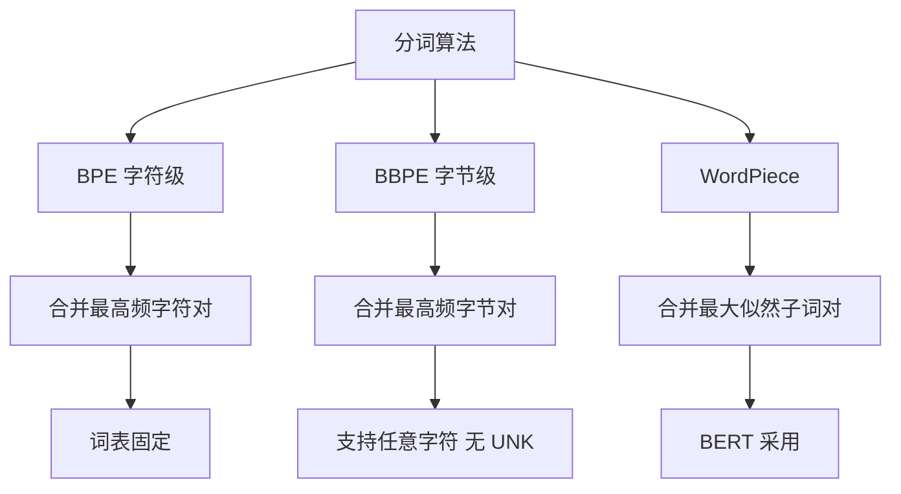

# 大模型中常用的分词算法有哪些?BPE和BBPE的区别是什么

分词是将文本切分为模型可处理的最小单元的过程。常见的分词粒度包括：

### 三种分词粒度
| 粒度 | 描述 | 优点 | 缺点 |
| :--- | :--- | :--- | :--- |
| **Word** | 按词切分 | 保留完整语义 | 词表巨大，存在OOV问题 |
| **Char** | 按字符切分 | 词表极小，无OOV | 序列过长，语义信息弱 |
| **Subword** | 按子词切分 | 平衡词表大小与语义表达能力 | 现代LLM的主流选择 |

### 主流分词算法
1. **BPE (Byte Pair Encoding)**
   - **原理**：从字符级开始，迭代合并语料中出现频率最高的相邻字节对，直到达到预设词表大小。
2. **WordPiece**
   - **原理**：类似 BPE，但合并准则是选择能使训练数据似然概率最大化的一对子词（BERT 使用）。
3. **Unigram LM**
   - **原理**：初始化一个大词表，通过统计语言模型计算每个 token 的损失，逐步删除对总似然贡献最小的 token。
4. **BBPE (Byte-level BPE)**
   - **原理**：直接在字节序列上进行 BPE 操作，将文本转为 UTF-8 字节后再合并。

### BPE vs BBPE 的区别
| 维度 | BPE | BBPE |
| :--- | :--- | :--- |
| **操作层级** | Unicode 字符级别 | 字节 级别 |
| **未知词处理** | 存在 OOV 风险 (特殊字符) | 天然无 OOV (覆盖所有字节) |
| **多语言支持** | 弱 (需扩充词表) | 强 (所有文本转为字节流) |
| **复杂度** | 低 | 中 (序列长度略增加) |
| **代表模型** | LLaMA (SentencePiece), RoBERTa | GPT-2/3/4, Qwen (tiktoken) |

- **实战案例**：在国际化电商评论分析中，使用BPE时经常无法切分泰卢固语等小语种生僻字符，导致数据丢失；切换至BBPE后所有Unicode字符均可正常编码，数据召回率提升至100%。

- **代码示例 (Python - HuggingFace Tokenizers)**：
```pythonnfrom tokenizers import Tokenizer, models, trainers

# BBPE implementation (base on bytes)
tokenizer = Tokenizer(models.BPE(continuing_subword_prefix=''))
trainer = trainers.BpeTrainer(vocab_size=30000, special_tokens=["<s>", "<pad>", "</s>", "<unk>"])
# Training on bytes requires pre-processing text to byte strings
```

## 技术原理

**BPE 通过高频合并生成词表**
BPE（Byte Pair Encoding）从字符级开始，迭代统计语料中出现频率最高的相邻字节对（byte pair）并合并为一个新 token，直到达到预设词表大小。它优先合并高频组合，最终词表既包含单字符也包含常用子词和完整词。BPE 在 Unicode 字符级别操作，对于训练集未出现的生僻字符仍存在 OOV（Out-Of-Vocabulary）风险。

**BBPE 在字节层面操作，支持任意字符**
BBPE（Byte-level BPE）是 BPE 的字节级版本：先将文本转为 UTF-8 字节序列（每个字符 1~4 字节），再在字节序列上做 BPE 合并。因为 UTF-8 字节只有 256 种，覆盖了所有 Unicode 字符，所以 BBPE 天然无 OOV——任何语言的任何字符都能被编码，多语言支持更强。代价是序列长度略增加（多字节字符拆得更细）。

**Subword 是主流方案，平衡了词表大小和语义**
Word 分词语义完整但词表巨大（百万级）且 OOV 严重；Char 分词无 OOV 但序列过长、语义信息弱。Subword（子词）是折中——常用词保持完整（如 "the"、"学习"），罕见词拆为子词组合（如 "unhappiness" → "un" + "happiness"），平衡了词表大小（通常 3~10 万）和语义表达，是现代 LLM 的主流选择。

**WordPiece 与 Unigram：不同的合并/删减策略**
WordPiece（BERT 使用）类似 BPE，但合并准则是选择能使训练数据似然概率最大化的一对子词，而非最高频率。Unigram（SentencePiece 支持）反向操作——初始化大词表，通过语言模型计算每个 token 对总似然的贡献，逐步删除贡献最小的 token。BPE 是"自底向上合并"，Unigram 是"自顶向下删减"。

## 代码示例

```python
# HuggingFace Tokenizers：训练 BBPE 分词器
from tokenizers import Tokenizer, models, trainers, pre_tokenizers, decoders

tokenizer = Tokenizer(models.BPE())   # BBPE 基于字节
tokenizer.pre_tokenizer = pre_tokenizers.ByteLevel(add_prefix_space=True)
tokenizer.decoder = decoders.ByteLevel()

trainer = trainers.BpeTrainer(
    vocab_size=50000,
    special_tokens=["<|endoftext|>", "<|im_start|>", "<|im_end|>"],
)
tokenizer.train(files=["corpus.txt"], trainer=trainer)
# GPT-2/3/4、Qwen 都用 BBPE（tiktoken 库）
```

```python
# 对比 BPE vs BBPE 对生僻字符的处理
from transformers import AutoTokenizer

# BBPE（GPT-2）：任意 Unicode 都能编码，无 OOV
bbpe_tok = AutoTokenizer.from_pretrained("gpt2")
print(bbpe_tok.encode("안녕하세요"))   # 韩语也能编码，返回字节级 token

# 传统 BPE（LLaMA 用 SentencePiece）：可能产生 <unk>
sp_tok = AutoTokenizer.from_pretrained("hf-internal-testing/llama-tokenizer")
# 某些未在训练集中的生僻字符可能变为 <unk>
```

## 注意事项

- BPE 是字符级合并，BBPE 是字节级合并，BBPE 天然无 OOV 且多语言支持更强。
- Subword 是主流，平衡词表大小与语义，Word 有 OOV，Char 序列过长。
- BPE 迭代合并高频字节对，WordPiece 选似然最大，Unigram 逐步删减低贡献 Token。
- 词表大小通常 3~10 万：太小增加序列长度（推理慢），太大增加 embedding 参数。
- SentencePiece 不依赖空格预分词，对中文/日文等无空格语言更友好。

## 流程图



## 记忆要点

- BPE是字符级合并，BBPE是字节级合并，BBPE天然无OOV且多语言支持更强
- Subword是主流，平衡词表大小与语义，Word有OOV，Char序列过长
- BPE迭代合并高频字节对，WordPiece选似然最大，Unigram逐步删减低贡献Token


## 结构化回答

**30 秒电梯演讲：** 将文本压缩为模型词典中的整数序列，在效率和信息保留间寻求平衡。——打个比方，把句子拆成乐高积木块，既要有固定的常用大块，也要有灵活的小块。

**展开框架：**
1. **BPE是字符级合** — BPE是字符级合并，BBPE是字节级合并，BBPE天然无OOV且多语言支持更强
2. **Subword是** — Subword是主流，平衡词表大小与语义，Word有OOV，Char序列过长
3. **BPE迭代合并高** — BPE迭代合并高频字节对，WordPiece选似然最大，Unigram逐步删减低贡献Token

**收尾：** 以上三点都能配合实战聊。我可以展开任一要点，比如「为什么SentencePiece不依赖预分词(空格切分)」这类追问您感兴趣吗？

## 视频脚本

> 预计时长：2 分钟 | 由浅入深

| 时间 | 画面/字幕 | 口播台词 | 讲解要点 |
|------|----------|----------|----------|
| 0:00 | 标题卡 | "大模型中常用的分词算法有哪些，30 秒讲清楚。" | 开场钩子 |
| 0:30 | 概念定义动画 | "一句话：将文本压缩为模型词典中的整数序列，在效率和信息保留间寻求平衡。" | 核心定义 |
| 1:00 | 要点图解 | "BPE是字符级合并，BBPE是字节级合并，BBPE天然无OOV且多语言支持更强" | 要点 |
| 1:30 | 总结卡 | "记好这几条，面试不慌。下期见。" | 收尾 |
