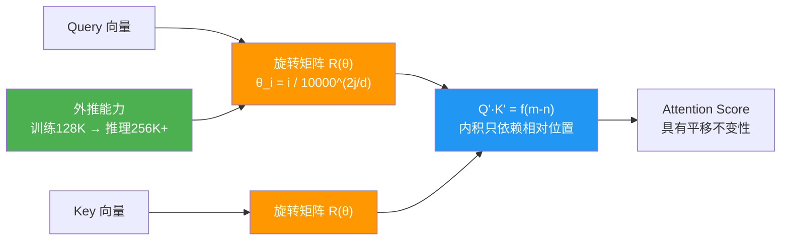

# RoPE如何实现长度外推?NTK-aware、YaRN、Dynamic Scaling有什么区别

**RoPE的长度外推问题：** 模型在4K长度上训练,推理时超过4K效果骤降.

**核心问题：** RoPE的频率theta_i = 10000^(-2i/d),超出训练最大位置L_train后注意力分布外推效果差.

- **主流外推方案:**

| 方法 | 核心思想 | 优点 | 缺点 |
|------|---------|------|------|
| Position Interpolation (PI) | 将目标位置线性缩放到训练范围 | 实现简单 | 需要少量微调 |
| NTK-aware | 调整base频率theta | 无需微调效果尚可 | 低频区域分辨率降低 |
| Dynamic NTK | 推理时动态调整base | 自适应性好 | 计算开销略增 |
| YaRN | 分频段插值:高频NTK+低频PI | 效果最好 | 实现复杂 |

- **YaRN核心:**
1. 高频区域(短波长):保持不变(局部注意力不受影响)
2. 低频区域(长波长):使用PI插值(全局位置需精确缩放)
3. 中间区域:平滑过渡
4. 引入温度系数alpha调整注意力分布
5. 效果:LLaMA-2从4K扩展到128K,几乎无损

- **补充原理细节:**
**RoPE 公式：** $f(q, m) = (q_m e^{im\theta})$，其中位置索引 $m$ 被注入到旋转角度中。
外推的本质问题在于：当 $m > L_{train}$ 时，模型从未见过这么大的旋转角度，导致注意力分数混乱。

**NTK-aware Scaling 原理：**
不再缩放位置索引 $m$，而是通过改变 base ($10000 \to b'$) 来改变频率 $\theta_i$。公式变为：$\theta'_i = b'^{-2i/d}$。
对于高频维度，我们要保持分辨率（即 $\theta$ 变化快），所以不能大幅缩放；对于低频维度，我们需要扩展感知范围。
NTK-aware 通过数学推导（保持最大频率 $\theta_{max}$ 不变）反推出一个新的 base，使得高频部分的相对位置关系尽量保持不变。

```text
Frequency Spectrum (i from 0 to d/2)
High Freq (i small) ───────────┐    (Local details)
                              │\
Low Freq (i large)  ──────────│─\\─── (Global context)
                              │  \\
Original Base (10000)         │   └──> Trained up to 4K
                              │
Extrapolation (>4K)           │
  - PI:     Scale m (Linear)  │    Positions mapped into [0, 4096]
  - NTK:    Scale Base (Exp)  │    Frequencies stretched to fit larger m
  - YaRN:   Scale m (Non-lin) │    Mix of both based on frequency band
```

## 常见考点
1. **RoPE 的优势**：相比于绝对位置编码和相对位置编码（T5 Bias），RoPE 有什么核心优势？（随着距离增加，相对位置编码的矩阵呈现衰减特性，且通过旋转矩阵相乘完美结合了相对位置信息和绝对位置注入，便于外推）。
2. **Linear Scaling (NAI)**：最简单的直接把位置 index 除以一个系数（如推理长度/训练长度）有什么问题？（会破坏高频特征，导致模型“近视”，丢失局部细节信息）。
3. **Attention Sink**：在外推非常长的序列时，开头的 token 往往会变成 Attention Sink（接受大量无关注意力），如何缓解？（通常在训练时加入特殊的 pad token 或者通过位置编码偏置）。

- **实战案例:** 在长文档问答系统中，直接使用训练长度为 4k 的 LLaMA 2 推理 10k 长度的文档时，模型会出现“重复输出”或“胡言乱语”。应用 NTK-aware Scaling 后，模型能基本理解全文，但在指代开头信息时仍可能出错；而使用 YaRN 可在无微调情况下稳定支持 16k 长度。

- **代码示例:**
```python
# 简单的 Dynamic NTK Scaling 实现逻辑
def apply_dynamic_ntk_scaling(inv_freq, seq_len, base=10000):
    # seq_len: 当前推理的实际长度
    # inv_freq: 原始的 1/theta (1/10000^(2i/d))
    if seq_len > 4096: # 假设训练长度为4096
        # 动态调整 base
        scale = seq_len / 4096
        new_base = base * scale
        # 重新计算 inv_freq
        inv_freq = 1.0 / (new_base ** (torch.arange(0, dim, 2).float() / dim))
    return inv_freq
```


## 核心流程图



## 记忆要点

- RoPE外推本质是处理训练长度外位置注意力混乱，核心是调整频率Base
- NTK-aware通过缩放Base频率拉伸，YaRN分频段插值(高频NTK+低频PI)
- YaRN效果最好，无需微调即可将4K扩展至128K且几乎无损


## 结构化回答

**30 秒电梯演讲：** 通过位置编码缩放或插值，突破训练长度的限制——打个比方，把长尺子折叠到短格子里，或者拉伸尺子刻度以适应更长距离

**展开框架：**
1. **RoPE外推本质** — RoPE外推本质是处理训练长度外位置注意力混乱，核心是调整频率Base
2. **NTK-awar** — NTK-aware通过缩放Base频率拉伸，YaRN分频段插值(高频NTK+低频PI)
3. **YaRN效果最好** — YaRN效果最好，无需微调即可将4K扩展至128K且几乎无损

**收尾：** 以上三点都能配合实战聊。我可以展开任一要点，比如「为什么高频分量不需要插值」这类追问您感兴趣吗？

## 视频脚本

> 预计时长：2 分钟 | 由浅入深

| 时间 | 画面/字幕 | 口播台词 | 讲解要点 |
|------|----------|----------|----------|
| 0:00 | 标题卡 | "RoPE如何实现长度外推，30 秒讲清楚。" | 开场钩子 |
| 0:30 | 概念定义动画 | "一句话：通过位置编码缩放或插值，突破训练长度的限制" | 核心定义 |
| 1:00 | 要点图解 | "RoPE外推本质是处理训练长度外位置注意力混乱，核心是调整频率Base" | 要点 |
| 1:30 | 总结卡 | "记好这几条，面试不慌。下期见。" | 收尾 |
