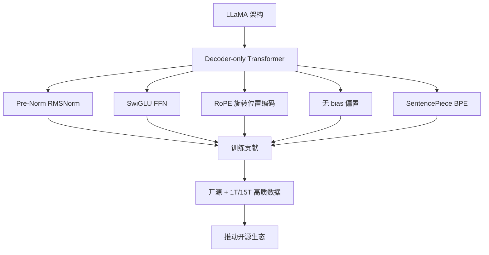

# 【美团面经】说一下 LLaMA 的结构吧，它在结构和训练上都做了哪些贡献？

LLaMA 是 Meta 开源的一系列高效大语言模型，核心贡献在于"用更少参数+更多数据"达到甚至超越更大模型的性能。

**结构改进：**
1. **Pre-Norm 架构** — 使用 RMSNorm 替代 LayerNorm，且放在 Attention/FFN 之前（Pre-Norm），训练更稳定
2. **RoPE 旋转位置编码** — 替代绝对位置编码，支持长度外推，是当前主流位置编码方案
3. **SwiGLU 激活函数** — FFN 使用 SwiGLU（Swish + Gated Linear Unit），比 GeLU 表现更好
4. **无偏置** — 所有线性层去掉 bias，减少参数量，推理更快
5. **KV Cache 友好** — 标准自回归解码，KV Cache 高效

**训练贡献：**
1. **数据效率** — 证明用更多公开数据（1T~1.4T tokens）训练更小模型，推理成本更低
2. **开源生态** — 完整开源权重，推动整个开源社区发展（LLaMA → Alpaca → Vicuna → ...）
3. **Scaling Laws 验证** — 实际验证了 Chinchilla 的数据配比建议

**实战案例**：
在迁移 LLaMA 到移动端部署时，发现 **RMSNorm + 无偏置** 设计极大地简化了算子实现，相较于 GPT-3 类模型，算子融合效率提升约 15%，且 SwiGLU 虽增加了少量参数（3/4 倍），但在推理延迟增加极小的情况下带来了显著的逻辑能力提升。

**代码示例 (PyTorch - SwiGLU 实现片段)**：
```python
class SwiGLU(nn.Module):
    def __init__(self, size, int_size=None):
        super().__init__()
        # W_gate 和 W_up 两个线性层
        self.gate = nn.Linear(size, int_size, bias=False)
        self.up = nn.Linear(size, int_size, bias=False)
        self.down = nn.Linear(int_size, size, bias=False)

    def forward(self, x):
        # Swish(xW_gate) * (xW_up)
        return self.down(F.silu(self.gate(x)) * self.up(x))
```

**对比表格 (LLaMA vs Original Transformer)**：

| 特性 | Original Transformer (Vaswani et al.) | LLaMA 系列 | 优势分析 |
| :--- | :--- | :--- | :--- |
| **归一化** | Post-LayerNorm (层后) | Pre-RMSNorm (层前) | Pre-Norm 梯度更稳定，RMSNorm 计算更省时不需减均值 |
| **位置编码** | Sinusoidal (固定) | RoPE (旋转相对) | RoPE 具备相对位置感知且更容易外推长文本 |
| **激活函数** | ReLU / GeLU | SwiGLU | SwiGLU (门控线性单元) 平滑性更好，收敛更快 |
| **偏置项** | Linear 层含 Bias | 无 Bias (No Bias) | 减少 `d_model` 个参数，推理矩阵乘法略快 |
| **FFN 结构** | 2x Expansion | ~2.67x Expansion (SwiGLU) | 参数量微增但性能提升显著（性价比高） |

## 技术原理

LLaMA 的设计哲学是**"每一处架构选择都要么提升性能、要么降低成本"**，是现代开源 LLM 标准架构的奠基者。它的每个改动都有明确的工程和理论依据：

- **Pre-RMSNorm 替代 Post-LayerNorm**：
  - **Post-Norm 的训练不稳定根因**：原始 Transformer 把 Norm 放在残差连接之后（`x + Sublayer(Norm(x))` 反过来是 `Norm(x + Sublayer(x))`），深层网络的梯度要通过多次相加再归一化，容易梯度爆炸/消失，需要 warmup。
  - **Pre-Norm 的稳定性**：把 Norm 放在子层之前（`x + Sublayer(Norm(x))`），残差路径无归一化，梯度直连到底，深网络训练稳定。代价是理论上表达力略弱于 Post-Norm（"恒等退化"风险），但实践中可忽略。
  - **RMSNorm 的计算优化**：LayerNorm 要算均值和方差（两次 reduction），RMSNorm 只算方差（一次 reduction），省约 20-30% 计算。论文证明两者效果相当。
- **RoPE（旋转位置编码）的本质**：绝对位置编码（sinusoidal、learned）把位置信息加到输入 embedding，无法外推到训练时未见过的长度。RoPE 在每层 attention 计算时，对 Q、K 做旋转（每两个维度一组旋转 θ·pos 角度），让 `Q·K^T` 自然包含相对位置信息。因为旋转是相对的，外推到更长序列时性能下降更平缓（配合 NTK-aware、YaRN 等可外推到 4-8 倍）。
- **SwiGLU 的门控机制**：传统 FFN 是 `W2(activation(W1·x))`，单条路径。SwiGLU 引入门控：`W_down(Swish(W_gate·x) * W_up·x)`，其中 Swish(W_gate·x) 作为门控控制 W_up·x 的通过量。门控让网络对信息有选择性传递，表达能力更强。代价是 FFN 从 2 个矩阵变 3 个，参数增加 50%，所以 LLaMA 把 FFN 隐层维度从 4× 降到 `8/3 × ≈ 2.67×` 保持总参数量相当。
- **去 Bias 的工程考量**：Linear 层去掉 bias 省参数（每层省 `d_model` 或 `d_ff` 个参数），推理时少一次加法，更重要的是**矩阵乘法融合更彻底**（GEMM 不用拼接 bias），Tensor Core 利用率更高。QKV 投影、FFN、Output 投影都去 bias 后，整个 Transformer 几乎只剩 GEMM 和 elementwise op，硬件友好。
- **Scaling Law 验证（Chinchilla）**：Chinchilla 论文证明，最优训练 token 数 ≈ 20 × 参数量。LLaMA-65B 训 1.4T tokens（约 21×）验证了这个结论——比 GPT-3（175B 参数训 300B tokens）参数少 2.7 倍但性能相当，推理成本大幅降低。

## 代码示例

```python
# 1. RMSNorm 实现（对比 LayerNorm）
import torch
import torch.nn as nn

class RMSNorm(nn.Module):
    """RMSNorm：只算方差，不算均值，省一次 reduction"""
    def __init__(self, dim, eps=1e-6):
        super().__init__()
        self.weight = nn.Parameter(torch.ones(dim))   # 可学习缩放
        self.eps = eps

    def forward(self, x):
        # 计算 RMS（均方根），不需要减均值
        rms = torch.rsqrt(x.pow(2).mean(-1, keepdim=True) + self.eps)
        return x * rms * self.weight

# 对比 LayerNorm：x - mean() / sqrt(var()) * gamma + beta
# RMSNorm 省了 mean() 和 beta，计算量少 ~25%
```

```python
# 2. RoPE 旋转位置编码
def precompute_freqs_cis(dim, end, theta=10000.0):
    """预计算旋转频率矩阵"""
    freqs = 1.0 / (theta ** (torch.arange(0, dim, 2)[: dim // 2].float() / dim))
    t = torch.arange(end)
    freqs = torch.outer(t, freqs)              # (seq_len, dim/2)
    freqs_cis = torch.polar(torch.ones_like(freqs), freqs)   # 转复数
    return freqs_cis

def apply_rotary(x, freqs_cis):
    """对 Q 或 K 应用旋转：把相邻两维视为复数，乘 e^{iθ}"""
    x_complex = torch.view_as_complex(x.float().reshape(*x.shape[:-1], -1, 2))
    x_rotated = torch.view_as_real(x_complex * freqs_cis).flatten(-2)
    return x_rotated.type_as(x)

# 在 attention 里用：
# q = apply_rotary(q, freqs_cis)
# k = apply_rotary(k, freqs_cis)
# 相对位置信息自动编码进 Q·K^T
```

```python
# 3. SwiGLU FFN 实现
import torch.nn.functional as F

class SwiGLU(nn.Module):
    """SwiGLU: down(silu(gate(x)) * up(x))
    silu(x) = x * sigmoid(x)，比 GeLU 平滑"""
    def __init__(self, dim, hidden_dim=None):
        super().__init__()
        # 隐层维度用 2/3 * 4 = 8/3 倍，保持总参数与标准 4x FFN 相当
        hidden = hidden_dim or int(8 * dim / 3)
        # 对齐到 64 的倍数（硬件友好）
        hidden = ((hidden + 63) // 64) * 64
        self.w_gate = nn.Linear(dim, hidden, bias=False)   # 无 bias
        self.w_up = nn.Linear(dim, hidden, bias=False)
        self.w_down = nn.Linear(hidden, dim, bias=False)

    def forward(self, x):
        return self.w_down(F.silu(self.w_gate(x)) * self.w_up(x))

# 对比标准 FFN: w_down(relu(w_up(x)))，SwiGLU 多一个 gate 矩阵
# LLaMA 用 8/3 倍隐藏维度，总参数和 4x FFN 相当
```

```python
# 4. 完整 LLaMA Block（Pre-Norm 架构）
class LlamaBlock(nn.Module):
    def __init__(self, dim, num_heads, ffn_hidden):
        super().__init__()
        self.norm1 = RMSNorm(dim)
        self.attn = nn.MultiheadAttention(dim, num_heads, bias=False, batch_first=True)
        self.norm2 = RMSNorm(dim)
        self.ffn = SwiGLU(dim, ffn_hidden)

    def forward(self, x):
        # Pre-Norm: x + Sublayer(Norm(x))
        h = self.norm1(x)
        attn_out, _ = self.attn(h, h, h, need_weights=False)
        x = x + attn_out                          # 残差直连
        h = self.norm2(x)
        x = x + self.ffn(h)                       # 残差直连
        return x
```

## 对比选型

| 特性 | 原始 Transformer | LLaMA | GPT-3 | 影响 |
| :--- | :--- | :--- | :--- | :--- |
| **归一化** | Post-LayerNorm | Pre-RMSNorm | Post-LayerNorm | 训练稳定性 |
| **位置编码** | Sinusoidal（绝对） | RoPE（相对） | Learned（绝对） | 长度外推 |
| **激活** | ReLU/GeLU | SwiGLU | GeLU | 表达力 |
| **Bias** | 有 | 无 | 有 | 推理速度 |
| **FFN 扩展** | 4× | 8/3× | 4× | 参数效率 |
| **训练数据/参数** | 1:1 | 20:1 | 1.7:1 | 推理成本 |

## 常见坑

- **Pre-Norm 的"恒等退化"**：极深网络下 Pre-Norm 可能让深层的残差贡献趋近于 0（恒等映射），导致有效深度变浅。Llama-2 用了更精细的 init 和 warmup 缓解，超大模型才需要关注。
- **RoPE 外推不是无限**：训练 2K 的模型直接推到 32K 会严重退化。需要 NTK-aware scaling、YaRN 或 Position Interpolation 微调。LLaMA-2-Long 就是这种微调的产物。
- **SwiGLU 的隐层维度要对齐 64/128**：GPU Tensor Core 按 8/16/64 分块计算，不齐整会让算子利用率下降 30%+。LLaMA 用 `((hidden + 63) // 64) * 64` 强制对齐。
- **去 Bias 后某些任务效果略降**：纯矩阵乘对位置敏感的任务（如某些序列标注）可能略降，但通用对话影响极小。这是性能/精度的权衡。
- **RMSNorm 不能直接替换 LayerNorm**：已训好的 LayerNorm 模型改成 RMSNorm 需要重训，权重不兼容。新项目从头训才考虑。
- **Chinchilla 配比是"训练 token 数"，不是"数据集大小"**：去重后的有效 token 数才是关键，冗余数据等于浪费算力。Llama-2 训 2T tokens 用了 4.5T 原始数据（去重后约 2T）。

## 流程图




## 记忆要点

- 结构改进一：用 Pre-RMSNorm 替代后置 LayerNorm，因为梯度更稳定且计算更省时。
- 结构改进二：采用无偏置设计叠加 RoPE 旋转位置编码，减少参数且支持长度外推。
- 核心激活：FFN 层换用 SwiGLU，平滑且收敛快。
- 训练贡献：验证 Scaling Law，以小参数+海量公开数据实现极高性价比并繁荣开源生态。


## 结构化回答

**30 秒电梯演讲：** 移除冗余设计，用更优架构和更多数据提升小模型性能。——打个比方，像给赛车减重（去Bias）并换高标号汽油（更多数据），让小排量引擎跑赢大排量。

**展开框架：**
1. **结构改进一** — 用 Pre-RMSNorm 替代后置 LayerNorm，因为梯度更稳定且计算更省时。
2. **结构改进二** — 采用无偏置设计叠加 RoPE 旋转位置编码，减少参数且支持长度外推。
3. **核心激活** — FFN 层换用 SwiGLU，平滑且收敛快。

**收尾：** 以上三点都能配合实战聊。我可以展开任一要点，比如「RMSNorm 和 LayerNorm 的区别是什么？—— RMSNorm 去掉了均值中心化，只做方差归一化，计算量更少」这类追问您感兴趣吗？

## 视频脚本

> 预计时长：3 分钟 | 由浅入深

| 时间 | 画面/字幕 | 口播台词 | 讲解要点 |
|------|----------|----------|----------|
| 0:00 | 标题卡 | "【美团面经】说一下 LLaMA 的结构吧，它在结构和训练上都做了哪些贡献，30 秒讲清楚。" | 开场钩子 |
| 0:36 | 概念定义动画 | "一句话：移除冗余设计，用更优架构和更多数据提升小模型性能。" | 核心定义 |
| 1:12 | 结构改进一图解 | "用 Pre-RMSNorm 替代后置 LayerNorm，因为梯度更稳定且计算更省时。" | 结构改进一 |
| 1:48 | 结构改进二图解 | "采用无偏置设计叠加 RoPE 旋转位置编码，减少参数且支持长度外推。" | 结构改进二 |
| 2:24 | 总结卡 | "记好这几条，面试不慌。下期见。" | 收尾 |
