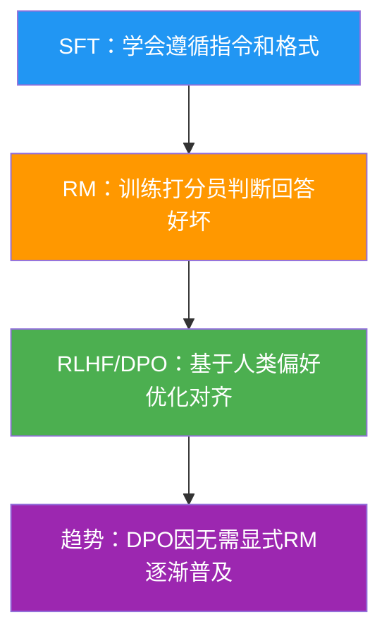

# 【美团面经】说一说大模型后训练（Post-training）的流程？

大模型训练分为**预训练和**后训练两大阶段。

**后训练完整流程：**

```
预训练模型
  │
  ├─ ① SFT（监督微调）
  │    用高质量指令-回答对微调
  │    让模型学会'听懂指令'并按格式输出
  │
  ├─ ② 奖励模型训练
  │    用人类偏好数据训练打分模型
  │    输入：(prompt, response) → 输出：标量分数
  │
  ├─ ③ RLHF / DPO 对齐
  │    RLHF：用 RM 的分数做 PPO 强化学习
  │    DPO：直接用偏好对优化，无需显式 RM
  │
  ├─ ④ 安全对齐（可选）
  │    Red-teaming + Constitutional AI
  │    防止有害输出
  │
  └─ ⑤ 模型合并 / 量化
       DARE / TIES 合并，GPTQ / AWQ 量化
```

**关键细节：**
- **SFT 数据量**：通常 1万~100万条，质量 > 数量
- **RLHF vs DPO**：RLHF 需要训练 RM + PPO（复杂），DPO 直接从偏好对优化（简单高效）
- **DeepSeek-R1 的创新**：跳过 SFT 直接 RL（RL first），用 GRPO 替代 PPO
- **迭代对齐**：GPT-4 / Claude 等顶级模型都经过多轮 RLHF 迭代

### 实战案例
在做金融问答模型 SFT 时，直接使用通用 SFT 数据会导致模型回答口语化严重（如"哦、这个嘛"）。**实战中需清洗数据**：使用正则过滤语气词，并强制训练模型输出 JSON 格式，否则线上 JSON 解析器会频繁报错。

### 代码示例
```python
# DPO 关键代码片段
# 只需修改 Loss 计算，无需训练 Reward Model
def dpo_loss(policy_chosen_logps, policy_rejected_logps, ref_chosen_logps, ref_rejected_logps, beta):
    # 计算策略模型和参考模型的 logp 差值
    pi_logratios = policy_chosen_logps - policy_rejected_logps
    ref_logratios = ref_chosen_logps - ref_rejected_logps
    
    # DPO 的核心目标：最大化 
    losses = -F.logsigmoid(beta * (pi_logratios - ref_logratios))
    return losses.mean()
```

### 对比表格
| 维度 | RLHF (PPO) | DPO |
| :--- | :--- | :--- |
| **训练复杂度** | 高（需训练 Policy, Value, RM 三个模型） | 低（只需训练 Policy 模型） |
| **显存占用** | 极高（需存储多模型副本及 Rollout 缓存） | 较低（仅相当于 SFT） |
| **训练稳定性** | 较差（超参数敏感，易 KL 散度发散） | 较好（本质是分类优化） |
| **效果** | SOTA天花板（OpenAI 路线） | 接近 RLHF，性价比首选 |


## 核心流程图



## 记忆要点

- 核心链路：SFT（指令微调）建立格式，接着训练奖励模型，最后用 RLHF 做人类对齐。
- SFT 细节：数据质量重于数量，核心是让模型听懂指令并严格遵循输出格式。
- RLHF vs DPO：因为 RLHF 训练极度复杂且不稳，所以 DPO 免去 RM 直接偏好优化成高性价比首选。
- 进阶演进：DeepSeek-R1 跳过 SFT 直接进行强化学习，验证了纯 RL 激发深度推理的潜力。


## 结构化回答

**30 秒电梯演讲：** 从“读书”到“做题”再到“讲规矩”的过程。——打个比方，SFT是教学生做题格式，RLHF是给回答打分纠偏，最后变成懂礼貌的优等生。

**展开框架：**
1. **核心链路** — SFT（指令微调）建立格式，接着训练奖励模型，最后用 RLHF 做人类对齐。
2. **SFT 细节** — 数据质量重于数量，核心是让模型听懂指令并严格遵循输出格式。
3. **RLHF vs** — RLHF vs DPO：因为 RLHF 训练极度复杂且不稳，所以 DPO 免去 RM 直接偏好优化成高性价比首选。

**收尾：** 以上三点都能配合实战聊。我可以展开任一要点，比如「DPO 和 PPO 的区别？—— DPO 无需 RM、无需在线采样，直接离线优化偏好」这类追问您感兴趣吗？

## 视频脚本

> 预计时长：3 分钟 | 由浅入深

| 时间 | 画面/字幕 | 口播台词 | 讲解要点 |
|------|----------|----------|----------|
| 0:00 | 标题卡 | "【美团面经】说一说大模型后训练（Post-training）的流程，30 秒讲清楚。" | 开场钩子 |
| 0:36 | 概念定义动画 | "一句话：从“读书”到“做题”再到“讲规矩”的过程。" | 核心定义 |
| 1:12 | 核心链路图解 | "SFT（指令微调）建立格式，接着训练奖励模型，最后用 RLHF 做人类对齐。" | 核心链路 |
| 1:48 | SFT 细节图解 | "数据质量重于数量，核心是让模型听懂指令并严格遵循输出格式。" | SFT 细节 |
| 2:24 | 总结卡 | "记好这几条，面试不慌。下期见。" | 收尾 |
