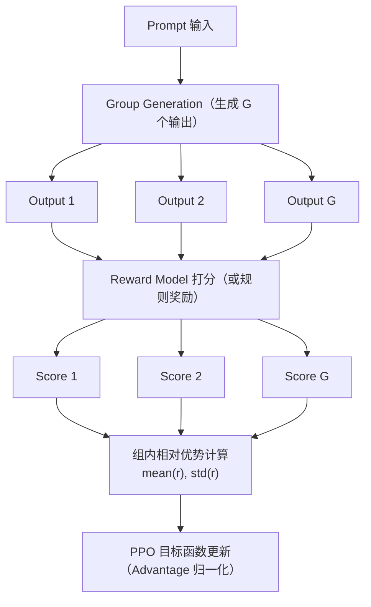

# GRPO(Group Relative Policy Optimization)是什么？DeepSeek为什么用它？

🎯 **本质**：GRPO是PPO的简化变体，去掉了Critic(价值网络)，用组内相对奖励代替基线，大幅降低了训练成本和显存需求。

📊 **PPO的问题**：
PPO需要4个模型，显存占用巨大：
1. Policy Model（策略模型）- 正在训练的模型
2. Reference Model（参考模型）- KL惩罚参考
3. Reward Model（奖励模型）- 评估输出质量
4. Value/Critic Model（价值模型）- 估计基线

**GRPO的创新**：
去掉Critic Model，改用组内相对比较。



**GRPO流程**：
1. **采样**：对每个prompt，生成G个不同的回答（一组，通常 G=4~8）。
2. **打分**：用Reward Model或规则函数（如代码编译通过、数学答案正确）对每个回答打分。
3. **计算优势**：组内归一化。
   - `mean(r)`：组内平均分
   - `std(r)`：组内标准差
   - `advantage_i = (r_i - mean(r)) / std(r)`
4. **更新**：用归一化的advantage更新策略。

**数学对比**：
- **PPO**: `advantage = reward - V(s)` (依赖 Critic)
- **GRPO**: `advantage = (reward - mean(group_reward)) / std(group_reward)` (依赖组内统计)

**实战案例**：在数学推理训练中，使用GRPO直接基于"答案是否正确"作为规则奖励，完全省去了训练复杂数学奖励模型的成本，且在Math基准上取得了超越PPO的效果。

**代码示例**：
```python
# 计算GRPO优势函数的伪代码
def compute_grpo_advantage(rewards):
    """
    rewards: list of float, 当前组内所有样本的奖励分数
    """
    mean = np.mean(rewards)
    std = np.std(rewards) + 1e-8  # 防止除零
    # 核心逻辑：用组内均值代替Critic估计的基线
    advantages = [(r - mean) / std for r in rewards]
    return advantages
```

**对比表格**：
| 特性 | PPO | GRPO |
| :--- | :--- | :--- |
| **Critic模型** | 需要 (占用大量显存) | 不需要 (省去约1/3显存) |
| **基线计算** | 依赖Value函数估计 | 依赖组内采样均值 (无偏估计) |
| **奖励模型** | 必须可微 (或特定格式) | 支持非可微规则奖励 (如编译结果) |
| **采样效率** | 单样本或Batch | 组采样 (Group Size G=4~8) |
| **训练速度** | 较慢 (需训练Actor+Critic) | 较快 (仅训练Actor) |

## 记忆要点

- 本质创新：砍掉PPO中昂贵的Critic(价值)网络，用同一Prompt的组内多个生成结果均值代替基线
- 数学转化：优势函数从依赖V网络变为组内统计，即 reward减均值除以标准差
- DeepSeek偏爱原因：省显存且极高稳定，对于数学/代码这种有标准答案的场景可直接用规则作Reward
- 实战优势：完全省去复杂且易Reward Hacking的奖励模型训练流程，降低RL落地门槛


## 结构化回答

**30 秒电梯演讲：** 用一组输出相互对比打分来替代复杂的价值网络，降低显存和训练成本。——打个比方，考试时不给每道题打分（需老师），而是让学生互相比较排个名次（组内相对），同样能分出好坏。

**展开框架：**
1. **本质创新** — 砍掉PPO中昂贵的Critic(价值)网络，用同一Prompt的组内多个生成结果均值代替基线
2. **数学转化** — 优势函数从依赖V网络变为组内统计，即 reward减均值除以标准差
3. **DeepSeek** — DeepSeek偏爱原因：省显存且极高稳定，对于数学/代码这种有标准答案的场景可直接用规则作Reward

**收尾：** 以上三点都能配合实战聊。您想深入聊哪一块？

## 视频脚本

> 预计时长：2 分钟 | 由浅入深

| 时间 | 画面/字幕 | 口播台词 | 讲解要点 |
|------|----------|----------|----------|
| 0:00 | 标题卡 | "GRPO(Group Relative Policy Optimization)，30 秒讲清楚。" | 开场钩子 |
| 0:30 | 概念定义动画 | "一句话：用一组输出相互对比打分来替代复杂的价值网络，降低显存和训练成本。" | 核心定义 |
| 1:00 | 本质创新图解 | "砍掉PPO中昂贵的Critic(价值)网络，用同一Prompt的组内多个生成结果均值代替基线" | 本质创新 |
| 1:30 | 总结卡 | "记好这几条，面试不慌。下期见。" | 收尾 |
