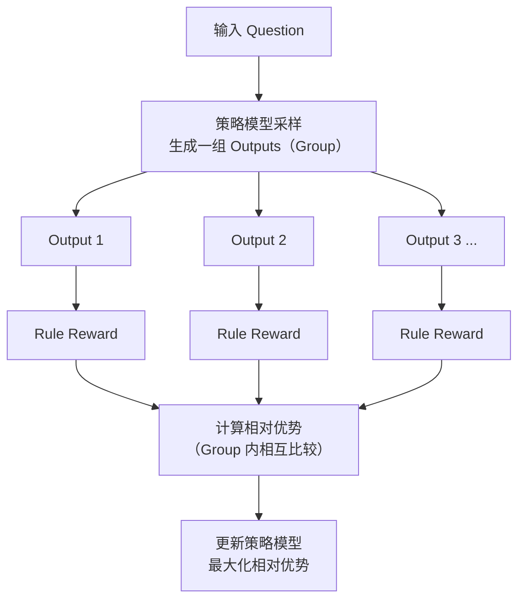
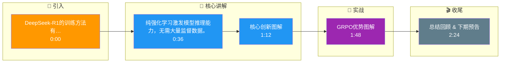

# DeepSeek-R1的训练方法有什么创新？

DeepSeek-R1展示了纯RL训练也能产生推理能力：

**DeepSeek-R1-Zero（纯RL）：**
- 直接在基座模型上用GRPO强化学习
- 不经过SFT
- 奖励函数：规则化奖励（数学题有标准答案、代码题有测试用例）
- 结果：模型自发产生CoT（思维链），出现AHA Moment（自我反思）

**DeepSeek-R1（完整流程）：**
1. Cold Start SFT：少量推理数据微调
2. 推理导向RL：GRPO训练
3. Rejection Sampling + SFT：从RL模型采样优质数据，再SFT
4. 全场景RL：推理+通用能力对齐

**关键创新：**
- 证明RL可以直接激发推理能力
- GRPO省去Critic Model
- 规则化奖励（不用Reward Model）避免reward hacking
- 知识蒸馏：将R1的推理能力蒸馏到小模型（1.5B-70B）

**影响**：打破了o1的垄断，开源社区获得强推理模型。

**GRPO (Group Relative Policy Optimization) 原理图**：


💥 **实战案例**：在尝试复现DeepSeek-R1-Zero时，我们发现如果直接使用大模型进行纯RL，初期极易陷入**语言混乱**（中英文混杂）和**重复循环**。加入"Cold Start"阶段，先用几千条高质量的CoT数据进行SFT微调，再开启RL，能显著稳定训练过程并收敛更快。

💻 **代码示例 (伪代码)**：
```pythonn# GRPO 核心逻辑对比 PPO
# PPO 需要 Value Model (Critic) 估算 baseline
# GRPO 使用 Group 内部的平均结果作为 baseline

outputs = model.sample(prompts, group_size=64) # 同一个Prompt采样64次
rewards = [compute_rule_reward(out) for out in outputs]

# 计算相对优势
baseline = mean(rewards)
advantages = [r - baseline for r in rewards] 

# PPO Loss 修正：使用相对优势代替 Value Model 输出
loss = -log_prob * advantages + kl_penalty
```

## 常见考点
1. **GRPO vs PPO**：GRPO 相比 PPO 的主要优势在哪里？（答案：GRPO 不需要训练一个额外的 Critic 模型来估算价值函数，而是通过同一组采样的输出来计算相对优势，大幅降低了显存占用和训练复杂度）。
2. **语言混合问题**：DeepSeek-R1-Zero 在纯 RL 过程中遇到了什么语言问题？（答案：出现了语言混合，即在推理过程中突然切换到其他语言，这是因为在没有 SFT 冷启动的情况下，RL 优化目标不包含语言一致性约束）。
3. **Aha Moment**：这具体指什么现象？（答案：模型在长链推理的中途，突然纠正之前的错误思路，得出正确答案，表现出类似人类的“顿悟”行为）。

## 记忆要点

- 核心创新：纯RL（GRPO）直接激发推理能力，无需SFT即可自发产生思维链和自我反思。
- GRPO优势：省去Critic模型，用Group内采样的相对优势做Baseline，大幅降低显存。
- 完整流程：冷启动SFT -> 推理导向RL -> 采样再SFT -> 全场景RL对齐。
- 实战痛点：纯RL初期易语言混乱，需少量CoT数据冷启动来稳定训练。

## 结构化回答

**30 秒电梯演讲：** 纯强化学习激发模型推理能力，无需大量监督数据。——打个比方，像让学生通过不断做题和对答案自学，而不是先听老师讲课。

**展开框架：**
1. **核心创新** — 纯RL（GRPO）直接激发推理能力，无需SFT即可自发产生思维链和自我反思。
2. **GRPO优势** — 省去Critic模型，用Group内采样的相对优势做Baseline，大幅降低显存。
3. **完整流程** — 冷启动SFT -> 推理导向RL -> 采样再SFT -> 全场景RL对齐。

**收尾：** 以上三点都能配合实战聊。您想深入聊哪一块？

## 视频脚本

> 预计时长：3 分钟 | 由浅入深

| 时间 | 画面/字幕 | 口播台词 | 讲解要点 |
|------|----------|----------|----------|
| 0:00 | 标题卡 | "DeepSeek-R1的训练方法有什么创新，30 秒讲清楚。" | 开场钩子 |
| 0:36 | 概念定义动画 | "一句话：纯强化学习激发模型推理能力，无需大量监督数据。" | 核心定义 |
| 1:12 | 核心创新图解 | "纯RL（GRPO）直接激发推理能力，无需SFT即可自发产生思维链和自我反思。" | 核心创新 |
| 1:48 | GRPO优势图解 | "省去Critic模型，用Group内采样的相对优势做Baseline，大幅降低显存。" | GRPO优势 |
| 2:24 | 总结卡 | "记好这几条，面试不慌。下期见。" | 收尾 |

### 视频流程图




