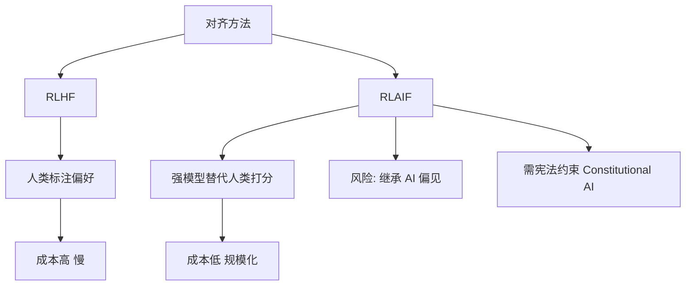
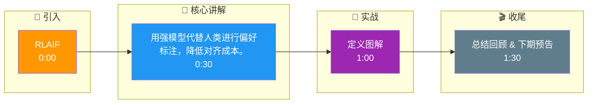

# 什么是RLAIF？和RLHF有什么区别？

RLAIF（Reinforcement Learning from AI Feedback）：用AI（而非人类）提供偏好标注。

**RLHF流程：**
1.  人工标注偏好对（A preferred over B）—— 成本高、慢、难以扩展。
2.  训练Reward Model（奖励模型）。
3.  用PPO/DPO优化策略模型。

**RLAIF流程：**
1.  用强LLM（如GPT-4/Claude）替代人工标注偏好，基于Prompt生成偏好评判。
2.  训练Reward Model（RMs）或直接用AI生成的Logits作为奖励。
3.  用PPO/DPO优化。

**优势：**
- **成本低**：API调用成本远低于雇佣专业标注人员。
- **速度快**：可并行批量生成，数据获取周期短。
- **可扩展性强**：可以轻松覆盖复杂领域（如医学、法律），只要Teacher Model足够强。

**质量争议与改进：**
- **AI偏见**：AI标注可能有长度偏好（偏好更长/更复杂的回答）或自身的安全偏见。
- **Constitutional AI（Anthropic）**：给AI一组“原则”（如宪法），AI根据原则自我批判和修正，生成偏好数据，不仅评判结果，还监督过程。
- **研究表明**：RLAIF在许多任务上效果接近甚至持平RLHF，且在安全性控制上表现更好。

**实践：**目前大多数团队已经用RLAIF/Constitutional AI作为RLHF的冷启动或替代方案，或者采用Human+AI混合标注（人类校验AI的标注结果）。

### 流程与对比表格

| 维度 | RLHF (人类反馈) | RLAIF (AI反馈) | 混合模式 |
| :--- | :--- | :--- | :--- |
| **标注主体** | 专业标注人员 | 强基座模型 (GPT-4/Claude) | AI预标 + 人工抽检
| **数据质量** | 高，贴合真实意图 | 中，可能存在模型偏见 | 高，成本可控
| **成本** | 极高 ($15-30/小时) | 低 (仅API调用费用) | 中等 |
| **扩展速度** | 慢 (按周计) | 极快 (按小时计) | 快 |
| **适用领域** | 通用领域，强安全要求 | 代码、数学、垂直领域 | 对齐/微调冷启动 |

### 实战案例
在一个金融合规对话项目初期，由于缺乏专业金融标注员，我们使用了 **Claude-3-Sonnet 按照“合规性、无害性、准确性”三大原则** 对模型生成的回复进行自动打分排序。虽然初期AI偏好偏向“拒绝回答”，但通过人工修正Prompt中的“宪法”条款（例如：在明确用户身份时可以提供一般性建议），我们快速构建了5万条高质量偏好数据，将DPO训练的时间从2个月缩短至2周。

### 代码示例
模拟使用LLM（如GPT-4）进行偏好标注并解析结果的逻辑：

```python
import json

def get_ai_preference_judge(prompt, response_a, response_b, client):
    system_prompt = """You are a helpful assistant. Please compare two responses based on Helpfulness and Safety.
    Return your answer in JSON format: {"choice": "A" or "B", "reason": "..."}."""
    
    user_content = f"""Prompt: {prompt}
    Response A: {response_a}
    Response B: {response_b}
    Which response is better?"""

    response = client.chat.completions.create(
        model="gpt-4-turbo",
        messages=[
            {"role": "system", "content": system_prompt},
            {"role": "user", "content": user_content}
        ],
        response_format={"type": "json_object"}
    )
    
    return json.loads(response.choices[0].message.content)
```

## 流程图



## 记忆要点

- 定义：RLAIF用强LLM替代人工标注偏好，RLHF用真人标注，前者成本低、速度快。
- 流程对比：RLHF需人工打分，RLAIF用AI打分（或直接用Logits），后续都接PPO/DPO。
- 改进方案：Constitutional AI给AI设定“宪法”原则，减少偏见和Reward Hacking。
- 适用性：RLAIF适合冷启动或垂直领域，RLHF适合对安全要求极高的通用场景。

## 结构化回答

**30 秒电梯演讲：** 用强模型代替人类进行偏好标注，降低对齐成本。——打个比方，请一位老教授（AI）帮忙批改作业，而不是全都由老师（人）亲自改。

**展开框架：**
1. **定义** — RLAIF用强LLM替代人工标注偏好，RLHF用真人标注，前者成本低、速度快。
2. **流程对比** — RLHF需人工打分，RLAIF用AI打分（或直接用Logits），后续都接PPO/DPO。
3. **改进方案** — Constitutional AI给AI设定“宪法”原则，减少偏见和Reward Hacking。

**收尾：** 以上三点都能配合实战聊。您想深入聊哪一块？

## 视频脚本

> 预计时长：2 分钟 | 由浅入深

| 时间 | 画面/字幕 | 口播台词 | 讲解要点 |
|------|----------|----------|----------|
| 0:00 | 标题卡 | "RLAIF，30 秒讲清楚。" | 开场钩子 |
| 0:30 | 概念定义动画 | "一句话：用强模型代替人类进行偏好标注，降低对齐成本。" | 核心定义 |
| 1:00 | 定义图解 | "RLAIF用强LLM替代人工标注偏好，RLHF用真人标注，前者成本低、速度快。" | 定义 |
| 1:30 | 总结卡 | "记好这几条，面试不慌。下期见。" | 收尾 |

### 视频流程图




