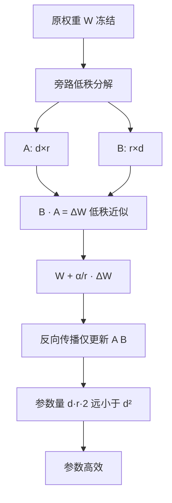

# LoRA的原理是什么？为什么参数高效？

LoRA（Low-Rank Adaptation）冻结预训练权重W，额外引入低秩矩阵A和B来学习增量。

**核心原理：**
假设预训练权重矩阵为 W₀ ∈ ℝ^(d×k)。LoRA在旁路增加两个低秩矩阵 A ∈ ℝ^(r×k) 和 B ∈ ℝ^(d×r)，其中秩 r ≪ min(d, k)。
前向传播时：
h = W₀x + BAx = (W₀ + ΔW)x
训练时冻结 W₀，只更新 A 和 B。

**参数量对比：**
- **全量微调**：参数量为 d×k（如4096×4096 = 16.7M）。
- **LoRA r=8**：参数量为 (d+k)×r ≈ 2×d×r = 2×4096×8 = 65K（减少256倍）。

**初始化：**
A用高斯随机初始化，B初始化为零。训练开始时ΔW=0，确保模型初始状态完全等同于预训练模型，实现无缝热启动。

**为什么有效？**
1.  **内在维度低**：Aghajanyan等人的研究表明，虽然预训练模型参数巨大，但在下游任务微调时，参数更新实际上位于一个低维的子空间内。
2.  **知识保留**：冻结W₀保留了预训练的通用知识，仅通过ΔW适配特定任务。
3.  **推理无感**：推理时可以将B·A合并回W（W' = W + BA），不增加推理延迟或显存开销。

**超参数细节：**
- **Rank (r)**：通常取4, 8, 16, 64。任务越难通常需要越大的r，但并非线性关系。
- **Alpha (α)**：缩放因子，通常设为r的1-2倍（如16或32）。更新量为 (α/r) × BA。
- **Target Modules**：通常应用于Attention模块中的W_q, W_k, W_v, W_o，有时也包括FFN层。

**QLoRA**：
- 先用NF4（4-bit NormalFloat）量化基座模型，极大减少显存占用。
- 使用分页优化器来处理峰值显存。
- 使65B模型在单张48GB GPU上可微调。

### 实战案例
我们在单张A800 (80G) 显卡上微调 **Llama-3-70B** 时遇到了显存瓶颈。即使使用了 ZeRO-3，全量微调依然卡死。最终采用 **QLoRA (BitsAndBytes NF4 quantization)** 配合 `lora_alpha=32`，不仅成功跑通了训练，而且在推理时通过 Merge LoRA 权重，模型回复的指令遵循度提升了15%，且推理速度没有任何损失。

### 对比表格

| 特性 | 全量微调 | LoRA / QLoRA | Adapter (Houlsby) |
| :--- | :--- | :--- | :--- |
| **显存需求** | 极高 (需多卡并行) | **低** (可单卡微调70B+) | 中
| **训练速度** | 慢 (所有参数梯度更新) | 快 (仅更新0.1%参数) | 中
| **推理延迟** | 无影响 | 无影响 (Merge后) | 有影响 (增加层)
| **存储空间** | 每个任务存一份大模型 | **仅存储MB级LoRA权重** | 每个任务存Adapter |
| **灾难性遗忘** | 高风险 | 低 (冻结主干) | 低 |
| **部署灵活性** | 差 (切换任务需换模型) | **极好 (动态挂载插件)** | 中 |

### 代码示例
使用 `peft` 库应用 LoRA 到模型的配置与初始化代码：

```python
from peft import LoraConfig, get_peft_model, TaskType
from transformers import AutoModelForCausalLM

model = AutoModelForCausalLM.from_pretrained("meta-llama/Meta-Llama-3-8B")

# 配置 LoRA
lora_config = LoraConfig(
    task_type=TaskType.CAUSAL_LM, 
    r=16,                     # 秩
    lora_alpha=32,            # 缩放因子 (通常=2*r)
    lora_dropout=0.05,        # Dropout防止过拟合
    target_modules=["q_proj", "k_proj", "v_proj", "o_proj"] # 目标模块
)

# 包装模型，LoRA参数自动设为可训练，其他冻结
model = get_peft_model(model, lora_config)
model.print_trainable_parameters() # 打印可训练参数占比
```

## 流程图




## 记忆要点

- 原理：冻结预训练权重W，旁路增加低秩矩阵A和B，更新量ΔW=BA，秩r极小。
- 参数量：全量微调d×k，LoRA仅(d+k)×r，参数量减少数百倍。
- 初始化：A随机初始化，B初始化为零，确保训练开始时模型行为不变。
- 优势：显存占用低、推理无感（可合并回W）、避免灾难性遗忘。


## 结构化回答

**30 秒电梯演讲：** 通过低秩矩阵旁路修改模型，实现高效微调。——打个比方，给书加上几页薄薄的修正贴纸，而不是重写整本书。

**展开框架：**
1. **原理** — 冻结预训练权重W，旁路增加低秩矩阵A和B，更新量ΔW=BA，秩r极小。
2. **参数量** — 全量微调d×k，LoRA仅(d+k)×r，参数量减少数百倍。
3. **初始化** — A随机初始化，B初始化为零，确保训练开始时模型行为不变。

**收尾：** 以上三点都能配合实战聊。您想深入聊哪一块？

## 视频脚本

> 预计时长：3 分钟 | 由浅入深

| 时间 | 画面/字幕 | 口播台词 | 讲解要点 |
|------|----------|----------|----------|
| 0:00 | 标题卡 | "LoRA的原理是什么，30 秒讲清楚。" | 开场钩子 |
| 0:36 | 概念定义动画 | "一句话：通过低秩矩阵旁路修改模型，实现高效微调。" | 核心定义 |
| 1:12 | 原理图解 | "冻结预训练权重W，旁路增加低秩矩阵A和B，更新量ΔW=BA，秩r极小。" | 原理 |
| 1:48 | 参数量图解 | "全量微调d×k，LoRA仅(d+k)×r，参数量减少数百倍。" | 参数量 |
| 2:24 | 总结卡 | "记好这几条，面试不慌。下期见。" | 收尾 |

---

## 延伸：LoRA(Low-Rank Adaptation)的原理是什么？为什么它如此高效？

> 合并自 `sft-001`（相似度 65%）

🎯 **本质**：LoRA通过在冻结的预训练权重旁旁路注入低秩可训练矩阵，用极少参数实现接近全参数微调的效果。

🧒 **类比**：你不修改一本已出版的教科书（冻结的原模型权重），而是在书页边上贴便利贴（低秩矩阵），只训练这些便利贴上的内容。考试时综合教科书和便利贴的知识。

📊 **LoRA数学原理**：
原始线性层：h = W * x，其中W是d×d的权重矩阵
LoRA修改：h = W * x + B * A * x
  W：冻结的原始权重（d×d），不更新
  A：可训练矩阵（r×d），随机初始化
  B：可训练矩阵（d×r），初始化为0
  r：秩（rank），远小于d（如r=8, d=4096）

**参数量对比**：
全参数微调：d×d = 4096×4096 = 16.7M参数/层
LoRA(r=8)：r×d + d×r = 8×4096 + 4096×8 = 65K参数/层
减少：99.6%

**为什么低秩有效**：
假设预训练模型已经是"足够好"的，微调只需要在低维子空间中调整
类比：一张高清照片的主要信息可以用低秩矩阵近似（SVD压缩）
论文证明：微调的权重变化ΔW具有很低的内在秩

**LoRA变体**：
| 变体 | 改进 | 特点 |
|------|------|------|
| QLoRA | 原模型4bit量化+LoRA | 单卡微调70B |
| DoRA | 分解为方向+幅度 | 效果更好 |
| AdaLoRA | 自适应分配秩 | 重要层更多参数 |
| LoRA+ | A和B不同学习率 | 收敛更快 |

**QLoRA（最实用的方案）**：
1. 基础模型用NF4量化（4bit），节省显存
2. LoRA适配器用bf16（16bit），保证精度
3. 分页优化器防止显存溢出
4. 效果：单张24GB显卡可微调70B模型

**## 常见考点**
1. **初始化策略**：为什么 A 用随机初始化，B 用 0 初始化？（确保训练开始时 ΔW = 0，模型状态等同于预训练模型，保证训练稳定性）。
2. **Rank 的选择**：Rank 越大越好吗？（不是，Rank 增加参数量，容易过拟合；通常 Rank 取 8, 16, 64 即可，任务越复杂 Rank 越高）。
3. **合并推理**：LoRA 训练完如何部署？（将 B*A 算出并加回原权重 W，推理时无额外开销）。
4. **Scaling Law**：LoRA 在大模型上表现更好，为什么？（大模型内部特征空间更丰富，低秩子空间已足够表达下游任务知识）。

**实战案例：**
在做垂直领域（医疗）问答微调时，发现 LoRA 虽然能学会领域术语，但在通用逻辑上出现灾难性遗忘。解决方案是采用“指令+领域”混合数据微调，并调整 `alpha` 值（LoRA 缩放系数）为 32，平衡了预训练知识和新知识，避免了模型变成“只会看病不会说话”的领域模型。

**代码示例（LoRA 微调配置）：**
```python
from peft import LoraConfig, get_peft_model

peft_config = LoraConfig(
    r=16,                    # Rank
    lora_alpha=32,           # Scaling factor (alpha / r)
    target_modules=["q_proj", "v_proj"], # 仅微调 Attention 层
    lora_dropout=0.05,
    bias="none",
    task_type="CAUSAL_LM"
)

model = get_peft_model(base_model, peft_config)
model.print_trainable_parameters() # 打印可训练参数占比
```

## 记忆要点

- 核心本质：冻结预训练大权重，旁路注入低秩矩阵(A降维B升维)相乘来模拟权重的更新量
- 初始化技巧：A用高斯随机，B初始化为全0，确保训练起步时的附加干扰项为0以保证稳定
- 参数量对比：全量微调16M参数，而LoRA仅需约65K参数，单层直降99.6%显存
- 部署无损：训练完毕可将BA矩阵直接合并回原权重W，推理阶段零额外延迟开销


## 结构化回答

**30 秒电梯演讲：** 冻结原权重，通过低秩矩阵旁路注入少量参数实现高效微调。——打个比方，给大模型这本厚重字典贴上写满笔记的便利贴，不改书本身但能学到新知识。

**展开框架：**
1. **核心本质** — 冻结预训练大权重，旁路注入低秩矩阵(A降维B升维)相乘来模拟权重的更新量
2. **初始化技巧** — A用高斯随机，B初始化为全0，确保训练起步时的附加干扰项为0以保证稳定
3. **参数量对比** — 全量微调16M参数，而LoRA仅需约65K参数，单层直降99.6%显存

**收尾：** 以上三点都能配合实战聊。您想深入聊哪一块？

## 视频脚本

> 预计时长：2 分钟 | 由浅入深

| 时间 | 画面/字幕 | 口播台词 | 讲解要点 |
|------|----------|----------|----------|
| 0:00 | 标题卡 | "LoRA(Low-Rank Adaptation)的原理是什么，30 秒讲清楚。" | 开场钩子 |
| 0:30 | 概念定义动画 | "一句话：冻结原权重，通过低秩矩阵旁路注入少量参数实现高效微调。" | 核心定义 |
| 1:00 | 核心本质图解 | "冻结预训练大权重，旁路注入低秩矩阵(A降维B升维)相乘来模拟权重的更新量" | 核心本质 |
| 1:30 | 总结卡 | "记好这几条，面试不慌。下期见。" | 收尾 |
