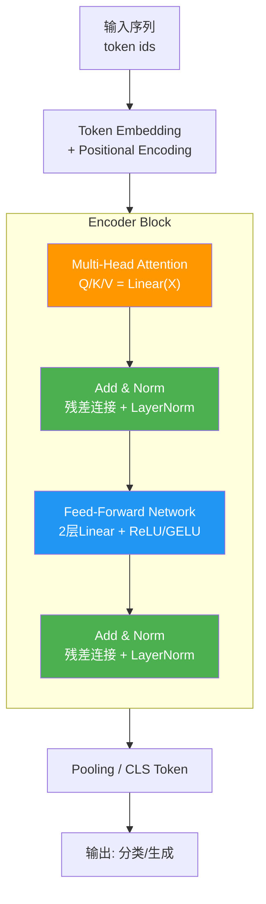

# Transformer中Self-Attention为什么要除以根号d？

在计算QKᵀ后除以√d_k（d_k是key的维度），目的是控制内积结果的方差。

当d_k很大时，QKᵀ的值会很大，导致softmax函数进入梯度饱和区（导数趋近于0），训练困难。

**原理细节与数学推导**：
假设向量 $q$ 和 $k$ 的各个分量是相互独立的随机变量，且均值为0，方差为1。
- 点积 $q \cdot k = \sum_{i=1}^{d_k} q_i k_i$。
- 根据方差性质，$Var(q \cdot k) = \sum_{i=1}^{d_k} Var(q_i k_i) = \sum_{i=1}^{d_k} (E[q_i]^2E[k_i]^2 + E[q_i]^2 Var(k_i) + E[k_i]^2 Var(q_i) + Var(q_i)Var(k_i))$，简化后由于独立同分布，方差约为 $d_k$。
- 因此，点积的量级会随着维度 $d_k$ 的增大而增大（标准差增长为 $\sqrt{d_k}$）。

除以 $\sqrt{d_k}$ 后，方差归一化至1，使softmax的输入分布保持在合理范围，避免梯度消失。

**不除的后果**：
- Softmax输入数值过大，函数趋近于阶跃函数。
- 输出分布接近 one-hot（即极度集中在最大值上），其他位置概率接近0。
- 梯度几乎为0，导致无法有效反向传播，训练停滞。

### 实战深化

**实战案例**：
在自定义Transformer结构进行实验时，如果不注意LayerNorm的位置（Post-LN vs Pre-LN），缩放因子的影响会有差异。特别是在**Post-LN**（原始Transformer）架构中，如果不除以√d_k，梯度在深层网络中会完全消失，模型Loss不降；而Pre-LN虽然鲁棒性稍强，但缺少缩放因子依然会导致初始化阶段的不稳定。

**代码示例 (Python)**：
```python
import torch
import torch.nn.functional as F

def scaled_dot_product_attention(q, k, v, mask=None):
    d_k = q.size(-1)
    # 1. 计算得分
    scores = torch.matmul(q, k.transpose(-2, -1))
    
    # 2. 关键：缩放 (防止进入Softmax饱和区)
    scores = scores / (d_k ** 0.5) 
    
    if mask is not None:
        scores = scores.masked_fill(mask == 0, -1e9)
        
    # 3. Softmax归一化
    attention_weights = F.softmax(scores, dim=-1)
    
    return torch.matmul(attention_weights, v)
```

**对比表格**：

| 维度 | 除以 √d_k | 不除以 √d_k | 备注 |
| :--- | :--- | :--- | :--- |
| **数值量级** | O(1)，标准差归一化 | O(√d_k)，随深度/维度增加 | d_k通常为64, 128等 |
| **梯度状态** | 正常梯度流动 | **梯度消失** (Vanishing Gradient) | Softmax导数趋近0 |
| **分布形状** | 平滑的概率分布 | 尖锐的 One-hot 分布 | 导致信息丢失，无法利用上下文 |
| **训练稳定性** | 稳定，易于收敛 | 极不稳定，Loss常为Nan | 尤其在Post-LN结构下 |
| **理论依据** | 假设q,k分量独立同分布，方差为1 | 忽略了点积后的方差累积 | Attention Is All You Need 论文核心细节 |


## 核心流程图



## 记忆要点

- 目的：除以√d_k归一化方差，防止点积随维度增大而膨胀。
- 后果：不除会导致Softmax输入过大，梯度饱和消失，训练停滞。
- 原理：假设q,k独立同分布，点积方差为d_k，除以√d_k使方差回归1。


## 结构化回答

**30 秒电梯演讲：** 缩放点积方差，防止Softmax梯度消失。——打个比方，数值太大输入softmax会导致“过饱和”，除以根号d像调音量旋钮。

**展开框架：**
1. **目的** — 除以√d_k归一化方差，防止点积随维度增大而膨胀。
2. **后果** — 不除会导致Softmax输入过大，梯度饱和消失，训练停滞。
3. **原理** — 假设q,k独立同分布，点积方差为d_k，除以√d_k使方差回归1。

**收尾：** 以上三点都能配合实战聊。您想深入聊哪一块？

## 视频脚本

> 预计时长：2 分钟 | 由浅入深

| 时间 | 画面/字幕 | 口播台词 | 讲解要点 |
|------|----------|----------|----------|
| 0:00 | 标题卡 | "Transformer中Self-Attention为什么要除以根号d，30 秒讲清楚。" | 开场钩子 |
| 0:30 | 概念定义动画 | "一句话：缩放点积方差，防止Softmax梯度消失。" | 核心定义 |
| 1:00 | 目的图解 | "除以√d_k归一化方差，防止点积随维度增大而膨胀。" | 目的 |
| 1:30 | 总结卡 | "记好这几条，面试不慌。下期见。" | 收尾 |

---

## 延伸：为什么attention要scaled

> 合并自 `xhw-013`（相似度 68%）

在 Transformer 的缩放点积注意力中，引入缩放因子（即除以 $\sqrt{d_k}$）主要是为了解决高维向量点积导致数值不稳定的问题。

**1. 核心原因：数值稳定性与梯度消失**
查询向量 $Q$ 和键向量 $K$ 的点积期望值与向量维度 $d_k$ 成正比。当维度较高时，点积结果会变得非常大。这些大值输入到 Softmax 函数后，会导致输出分布极端化（某些位置接近 1，其他位置接近 0）。这种极端分布会使 Softmax 进入梯度极小的饱和区，导致反向传播时梯度消失，严重影响模型训练的收敛速度和效果。

**2. 解决方案**
通过将点积结果除以 $\sqrt{d_k}$，可以将数值缩放到一个合理的范围内。从数学上看，假设向量元素相互独立且方差为 1，点积的方差为 $d_k$，标准差为 $\sqrt{d_k}$。除以该标准差可以将点积结果归一化，使其方差维持在 1 左右。这保证了 Softmax 的输入不会过大，从而保持梯度的稳定性，使模型能够有效训练。

**3. 数学推导细节**
假设 $q_i$ 和 $k_i$ 是向量 $Q$ 和 $K$ 的第 $i$ 个分量，且均值为 0，方差为 1。点积 $Q \cdot K^T = \sum_{j=1}^{d_k} q_i k_j$。
- 由于独立性，和的方差等于方差的和：$Var(\sum q_i k_j) = \sum Var(q_i k_j)$。
- $Var(q_i k_j) = E[q_i^2 k_j^2] - E[q_i k_j]^2 = E[q_i^2]E[k_j^2] - 0 = 1 \times 1 = 1$。
- 因此，$Var(Q \cdot K^T) = d_k$。
为了让方差回归到 1，我们需要除以标准差 $\sqrt{d_k}$。

**4. 边界条件与影响**
- **低维情况**：如果 $d_k$ 很小（例如 1 或 2），不缩放影响不大；但现代模型中 $d_k$ 通常为 64 或更大，缩放至关重要。
- **Softmax 饱和**：Softmax 函数 $\text{softmax}(x)_i = \frac{e^{x_i}}{\sum e^{x_j}}$。当 $x_i$ 与 $x_j$ 差距过大（即某个点积远大于其他），$e^{x_i}$ 占据主导，Softmax 输出趋近于 One-hot 向量，梯度趋近于 0。

**5. Softmax 饱和示意图**
```text
┌─────────────────────────────────────────────────────────────────────┐
│                    缩放因子对 Softmax 分布的影响                      │
├─────────────────────────────────────────────────────────────────────┤
│                                                                     │
│  未缩放: 点积很大，Softmax 极度尖锐                                 │
│  Value:  [ 10.5,   0.2,  -0.5,   1.1 ]                             │
│  Prob:   [ 0.98,  0.01,  0.00,  0.01 ]  (梯度极小，难以更新)        │
│       ▲                                                             │
│       │                                                             │
│  缩放后: 除以 sqrt(dk)，分布平滑                                     │
│  Value:  [ 1.31,  0.02, -0.06,  0.13 ]                             │
│  Prob:   [ 0.45,  0.20,  0.15,  0.20 ]  (梯度良好，易于训练)        │
│                                                                     │
└─────────────────────────────────────────────────────────────────────┘
```

## 常见考点
1. **除以 $d_k$ 还是 $\sqrt{d_k}$**：必须除以标准差（根号），除以维度本身会导致矫枉过正，方差过小，梯度同样可能异常。
2. **如果不用缩放会怎样**：模型训练初期 loss 下降极慢甚至不收敛，因为梯度消失。
3. **其他注意力机制**：如 Cosine Similarity Attention 是否需要缩放？（通常不需要，因为余弦相似度本身已归一化）。


## 核心流程图


## 记忆要点

- 核心防饱和：因为高维QK点积方差变大，所以除以根号dk让方差回归1，防止softmax进饱和区。
- 因果联系：若不缩放，softmax输出分布极端化(趋近one-hot)，会导致反向传播时梯度消失。
- 易混点：必须除以标准差(根号dk)，若除以dk会导致矫枉过正、方差过小。


## 结构化回答

**30 秒电梯演讲：** 除以维度根号以抑制点积数值过大，防止Softmax梯度消失。——打个比方，像调节麦克风音量，防止声音太大导致音响（Softmax）爆音失真。

**展开框架：**
1. **核心防饱和** — 因为高维QK点积方差变大，所以除以根号dk让方差回归1，防止softmax进饱和区。
2. **因果联系** — 若不缩放，softmax输出分布极端化(趋近one-hot)，会导致反向传播时梯度消失。
3. **易混点** — 必须除以标准差(根号dk)，若除以dk会导致矫枉过正、方差过小。

**收尾：** 以上三点都能配合实战聊。您想深入聊哪一块？

## 视频脚本

> 预计时长：3 分钟 | 由浅入深

| 时间 | 画面/字幕 | 口播台词 | 讲解要点 |
|------|----------|----------|----------|
| 0:00 | 标题卡 | "attention要scaled，30 秒讲清楚。" | 开场钩子 |
| 0:36 | 概念定义动画 | "一句话：除以维度根号以抑制点积数值过大，防止Softmax梯度消失。" | 核心定义 |
| 1:12 | 核心防饱和图解 | "因为高维QK点积方差变大，所以除以根号dk让方差回归1，防止softmax进饱和区。" | 核心防饱和 |
| 1:48 | 因果联系图解 | "若不缩放，softmax输出分布极端化(趋近one-hot)，会导致反向传播时梯度消失。" | 因果联系 |
| 2:24 | 总结卡 | "记好这几条，面试不慌。下期见。" | 收尾 |
