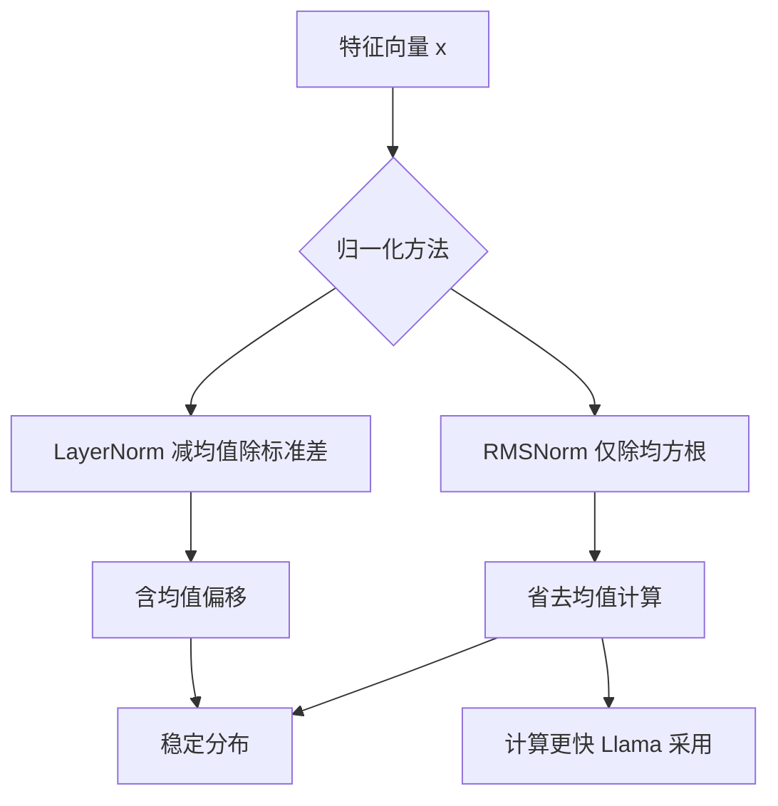

# LayerNorm和RMSNorm有什么区别？

**LayerNorm**：对每个样本在所有特征维度上做归一化。
均值μ = mean(x)，方差σ² = var(x)
y = (x - μ) / √(σ² + ε) × γ + β

**RMSNorm（Root Mean Square Normalization）**：去掉中心化（减均值）步骤，只做缩放。
RMS = √(mean(x²) + ε)
y = x / RMS × γ

**区别**：
1. RMSNorm不计算均值，不进行中心化，只做缩放归一化
2. 计算量更小：少了一次mean计算和减法操作
3. 效果接近：研究表明LayerNorm的主要作用来自缩放而非中心化
4. 推理更快：减少了约7-64%的计算时间

**使用**：Llama系列、Qwen、DeepSeek使用Pre-RMSNorm（在attention之前应用）。

**实战案例**：
在混合专家模型中，由于需要频繁进行归一化操作，使用LayerNorm会导致残差连接中的中心化操作抵消部分梯度信息，影响专家路由的稳定性。切换至RMSNorm通常能获得更好的训练稳定性及略高的推理吞吐（TPS提升5%-10%）。

**代码示例（Python，RMSNorm实现）**：
```python
import torch
import torch.nn as nn

class RMSNorm(nn.Module):
    def __init__(self, dim: int, eps: float = 1e-6):
        super().__init__()
        self.eps = eps
        self.weight = nn.Parameter(torch.ones(dim)) # gamma

    def _norm(self, x):
        # 1. 计算均方根 (不计算均值)
        # 2. 保持 float32 精度计算以防溢出
        return x * torch.rsqrt(x.pow(2).mean(-1, keepdim=True) + self.eps)

    def forward(self, x):
        output = self._norm(x.float()).type_as(x)
        return output * self.weight # RMSNorm 通常不包含 bias (beta)
```

**对比表格**：
| 特性 | LayerNorm | RMSNorm |
| :--- | :--- | :--- |
| **计算公式** | $(x - \mu) / \sqrt{\sigma^2 + \epsilon} \cdot \gamma + \beta$ | $x / \sqrt{mean(x^2) + \epsilon} \cdot \gamma$ |
| **可学习参数** | 2 (\gamma, \beta) | 1 (\gamma) |
| **中心化** | 是 | 否 |
| **计算量** | 较高 (需计算mean & var) | 较低 (仅需mean of squares) |
| **理论优势** | 0均值，符合标准正态分布 | 简化，保留幅值信息，计算快 |
| **主流应用** | BERT, GPT-2, ViT | Llama 3, Qwen2, Mistral |

## 常见考点
- **为什么去中心化效果依然好？**：Re-zero论文指出Transformer中的残差连接本身提供了重置均值的机制，LayerNorm的中心化操作可能是冗余的。
- **归一化位置（Pre-Norm vs Post-Norm）**：RMSNorm通常配合Pre-Norm（在子层输入前归一化）使用，这有助于解决深层网络的梯度消失问题，使模型更容易训练。
- **可学习参数**：LayerNorm有γ和β两个参数，而RMSNorm通常只有γ，不包含β（因为去掉了减均值，偏置β的作用可以通过其他层实现，进一步减少参数量）。

## 流程图



## 核心知识点图


## 记忆要点

- 区别：RMSNorm去掉LayerNorm的减均值（中心化）步骤，仅做缩放。
- 优势：计算量更少（约快7-64%），推理加速，效果相当。
- 应用：主流模型（Llama/Qwen）多采用Pre-RMSNorm结构。


## 结构化回答

**30 秒电梯演讲：** LayerNorm去中心化版本，计算更快效果相当。——打个比方，LayerNorm是先居中再缩放，RMSNorm省去居中只做缩放，省力且结果差不多。

**展开框架：**
1. **区别** — RMSNorm去掉LayerNorm的减均值（中心化）步骤，仅做缩放。
2. **优势** — 计算量更少（约快7-64%），推理加速，效果相当。
3. **应用** — 主流模型（Llama/Qwen）多采用Pre-RMSNorm结构。

**收尾：** 以上三点都能配合实战聊。您想深入聊哪一块？

## 视频脚本

> 预计时长：2 分钟 | 由浅入深

| 时间 | 画面/字幕 | 口播台词 | 讲解要点 |
|------|----------|----------|----------|
| 0:00 | 标题卡 | "LayerNorm和RMSNorm有什么区别，30 秒讲清楚。" | 开场钩子 |
| 0:30 | 概念定义动画 | "一句话：LayerNorm去中心化版本，计算更快效果相当。" | 核心定义 |
| 1:00 | 区别图解 | "RMSNorm去掉LayerNorm的减均值（中心化）步骤，仅做缩放。" | 区别 |
| 1:30 | 总结卡 | "记好这几条，面试不慌。下期见。" | 收尾 |
