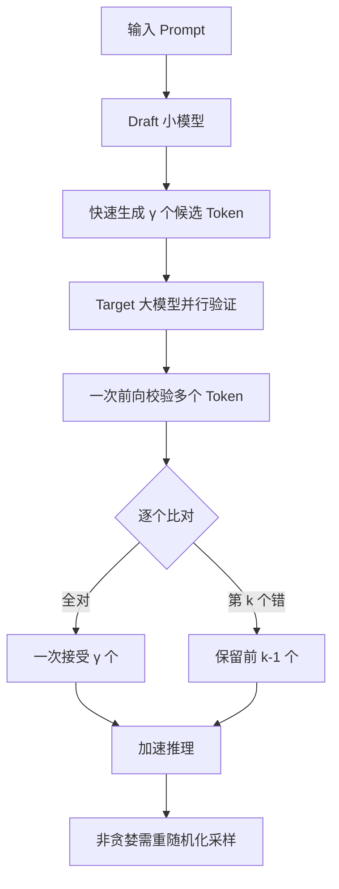

# 在大模型推理服务中，Speculative Decoding（推测解码）利用 Draft Model 加速的原理是什么？它在非贪婪采样场景下面临什么挑战？

Speculative Decoding 使用一个小型的 Draft Model 快速生成一段候选序列，然后由大模型在单次前向传播中并行验证这些 Token。如果验证通过，则直接采纳；失败则回退到正确的 Token 并重新开始。由于大模型并行验证多个 Token 的计算量通常与生成单个 Token 相当，因此在 Draft Model 准确率较高时，能显著提升生成速度。在非贪婪采样（如 Temperature > 0）场景下，验证过程变得复杂，因为我们需要采样分布而非唯一的最大概率 Token。如果要保持采样一致性，验证时需要复杂的采样修正逻辑，可能导致验证失败率升高，从而降低加速比甚至产生额外的计算开销。

### 实战案例
在实际部署中，如果 Draft Model（如 1B 参数）与 Target Model（如 70B 参数）的能力差距过大，或者 Prompt 包含大量复杂的逻辑推理任务，Draft Model 的猜测准确率会大幅下降（低于 50%）。此时验证开销超过收益，导致端到端延迟反而比标准自回归生成增加了约 15%，因此需根据业务场景谨慎选择配对模型或关闭该功能。

### 代码示例 (PyTorch 伪代码)
```python
# 简化的非贪婪验证采样逻辑
# p_draft: Draft Model输出的概率分布
# p_target: Target Model并行验证输出的概率分布
# k: 推测的步数

# 使用 rejection sampling 接受 Token
r = torch.rand(k)  # 生成 k 个 [0, 1) 随机数
accepted_ratio = p_target / p_draft 

# 只有当 r 小于接受率时才接受 Draft Token
accept_mask = r < accepted_ratio 

# 对于首个拒绝或所有接受的 Token，需依据 Target 分布重采样以保持一致性
final_tokens = sample_tokens(p_target, accept_mask)
```

### 对比表格
| 特性 | 贪婪采样 | 非贪婪采样 |
| :--- | :--- | :--- |
| **Draft 生成** | 选择概率最大的唯一 Token | 从概率分布中采样 Token |
| **验证逻辑** | 简单比较概率最大值是否一致 | 需复杂的拒绝采样或分布匹配算法 |
| **加速效果** | Draft 准确率高时加速比显著（可达 2-3x） | 因验证失败率和重采样开销，加速比通常较低（< 1.5x） |
| **一致性** | 绝对确定 | 需引入额外机制保证与 Target Model 分布一致 |

## 技术原理

Speculative Decoding 的加速本质是「把串行 N 步变成并行 1 步」，但背后的数学一致性约束决定了它的适用边界：

- **并行验证的算力账**：自回归生成 1 个 token 需要一次完整 forward（成本 $C$）。生成 $k$ 个 token 串行需 $kC$。投机解码让 Draft 草拟 $k$ 个 token，Target 一次 forward 并行验证这 $k$ 个位置（成本仍是 $C$，因为 KV cache 已就位，只需计算这 $k$ 个位置的 logits）。如果全部接受，$k$ 个 token 只花了 $2C$（Draft $C$ + Target $C$），相比 $kC$ 加速比 $k/2$。接受率越高越赚。
- **贪婪采样的验证**：Draft 选 argmax，Target 也算 argmax，逐位比较即可。验证逻辑 $O(k)$，简单确定性接受。
- **非贪婪采样的拒绝采样验证**：Draft 采样 $x \sim q$（Draft 分布），Target 给出分布 $p$。为保持与 Target 分布一致，对每个 Draft token $x_i$，以概率 $\min(1, p(x_i)/q(x_i))$ 接受；被拒绝处用 $\propto \max(0, p - q)$ 重采样。这保证了最终分布严格等于 Target 分布 $p$。但若 $q$ 与 $p$ 差距大（Draft 弱），接受率骤降，加速比可能跌破 1（即比纯 Target 还慢）。
- **Draft 模型选择**：理想 Draft 应与 Target 同源、规模小一个数量级（如 7B Target + 1B Draft）。常用方案：(1) 训练独立小模型；(2) 用 Target 早期 layer 的浅层预测（LayerSkip）；(3) Medusa/EAGLE 等并行头方案。

## 注意事项

- **接受率是生命线**：生产中接受率低于 50% 基本不值得开。应先用代表性 prompt 离线测 Draft 准确率，再做开关决策。
- **Draft 与 Target 的 tokenizer 必须一致**：分词不一致会导致整段验证失败，且难排查。最好用同一家族的模型。
- **batch 场景的复杂度**：投机解码在 batch=1 时收益最大；多请求拼 batch 时，不同请求的 Draft 长度不一，padding 浪费严重。需要配合动态 batch（如 vLLM 的 continuous batching）。
- **配置调优**：推测长度 $k$ 一般取 4~8，太短收益小，太长浪费 Draft 算力且失败回退成本高。可做自适应（根据历史接受率动态调整 $k$）。
- **KV Cache 的额外开销**：Draft 模型也有自己的 KV Cache，会与 Target 共享显存。长上下文（>16K）下 Draft 的 KV Cache 占用可能抵消加速收益，需要 Draft 模型用更小的 hidden_dim 或 GQA 压缩 KV。
- **Medusa/EAGLE 的自 draft 方案**：Medusa、EAGLE 等方案不需要独立 Draft 模型，而是在 Target 上挂多个预测头并行草拟。优点是无 tokenizer 一致性问题、无额外模型加载；缺点是训练成本高（要训练额外 head）且预测长度受限（通常 4-5 token）。
- **流式输出的延迟特性**：投机解码对首 token 延迟（TTFT）无改善甚至略有增加（Draft 先草拟），主要改善的是后续 token 的吞吐。交互式 chat 场景要注意用户感知的「卡顿」可能不降反升。

## 流程图




## 记忆要点

- 加速原理：大模型并行验证k个token的计算量与生成1个token相当，猜对即赚
- 贪婪挑战：贪婪采样仅比对最大值，而非贪婪需从分布采样，导致验证逻辑极复杂
- 分布一致：非贪婪需复杂的拒绝采样修正，否则无法保证与目标模型分布一致
- 性能反噬：非贪婪场景验证失败率与重采样开销剧增，加速比通常缩水至1.5x以下


## 结构化回答

**30 秒电梯演讲：** 小模型极速草拟，大模型并行验证，用小算力换取大模型推理加速。——打个比方，就像老总（大模型）让实习生（小模型）先写好一份文件草稿，自己只需快速通读验证并签字，比老总逐字手写快得多。但如果实习生写得太离谱（非贪婪采样时易发生），老总修改起…

**展开框架：**
1. **加速原理** — 大模型并行验证k个token的计算量与生成1个token相当，猜对即赚
2. **贪婪挑战** — 贪婪采样仅比对最大值，而非贪婪需从分布采样，导致验证逻辑极复杂
3. **分布一致** — 非贪婪需复杂的拒绝采样修正，否则无法保证与目标模型分布一致

**收尾：** 以上三点都能配合实战聊。您想深入聊哪一块？

## 视频脚本

> 预计时长：2 分钟 | 由浅入深

| 时间 | 画面/字幕 | 口播台词 | 讲解要点 |
|------|----------|----------|----------|
| 0:00 | 标题卡 | "在大模型推理服务中，Speculative Decoding（推测解码）利用 D，30 秒讲清楚。" | 开场钩子 |
| 0:30 | 概念定义动画 | "一句话：小模型极速草拟，大模型并行验证，用小算力换取大模型推理加速。" | 核心定义 |
| 1:00 | 加速原理图解 | "大模型并行验证k个token的计算量与生成1个token相当，猜对即赚" | 加速原理 |
| 1:30 | 总结卡 | "记好这几条，面试不慌。下期见。" | 收尾 |
