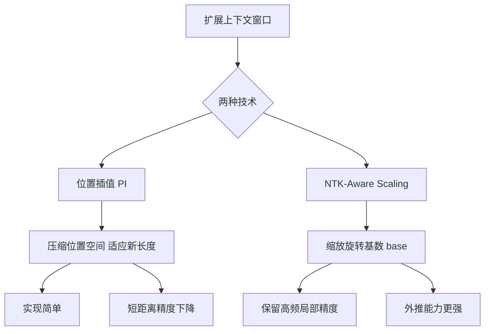

# Positional Interpolation（位置插值）和 NTK-Aware Scaling 都是用于扩展 LLM 上下文窗口的技术，它们的原理有何不同？

两者都是为了解决模型在训练长度之外的长序列推理问题。**Positional Interpolation**（如 Llama 2 采用）假设位置编码的范围不变，通过缩小位置索引的间隔（如将 4096 的位置范围线性压缩到更长的序列中），使得模型在超出原长度时，位置编码数值不会溢出或分布异常。**NTK-Aware Scaling** 则基于 RoPE（旋转位置编码）的频域特性，不直接缩放位置索引，而是缩放旋转角度的基数（Base）。它通过保留高频成分同时衰减低频成分，使得模型能够外推到更长的距离。相比线性插值，NTK-Aware Scaling 在处理长文本“大海捞针”任务时通常能保持更好的注意力聚焦能力。

**实战案例**：在做 128k 上下文长文本微调时，直接使用 PI 会导致模型注意力极度的“近视”，即过度关注局部信息而忽略全局结构，最终模型在总结长文档时出现前后矛盾；改用 NTK-Aware Scaling 后，模型在无需全量重训的情况下，成功恢复了长距离依赖能力。

**代码示例**：
```python
# NTK-Aware Scaling 实现关键片段
import torch 

def apply_ntk_scaling(base, context_len, alpha):
    # alpha 是缩放因子，通常设为 context_len / original_len
    scale = alpha ** (dim / (dim - 2)) # dim 是 head_dim
    return base * scale

# 实际使用中动态调整 RoPE 的 base 值
base = 10000
new_base = apply_ntk_scaling(base, 32768, 8)
```

**对比表格**：

| 特性 | Positional Interpolation (PI) | NTK-Aware Scaling |
| :--- | :--- | :--- |
| **核心原理** | 压缩位置索引范围 (如 [0, 4096] -> [0, 8192]) | 缩放 RoPE 的旋转基数 (Base) 以改变频率分量 |
| **数学本质** | 线性变换，位置密度增加 | 非线性变换，保留高频特征 |
| **外推能力** | 较弱，适合微调场景 | 较强，适合直接外推 |
| **信息保留** | 可能导致远距离位置信息模糊 | 更好地保留长距离的相对位置信息 |
| **主要风险** | 模型“近视”，注意力过于集中局部 | 极长序列下可能出现数值不稳定 |

## 技术原理

理解 PI 与 NTK 的差异，需要从 RoPE 的频域结构入手：

- **RoPE 的多频特性**：RoPE 对位置 $m$ 的编码由多个不同频率的正弦/余弦分量组成，频率 $\omega_i = \text{base}^{-2i/d}$。$i$ 小对应高频（捕捉局部细节），$i$ 大对应低频（捕捉全局结构）。当位置 $m$ 超出训练范围时，高频分量率先「卷绕」（aliasing），破坏相对位置信息。
- **PI 的线性压缩**：PI 把位置索引整体除以缩放因子 $s$（$m' = m/s$），相当于把 $[0, L_{\text{new}}]$ 线性映射回 $[0, L_{\text{train}}]$。所有频率分量被同等压缩，高频和低频都变「密」。优点是实现简单（改一行代码），缺点是高频细节也被压缩，模型对相近 token 的区分能力下降——即「近视」。
- **NTK-Aware Scaling 的频率感知缩放**：不压缩位置索引，而是缩放 base：$\text{base}' = \text{base} \cdot s^{d/(d-2)}$。这等价于：高频分量（小 $i$）几乎不缩放，低频分量（大 $i$）大幅缩放。结果是「近距离位置关系保持原样，远距离外推能力增强」，更符合「局部精确、全局模糊可接受」的语义先验。
- **训练-外推代价对比**：PI 因破坏高频，通常需要少量微调（~1B tokens）恢复；NTK-Aware 在很多场景可零微调直接外推（YaRN 是其改进版，进一步优化过渡区）。

## 注意事项

- **缩放因子 $s$ 的选择**：$s$ 不是越大越好。一般取 $s = L_{\text{target}} / L_{\text{train}}$，但超过 8 倍时即使 NTK 也可能出现注意力崩塌，需要配合微调。
- **PI 与 NTK 可叠加**：实际工程中 PI（粗调长度）+ NTK（保高频）+ 少量长文本微调是常见组合拳，比单一方法更稳。
- **YaRN / Dynamic NTK**：YaRN 引入分段缩放（临界频率之上不缩放、之下线性缩放），比朴素 NTK 更平滑；Dynamic NTK 在推理时根据当前序列长度动态调整 base，适合变长输入。
- **「大海捞针」测试**：评估长上下文能力的黄金标准是在超长文档中精确召回特定事实。PI 在此测试上常常失败（近视），NTK/YaRN 表现明显更好，是选型的实测依据。
- **微调数据的重要性**：即使 NTK/YaRN 能零样本外推，少量长文本微调（如 1B token 的长文档数据）能显著恢复模型在长上下文下的精确召回和推理能力。完全不做微调的外推上限有限。
- **RoPE 的 base 选择**：原版 Llama 用 base=10000；Llama 3 等新模型用更大的 base（如 500000）从训练时就支持更长上下文，减少推理时的缩放需求。选 NTK 缩放时要基于模型的原始 base 做计算。
- **外推缩放与 attention sink 的关系**：长上下文下某些注意力会异常集中在前几个 token（attention sink），这与位置编码外推的数值稳定性相关。StreamingLLM 等方法保留前几个 sink token 的 KV Cache 即可恢复长文本生成能力，与 PI/NTK 是正交的优化方向。
- **缩放对 instruction following 的影响**：实测发现，过激的 PI 缩放（$s > 8$）会让模型在长上下文里「忘记」指令——即便 recall 能力尚可，遵循指令的准确率会下降。这提示位置编码缩放不仅影响「记忆」，还影响「注意力分配」。

## 流程图




## 记忆要点

- 共同目的：解决超出原训练长度的长序列推理位置编码溢出或异常问题
- PI线性插值：压缩位置索引范围，简单但易致模型“近视”过度关注局部信息
- NTK缩放：改缩放RoPE旋转基数，非线性保留高频特征，长距外推能力更强
- 口诀对比：PI内插压密度需微调，NTK外推导频率免重训


## 结构化回答

**30 秒电梯演讲：** PI压缩位置空间适应新长度，NTK缩放旋转基数保留高频特征。——打个比方，PI像是把长距离地图强行缩印在一张纸上，导致看不清细节；NTK像是通过调整焦距的显微镜，让观察范围变大时还能看清局部纹理。

**展开框架：**
1. **共同目的** — 解决超出原训练长度的长序列推理位置编码溢出或异常问题
2. **PI线性插值** — 压缩位置索引范围，简单但易致模型“近视”过度关注局部信息
3. **NTK缩放** — 改缩放RoPE旋转基数，非线性保留高频特征，长距外推能力更强

**收尾：** 以上三点都能配合实战聊。您想深入聊哪一块？

## 视频脚本

> 预计时长：2 分钟 | 由浅入深

| 时间 | 画面/字幕 | 口播台词 | 讲解要点 |
|------|----------|----------|----------|
| 0:00 | 标题卡 | "Positional Interpolation（位置插值）和 NTK-Awar，30 秒讲清楚。" | 开场钩子 |
| 0:30 | 概念定义动画 | "一句话：PI压缩位置空间适应新长度，NTK缩放旋转基数保留高频特征。" | 核心定义 |
| 1:00 | 共同目的图解 | "解决超出原训练长度的长序列推理位置编码溢出或异常问题" | 共同目的 |
| 1:30 | 总结卡 | "记好这几条，面试不慌。下期见。" | 收尾 |
