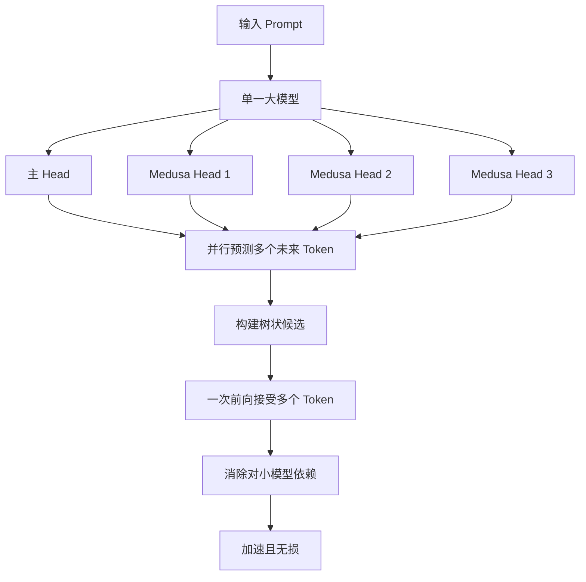

# 什么是Medusa解码？它与传统的投机解码相比有什么独特优势？

Medusa解码是一种非自回归并行解码技术，通过在主模型上增加多个预测未来的“输出头”来并行生成候选token，并共享底层Transformer参数。与依赖小模型草拟的传统投机解码相比，Medusa消除了对独立Draft Model的依赖，避免了因小模型能力弱导致的接受率低问题，且单模型部署更简单、显存开销更低，通常能实现更高的加速比。

## 技术原理

Medusa 突破了传统投机解码「必须有独立小模型」的范式依赖：

- **多头并行预测**：在主模型最后一层隐藏状态 $h_t$ 上，挂载 $k$ 个轻量级 Medusa Head（通常是单层 MLP）。第 $i$ 个 Head 基于当前隐藏态 $h_t$ 直接预测位置 $t+i$ 的 token，即 $\hat{y}_{t+i} = \text{Head}_i(h_t)$。一次前向即可拿到 $k$ 个候选后续 token。
- **树状候选构造**：每个 Head 输出 Top-$\tau$ 个候选，组合成 $\tau^k$ 条候选路径，再用 Tree Attention 在单次大模型前向中并行验证所有路径。这把投机解码的「串行草拟」变成了「单模型内的并行扩展」。
- **训练成本低**：Medusa Head 只训练新增的 MLP 参数（主模型冻结或用 LoRA 微调），数据可以是主模型自身的推理输出，无需额外草拟数据集。
- **延迟下界**：理论加速比上界约为 $k+1$（$k$ 个 Head + 1 个原始预测），实际因验证拒绝率通常落在 2~3x。

## 代码示例

```python
# Medusa 头结构（PyTorch 伪代码）
import torch
import torch.nn as nn

class MedusaHead(nn.Module):
    """单层 MLP，预测未来第 i 个位置的 token"""
    def __init__(self, hidden_size, vocab_size):
        super().__init__()
        self.linear = nn.Linear(hidden_size, hidden_size)
        self.lm_head = nn.Linear(hidden_size, vocab_size, bias=False)

    def forward(self, h):
        # h: (batch, seq, hidden) 主模型最后一层隐藏状态
        return self.lm_head(self.linear(h))  # 输出 vocab 概率

class MedusaModel(nn.Module):
    def __init__(self, base_model, num_heads=4, hidden_size=4096, vocab_size=32000):
        super().__init__()
        self.base = base_model              # 冻结或 LoRA 微调
        self.original_head = base_model.lm_head  # 原始预测 t+1
        self.medusa_heads = nn.ModuleList(
            [MedusaHead(hidden_size, vocab_size) for _ in range(num_heads)]
        )  # 预测 t+2 ... t+(num_heads+1)

    def forward(self, input_ids):
        h = self.base.model(input_ids).last_hidden_state
        candidates = [self.original_head(h)]          # 位置 t+1
        for head in self.medusa_heads:
            candidates.append(head(h))                # 位置 t+2, t+3, ...
        return candidates  # 列表，每项是 vocab 分布，供树形验证使用
```

## 注意事项

- **Head 数量与精度权衡**：Head 越多候选路径越宽，但远距离预测准确率衰减很快（$t+5$ 的准确率通常远低于 $t+2$）。实践中 $k=4\sim5$ 是性价比拐点，再多收益递减。
- **Tree Attention 实现复杂**：需要自定义 attention mask 支持树形并行验证，主流推理框架（vLLM、TensorRT-LLM）已内置支持，自研需小心 mask 构造错误。
- **训练目标**：Medusa Head 的训练目标是让预测 token 贴近主模型的真实输出（distillation 风格），而非贴近人类标注——它是「学会猜主模型会怎么接」。
- **适用边界**：对结构化输出（代码、JSON）加速明显，因为可预测性强；对高度创造性生成（创意写作）加速比会下降。

## 流程图




## 记忆要点

- 核心定义：给主模型加多个并行预测头，共享底层参数，一次前向生成多候选token
- 对比优势：相比传统投机免独立小模型，显存更低且单模型部署极简
- 接受率优：无小模型能力瓶颈，通常能实现比传统方案更高的猜测接受率


## 结构化回答

**30 秒电梯演讲：** 单模型多头上树并行解码，消除小模型依赖——打个比方，传统投机解码是让实习生（小模型）写草稿，高手（大模型）改，实习生水平差常被拒；Medusa是高手自己脑里长出几个替身，同时写多份，自己挑对的，不用带实习生。

**展开框架：**
1. **核心定义** — 给主模型加多个并行预测头，共享底层参数，一次前向生成多候选token
2. **对比优势** — 相比传统投机免独立小模型，显存更低且单模型部署极简
3. **接受率优** — 无小模型能力瓶颈，通常能实现比传统方案更高的猜测接受率

**收尾：** 以上三点都能配合实战聊。您想深入聊哪一块？

## 视频脚本

> 预计时长：2 分钟 | 由浅入深

| 时间 | 画面/字幕 | 口播台词 | 讲解要点 |
|------|----------|----------|----------|
| 0:00 | 标题卡 | "Medusa解码，30 秒讲清楚。" | 开场钩子 |
| 0:30 | 概念定义动画 | "一句话：单模型多头上树并行解码，消除小模型依赖" | 核心定义 |
| 1:00 | 核心定义图解 | "给主模型加多个并行预测头，共享底层参数，一次前向生成多候选token" | 核心定义 |
| 1:30 | 总结卡 | "记好这几条，面试不慌。下期见。" | 收尾 |
